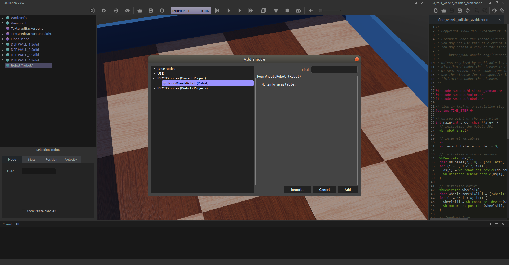

## Tutorial 7: Your First PROTO

The aim of this tutorial is to create a PROTO file corresponding to the four wheels robot from the previous tutorial.

### Copy the Robot Definition

For now, the definition of the robot is completely contained in the world file.
Moving this definition in a PROTO file will allow you to use this robot without the need to completely copy its definition (either several times in the same world or in different world).

> **Hands-on #1**: Open the world `4_wheels_robot.wbt` created in the previous tutorial in your favorite text editor.
Create a new file in the `protos` folder of your project called `FourWheelsRobot.proto` and open this file in the text editor too, this file will contain the definition of your robot.

Any PROTO file should at least respect the following structure:
```
PROTO protoName [
]
{
  protoBody
}
```

The `protoName` should be the name of the PROTO file (i.e. `FourWheelsRobot` in this case), and the `protoBody` is the definition of the root node (i.e. the [Robot](../reference/robot.md) node in this case).

> **Hands-on #2**: Write this default structure in your PROTO file with the correct `protoName`.
From the `4_wheels_robot.wbt` world file copy the robot node (starting with `Robot {` and ending with the final `}`) and paste it in your PROTO file instead of the `protoBody`.
Finally, save the PROTO file.

### Use the PROTO Node.

This new PROTO node is now available for each worlds in your current project.

%figure "The PROTO is now visible in the Add a node window."



%end

> **Hands-on #3**: Open the `4_wheels_robot.wbt` world in Webots and add the `FourWheelsRobot` node (that you just defined).
The node is located in `PROTO nodes (Project) / FourWheelsRobot (Robot)`.

A second 4 wheels robot should have been added at the exact same location than the already existing one.

### Adding Fields

As you probably noticed, this new PROTO node doesn't have any open field, it is therefore impossible to translate, rotate or change the controller for example.
It is very easy to add new fields to a PROTO node and to link them with internal fields.
This should be done in the PROTO interface part (part between the `[` and the `]`).

> **Hands-on #4**: Edit your PROTO file in your text editor and add the definition of the `translation` and `rotation` field in the PROTO interface part:
```
  field SFVec3f    translation   0 0 0
  field SFRotation rotation      0 1 0 0
```
Your PROTO node has now two open fields but they are not linked to any internal field.
To link the fields you should use the IS keyword, simply replace the `translation` and `rotation` fields of the [Robot](../reference/robot.md) node by:
```
  translation IS translation
  rotation IS rotation
```
Save your PROTO file, it should now look like this:
```
PROTO FourWheelsRobot [
  field SFVec3f    translation   0 0 0
  field SFRotation rotation      0 1 0 0
]
{
  Robot {
    translation IS translation
    rotation IS rotation
    children [
      ...
    ]
    boundingObject USE BODY
    physics Physics {
      ...
    }
    controller "4_wheels_collision_avoidance"
  }
}
```

You can now save your simulation in Webots and revert it. The `translation` and `rotation` of the `FourWheelsRobot` node can now be changed (either in the [scene tree](the-scene-tree.md) or using the handles in the [3D view](the-3d-window.md)).

### Conclusion

You are now able to create PROTO nodes from any nodes you created in Webots.

More specifically, you learnt how to copy the node definition in the PROTO file and how to open and link PROTO fields to internal node fields.

To go further, the [PROTO chapter](../reference/proto.md) of the reference manual explains in detail all the possibilities of the PROTO mechanism.
