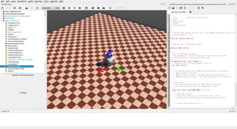

## Tutorial 8: The Supervisor (30 Minutes)

A [Supervisor](../reference/supervisor.md) oversees a world and can set or get information about it.
This tutorial will teach you:
- How to move objects using the supervisor.
- How to delete a node and spawn another in its place.
- How to track the evolution of an object in the scene.
- How to change the properties of an object, namely its color.

These are only some tasks the [Supervisor](../reference/supervisor.md) is capable of, refer to its documentation for a complete overview.
Just note that it is, however, not possible to access directly measurements recorded by devices mounted on a different robot even if the supervisor option is enabled.

### Setting up the Environment and Adding a Supervisor

> **Hands-on #1**: The objective is to create the environment and add a Supervisor. Create a new project from **File / New / New Project Directory...** menu item and follow the instructions:
1. Name the project directory `my_supervisor` instead of the proposed `my_project`.
2. Name the world file `my_supervisor.wbt` instead of the proposed `empty.wbt`.
3. Click all the tick boxes, including the "Add a rectangle arena" which is not ticked by default.
4. In order to have more space, enlarge the arena by setting the size to 10x10 meters by changing the `floorSize` field.
5. Add a [BB-8](https://webots.cloud/run?url={{ url.github_tree }}/projects/robots/sphero/bb8/protos/BB-8.proto) robot to the scene, to do this click the `Add` button  and navigate to: `PROTO nodes (Webots projects) / robots / sphero / bb8`.
6. For the purpose of this tutorial, remove the default controller of [BB-8](https://webots.cloud/run?url={{ url.github_tree }}/projects/robots/sphero/bb8/protos/BB-8.proto) by clicking the `controller` field, then the `Select` button, and pick `<none>` from the list.
7. Add a simple [Robot](../reference/robot.md) node to the scene, this will become our Supervisor.
The [Robot](../reference/robot.md) node can be found in the `base nodes` category when clicking the `Add` button.
To better keep track of it, change its `name` field to `supervisor`.
8. Despite the name change the node is still currently just a [Robot](../reference/robot.md), to turn this robot into a [Supervisor](../reference/supervisor.md) requires to set its `supervisor` field to "TRUE".
9. Much like a normal robot, the behavior of a supervisor is defined by a controller.
Add a controller using the **File / New / New Robot Controller...** menu item, selecting the programming language you prefer.
For this tutorial, Python is the choice, but the code will be provided for all other options.
Set `supervisor_controller` as the name of the controller and click finish (for C++ and Java call it `SupervisorController` instead).
10. Expand once more the [Robot](../reference/robot.md) node, press the `controller` field and click the `Select` button in order to attribute the controller you just created to the supervisor.
11. Save the world.

If you followed these steps, your environment should look like this:

%figure "Resulting environment."



%end

### Moving Objects Using a Supervisor

So far our [Supervisor](../reference/supervisor.md) is quite dull, because the controller that was attributed to it does nothing.

In this section, we will program the supervisor to move the BB-8 robot to a different location.
It should be noted that to achieve this we are effectively cheating, rather than instructing the BB-8 to move to a new location we will transport it there.
In other words the movement will ignore all the physics, but herein lies the power of a [Supervisor](../reference/supervisor.md), as it can bend the rules however it likes.

As you might have noticed, the default controller we created from the **File / New / New Robot Controller...** menu item is setup for a classic robot, not a supervisor.
In order to access the powers of a supervisor requires therefore some slight changes to the controller.
To begin with, replace the contents of the default controller with the following code, depending on the language you have picked and save.

The changes include:
- import the Supervisor library/module instead of the Robot one
- instead of creating a `Robot` instance, create a `Supervisor` one.


> **Note:** It is important to remember that a supervisor is nothing more than a robot with special powers, which implies that whatever a robot can do, so can the supervisor.
This means that you do not need a `Robot` instance if you have a supervisor one.
For example the infinite loop that determines the pace of the controller (namely: `while robot.step(TIME_STEP) != -1`) does not need to be changed, as the supervisor can do the same.

Here are the instructions to follow based on the programming language you picked.

%tab-component "language"

%tab "C"

Replace the contents of your controller with the following.
Save and compile it using the `Build` button.

```c
#include <webots/robot.h>
#include <webots/supervisor.h>
#include <stdio.h>

#define TIME_STEP 32

int main(int argc, char **argv) {
  wb_robot_init();

  // [CODE PLACEHOLDER 1]

  int i = 0;
  while (wb_robot_step(TIME_STEP) != -1) {
    // [CODE PLACEHOLDER 2]

    i++;
  }

  wb_robot_cleanup();

  return 0;
}
```
%tab-end

%tab "C++"

Replace the contents of your controller with the following.
Save and compile it using the `Build` button.

```cpp
#include <webots/Supervisor.hpp>

#define TIME_STEP 32

// All the webots classes are defined in the "webots" namespace
using namespace webots;

int main(int argc, char **argv) {

  Supervisor *robot = new Supervisor(); // create Supervisor instance

  // [CODE PLACEHOLDER 1]

  int i = 0;
  while (robot->step(TIME_STEP) != -1) {
    // [CODE PLACEHOLDER 2]

    i++;
  }

  delete robot;

  return 0;
}
```
%tab-end

%tab "Python"

Replace the contents of your controller with the following and save.

```python
from controller import Supervisor

TIME_STEP = 32

robot = Supervisor()  # create Supervisor instance

# [CODE PLACEHOLDER 1]

i = 0
while robot.step(TIME_STEP) != -1:
  # [CODE PLACEHOLDER 2]

  i += 1
```
%tab-end

%tab "Java"

Replace the contents of your controller with the following.
Save and compile it using the `Build` button.

```java
import com.cyberbotics.webots.controller.Supervisor;
import com.cyberbotics.webots.controller.Node;
import com.cyberbotics.webots.controller.Field;

public class SupervisorController {

  public static void main(String[] args) {

    int TIME_STEP = 32;

    Supervisor robot = new Supervisor(); // create Supervisor instance

    // [CODE PLACEHOLDER 1]

    int i = 0;
    while (robot.step(TIME_STEP) != -1) {
      // [CODE PLACEHOLDER 2]

      i++;
    }
  }
}
```
%tab-end

%tab "MATLAB"

Replace the contents of your controller with the following and save it.

```matlab
function supervisor_controller

TIME_STEP = 32;

% [CODE PLACEHOLDER 1]

i = 0;
while wb_robot_step(TIME_STEP) ~= -1
  % [CODE PLACEHOLDER 2]

  i = i + 1;
end
```
%tab-end

%end

To move BB-8 to a new location is quite straightforward, if you wished to do so without the help of a supervisor you would simply change its `translation` field to the desired value, say `0 0 2.5`.
The [Supervisor](../reference/supervisor.md) does it much in the same way.

%tab-component "language"

%tab "C"

> **Hands-on #2**: Move BB-8 using the Supervisor.
In principle the world could be very complex, so it is necessary to have a way of uniquely identifying our BB-8 among the other objects.
To do so we can use the `DEF` mechanism explored in [tutorial 2](tutorial-2-modification-of-the-environment.md).
Click the BB-8 node in the scene tree and give it a `DEF` name "BB-8", then save the world.

> Behind the scenes, each node is uniquely identifiable by a node reference and by having this reference, we can modify it.
To retrieve the reference, the supervisor function [`wb_supervisor_node_get_from_def`](../reference/supervisor.md#wb_supervisor_node_get_from_def) can be used.
In `CODE PLACEHOLDER 1`, retrieve the node reference of BB-8.
> ```c
> WbNodeRef bb8_node = wb_supervisor_node_get_from_def("BB-8");
> ```
Now that we have access to the node, we need to get access to its `translation` field, specifically we need a reference to this field as we just did for the node.
To do so, the [`wb_supervisor_node_get_field`](../reference/supervisor.md#wb_supervisor_node_get_field) function can be used.
> ```c
> WbFieldRef translation_field = wb_supervisor_node_get_field(bb8_node, "translation");
> ```
Finally, now that a reference to the translation field is available, all that remains to do is to set it to a different value.
Once again, the supervisor API has all the necessary tools to do so.
The `translation` field is of type `SFVec3`, which just means it is a three dimensional vector.
The value of this field can be set by using the [`wb_supervisor_field_set_sf_vec3f`](../reference/supervisor.md#wb_supervisor_field_set_sf_vec3f) function.
> ```c
> if (i == 0) {
>   const double new_value[3] = {2.5, 0, 0};
>   wb_supervisor_field_set_sf_vec3f(translation_field, new_value);
> }
> ```
That is all there is to it.
If you save, build and run the simulation you will see that BB-8 is transported to a new location instantly.

%tab-end

%tab "C++"

> **Hands-on #2**: Move BB-8 using the Supervisor.
In principle the world could be very complex, so it is necessary to have a way of uniquely identifying our BB-8 among the other objects.
To do so we can use the `DEF` mechanism explored in [tutorial 2](tutorial-2-modification-of-the-environment.md).
Click the BB-8 node in the scene tree and give it a `DEF` name "BB-8", then save the world.

> Behind the scenes, each node is uniquely identifiable by a node reference and by having this reference, we can modify it.
To retrieve the reference, the supervisor method [`getFromDef`](../reference/supervisor.md#wb_supervisor_node_get_from_def)  can be used.
In `CODE PLACEHOLDER 1`, retrieve the node reference of BB-8.
> ```cpp
> Node *bb8Node = robot->getFromDef("BB-8");
> ```
Now that we have access to the node, we need to get access to its `translation` field, specifically we need a reference to this field as we just did for the node.
To do so, the [`getField`](../reference/supervisor.md#wb_supervisor_node_get_field) method can be used.
> ```cpp
> Field *translationField = bb8Node->getField("translation");
> ```
Finally, now that a reference to the translation field is available, all that remains to do is to set it to a different value.
Once again, the supervisor API has all the necessary tools to do so.
The `translation` field is of type `SFVec3`, which just means it is a three dimensional vector.
The value of this field can be set by using the [`setSFVec3f`](../reference/supervisor.md#wb_supervisor_field_set_sf_vec3f) method.
In `CODE PLACEHOLDER 2`, add the following:
> ```cpp
> if (i == 0) {
>   const double newValue[3] = {2.5, 0, 0};
>   translationField->setSFVec3f(newValue);
> }
> ```
That is all there is to it.
If you save, build and run the simulation you will see that BB-8 is transported to a new location instantly.

%tab-end

%tab "Python"

> **Hands-on #2**: Move BB-8 using the Supervisor.
In principle the world could be very complex, so it is necessary to have a way of uniquely identifying our BB-8 among the other objects.
To do so we can use the `DEF` mechanism explored in [tutorial 2](tutorial-2-modification-of-the-environment.md).
Click the BB-8 node in the scene tree and give it a `DEF` name "BB-8", then save the world.

> Behind the scenes, each node is uniquely identifiable by a node reference and by having this reference, we can modify it.
To retrieve the reference, the supervisor method [`getFromDef`](../reference/supervisor.md#wb_supervisor_node_get_from_def) can be used.
In `CODE PLACEHOLDER 1`, retrieve the node reference of BB-8.
> ```python
> bb8_node = robot.getFromDef('BB-8')
> ```
Now that we have access to the node, we need to get access to its `translation` field, specifically we need a reference to this field as we just did for the node.
To do so, the [`getField`](../reference/supervisor.md#wb_supervisor_node_get_field) method can be used.
> ```python
> translation_field = bb8_node.getField('translation')
> ```
Finally, now that a reference to the translation field is available, all that remains to do is to set it to a different value.
Once again, the supervisor API has all the necessary tools to do so.
The `translation` field is of type `SFVec3`, which just means it is a three dimensional vector.
The value of this field can be set by using the [`setSFVec3f`](../reference/supervisor.md#wb_supervisor_field_set_sf_vec3f) method.
> ```python
> if i == 0:
>   new_value = [2.5, 0, 0]
>   translation_field.setSFVec3f(new_value)
> ```
That is all there is to it.
If you save and run the simulation you will see that BB-8 is transported to a new location instantly.

%tab-end

%tab "Java"

> **Hands-on #2**: Move BB-8 using the Supervisor.
In principle the world could be very complex, so it is necessary to have a way of uniquely identifying our BB-8 among the other objects.
To do so we can use the `DEF` mechanism explored in [tutorial 2](tutorial-2-modification-of-the-environment.md).
Click the BB-8 node in the scene tree and give it a `DEF` name "BB-8", then save the world.

> Behind the scenes, each node is uniquely identifiable by a node reference and by having this reference, we can modify it.
To retrieve the reference, the supervisor method [`getFromDef`](../reference/supervisor.md#wb_supervisor_node_get_from_def) can be used.
In `CODE PLACEHOLDER 1`, retrieve the node reference of BB-8.
> ```java
> Node bb8Node = robot.getFromDef("BB-8");
> ```
Now that we have access to the node, we need to get access to its `translation` field, specifically we need a reference to this field as we just did for the node.
To do so, the [`getField`](../reference/supervisor.md#wb_supervisor_node_get_field) method can be used.
> ```java
> Field translationField = bb8Node.getField("translation");
> ```
Finally, now that a reference to the translation field is available, all that remains to do is to set it to a different value.
Once again, the supervisor API has all the necessary tools to do so.
The `translation` field is of type `SFVec3`, which just means it is a three dimensional vector.
The value of this field can be set by using the [`setSFVec3f`](../reference/supervisor.md#wb_supervisor_field_set_sf_vec3f) method.
> ```java
> if (i == 0) {
>   double newValue[] = {2.5, 0, 0};
>   translationField.setSFVec3f(newValue);
> }
> ```
That is all there is to it.
If you save, build and run the simulation you will see that BB-8 is transported to a new location instantly.

%tab-end

%tab "MATLAB"

> **Hands-on #2**: Move BB-8 using the Supervisor.
In principle the world could be very complex, so it is necessary to have a way of uniquely identifying our BB-8 among the other objects.
To do so we can use the `DEF` mechanism explored in [tutorial 2](tutorial-2-modification-of-the-environment.md).
Click the BB-8 node in the scene tree and give it a `DEF` name "BB-8", then save the world.

> Behind the scenes, each node is uniquely identifiable by a node reference and by having this reference, we can modify it.
To retrieve the reference, the supervisor method [`wb_supervisor_node_get_from_def`](../reference/supervisor.md#wb_supervisor_node_get_from_def) can be used.
In `CODE PLACEHOLDER 1`, retrieve the node reference of BB-8.
> ```matlab
> bb8_node = wb_supervisor_node_get_from_def('BB-8');
> ```
Now that we have access to the node, we need to get access to its `translation` field, specifically we need a reference to this field as we just did for the node.
To do so, the [`wb_supervisor_node_get_field`](../reference/supervisor.md#wb_supervisor_node_get_field) function can be used.
> ```matlab
> translation_field = wb_supervisor_node_get_field(bb8_node, 'translation');
> ```
Finally, now that a reference to the translation field is available, all that remains to do is to set it to a different value.
Once again, the supervisor API has all the necessary tools to do so.
The `translation` field is of type `SFVec3`, which just means it is a three dimensional vector.
The value of this field can be set by using the [`wb_supervisor_field_set_sf_vec3f`](../reference/supervisor.md#wb_supervisor_field_set_sf_vec3f) function.
> ```matlab
> if (i == 0)
>   new_value = [2.5, 0, 0]
>   wb_supervisor_field_set_sf_vec3f(translation_field, new_value);
> end
> ```
That is all there is to it.
If you save and run the simulation you will see that BB-8 is transported to a new location instantly.

%tab-end

%end

This is a simple example, but the principle remains the same no matter which field you wish to change.
You can for instance increase the size of an object, perhaps change its color, change the light conditions, or reset its position if it goes out of bounds, the options are limitless.
It is just a matter of getting a node reference, from which a field reference can be obtained by name, and set its value by using the function that is appropriate for the type you are trying to change.

### Spawning and Removing Nodes

Supervisors can also be used to populate the environment, allowing to dynamically setup the scene.
This section focuses on how nodes can be added and removed, specifically we will remove [BB-8](https://webots.cloud/run?url={{ url.github_tree }}/projects/robots/sphero/bb8/protos/BB-8.proto) from this world, and replace it with a different robot, namely [Nao](https://webots.cloud/run?url={{ url.github_tree }}/projects/robots/softbank/nao/protos/Nao.proto).

%tab-component "language"

%tab "C"

> **Hands-on #3**: Removing and adding nodes.
In the previous section, we already saw how to retrieve the node reference of an object.
A node can be removed from the scene tree by using the [`wb_supervisor_node_remove`](../reference/supervisor.md#wb_supervisor_node_remove) function.
The `if` condition is not necessary, it simply adds a 10 step delay before the removal to make it more apparent.
Add the following code in `CODE PLACEHOLDER 2`.
> ```c
> if (i == 10)
>   wb_supervisor_node_remove(bb8_node);
> ```
After 10 time steps, [BB-8](https://webots.cloud/run?url={{ url.github_tree }}/projects/robots/sphero/bb8/protos/BB-8.proto) will be removed from the scene.
Now, let's instead add the [Nao](https://webots.cloud/run?url={{ url.github_tree }}/projects/robots/softbank/nao/protos/Nao.proto) robot after 20 time steps.
In order to add a node, we must know where we wish to spawn it in the scene tree.
Should it be added at the top level of the scene tree? Should it inserted as a field of a another node?
These questions will change how the node will be inserted and which supervisor function needs to be used, but the constant factor among them is that we need a reference to this position.
In this context, the [Nao](https://webots.cloud/run?url={{ url.github_tree }}/projects/robots/softbank/nao/protos/Nao.proto) robot will be added at the last position in the scene tree, where BB-8 used to appear.
First of all, we need to declare the [Nao](https://webots.cloud/run?url={{ url.github_tree }}/projects/robots/softbank/nao/protos/Nao.proto) to Webots as in importable PROTO for the world we created.
To proceed, click on the `IMPORTABLE EXTERNPROTO` button located at the top of the scene tree.
The field editor, located below the scene tree, should display an `IMPORTABLE EXTERNPROTO` pane with a button named "Insert new".
Click this button and select the [Nao](https://webots.cloud/run?url={{ url.github_tree }}/projects/robots/softbank/nao/protos/Nao.proto) robot from the `PROTO nodes (Webots Projects)` section.
Press the "Insert" button.
If you hover the [Nao](https://webots.cloud/run?url={{ url.github_tree }}/projects/robots/softbank/nao/protos/Nao.proto) item that appeared below the "Insert new" button, you will see in the tooltip the URL from where it is downloaded.
Save the world file, so that this information is stored.

> Although not apparent, the scene tree is in fact a [Group](../reference/group.md) node, and each of the objects in the scene tree like `WorldInfo`, `Viewpoint`, `TexturedBackground` and so forth are nothing more than nodes defined as its children.
We refer to this [Group](../reference/group.md) node containing everything as the `root` node.
In order to insert the [Nao](https://webots.cloud/run?url={{ url.github_tree }}/projects/robots/softbank/nao/protos/Nao.proto) robot, the reference we require is actually a reference to the `children` field of the `root` node.
In the spot marked by `CODE PLACEHOLDER 1`, the following code allows to get this reference.
> ```c
> WbNodeRef root_node = wb_supervisor_node_get_root();
> WbFieldRef children_field = wb_supervisor_node_get_field(root_node, "children");
> ```
To spawn a node you should use the supervisor function [`wb_supervisor_field_import_[mf/sf]_node_from_string`](../reference/supervisor.md#wb_supervisor_field_import_mf_node_from_string).
The "mf\_node" and "sf\_node" components in the name of these functions specify what is the type of the node where the objects is inserted *into*.
"mf\_node" stands for multi-field node whereas "sf\_node" stands for single-field node.

> As previously mentioned, the [Nao](https://webots.cloud/run?url={{ url.github_tree }}/projects/robots/softbank/nao/protos/Nao.proto) should be added to the `children` field of the `root` node, and as you might guess, this `children` field is of type multi-field.

> Let's add it from string after 20 time steps, add the following snippet in `CODE PLACEHOLDER 2`:
> ```c
> if (i == 20)
>   wb_supervisor_field_import_mf_node_from_string(children_field, -1, "Nao { }");
> ```
The "-1" specifies in which position we wish to insert the node, in this case, to insert it at the last position.
`"Nao { }"` is a string that describes what we wish to spawn.
The way the object is described is by using the VRML97 format, this is the format used in the world files as well.
After 20 timesteps, the [Nao](https://webots.cloud/run?url={{ url.github_tree }}/projects/robots/softbank/nao/protos/Nao.proto) robot will spawn in the middle of the scene.

> Let's assume we wanted the [Nao](https://webots.cloud/run?url={{ url.github_tree }}/projects/robots/softbank/nao/protos/Nao.proto) to be spawned in the position BB-8 used to be, we certainly could move it there following the procedure of hands-on 2, but that would not be smart.
In fact, we can simply specify the translation field directly in the string!
Replace the string `"Nao { }"` with `"Nao { translation 2.5 0 0.334 }"` and it will spawn exactly at that location.
It does not stop there, in the same fashion we could define its `controller` parameter, or the `cameraWidth` or any other of its parameters in the same fashion.

%tab-end

%tab "C++"
> **Hands-on #3**: Removing and adding nodes.
In the previous section, we already saw how to retrieve the node reference of an object.
A node can be removed from the scene tree by using the [`remove`](../reference/supervisor.md#wb_supervisor_node_remove) method.
The `if` condition is not necessary, it simply adds a 10 step delay before the removal to make it more apparent.
Add the following code in `CODE PLACEHOLDER 2`.
> ```cpp
> if (i == 10)
>   bb8Node->remove();
> ```
After 10 time steps, [BB-8](https://webots.cloud/run?url={{ url.github_tree }}/projects/robots/sphero/bb8/protos/BB-8.proto) will be removed from the scene.
Now, let's instead add the [Nao](https://webots.cloud/run?url={{ url.github_tree }}/projects/robots/softbank/nao/protos/Nao.proto) robot after 20 time steps.
In order to add a node, we must know where we wish to spawn it in the scene tree.
Should it be added at the top level of the scene tree? Should it inserted as a field of a another node?
These questions will change how the node will be inserted and which supervisor function needs to be used, but the constant factor among them is that we need a reference to this position.
In this context, the [Nao](https://webots.cloud/run?url={{ url.github_tree }}/projects/robots/softbank/nao/protos/Nao.proto) robot will be added at the last position in the scene tree, where BB-8 used to appear.
First of all, we need to declare the [Nao](https://webots.cloud/run?url={{ url.github_tree }}/projects/robots/softbank/nao/protos/Nao.proto) to Webots as in importable PROTO for the world we created.
To proceed, click on the `IMPORTABLE EXTERNPROTO` button located at the top of the scene tree.
The field editor, located below the scene tree, should display an `IMPORTABLE EXTERNPROTO` pane with a button named "Insert new".
Click this button and select the [Nao](https://webots.cloud/run?url={{ url.github_tree }}/projects/robots/softbank/nao/protos/Nao.proto) robot from the `PROTO nodes (Webots Projects)` section.
Press the "Insert" button.
If you hover the [Nao](https://webots.cloud/run?url={{ url.github_tree }}/projects/robots/softbank/nao/protos/Nao.proto) item that appeared below the "Insert new" button, you will see in the tooltip the URL from where it is downloaded.
Save the world file, so that this information is stored.

> Although not apparent, the scene tree is in fact a [Group](../reference/group.md) node, and each of the objects in the scene tree like `WorldInfo`, `Viewpoint`, `TexturedBackground` and so forth are nothing more than nodes defined as its children.
We refer to this [Group](../reference/group.md) node containing everything as the `root` node.
In order to insert the [Nao](https://webots.cloud/run?url={{ url.github_tree }}/projects/robots/softbank/nao/protos/Nao.proto) robot, the reference we require is actually a reference to the `children` field of the `root` node.
In the spot marked by `CODE PLACEHOLDER 1`, the following code allows to get this reference.
> ```cpp
> Node *rootNode = robot->getRoot();
> Field *childrenField = rootNode->getField("children");
> ```
To spawn a node you should use the supervisor function [`importMFNodeFromString`](../reference/supervisor.md#wb_supervisor_field_import_mf_node_from_string) or [`importSFNodeFromString`](../reference/supervisor.md#wb_supervisor_field_import_sf_node_from_string).
The "MFNode" and "SFNode" components in the name of these functions specify what is the type of the node where the objects is inserted *into*.
"MFNode" stands for multi-field node whereas "SFNode" stands for single-field node.

> As previously mentioned, the [Nao](https://webots.cloud/run?url={{ url.github_tree }}/projects/robots/softbank/nao/protos/Nao.proto) should be added to the `children` field of the `root` node, and as you might guess, this `children` field is of type multi-field.

> Let's add it from string after 20 time steps, add the following snippet in `CODE PLACEHOLDER 2`:
> ```cpp
> if (i == 20)
>   childrenField->importMFNodeFromString(-1, "Nao { }");
> ```
The "-1" specifies in which position we wish to insert the node, in this case, to insert it at the last position.
`"Nao { }"` is a string that describes what we wish to spawn.
The way the object is described is by using the VRML97 format, this is the format used in the world files as well.
After 20 timesteps, the [Nao](https://webots.cloud/run?url={{ url.github_tree }}/projects/robots/softbank/nao/protos/Nao.proto) robot will spawn in the middle of the scene.

> Let's assume we wanted the [Nao](https://webots.cloud/run?url={{ url.github_tree }}/projects/robots/softbank/nao/protos/Nao.proto) to be spawned in the position BB-8 used to be, we certainly could move it there following the procedure of hands-on 2, but that would not be smart.
In fact, we can simply specify the translation field directly in the string!
Replace the string `"Nao { }"` with `"Nao { translation 2.5 0 0.334 }"` and it will spawn exactly at that location.
It does not stop there, in the same fashion we could define its `controller` parameter, or the `cameraWidth` or any other of its parameters in the same fashion.

%tab-end

%tab "Python"
> **Hands-on #3**: Removing and adding nodes.
In the previous section, we already saw how to retrieve the node reference of an object.
A node can be removed from the scene tree by using the [`remove`](../reference/supervisor.md#wb_supervisor_node_remove) method.
The `if` condition is not necessary, it simply adds a 10 step delay before the removal to make it more apparent.
Add the following code in `CODE PLACEHOLDER 2`.
> ```python
> if i == 10:
>   bb8_node.remove()
> ```
After 10 time steps, [BB-8](https://webots.cloud/run?url={{ url.github_tree }}/projects/robots/sphero/bb8/protos/BB-8.proto) will be removed from the scene.
Now, let's instead add the [Nao](https://webots.cloud/run?url={{ url.github_tree }}/projects/robots/softbank/nao/protos/Nao.proto) robot after 20 time steps.
In order to add a node, we must know where we wish to spawn it in the scene tree.
Should it be added at the top level of the scene tree? Should it inserted as a field of a another node?
These questions will change how the node will be inserted and which supervisor function needs to be used, but the constant factor among them is that we need a reference to this position.
In this context, the [Nao](https://webots.cloud/run?url={{ url.github_tree }}/projects/robots/softbank/nao/protos/Nao.proto) robot will be added at the last position in the scene tree, where BB-8 used to appear.
First of all, we need to declare the [Nao](https://webots.cloud/run?url={{ url.github_tree }}/projects/robots/softbank/nao/protos/Nao.proto) to Webots as in importable PROTO for the world we created.
To proceed, click on the `IMPORTABLE EXTERNPROTO` button located at the top of the scene tree.
The field editor, located below the scene tree, should display an `IMPORTABLE EXTERNPROTO` pane with a button named "Insert new".
Click this button and select the [Nao](https://webots.cloud/run?url={{ url.github_tree }}/projects/robots/softbank/nao/protos/Nao.proto) robot from the `PROTO nodes (Webots Projects)` section.
Press the "Insert" button.
If you hover the [Nao](https://webots.cloud/run?url={{ url.github_tree }}/projects/robots/softbank/nao/protos/Nao.proto) item that appeared below the "Insert new" button, you will see in the tooltip the URL from where it is downloaded.
Save the world file, so that this information is stored.

> Although not apparent, the scene tree is in fact a [Group](../reference/group.md) node, and each of the objects in the scene tree like `WorldInfo`, `Viewpoint`, `TexturedBackground` and so forth are nothing more than nodes defined as its children.
We refer to this [Group](../reference/group.md) node containing everything as the `root` node.
In order to insert the [Nao](https://webots.cloud/run?url={{ url.github_tree }}/projects/robots/softbank/nao/protos/Nao.proto) robot, the reference we require is actually a reference to the `children` field of the `root` node.
In the spot marked by `CODE PLACEHOLDER 1`, the following code allows to get this reference.
> ```python
> root_node = robot.getRoot()
> children_field = root_node.getField('children')
> ```
To spawn a node you should use the supervisor function [`importMFNodeFromString`](../reference/supervisor.md#wb_supervisor_field_import_mf_node_from_string) or [`importSFNodeFromString`](../reference/supervisor.md#wb_supervisor_field_import_sf_node_from_string).
The "MFNode" and "SFNode" components in the name of these functions specify what is the type of the node where the objects is inserted *into*.
"MFNode" stands for multi-field node whereas "sf_node" stands for single-field node.

> As previously mentioned, the [Nao](https://webots.cloud/run?url={{ url.github_tree }}/projects/robots/softbank/nao/protos/Nao.proto) should be added to the `children` field of the `root` node, and as you might guess, this `children` field is of type multi-field.

> Let's add it from string after 20 time steps, add the following snippet in `CODE PLACEHOLDER 2`:
> ```python
> if i == 20:
>   children_field.importMFNodeFromString(-1, 'Nao { }')
> ```
The "-1" specifies in which position we wish to insert the node, in this case, to insert it at the last position.
`"Nao { }"` is a string that describes what we wish to spawn.
The way the object is described is by using the VRML97 format, this is the format used in the world files as well.
After 20 timesteps, the [Nao](https://webots.cloud/run?url={{ url.github_tree }}/projects/robots/softbank/nao/protos/Nao.proto) robot will spawn in the middle of the scene.

> Let's assume we wanted the [Nao](https://webots.cloud/run?url={{ url.github_tree }}/projects/robots/softbank/nao/protos/Nao.proto) to be spawned in the position BB-8 used to be, we certainly could move it there following the procedure of hands-on 2, but that would not be smart.
In fact, we can simply specify the translation field directly in the string!
Replace the string `"Nao { }"` with `"Nao { translation 2.5 0 0.334 }"` and it will spawn exactly at that location.
It does not stop there, in the same fashion we could define its `controller` parameter, or the `cameraWidth` or any other of its parameters in the same fashion.

%tab-end

%tab "Java"
> **Hands-on #3**: Removing and adding nodes.
In the previous section, we already saw how to retrieve the node reference of an object.
A node can be removed from the scene tree by using the [`remove`](../reference/supervisor.md#wb_supervisor_node_remove) method.
The `if` condition is not necessary, it simply adds a 10 step delay before the removal to make it more apparent.
Add the following code in `CODE PLACEHOLDER 2`.
> ```java
> if (i == 10)
>   bb8Node.remove();
> ```
After 10 time steps, [BB-8](https://webots.cloud/run?url={{ url.github_tree }}/projects/robots/sphero/bb8/protos/BB-8.proto) will be removed from the scene.
Now, let's instead add the [Nao](https://webots.cloud/run?url={{ url.github_tree }}/projects/robots/softbank/nao/protos/Nao.proto) robot after 20 time steps.
In order to add a node, we must know where we wish to spawn it in the scene tree.
Should it be added at the top level of the scene tree? Should it inserted as a field of a another node?
These questions will change how the node will be inserted and which supervisor function needs to be used, but the constant factor among them is that we need a reference to this position.
In this context, the [Nao](https://webots.cloud/run?url={{ url.github_tree }}/projects/robots/softbank/nao/protos/Nao.proto) robot will be added at the last position in the scene tree, where BB-8 used to appear.
First of all, we need to declare the [Nao](https://webots.cloud/run?url={{ url.github_tree }}/projects/robots/softbank/nao/protos/Nao.proto) to Webots as in importable PROTO for the world we created.
To proceed, click on the `IMPORTABLE EXTERNPROTO` button located at the top of the scene tree.
The field editor, located below the scene tree, should display an `IMPORTABLE EXTERNPROTO` pane with a button named "Insert new".
Click this button and select the [Nao](https://webots.cloud/run?url={{ url.github_tree }}/projects/robots/softbank/nao/protos/Nao.proto) robot from the `PROTO nodes (Webots Projects)` section.
Press the "Insert" button.
If you hover the [Nao](https://webots.cloud/run?url={{ url.github_tree }}/projects/robots/softbank/nao/protos/Nao.proto) item that appeared below the "Insert new" button, you will see in the tooltip the URL from where it is downloaded.
Save the world file, so that this information is stored.

> Although not apparent, the scene tree is in fact a [Group](../reference/group.md) node, and each of the objects in the scene tree like `WorldInfo`, `Viewpoint`, `TexturedBackground` and so forth are nothing more than nodes defined as its children.
We refer to this [Group](../reference/group.md) node containing everything as the `root` node.
In order to insert the [Nao](https://webots.cloud/run?url={{ url.github_tree }}/projects/robots/softbank/nao/protos/Nao.proto) robot, the reference we require is actually a reference to the `children` field of the `root` node.
In the spot marked by `CODE PLACEHOLDER 1`, the following code allows to get this reference.
> ```java
> Node rootNode = robot.getRoot();
> Field childrenField = rootNode.getField("children");
> ```
To spawn a node you should use the supervisor function [`importMFNodeFromString`](../reference/supervisor.md#wb_supervisor_field_import_mf_node_from_string) or [`importSFNodeFromString`](../reference/supervisor.md#wb_supervisor_field_import_sf_node_from_string).
The "MFNode" and "sf_node" components in the name of these functions specify what is the type of the node where the objects is inserted *into*.
"MFNode" stands for multi-field node whereas "SFNode" stands for single-field node.

> As previously mentioned, the [Nao](https://webots.cloud/run?url={{ url.github_tree }}/projects/robots/softbank/nao/protos/Nao.proto) should be added to the `children` field of the `root` node, and as you might guess, this `children` field is of type multi-field.

> Let's add it from string after 20 time steps, add the following snippet in `CODE PLACEHOLDER 2`:
> ```java
> if (i == 20)
>   childrenField.importMFNodeFromString(-1, "Nao { }");
> ```
The "-1" specifies in which position we wish to insert the node, in this case, to insert it at the last position.
`"Nao { }"` is a string that describes what we wish to spawn.
The way the object is described is by using the VRML97 format, this is the format used in the world files as well.
After 20 timesteps, the [Nao](https://webots.cloud/run?url={{ url.github_tree }}/projects/robots/softbank/nao/protos/Nao.proto) robot will spawn in the middle of the scene.

> Let's assume we wanted the [Nao](https://webots.cloud/run?url={{ url.github_tree }}/projects/robots/softbank/nao/protos/Nao.proto) to be spawned in the position BB-8 used to be, we certainly could move it there following the procedure of hands-on 2, but that would not be smart.
In fact, we can simply specify the translation field directly in the string!
Replace the string `"Nao { }"` with `"Nao { translation 2.5 0.334 }"` and it will spawn exactly at that location.
It does not stop there, in the same fashion we could define its `controller` parameter, or the `cameraWidth` or any other of its parameters in the same fashion.

%tab-end

%tab "MATLAB"
> **Hands-on #3**: Removing and adding nodes.
In the previous section, we already saw how to retrieve the node reference of an object.
A node can be removed from the scene tree by using the [`wb_supervisor_node_remove`](../reference/supervisor.md#wb_supervisor_node_remove) function.
The `if` condition is not necessary, it simply adds a 10 step delay before the removal to make it more apparent.
Add the following code in `CODE PLACEHOLDER 2`.
> ```MATLAB
> if (i == 10)
>   wb_supervisor_node_remove(bb8_node);
> end
> ```
After 10 time steps, [BB-8](https://webots.cloud/run?url={{ url.github_tree }}/projects/robots/sphero/bb8/protos/BB-8.proto) will be removed from the scene.
Now, let's instead add the [Nao](https://webots.cloud/run?url={{ url.github_tree }}/projects/robots/softbank/nao/protos/Nao.proto) robot after 20 time steps.
In order to add a node, we must know where we wish to spawn it in the scene tree.
Should it be added at the top level of the scene tree? Should it inserted as a field of a another node?
These questions will change how the node will be inserted and which supervisor function needs to be used, but the constant factor among them is that we need a reference to this position.
In this context, the [Nao](https://webots.cloud/run?url={{ url.github_tree }}/projects/robots/softbank/nao/protos/Nao.proto) robot will be added at the last position in the scene tree, where BB-8 used to appear.
First of all, we need to declare the [Nao](https://webots.cloud/run?url={{ url.github_tree }}/projects/robots/softbank/nao/protos/Nao.proto) to Webots as in importable PROTO for the world we created.
To proceed, click on the `IMPORTABLE EXTERNPROTO` button located at the top of the scene tree.
The field editor, located below the scene tree, should display an `IMPORTABLE EXTERNPROTO` pane with a button named "Insert new".
Click this button and select the [Nao](https://webots.cloud/run?url={{ url.github_tree }}/projects/robots/softbank/nao/protos/Nao.proto) robot from the `PROTO nodes (Webots Projects)` section.
Press the "Insert" button.
If you hover the [Nao](https://webots.cloud/run?url={{ url.github_tree }}/projects/robots/softbank/nao/protos/Nao.proto) item that appeared below the "Insert new" button, you will see in the tooltip the URL from where it is downloaded.
Save the world file, so that this information is stored.

> Although not apparent, the scene tree is in fact a [Group](../reference/group.md) node, and each of the objects in the scene tree like `WorldInfo`, `Viewpoint`, `TexturedBackground` and so forth are nothing more than nodes defined as its children.
We refer to this [Group](../reference/group.md) node containing everything as the `root` node.
In order to insert the [Nao](https://webots.cloud/run?url={{ url.github_tree }}/projects/robots/softbank/nao/protos/Nao.proto) robot, the reference we require is actually a reference to the `children` field of the `root` node.
In the spot marked by `CODE PLACEHOLDER 1`, the following code allows to get this reference.
> ```matlab
> root_node = wb_supervisor_node_get_root()
> children_field = wb_supervisor_node_get_field(root_node, 'children')
> ```
To spawn a node you should use the supervisor function [`wb_supervisor_field_import_[mf/sf]_node_from_string`](../reference/supervisor.md#wb_supervisor_field_import_mf_node_from_string).
The "mf_node" and "sf_node" component in the name of these functions specify what is the type of the node where the objects is inserted *into*.
"mf_node" stands for multi-field node whereas "sf_node" stands for single-field node.

> As previously mentioned, the [Nao](https://webots.cloud/run?url={{ url.github_tree }}/projects/robots/softbank/nao/protos/Nao.proto) should be added to the `children` field of the `root` node, and as you might guess, this `children` field is of type multi-field.

> Let's add it from string after 20 time steps, add the following snippet in `CODE PLACEHOLDER 2`:
> ```matlab
> if (i == 20)
>   wb_supervisor_field_import_mf_node_from_string(children_field, -1, 'Nao { }');
> end
> ```
The "-1" specifies in which position we wish to insert the node, in this case, to insert it at the last position.
`"Nao { }"` is a string that describes what we wish to spawn.
The way the object is described is by using the VRML97 format, this is the format used in the world files as well.
After 20 timesteps, the [Nao](https://webots.cloud/run?url={{ url.github_tree }}/projects/robots/softbank/nao/protos/Nao.proto) robot will spawn in the middle of the scene.

> Let's assume we wanted the [Nao](https://webots.cloud/run?url={{ url.github_tree }}/projects/robots/softbank/nao/protos/Nao.proto) to be spawned in the position BB-8 used to be, we certainly could move it there following the procedure of hands-on 2, but that would not be smart.
In fact, we can simply specify the translation field directly in the string!
Replace the string `"Nao { }"` with `"Nao { translation 2.5 0 0.334 }"` and it will spawn exactly at that location.
It does not stop there, in the same fashion we could define its `controller` parameter, or the `cameraWidth` or any other of its parameters in the same fashion.

%tab-end

%end

> **Trick:** If you are not familiar with VRML97, an easy trick to define these strings is to let Webots do it for you.
You can manually create the object (using the Webots interface), and then save the world.
When saving, Webots will translate what you built into a string of text.
If you open the world file with a text editor, you can simply copy the description of the object.

### Track Object Position Using a Supervisor

Since the supervisor has unlimited power, it is the perfect tool to track the evolution of a simulation.
In this section, we will use the acquired knowledge to spawn a ball, and track its position as it falls and when it touches the ground change its color.

%tab-component "language"

%tab "C"

> **Hands-on #4**:
We need to use the [`wb_supervisor_field_import_mf_node_from_string`](../reference/supervisor.md#wb_supervisor_field_import_mf_node_from_string) function to spawn the ball at location `0 1 1`, and since we are at it, let us get a reference to this node and to the `color` field of the `Ball`.
But first, we have to declare the [Ball](https://webots.cloud/run?url={{ url.github_tree }}/projects/robots/softbank/nao/protos/Nao.proto) as an `IMPORTABLE EXTERNPROTO` as we did it previously for the [Nao](https://webots.cloud/run?url={{ url.github_tree }}/projects/robots/softbank/nao/protos/Nao.proto) robot. Once done, in `CODE PLACEHOLDER 1` add:
> ```c
> wb_supervisor_field_import_mf_node_from_string(children_field, -1, "DEF BALL Ball { translation 0 1 1 }");
> WbNodeRef ball_node = wb_supervisor_node_get_from_def("BALL");
> WbFieldRef color_field = wb_supervisor_node_get_field(ball_node, "color");
> ```
If you run the simulation, the ball should appear and begin to fall until it clashes with the ground.

> In order to track the position of the ball, we could get a reference to its translation field and read that value continuously however a simpler approach would be to use another supervisor function created for that task, namely [`wb_supervisor_node_get_position`](../reference/supervisor.md#wb_supervisor_node_get_position).
In `CODE PLACEHOLDER 2` add:
> ```c
> const double *position = wb_supervisor_node_get_position(ball_node);
> printf("Ball position: %f %f %f\n", position[0], position[1], position[2]);
> ```
Now that we can track it, let's change the color of the ball as soon as it collides.
Since the ball has a radius of 0.2, we can change the `color` field when the "Y" coordinate of the position is smaller than this value.
> ```c
> if (position[2] < 0.2) {
>   const double red_color[3] = {1, 0, 0};
>   wb_supervisor_field_set_sf_color(color_field, red_color);
> }
> ```

%tab-end

%tab "C++"
> **Hands-on #4**:
We need to use the [`wb_supervisor_field_import_mf_node_from_string`](../reference/supervisor.md#wb_supervisor_field_import_mf_node_from_string) function to spawn the ball at location `0 1 1`, and since we are at it, let us get a reference to this node and to the `color` field of the `Ball`.
But first, we have to declare the [Ball](https://webots.cloud/run?url={{ url.github_tree }}/projects/robots/softbank/nao/protos/Nao.proto) as an `IMPORTABLE EXTERNPROTO` as we did it previously for the [Nao](https://webots.cloud/run?url={{ url.github_tree }}/projects/robots/softbank/nao/protos/Nao.proto) robot. Once done, in `CODE PLACEHOLDER 1` add:
> ```cpp
> childrenField->importMFNodeFromString(-1, "DEF BALL Ball { translation 0 1 1 }");
> Node *ballNode = robot->getFromDef("BALL");
> Field *colorField = ballNode->getField("color");
> ```
If you run the simulation, the ball should appear and begin to fall until it clashes with the ground.

> In order to track the position of the ball, we could get a reference to its translation field and read that value continuously however a simpler approach would be to use another supervisor method created for that task, namely [`getPosition`](../reference/supervisor.md#wb_supervisor_node_get_position).
In `CODE PLACEHOLDER 2` add:
> ```cpp
> const double *position = ballNode->getPosition();
> std::cout << "Ball position: " << position[0] << " " << position[1] << " " << position[2] << std::endl;
> ```
Now that we can track it, let's change the color of the bool as soon as it collides.
Since the ball has a radius of 0.2, we can change the `color` field when the "Y" coordinate of the position is smaller than this value.
> ```cpp
> if (position[2] < 0.2) {
>   const double redColor[3] = {1, 0, 0};
>   colorField->setSFColor(redColor);
> }
> ```
%tab-end

%tab "Python"
> **Hands-on #4**:
We need to use the [`wb_supervisor_field_import_mf_node_from_string`](../reference/supervisor.md#wb_supervisor_field_import_mf_node_from_string) function to spawn the ball at location `0 1 1`, and since we are at it, let us get a reference to this node and to the `color` field of the `Ball`.
But first, we have to declare the [Ball](https://webots.cloud/run?url={{ url.github_tree }}/projects/robots/softbank/nao/protos/Nao.proto) as an `IMPORTABLE EXTERNPROTO` as we did it previously for the [Nao](https://webots.cloud/run?url={{ url.github_tree }}/projects/robots/softbank/nao/protos/Nao.proto) robot. Once done, in `CODE PLACEHOLDER 1` add:
> ```python
> children_field.importMFNodeFromString(-1, 'DEF BALL Ball { translation 0 1 1 }')
> ball_node = robot.getFromDef('BALL')
> color_field = ball_node.getField('color')
> ```
If you run the simulation, the ball should appear and begin to fall until it clashes with the ground.

> In order to track the position of the ball, we could get a reference to its translation field and read that value continuously however a simpler approach would be to use another supervisor method created for that task, namely [`getPosition`](../reference/supervisor.md#wb_supervisor_node_get_position).
In `CODE PLACEHOLDER 2` add:
> ```python
> position = ball_node.getPosition()
> print('Ball position: %f %f %f\n' %(position[0], position[1], position[2]))
> ```
Now that we can track it, let's change the color of the bool as soon as it collides.
Since the ball has a radius of 0.2, we can change the `color` field when the "Y" coordinate of the position is smaller than this value.
> ```python
> if position[2] < 0.2:
>   red_color = [1, 0, 0]
>   color_field.setSFColor(red_color)
> ```

%tab-end

%tab "Java"
> **Hands-on #4**:
We need to use the [`wb_supervisor_field_import_mf_node_from_string`](../reference/supervisor.md#wb_supervisor_field_import_mf_node_from_string) function to spawn the ball at location `0 1 1`, and since we are at it, let us get a reference to this node and to the `color` field of the `Ball`.
But first, we have to declare the [Ball](https://webots.cloud/run?url={{ url.github_tree }}/projects/robots/softbank/nao/protos/Nao.proto) as an `IMPORTABLE EXTERNPROTO` as we did it previously for the [Nao](https://webots.cloud/run?url={{ url.github_tree }}/projects/robots/softbank/nao/protos/Nao.proto) robot. Once done, in `CODE PLACEHOLDER 1` add:
> ```java
> childrenField.importMFNodeFromString(-1, "DEF BALL Ball { translation 0 1 1 }");
> Node ballNode = robot.getFromDef("BALL");
> Field colorField = ballNode.getField("color");
> ```
If you run the simulation, the ball should appear and begin to fall until it clashes with the ground.

> In order to track the position of the ball, we could get a reference to its translation field and read that value continuously however a simpler approach would be to use another supervisor method created for that task, namely [`getPosition`](../reference/supervisor.md#wb_supervisor_node_get_position).
In `CODE PLACEHOLDER 2` add:
> ```java
> double position[] = ballNode.getPosition();
> System.out.println("Ball position: " + position[0] + " " + position[1] + " " + position[2]);
> ```
Now that we can track it, let's change the color of the bool as soon as it collides.
Since the ball has a radius of 0.2, we can change the `color` field when the "Y" coordinate of the position is smaller than this value.
> ```cpp
> if (position[2] < 0.2) {
>   double redColor[] = {1, 0, 0};
>   colorField.setSFColor(redColor);
> }
> ```

%tab-end

%tab "MATLAB"
> **Hands-on #4**:
We need to use the [`wb_supervisor_field_import_mf_node_from_string`](../reference/supervisor.md#wb_supervisor_field_import_mf_node_from_string) function to spawn the ball at location `0 1 1`, and since we are at it, let us get a reference to this node and to the `color` field of the `Ball`.
But first, we have to declare the [Ball](https://webots.cloud/run?url={{ url.github_tree }}/projects/objects/balls/protos/Ball.proto) as an `IMPORTABLE EXTERNPROTO` as we did it previously for the [Nao](https://webots.cloud/run?url={{ url.github_tree }}/projects/robots/softbank/nao/protos/Nao.proto) robot. Once done, in `CODE PLACEHOLDER 1` add:
> ```matlab
> wb_supervisor_field_import_mf_node_from_string(children_field, -1, 'DEF BALL Ball { translation 0 1 1 }');
> ball_node = wb_supervisor_node_get_from_def('BALL');
> color_field = wb_supervisor_node_get_field(ball_node, 'color');
> ```
If you run the simulation, the ball should appear and begin to fall until it clashes with the ground.

> In order to track the position of the ball, we could get a reference to its translation field and read that value continuously however a simpler approach would be to use another supervisor method created for that task, namely [`wb_supervisor_node_get_position`](../reference/supervisor.md#wb_supervisor_node_get_position).
In `CODE PLACEHOLDER 2` add:
> ```matlab
> position = wb_supervisor_node_get_position(ball_node);
> wb_console_print(strcat('Ball position: ', num2str(position(1)), ' ', num2str(position(2)), ' ', num2str(position(3))), WB_STDOUT);
> ```
Now that we can track it, let's change the color of the bool as soon as it collides.
Since the ball has a radius of 0.2, we can change the `color` field when the "Y" coordinate of the position is smaller than this value.
> ```matlab
> if (position(3) < 0.2)
>   red_color = [1, 0, 0];
>   wb_supervisor_field_set_sf_color(color_field, red_color);
> end
> ```

%tab-end

%end

### Putting Everything Together

Here you can find the complete code of the controller.

%tab-component "language"

%tab "C"

```c
#include <webots/robot.h>
#include <webots/supervisor.h>
#include <stdio.h>

#define TIME_STEP 32

int main(int argc, char **argv) {
  wb_robot_init();

  // [CODE PLACEHOLDER 1]
  WbNodeRef bb8_node = wb_supervisor_node_get_from_def("BB-8");
  WbFieldRef translation_field = wb_supervisor_node_get_field(bb8_node, "translation");

  WbNodeRef root_node = wb_supervisor_node_get_root();
  WbFieldRef children_field = wb_supervisor_node_get_field(root_node, "children");

  wb_supervisor_field_import_mf_node_from_string(children_field, -1, "DEF BALL Ball { translation 0 1 1 }");
  WbNodeRef ball_node = wb_supervisor_node_get_from_def("BALL");
  WbFieldRef color_field = wb_supervisor_node_get_field(ball_node, "color");

  int i = 0;
  while (wb_robot_step(TIME_STEP) != -1) {
    // [CODE PLACEHOLDER 2]
    if (i == 0) {
      const double new_value[3] = {2.5, 0, 0};
      wb_supervisor_field_set_sf_vec3f(translation_field, new_value);
    }

    if (i == 10)
      wb_supervisor_node_remove(bb8_node);

    if (i == 20)
      wb_supervisor_field_import_mf_node_from_string(children_field, -1, "Nao { translation 2.5 0 0.334 }");

    const double *position = wb_supervisor_node_get_position(ball_node);
    printf("Ball position: %f %f %f\n", position[0], position[1], position[2]);

    if (position[2] < 0.2) {
      const double red_color[3] = {1, 0, 0};
      wb_supervisor_field_set_sf_color(color_field, red_color);
    }

    i++;
  }

  wb_robot_cleanup();

  return 0;
}
```

%tab-end

%tab "C++"

```cpp
#include <webots/Supervisor.hpp>

#define TIME_STEP 32

// All the webots classes are defined in the "webots" namespace
using namespace webots;

int main(int argc, char **argv) {

  Supervisor *robot = new Supervisor(); // create Supervisor instance

  // [CODE PLACEHOLDER 1]
  Node *bb8Node = robot->getFromDef("BB-8");
  Field *translationField = bb8Node->getField("translation");

  Node *rootNode = robot->getRoot();
  Field *childrenField = rootNode->getField("children");

  childrenField->importMFNodeFromString(-1, "DEF BALL Ball { translation 0 1 1 }");
  Node *ballNode = robot->getFromDef("BALL");
  Field *colorField = ballNode->getField("color");

  int i = 0;
  while (robot->step(TIME_STEP) != -1) {
    // [CODE PLACEHOLDER 2]
    if (i == 0) {
      const double newValue[3] = {2.5, 0, 0};
      translationField->setSFVec3f(newValue);
    }

    if (i == 10)
      bb8Node->remove();

    if (i == 20)
      childrenField->importMFNodeFromString(-1, "Nao { }");

    const double *position = ballNode->getPosition();
    std::cout << "Ball position: " << position[0] << " " << position[1] << " " << position[2] << std::endl;

    if (position[2] < 0.2) {
      const double redColor[3] = {1, 0, 0};
      colorField->setSFColor(redColor);
    }

    i++;
  }

  delete robot;

  return 0;
}

```

%tab-end

%tab "Python"

```python
from controller import Supervisor

TIME_STEP = 32

robot = Supervisor()  # create Supervisor instance

# [CODE PLACEHOLDER 1]
bb8_node = robot.getFromDef('BB-8')
translation_field = bb8_node.getField('translation')

root_node = robot.getRoot()
children_field = root_node.getField('children')

children_field.importMFNodeFromString(-1, 'DEF BALL Ball { translation 0 1 1 }')
ball_node = robot.getFromDef('BALL')
color_field = ball_node.getField('color')

i = 0
while robot.step(TIME_STEP) != -1:
  # [CODE PLACEHOLDER 2]
  if (i == 0):
    new_value = [2.5, 0, 0]
    translation_field.setSFVec3f(new_value)

  if i == 10:
      bb8_node.remove()

  if i == 20:
    children_field.importMFNodeFromString(-1, 'Nao { }')

  position = ball_node.getPosition()
  print('Ball position: %f %f %f\n' %(position[0], position[1], position[2]))

  if position[2] < 0.2:
    red_color = [1, 0, 0]
    color_field.setSFColor(red_color)

  i += 1
```

%tab-end

%tab "Java"
```java
import com.cyberbotics.webots.controller.Supervisor;
import com.cyberbotics.webots.controller.Node;
import com.cyberbotics.webots.controller.Field;

public class SupervisorController {

  public static void main(String[] args) {

    int TIME_STEP = 32;

    Supervisor robot = new Supervisor(); // create Supervisor instance

    // [CODE PLACEHOLDER 1]
    Node bb8Node = robot.getFromDef("BB-8");
    Field translationField = bb8Node.getField("translation");

    Node rootNode = robot.getRoot();
    Field childrenField = rootNode.getField("children");

    childrenField.importMFNodeFromString(-1, "DEF BALL Ball { translation 0 1 1 }");
    Node ballNode = robot.getFromDef("BALL");
    Field colorField = ballNode.getField("color");

    int i = 0;
    while (robot.step(TIME_STEP) != -1) {
      // [CODE PLACEHOLDER 2]
      if (i == 0) {
        double newValue[] = {2.5, 0, 0};
        translationField.setSFVec3f(newValue);
      }

      if (i == 10)
        bb8Node.remove();

      if (i == 20)
        childrenField.importMFNodeFromString(-1, "Nao { }");

      double position[] = ballNode.getPosition();
      System.out.println("Ball position: " + position[0] + " " + position[1] + " " + position[2]);

      if (position[2] < 0.2) {
        double redColor[] = {1, 0, 0};
        colorField.setSFColor(redColor);
      }

      i++;
    }
  }
}
```
%tab-end

%tab "MATLAB"

```matlab
function supervisor_controller

TIME_STEP = 32;

% [CODE PLACEHOLDER 1]
bb8_node = wb_supervisor_node_get_from_def('BB-8');
translation_field = wb_supervisor_node_get_field(bb8_node, 'translation');

root_node = wb_supervisor_node_get_root()
children_field = wb_supervisor_node_get_field(root_node, 'children')

wb_supervisor_field_import_mf_node_from_string(children_field, -1, 'DEF BALL Ball { translation 0 1 1 }');
ball_node = wb_supervisor_node_get_from_def('BALL');
color_field = wb_supervisor_node_get_field(ball_node, 'color');

i = 0;
while wb_robot_step(TIME_STEP) ~= -1
  % [CODE PLACEHOLDER 2]
  if (i == 0)
    new_value = [2.5, 0, 0]
    wb_supervisor_field_set_sf_vec3f(translation_field, new_value);
  end

  if (i == 10)
    wb_supervisor_node_remove(bb8_node);
  end

  if (i == 20)
    wb_supervisor_field_import_mf_node_from_string(children_field, -1, 'Nao { }');
  end

  position = wb_supervisor_node_get_position(ball_node);
  wb_console_print(strcat('Ball position: ', num2str(position(1)), ' ', num2str(position(2)), ' ', num2str(position(3))), WB_STDOUT);

  if (position(3) < 0.2)
    red_color = [1, 0, 0];
    wb_supervisor_field_set_sf_color(color_field, red_color);
  end

  i = i + 1;
end
```
%tab-end

%end

### Conclusion

With this tutorial you have learned:
1. A [Supervisor](../reference/supervisor.md) is nothing more than a [Robot](../reference/robot.md) with extra powers, therefore anything that you can do with a `Robot` instance, you can do with a `Supervisor` instance.
2. A [Supervisor](../reference/supervisor.md) is not bound by physics, since its powers are unlimited, it can also "cheat".
3. Whenever one wishes to alter the scene tree using a [Supervisor](../reference/supervisor.md), a reference needs to be obtained:
   - To insert a node, you need a reference of the field that will contain it.
   - To remove a node, you need a reference to the node (i.e., the object) itself.
   - To change the value of a parameter like (translation, color, size, etc.) you need a reference to said field.
4. Spawning a robot or an object can be achieved by defining it as an `IMPORTABLE EXTERNPROTO` and using the [wb\_supervisor\_field\_import\_mf\_node\_from\_string](../reference/supervisor.md#wb_supervisor_field_import_mf_node_from_string) API function.
