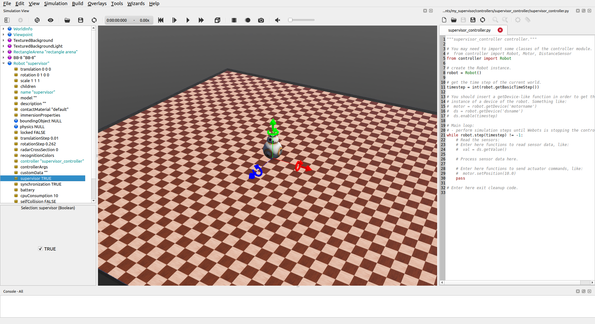

## Tutorial 8: The Supervisor (XX Minutes)

This tutorial explains how to add and use a [Supervisor](../reference/supervisor.md).

A [Supervisor](../reference/supervisor.md) is a special type of [Robot](..reference/robot.md) which has additional powers.
In fact, any [Robot](..reference/robot.md) can be turned into a supervisor by setting the corresponding field called `supervisor` to true.
A [Supervisor](../reference/supervisor.md) can modify the environment by adding or removing nodes to the scene, it can change their properties by modifying the values of their fields in a programmatic way, allowing for instance to move or setup a robot a certain way and, last but not least, thanks to its unlimited access, it can be used to gather measurements about the state of the simulation as well as its evolution.

This tutorial will explore how to achieve these tasks using a [Supervisor](../reference/supervisor.md).

### Setting up the Environment and Adding a Supervisor

> **Hands-on #1**: Create the environment and add a Supervisor.
Create a new project from the `Wizards` menu by selecting the `New Project Directory...` menu item and follow the instructions:
1. Name the project directory `my_supervisor` instead of the proposed `my_project`.
2. Name the world file `my_supervisor.wbt` instead of the proposed `empty.wbt`.
3. Click all the tick boxes, including the "Add a rectangle arena" which is not ticked by default.
4. In order to have more space, enlarge the arena by setting the size to 10x10 meters by changing the `floorSize` field.
5. Add a [BB-8](bb8.md) robot to the scene, to do this click the `Add` button  and navigate to: `PROTO nodes (Webots projects) / robots / sphero / bb8`. 
6. For the purpose of this tutorial, remove the default controller of BB-8 by clicking the `controller` field, then the `Select` button, and picking `void` from the list.
7. Add a simple [Robot](..reference/robot.md) node to the scene, this will become our Supervisor.
The [Robot](..reference/robot.md) node can be found in the `base nodes` category when clicking the `Add` button.
To better keep track of it, change the `name` field of this node to `supervisor`.
8. Despite the name, the node is still currently just a [Robot](..reference/robot.md), to turn this robot into a [Supervisor](../reference/supervisor.md) requires to set its `supervisor` field to "TRUE".
9. Much like a normal robot, the behavior of a supervisor is defined by a controller.
Add a controller using the `Wizards` menu and select `New Robot Controller..`, selecting the programming language you prefer.
For this tutorial, Python is the choice, but the code will be provided for all other options.
Set `supervisor_controller` as the name of the controller and click finish.
10. Expand once more the [Robot](..reference/robot.md) node, press the `controller` field and click the `select` button in order to give this node the controller we just created, namely pick `supervisor_controller` from the list.
11. Save the world.

If you followed these steps, your environment should look like this:

%figure "Resulting environment."

%end

### Moving Objects using a Supervisor

So far our [Supervisor](../reference/supervisor.md) is quite dull, because according to the controller that was attributed to it, the default behavior does nothing.

In this section, we will program the supervisor to move the BB-8 robot to a different location.
It should be noted that to achieve this we are effectively cheating, rather than instructing the BB-8 to move to a new location we will transport it there.
In other words the movement will ignore all the physics, but herein lies the power of a [Supervisor](../reference/supervisor.md), as it can bend the rules however it likes.

To move the BB-8 to a new location is quite straightforward, if you wished to do so without the help of a supervisor you would simply change its `translation` field to the desired value, say `0 0 2.5`.
The [Supervisor](../reference/supervisor.md) does it much in the same way.

As you might have noticed, the default controller we created using the `Wizard` is setup for a classic robot, not a supervisor.
In order to access the powers of a supervisor requires therefore some slight changes to the controller.
To begin with, replace the contents of the default controller with the following code, depending on the language you have picked and save.
In Python the changes made consist in replacing `from controller import Robot` with `from controller import Supervisor`, in order to have access to the new functionalities provided by the supervisor node.
Similarly, instead of creating a robot instance using `robot = Robot()`, we create a supervisor one instead by doing `robot = Supervisor()`.

>**Note:** It is important to remember that a supervisor is nothing more than a robot with special powers, which implies that whatever a robot can do, so can the supervisor.
This means that you do not need a `Robot` instance if you have a supervisor one.
For example the infinite loop that determines the pace of the controller (namely: `while robot.step(TIME_STEP) != -1`) does not need to be changed, as the supervisor can do the same.

%tab-component "language" %tab "C"

#include <webots/supervisor.h>

#define TIME_STEP 32

int main(int argc, char **argv) {
  wb_robot_init();

  // CODE PLACEHOLDER 1

  while (wb_robot_step(TIME_STEP) != -1) {
    // CODE PLACEHOLDER 2

  }

  wb_robot_cleanup();

  return 0;
}
%tab-end

%tab "C++"

#include <webots/Supervisor.hpp>

#define TIME_STEP 32

// All the webots classes are defined in the "webots" namespace
using namespace webots;

int main(int argc, char **argv) {
  Robot *robot = new Supervisor();

  // CODE PLACEHOLDER 1

  while (robot->step(TIME_STEP) != -1) {
    // CODE PLACEHOLDER 2

  }

  delete robot;

  return 0;
}
%tab-end

%tab "Python"

from controller import Supervisor

TIME_STEP = 32

# create the Supervisor instance.
robot = Supervisor()

# CODE PLACEHOLDER 1

while robot.step(TIME_STEP) != -1:
  # CODE PLACEHOLDER 2

  pass
%tab-end

%tab "Java"

import com.cyberbotics.webots.controller.Supervisor;

public class MySupervisor {

 public static void main(String[] args) {

   int TIME_STEP = 32;

   Supervisor robot = new Supervisor();

   while (robot.step(TIME_STEP) != -1);
 }
}
%tab-end

%tab "MATLAB"

TIME_STEP = 32;

% CODE PLACEHOLDER 1

while wb_robot_step(TIME_STEP) ~= -1
  % CODE PLACEHOLDER 2

end

%tab-end 

%end

Save the controller, and if necessary compile it using the `Build` button.
Now everything is ready to begin programming the supervisor so that it moves BB-8 to a new location.

> **Hands-on #2**: Move BB-8 using the Supervisor.
1. In principle the world could be very complex, so it is necessary to have a way of uniquely identifying our BB-8 among the other objects.
To do so we can use the DEF mechanism explored in [tutorial 2](tutorial-2-modification-of-the-environment.md).
Click the BB-8 node in the scene tree and give it a DEF name "MY_BB8", then save the world.
2. Behind the scenes, in Webots each node is uniquely identifiable by a node reference.
To retrieve this reference, the supervisor API method [getFromDef](../reference/supervisor?tab-language=python#wb_supervisor_node_get_from_def) can be used.
In placeholder 1, let's retrieve the node reference of BB-8.

%tab-component "language" %tab "C"

WbNodeRef bb8_node = wb_supervisor_node_get_from_def("MY_BB8");

%tab-end

%tab "C++"

Node *bb8Node = robot.getFromDef("MY_BB8");

%tab-end

%tab "Python"

bb8_node = robot.getFromDef("MY_BB8")

%tab-end

%tab "Java"

Node bb8Node = robot.getFromDef("MY_BB8");

%tab-end

%tab "MATLAB"

bb8_node = wb_supervisor_node_get_from_def('MY_BB8')

%tab-end 

%end