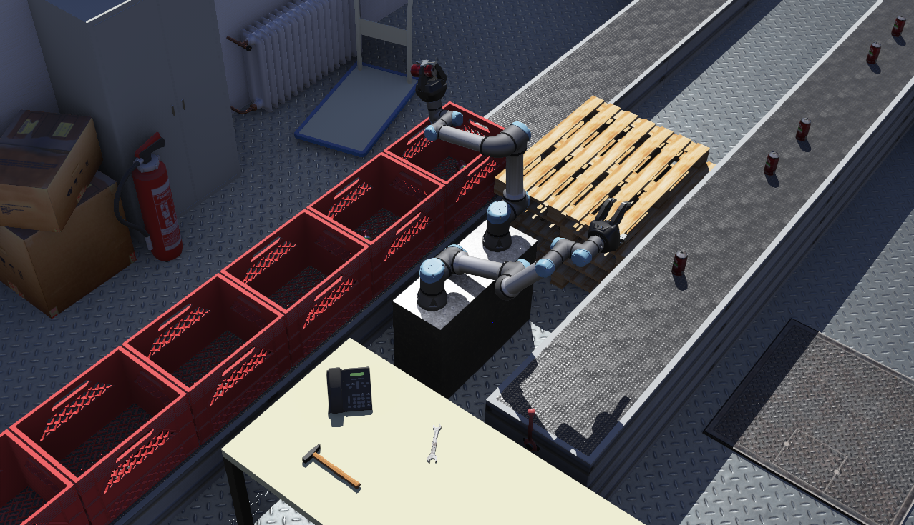

## Universal Robot UR5e

%robot ur5e images/robots/ur5e/model.png

The [Universal Robot UR5e](https://www.universal-robots.com/products/ur5-robot/) is a flexible collaborative robot arm with 6 degrees of freedom.

The Universal Robot UR5e model in Webots is fully compatible with ROS.

### Movie Presentation


### UR5e PROTO

Derived from [Robot](../reference/robot.md).

```
UR5e {
  SFVec3f    translation     0 0 0
  SFRotation rotation        1 0 0 4.712388966
  SFString   name            "UR5e"
  SFString   controller      "void"
  SFString   controllerArgs  ""
  SFBool     synchronization TRUE
  SFBool     selfCollision   TRUE
  MFNode     toolSlot        []
  SFBool     staticBase      TRUE
}
```

> **File location**: "[WEBOTS\_HOME/projects/robots/universal_robots/ur5e/protos/UR5e.proto](https://github.com/omichel/webots/tree/master/projects/robots/universal_robots/ur5e/protos/UR5e.proto)"

#### UR5e Field Summary

- `toolSlot`: Extend the robot with new nodes at the end of the arm.

- `staticBase`: Defines if the robot base should be pinned to the static environment.

### Samples

You will find the following sample in this folder: "WEBOTS\_HOME/projects/robots/universal_robots/ur5e/worlds".

#### ur5e.wbt

 This simulation shows two UR5e robots equipped with a [ROBOTIQ 3F Gripper](gripper-actuators.md#robotiq-3f-gripper) grabbing cans on a conveyor belt and putting them in crates.

### ROS

To use ROS with the simulated UR5e robot in Webots, the `universal_robot_ros` controller should be assigned to the robot. Then the `ur_e_webots` ROS package located in "[WEBOTS\_HOME/projects/robots/universal_robots/ur5e/ressources/ros_package/ur_e_webots](https://github.com/omichel/webots/tree/master/projects/robots/universal_robots/ur5e/ressources/ros_package/ur_e_webots)" should be copied into your catkin workspace.

Once `roscore` is started the `ur5e` node of the `ur_e_webots` package can be launched:
```
roslaunch ur_e_webots ur5e.launch
```

The simulation can now be started.

> **Note**: As MoveIt! seems to have difficulties with finding plans for the robot with full joint limits [-2pi, 2pi], there is a joint_limited version using joint limits restricted to [-pi,pi]. In order to use this joint limited version, simply use the launch file arguments 'limited', i.e.: `roslaunch ur_e_webots ur5e_joint_limited.launch`

#### MoveIt!

Thanks to the [universal_robot](http://wiki.ros.org/universal_robot) ros package, MoveIt! can be used for motion planning. It can be started with the following launch file:
```
roslaunch ur5_e_moveit_config ur5_e_moveit_planning_execution.launch
```
Finally, for starting up RViz with a configuration including the MoveIt! Motion Planning plugin run:
```
roslaunch ur5_e_moveit_config moveit_rviz.launch config:=true
```
