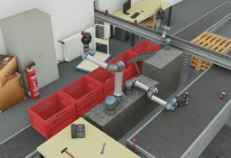

## Universal Robots UR3e, UR5e and UR10e

%robot ure images/robots/ure/model.thumbnail.png

The Universal Robots [UR3e](https://www.universal-robots.com/products/ur3-robot/), [UR5e](https://www.universal-robots.com/products/ur5-robot/) and [UR10e](https://www.universal-robots.com/products/ur10-robot/) are flexible collaborative robot arms with 6 degrees of freedom.

The Universal Robots UR3e, UR5e and UR10e models in Webots are fully compatible with ROS.

These robot models and controllers are sponsored by the [ROSin european project](http://rosin-project.eu/ftp/cross-platform-ros-simulation-for-mobile-manipulators).

### Movie Presentation


### UR3e, UR5e and UR10e PROTO

Derived from [Robot](../reference/robot.md).

```
UR5e/UR5e/UR10e {
  SFVec3f    translation     0 0 0
  SFRotation rotation        1 0 0 4.712388966
  SFString   name            "UR5e"
  SFString   controller      "void"
  MFString   controllerArgs  []
  SFBool     supervisor      FALSE
  SFBool     synchronization TRUE
  SFBool     selfCollision   TRUE
  MFNode     toolSlot        []
  SFBool     staticBase      TRUE
}
```

> **File location**: "[WEBOTS\_HOME/projects/robots/universal\_robots/protos/UR3e.proto](https://github.com/cyberbotics/webots/tree/master/projects/robots/universal_robots/protos/UR3e.proto)", "[WEBOTS\_HOME/projects/robots/universal\_robots/protos/UR5e.proto](https://github.com/cyberbotics/webots/tree/master/projects/robots/universal_robots/protos/UR5e.proto)" and "[WEBOTS\_HOME/projects/robots/universal\_robots/protos/UR10e.proto](https://github.com/cyberbotics/webots/tree/master/projects/robots/universal_robots/protos/UR10e.proto)"

#### Field Summary

- `toolSlot`: Extend the robot with new nodes at the end of the arm.

- `staticBase`: Defines if the robot base should be pinned to the static environment.

### Samples

You will find the following sample in this folder: "[WEBOTS\_HOME/projects/robots/universal\_robots/worlds](https://github.com/cyberbotics/webots/tree/master/projects/robots/universal_robots/worlds)".

#### [ure.wbt](https://github.com/cyberbotics/webots/tree/master/projects/robots/universal_robots/worlds/ure.wbt)

 This simulation shows an UR3e, an UR5e and an UR10e robot, equipped with a [ROBOTIQ 3F Gripper](gripper-actuators.md#robotiq-3f-gripper), grabbing cans on conveyor belts and putting them in crates.

### ROS

To use ROS with the simulated UR3e/UR5e/UR10e robot in Webots, the `<extern>` controller should be assigned to the robot.
Then the `ur_e_webots` ROS package located in "[WEBOTS\_HOME/projects/robots/universal\_robots/resources/ros\_package/ur\_e\_webots](https://github.com/cyberbotics/webots/tree/master/projects/robots/universal_robots/resources/ros_package/ur_e_webots)" should be copied into your catkin workspace.

Once `roscore` is started the `ur5e` (replace `5` by `3` or `10` for the UR3e or UR10e) node of the `ur_e_webots` package can be launched:
```
roslaunch ur_e_webots ur5e.launch
```

The simulation can now be started.

#### MoveIt!

Thanks to the [universal\_robot](http://wiki.ros.org/universal_robot) ROS package, MoveIt! can be used for motion planning. It can be started with the following launch file:
```
roslaunch ur5_e_moveit_config ur5_e_moveit_planning_execution.launch
```
Finally, to start RViz with a configuration including the MoveIt! Motion Planning plugin, run:
```
roslaunch ur5_e_moveit_config moveit_rviz.launch config:=true
```

> **Note**: As MoveIt! seems to have difficulties with finding plans for the robot with full joint limits [-2pi, 2pi], there is a joint_limited version using joint limits restricted to [-pi,pi]. In order to use this joint limited version, simply use instead the `ur5e_joint_limited` launch file instead of the `ur5e.launch` one, i.e.: `roslaunch ur_e_webots ur5e_joint_limited.launch`
