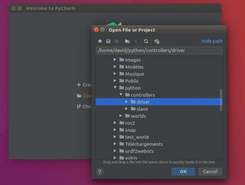
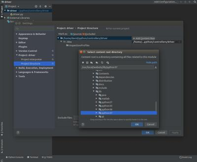
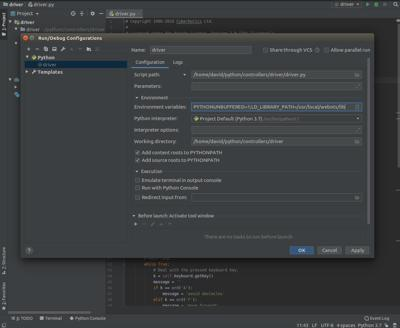
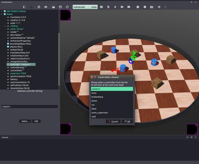
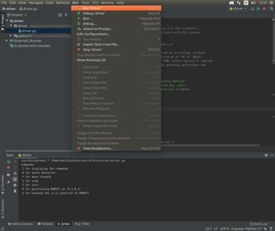

## Using your IDE

Using an [Integrated Development Environment (IDE)](https://en.wikipedia.org/wiki/Integrated_development_environment) is convenient as it generally features advanced source code edition tools, a built-in debugger, etc.
Fortunately, you can use your favorite IDE to develop a Webots controller.

A priori, Webots works with any IDE to create, build and debug robot controllers.
It is simply a matter of setting up the IDE correctly to use the build rules of Webots controllers.

Documenting every IDE for each OS is difficult to maintain.
Therefore, only some of them are documented here.
They could serve as a reference for others.

The build rules are:

- The target executable file should have the same name as the controller directory, and follow strictly this path: `$WEBOTS_PROJECT/controllers/$(CONTROLLER_NAME)/$(CONTROLLER_NAME)$(EXE_EXTENSION)`.
- The executable should be compiled, linked and executed with the Webots controller library.
Therefore a number of paths and/or environment variables should be set accordingly.

%tab-component "language"

%tab "C"

```
libraries:
- $(WEBOTS_HOME)/lib/controller/$(SL_PREFIX)Controller$(SL_SUFFIX)

includes:
- $(WEBOTS_HOME)/include/controller/c
```

%tab-end

%tab "C++"

```
libraries:
- $(WEBOTS_HOME)/lib/controller/$(SL_PREFIX)Controller$(SL_SUFFIX)
- $(WEBOTS_HOME)/lib/controller/$(SL_PREFIX)CppController$(SL_SUFFIX)

includes:
- $(WEBOTS_HOME)/include/controller/cpp
```

%tab-end

%tab "Java"

```
libraries:
- $(WEBOTS_HOME)/lib/controller/java/Controller.jar
```

%tab-end

%tab "Python"

```
N/A because Python is interpreted.
```

%tab-end

%end

---

*Legend*

- `WEBOTS_HOME` is the path to Webots.
- `WEBOTS_PROJECT` is the path to your Webots project.
- `CONTROLLER_NAME` is the name of your controller.
- `EXE_EXTENSION` is the executable file suffix.
    - For C or C++: `.exe` on Windows, and an empty string on other operating systems.
    - For Python: `.py`.
    - For Java: `.class` or `.jar`.
- `SL_PREFIX` is the prefix of a shared library: `lib` on Linux or macOS, and an empty string on Windows.
- `SL_SUFFIX` is the suffix of a shared library: `.so` on Linux, `.dylib` on macOS and `.dll` on Windows.
- `PYTHON_VERSION` is your Python version, but concatenated (`310`, `39`, `38`, etc.).

---

Some IDE comes with interpreters or a compiler tool chain.
They may be incompatible with the precompiled Webots controller libraries.
In this case, the IDE integration may be much more complex.
For example, this is the case of the `Visual Studio C++ compiler` which is not compatible with the `MINGW gcc compiler` used to precompile the C++ Webots controller library.
Therefore Visual Studio needs [custom instructions](#visual-studio).

### Visual Studio

Microsoft Visual Studio is an integrated development environment (IDE) for C/C++ available on the Windows platform.
On Windows, Visual Studio is a possible alternative to using Webots built-in Makefile and gcc (MinGW) compiler.
Visual Studio can be used to develop controllers using Webots C or C++ API.
The developer must choose one of these two APIs as they cannot be used together in controller code.
The C API is composed of ".h" files that contains flat C functions that can be used in C or C++ controllers.
The C++ API is composed of ".hpp" files that contain C++ classes and methods that can be used in C++ controllers only.
In principle any C or C++ controller from the Webots distribution can be turned into a Visual Studio project.

#### New Robot Controller

A Visual Studio option is offered in the **File / New / New Robot Controller...** menu item after you choose the C or C++ language on Windows.
Webots creates a Visual Studio project for your robot controller, so that you don't need to configure it manually as described in the next section.
Webots assumes that you defined the environment variable `WEBOTS_HOME` in the system settings.
This variable should point to the installation folder of Webots, typically, `C:\Program Files\Webots` or `C:\Users\<MyUsername>\AppData\Local\Programs\Webots`.

#### Configuration

When creating a Webots controller with Visual Studio, it is necessary to specify the path to Webots ".h" and/or ".hpp" files.
It is also necessary to configure the linker to use the "Controller.lib" import library from Webots distribution.
The "Controller.lib" files is needed to link with the "Controller.dll" file that must be used by the controller in order to communicate with Webots.

The following procedure (Visual Studio 2008 Express) explains how to create a Visual Studio project for a Webots controller.
In this guide, the resulting ".exe" file is launched by Webots.
Alternatively, Visual Studio can also launch external controllers as explained [here](running-extern-robot-controllers.md#single-simulation-and-single-local-extern-robot-controller).

1. Copy a Webots project from Webots distribution to your "Documents" folder, or create an empty project directory using the **File / New / New Project Directory...**. Either way, the project directory must contain the "controllers" and "worlds" subdirectories.

2. Start Visual Studio and select: **File / New / Project...**.
Then choose these settings:

        Project type: General
        Template: Empty Project
        Name: MyController (for example)
        Location: C:\Users\MyName\Documents\MyProject\controllers (for example)

    Where "MyController" is the name of a new or already existing controller
    directory, and where "Location" must indicate the "controllers" subdirectory of
    your Webots project directory.

3. Then you can add a C or C++ source file to your project: Choose either: `Project / Add Existing Item` or `Project / Add New Item / C++ File (.cpp)`.
In the second case you can copy the content of one of the C/C++ examples of Webots distribution.

    Note that if you copied C code from Webots examples to Visual Studio, it is highly
    recommended to change the source file extension from .c to .cpp. The reason is
    that Webots examples are written for the gcc compiler which uses a more modern
    version of the C language than Visual Studio. By changing the file extension to
    .cpp you will instruct Visual Studio to compile the file in C++ mode (/TP) which is
    more tolerant with gcc code. If you don't do it, you may run into error messages
    like these:

        MyController.c(24): error C2275: 'WbDeviceTag' : illegal use of
          this type as an expression
        MyController.c(24): error C2146: syntax error : missing ';' before
          identifier 'ir0'
        ...

4. Now we can set up the project configuration for Webots.
Select the `Project / Properties` menu.
In the `Property Pages`, in the `Configuration Properties`, enter following configuration:

        C/C++ > General > Additional Include Directories:
          C:\Program Files\Webots\include\controller\c

    This will tell Visual Studio where to find Webots C API (.h files).

    By default Visual Studio places the .exe file in a "Debug" or "Release"
    subdirectory. However, in order to be executed by Webots, the .exe file must be
    placed directly at the root of the "MyController" directory. So, in this example
    the .exe should be there: "MyProject\controllers\MyController\MyController.exe".
    Consequently the linker output file should be configured like this:

        Linker > General > Output File: $(ProjectName).exe

    Now we need to tell Visual Studio to use the "Controller.lib" import library:

        Linker > Input > Additional Dependencies:
          Controller.lib
        Linker > General > Additional Library Directories:
          C:\Program Files\Webots\lib\controller

5. If you want to use the C API, you should skip step 5 and go directly to step 6.
If you want to use the C++ API follow these instructions:

    - In `Property Pages`, in the `Configuration Properties`, add the path to Webots .hpp files:


            C/C++ > General > Additional Include Directories:
              C:\Program Files\Webots\include\controller\c
              C:\Program Files\Webots\include\controller\cpp

    - Now you should have the path to both the .h and the .hpp files.

    - Then you need to add Webots C++ wrappers to your project.
    The C++ wrappers are .cpp files that implement the interface between the C++ API and the C API.
    You can proceed like this:

    - In Visual Studio, in the `Solution Explorer`: right-mouse-click on the `Sources Files` folder, then select `Add / New Filter`.
    This should create a `NewFilter1` subfolder in your `Sources Files` folder.
    Then select the `NewFilter1` and with the right-mouse-button: choose the `Add / Existing Item...` menu.
    In the file dialog, go to the "C:\Program Files\Webots\resources\languages\cpp" directory, then select all the .cpp files (but no other file) in that directory and hit the `Add` button.
    This should add the "Accelerometer.cpp, Camera.cpp, Compass.cpp", etc. source files to your project.

6. Now you should be able to build your controller with the `Build / Build MyController` menu item (or the <kbd>F7</kbd> key).
This should generate the "MyProject\controllers\MyController\MyController.exe" file.

7. Now we can switch to Webots in order to test the .exe controller.
Start Webots and verify that your robot is associated with the correct controller: In the `Scene tree`, expand the robot node and check the `controller` field.
It should be: `controller "MyController"`.
Otherwise you should change it: hit the `...` (ellipsis) button, this opens a selection dialog.
In the selection dialog choose "MyController".
Then hit the `Save` button in Webots' main window.
Finally you can hit the `Run` button to start the simulation.
At this point the simulation should be using your Visual Studio controller.

8. If you want to debug your controller with Visual Studio you can *attach* the debugger to the running controller process.
Proceed like this: In Webots, hit the `Pause` button then the `Reload` button.
Then, in Visual Studio, use the `Debug / Attach to Process...` menu.
In the dialog choose the `MyController.exe_webots` process.
Still in Visual Studio, you can now add breakpoints and watches in the controller code.
Then, in Webots, hit the `Run` button to resume the simulation.
Now the controller should pause when it reaches one of your breakpoints.

#### Link with the Webots Libraries

Webots contains several `C` or `C++` libraries based on the `libController` or `libCppController` libraries (e.g. the `vehicle libraries`, `DARwIn-OP library`, `youBot library`, etc.).

The precompiled `C` libraries are released with their corresponding Visual Studio `.lib` file (the linker to the `.dll` file) to facilitate their integration into a Visual Studio project.
They are located in the same directory as the library source, where the `.dll` file is generated.

**Note**: The chosen architecture (32 or 64-bit) should match with Visual Studio solution platform and the path to the `Controller.lib` library.

However there is no precompiled `C++` libraries for Visual Studio, because the `gcc` compiler tool chain embedded in Webots is incompatible with Visual Studio.
To use the `C++` libraries with your project, their source files should be compiled directly in your project, exactly as for the `libCppController` library (cf. instructions above).

For example, to add the `C++ vehicle libraries`:

- Add the `C`, `car` and `driver` precompiled libraries (`Linker > Input > Additional Dependencies`):

    - `car.lib`
    - `driver.lib`

- Add the following `C++` source files to your project (`Add / New Filter` and `Add / Existing Item...`):

    - `$(WEBOTS_HOME)/projects/default/libraries/vehicle/cpp/car/src/*.cpp`
    - `$(WEBOTS_HOME)/projects/default/libraries/vehicle/cpp/driver/src/*.cpp`

- If the include files are not located in `$(WEBOTS_HOME)/include/controller/c` or `$(WEBOTS_HOME)/include/controller/cpp` (which is the case for the vehicle libraries), they should be added to your project (`C/C++ > General > Additional Include Directories`).

### CMake

[CMake](https://cmake.org) is a cross-platform free and open-source software tool for managing the build process of software using a compiler-independent method.
Using [its generators](https://cmake.org/cmake/help/v3.0/manual/cmake-generators.7.html), it generates native build environments, such as `XCode`, `CodeBlocks`, `Sublime Text 2` or `Eclipse` projects.
The actual build is processed in these environments.
For the `Visual Studio` target, prefer the [above solution](#visual-studio).

As a template, you could copy the following `CMakeLists.txt` file to your controller directory.
This template is only a sample, it may be adapted depending on your CMake target.

```cmake
cmake_minimum_required(VERSION 3.0)

# Setup the project.
# Its name is defined to be the controller directory name.
get_filename_component(PROJECT ${CMAKE_SOURCE_DIR} NAME)
project(${PROJECT})

# Get C or C++ sources in the current directory (only).
file(GLOB C_SOURCES *.c)
file(GLOB CPP_SOURCES *.cpp)
set(SOURCES ${C_SOURCES} ${CPP_SOURCES})

# Set the  Webots home path (change it according to your installation method)
set(WEBOTS_HOME "/usr/local/webots")
#set(WEBOTS_HOME "/snap/webots/current/usr/share/webots")

# Link with the Webots controller library.
link_directories($ENV{WEBOTS_HOME}/lib/controller)
set (LIBRARIES m ${CMAKE_SHARED_LIBRARY_PREFIX}Controller${CMAKE_SHARED_LIBRARY_SUFFIX} ${CMAKE_SHARED_LIBRARY_PREFIX}CppController${CMAKE_SHARED_LIBRARY_SUFFIX})
include_directories($ENV{WEBOTS_HOME}/include/controller/c $ENV{WEBOTS_HOME}/include/controller/cpp)

# Setup the target executable.
add_executable(${PROJECT} ${SOURCES})
target_link_libraries(${PROJECT} ${LIBRARIES})

# Copy the target executable at the right location.
add_custom_command(TARGET ${PROJECT} POST_BUILD COMMAND ${CMAKE_COMMAND} -E
  copy ${CMAKE_BINARY_DIR}/${PROJECT} ${CMAKE_SOURCE_DIR}
)
```

Then, create a `build` directory, create the native project, and build it in the target IDE.
For example:

```shell
# export WEBOTS_HOME=...
cd $WEBOTS_PROJECT/controllers/$CONTROLLER_NAME
# edit CMakeLists.txt
mkdir build
cd build
cmake .. -G "Unix Makefiles"
make
```

### Qt Creator

[Qt Creator](https://www.qt.io) is a cross-platform IDE supporting among others the C++ language.

As a template, you could copy the following `qmake.pro` file in your controller directory and open this project in Qt Creator:

```qmake
# Setup global paths. The WEBOTS_HOME environment variable should be setup.
WEBOTS_HOME_PATH = $$(WEBOTS_HOME)
CONTROLLER_PATH = $$PWD
CONTROLLER_NAME = $$basename(CONTROLLER_PATH)

# Get C or C++ sources in the current directory (only).
SOURCES = $$files(*.c, true)
SOURCES += $$files(*.cpp, true)
HEADERS = $$files(*.h, true)

# Setup the project.
# Its name is defined to be the controller directory name.
TARGET = $$CONTROLLER_NAME
DESTDIR = $$CONTROLLER_PATH
QMAKE_TARGET = $$CONTROLLER_NAME

# Do not link with the Qt libraries :-)
CONFIG -= qt

# Link with the Webots controller library.
INCLUDEPATH += $$WEBOTS_HOME_PATH/include/controller/c $$WEBOTS_HOME_PATH/include/controller/cpp
LIBS += -L$$WEBOTS_HOME_PATH/lib/controller -lController -lCppController
win32 {
  CONFIG += console
}
macx {
  CONFIG -= app_bundle
  CONFIG += sdk_no_version_check
}
```

### PyCharm

[PyCharm](https://www.jetbrains.com/pycharm) is a cross-platform integrated development environment (IDE), specifically for the Python language.
It provides code analysis, a graphical debugger, an integrated unit tester and integration with version control systems (VCSes).

[PyCharm](https://www.jetbrains.com/pycharm) is a possible alternative to using Webots built-in editor for Python.
This chapter explains step-by-step how to configure [PyCharm](https://www.jetbrains.com/pycharm) to edit a Python controller and run it.
Although this chapter focuses on [PyCharm](https://www.jetbrains.com/pycharm), you should be able to configure any other Python IDE in a similar way.

#### Creation of the PyCharm Project

Once PyCharm is started, click on `Open` and then select the directory of the Webots robot controller that you want to modify.
As an example, the `driver` sample controller is used here.

%figure "Open controller in PyCharm"



%end

In order to use the Webots Python API, it should be added to the project.
This can be done from the `File` / `Settings` menu.
In the `Settings` window, select the `Project` / `Project Structure` tab, then, the `Add Content Root` button can be used to add a new folder to the path, select the `WEBOTS_HOME/lib/controller/python38` folder (or any other Python version).

%figure "Addition of the Webots controller library"



%end

The Webots Python API depends on the Webots CPP API, therefore, the path need to be modifed to include the Webots `lib` directory.
This can be done from the `Run` / `Edit Configurations` menu.
In the `Run Configurations` windows, press the `+` button and then select `Python`, then set the `Script path` to point to your python file and in the `Environment variables` define the path variable (adjust it if needed, with your actual Webots installation folder):

%tab-component "os"

%tab "Linux"
```bash
LD_LIBRARY_PATH=/usr/local/webots/lib/controller
```
%tab-end

%tab "Windows"
```bash
Path=C:\Program Files\Webots\lib\controller\;C:\Program Files\Webots\msys64\mingw64\bin\;C:\Program Files\Webots\msys64\mingw64\bin\cpp
```
_Note_: for some reason, the anti-slash at the end of `controller\` and `bin\` is critical. If missing, it won't work.
%tab-end

%tab "macOS"
```bash
DYLD_LIBRARY_PATH=/Applications/Webots.app/lib/controller
```
%tab-end

%end

If you are using other libraries (e.g., the `vehicle libraries`, `DARwIn-OP library`, etc.), the path to the corresponding shared libraries should be added as well.

%figure "Addition of the Webots libraries to the path"



%end

#### Run the Controller

Once the [PyCharm](https://www.jetbrains.com/pycharm) project configured, you can start Webots and open the desired world.
To allow [PyCharm](https://www.jetbrains.com/pycharm) to start the controller instead of Webots, set the controller of the robot to `<extern>` and set the environment variables as explained in the [Running Extern Robot Controllers](https://cyberbotics.com/doc/guide/running-extern-robot-controllers#environment-variables) chapter.

%figure "Robot controller to external"



%end

The controller can now be started from [PyCharm](https://www.jetbrains.com/pycharm) from the `Run` menu (if not already done, start the simulation in Webots).

%figure "Run controller from PyCharm"



%end
