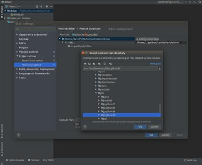

## Using Your IDE

Using an [Integrated Development Environment (IDE)](https://en.wikipedia.org/wiki/Integrated_development_environment) is convenient as it generally features advanced source code edition tools, a built-in debugger, etc.
Fortunately, you can use your favorite IDE to develop a Webots controller.

A priori, Webots works with any IDE to create, build and debug robot controllers.
It is simply a matter of setting up the IDE correctly to fulfill the Webots controller build rules.

Documenting every IDE for each OS is a huge and unmaintainable task.
This is why only some of them are documented.
They could serve as a reference for others.

The build rules are:

- The target executable file should have the same name as the controller directory, and follow strictly this path: `$WEBOTS_PROJECT/controllers/$(CONTROLLER_NAME)/$(CONTROLLER_NAME)$(EXE_EXTENSION)`.
- The executable should be linked with the Webots controller library (and eventually include the corresponding path).

%tab-component "language"

%tab "C"

```
libraries:
- $(WEBOTS_HOME)/lib/$(SL_PREFIX)Controller$(SL_SUFFIX)

includes:
- $(WEBOTS_HOME)/include/controller/c
```

%tab-end

%tab "C++"

```
libraries:
- $(WEBOTS_HOME)/lib/$(SL_PREFIX)Controller$(SL_SUFFIX)
- $(WEBOTS_HOME)/lib/$(SL_PREFIX)CppController$(SL_SUFFIX)

includes:
- $(WEBOTS_HOME)/include/controller/cpp
```

%tab-end

%tab "Java"

```
libraries:
- $(WEBOTS_HOME)/lib/java/Controller.jar
```

%tab-end

%tab "Python"

```
N/A because Python is interpreted.
```

%tab-end

%end

---

*Legend*

- `WEBOTS_HOME` is the path to Webots.
- `WEBOTS_PROJECT` is the path to your Webots project.
- `CONTROLLER_NAME` is the name of your controller.
- `EXE_EXTENSION` is the executable file suffix.
    - For C or C++: `.exe` on Windows, and an empty string on other operating systems.
    - For Python: `.py`.
    - For Java: `.class` or `.jar`.
- `SL_PREFIX` is the prefix of a shared library: `lib` on Linux or macOS, and an empty string on Windows.
- `SL_SUFFIX` is the suffix of a shared library: `.so` on Linux, `.dylib` on macOS and `.dll` on Windows.
- `PYTHON_VERSION` is your Python version, but concatenated (`27`, `37`, etc.).

---

### Visual Studio

On Windows, [Visual Studio](https://visualstudio.microsoft.com) can be used to create a C or C++ controller.

A `Visual Studio` project can be simply created using the "New Robot Controller..." wizard.
To do so, you should simply select the **Wizards / New Robot Controller...** menu item, choose the C or C++ language, and select a Visual Studio project.
The target project can be open in `Visual Studio`.

#### How to Debug a Controller with Visual Studio

If you want to debug your controller with Visual Studio you can *attach* the debugger to the running controller process.
Proceed like this: In Webots, hit the `Pause` button then the `Reload` button.
Then, in Visual Studio, use the `Debug / Attach to Process...` menu.
In the dialog choose the `MyController.exe_webots` process.
Still in Visual Studio, you can now add breakpoints and watches in the controller code.
Then, in Webots, hit the `Run` button to resume the simulation.
Now the controller should pause when it reaches one of your breakpoints.

#### Link with the Other Webots Libraries

Webots contains several `C` or `C++` libraries based on the `libController` or `libCppController` libraries (e.g. the `vehicle libraries`, `DARwIn-OP library`, `youBot library`, etc.).

The precompiled `C` libraries are released with their corresponding Visual Studio `.lib` file (the linker to the `.dll` file) to facilitate their integration into a Visual Studio project.
They are located in the same directory as the library source, where the `.dll` file is generated.

However there is no precompiled `C++` libraries for Visual Studio, because the `gcc` compiler tool chain embedded in Webots is incompatible with Visual Studio.
To use the `C++` libraries with your project, their source files should be compiled directly in your project, exactly as for the `libCppController` library (cf. instructions above).

For example, to add the `C++ vehicle libraries`:

- Add the `C`, `car` and `driver` precompiled libraries (`Linker > Input > Additional Dependencies`):

    - `car.lib`
    - `driver.lib`

- Add the following `C++` source files to your project (`Add / New Filter` and `Add / Existing Item...`):

    - `$(WEBOTS_HOME)/projects/default/libraries/vehicle/cpp/car/src/*.cpp`
    - `$(WEBOTS_HOME)/projects/default/libraries/vehicle/cpp/driver/src/*.cpp`

- If the include files are not located in `$(WEBOTS_HOME)/include/controller/c` or `$(WEBOTS_HOME)/include/controller/cpp` (which is the case for the vehicle libraries), they should be added to your project (`C/C++ > General > Additional Include Directories`).

### CMake

[CMake](https://cmake.org) is a cross-platform free and open-source software tool for managing the build process of software using a compiler-independent method.
Using [its generators](https://cmake.org/cmake/help/v3.0/manual/cmake-generators.7.html), it generates native build environments, such as `XCode`, `CodeBlocks`, `Sublime Text 2` or `Eclipse` projects.
The actual build is processed in these environments.
For the `Visual Studio` target, prefer the [above solution](#visual-studio).

As a template, you could copy the following `CMakeLists.txt` file to your controller directory.
This template is only a sample, it may be adapted depending on your CMake target.

```cmake
cmake_minimum_required(VERSION 3.0)

# Setup the project.
# Its name is defined to be the controller directory name.
get_filename_component(PROJECT ${CMAKE_SOURCE_DIR} NAME)
project(${PROJECT})

# Get C or C++ sources in the current directory (only).
file(GLOB C_SOURCES *.c)
file(GLOB CPP_SOURCES *.cpp)
set(SOURCES ${C_SOURCES} ${CPP_SOURCES})

# Link with the Webots controller library.
IF (WIN32)
  link_directories($ENV{WEBOTS_HOME}/msys64/mingw64/bin)
ELSE()
  link_directories($ENV{WEBOTS_HOME}/lib)
ENDIF()
set (LIBRARIES ${CMAKE_SHARED_LIBRARY_PREFIX}Controller${CMAKE_SHARED_LIBRARY_SUFFIX} ${CMAKE_SHARED_LIBRARY_PREFIX}CppController${CMAKE_SHARED_LIBRARY_SUFFIX})
include_directories($ENV{WEBOTS_HOME}/include/controller/c $ENV{WEBOTS_HOME}/include/controller/cpp)

# Setup the target executable.
add_executable(${PROJECT} ${SOURCES})
target_link_libraries(${PROJECT} ${LIBRARIES})

# Copy the target executable at the right location.
add_custom_command(TARGET ${PROJECT} POST_BUILD COMMAND ${CMAKE_COMMAND} -E
  copy ${CMAKE_BINARY_DIR}/${PROJECT} ${CMAKE_SOURCE_DIR}
)
```

Then, create a `build` directory, create the native project, and build it in the target IDE.
For example:

```shell
# export WEBOTS_HOME=...
cd $WEBOTS_PROJECT/controllers/$CONTROLLER_NAME
# edit CMakeLists.txt
mkdir build
cd build
cmake .. -G "Unix Makefiles"
make
```

### Qt Creator

[Qt Creator](https://www.qt.io) is a cross-platform IDE supporting among others the C++ language.

As a template, you could copy the following `qmake.pro` file in your controller directory and open this project in Qt Creator:

```qmake
# Setup global paths. The WEBOTS_HOME environment variable should be setup.
WEBOTS_HOME_PATH = $$(WEBOTS_HOME)
CONTROLLER_PATH = $$PWD
CONTROLLER_NAME = $$basename(CONTROLLER_PATH)

# Get C or C++ sources in the current directory (only).
SOURCES = $$files(*.c, true)
SOURCES += $$files(*.cpp, true)
HEADERS = $$files(*.h, true)

# Setup the project.
# Its name is defined to be the controller directory name.
TARGET = $$CONTROLLER_NAME
DESTDIR = $$CONTROLLER_PATH
QMAKE_TARGET = $$CONTROLLER_NAME

# Do not link with the Qt libraries :-)
CONFIG -= qt

# Link with the Webots controller library.
INCLUDEPATH += $$WEBOTS_HOME_PATH/include/controller/c $$WEBOTS_HOME_PATH/include/controller/cpp
win32 {
  CONFIG += console
  LIBS += -L$$WEBOTS_HOME_PATH/msys64/mingw64/bin -lController -lCppController
}
unix {
  LIBS += -L$$WEBOTS_HOME_PATH/lib -lController -lCppController
}
macx {
  CONFIG -= app_bundle
  CONFIG += sdk_no_version_check
  LIBS += -L$$WEBOTS_HOME_PATH/lib -lController -lCppController
}
```

### PyCharm

[PyCharm](https://www.jetbrains.com/pycharm) is a cross-platform integrated development environment (IDE), specifically for the Python language.
It provides code analysis, a graphical debugger, an integrated unit tester and integration with version control systems (VCSes).

[PyCharm](https://www.jetbrains.com/pycharm) is a possible alternative to using Webots built-in editor for Python.
This chapter explains step-by-step how to configure [PyCharm](https://www.jetbrains.com/pycharm) to edit a Python controller and run it.
Although this chapter focuses on [PyCharm](https://www.jetbrains.com/pycharm), you should be able to configure any other Python IDE in a similar way.

#### Creation of the PyCharm Project

Once PyCharm is started, click on `Open` and then select the directory of the Webots robot controller that you want to modify.
As an example, the `driver` sample controller is used here.

%figure "Open controller in PyCharm"


%end

In order to use the Webots Python API, it should be added to the project.
This can be done from the `File` / `Settings` menu.
In the `Settings` window, select the `Project` / `Project Structure` tab, then, the `Add Content Root` button can be used to add a new folder to the path, select the `WEBOTS_HOME/lib/python37` folder (or any other Python version).

%figure "Addition of the Webots controller library"



%end

The Webots Python API depends on the Webots CPP API, therefore, the path need to be modifed to include the Webots `lib` directory.
This can be done from the `Run` / `Edit Configurations` menu.
In the `Run Configurations` windows, press the `+` button and then select `Python`, then set the `Script path` to point to your python file and in the `Environment variables` define the path variable (i.e. `PATH` on Windows, `LD_LIBRARY_PATH` on Linux or `DYLD_LIBRARY_PATH` on macOS) to point to `WEBOTS_HOME/lib` (or `WEBOTS_HOME\msys64\mingw64\bin` on Windows).

%figure "Addition of the Webots libraries to the path"


%end

#### Run the Controller

Once the [PyCharm](https://www.jetbrains.com/pycharm) project configured, you can start Webots and open the desired world.
To allow [PyCharm](https://www.jetbrains.com/pycharm) to start the controller instead of Webots, set the controller of the robot to `<extern>` (see the [Running Extern Robot Controllers](https://www.cyberbotics.com/doc/guide/running-extern-robot-controllers) chapter for more information about external controller).

%figure "Robot controller to external"


%end

The controller can now be started from [PyCharm](https://www.jetbrains.com/pycharm) from the `Run` menu (if not already done, start the simulation in Webots).

%figure "Run controller from PyCharm"


%end
