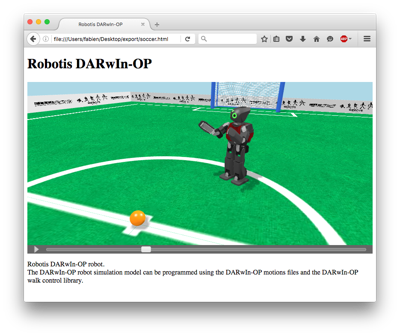

## Web Animation

### Description

Webots can record a simulation to an interactive 3D `HTML` page.
The result is similar to a movie with playback controls, except that you can change the viewpoint at any time.

The mechanism is similar to the [web scene export](web-scene.md), except that a supplementary `JSON` animation file containing the moving objects positions is exported.

The [figure below](#screenshot-of-a-web-animation-page-generated-by-webots) shows an example of an animation page generated by Webots.

%figure "Screenshot of a Web animation page generated by Webots"

%end

### How to Export a Web Animation

Select the `File / Make HTML5 Animation...` menu item and choose the target `HTML` file.
Webots will ask to playback the resulting file in the default Web browser (from the OS settings).

For more details about the HTML export dialog please refer to [this section](web-scene.md#how-to-export-a-web-scene).

**Note**: The `X3D` file, the `JSON` animation file and the required textures are exported in the same directory as the target `HTML` file.

**Note**: The playback option may not work correctly depending on your default Web browser.
In this case, please refer to the [section below](#remarks-on-the-used-technologies-and-their-limitations).

**Note**: A [Supervisor](supervisor-programming.md) can start or stop an animation recording as well.

### How to Embed a Web Animation in Your Website

Please refer to [this section](web-scene.md#how-to-embed-a-web-scene-in-your-website).

### Limitations

The animation file contains only modifications over the following fields:  - `LED.color`  - `Material.diffuseColor`  - `Material.emissiveColor`  - `TextureTransform.translation` (only for the [Track](../reference/track.md) node)  - `Transform.rotation`  - `Transform.translation` The other VRML97 fields are not recorded in the animation file.
Node insertion or deletion are also not recorded in the animation file.

Additional limitations are described in [this section](web-scene.md#limitations).

### Scene Refresh Rate

The scene refresh rate is defined by the `window.requestAnimationFrame()` function. The number of refresh is generally 60 per seconds but will generally match the display refresh rate in most web browsers according to the [documentation](https://developer.mozilla.org/en-US/docs/Web/API/Window/requestAnimationFrame).

However, the `WorldInfo.basicTimeStep` field have an impact on the refresh rate too, because the updates are only sent during the simulation step.
The actual refresh rate can be computed with the following formula:

%figure

%end

> **Note**: It is not recommended to change the `WorldInfo.FPS` or `WorldInfo.basicTimeStep` fields while recording an animation.

### Remarks on the Used Technologies and Their Limitations

Please refer to [this section](web-scene.md#remarks-on-the-used-technologies-and-their-limitations).
