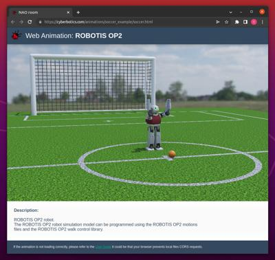

## Web Animation

### Description

Webots can record a simulation to an interactive 3D `HTML` page.
The result is similar to a movie with playback controls, except that you can change the viewpoint at any time.

The mechanism is similar to the [web scene export](web-scene.md), except that a supplementary `JSON` animation file containing the moving objects positions is exported.

The [figure below](#screenshot-of-a-web-animation-page-generated-by-webots) shows an example of an animation page generated by Webots. This animation is available [here](https://cyberbotics.com/animations/soccer_example/soccer.html).

%figure "Screenshot of a Web animation page generated by Webots"

%end

### How to Export a Web Animation

Select the `Share...` menu item and choose if you want to upload it to [webots.cloud](https://webots.cloud) or to save it locally, then click the `Record and export animation` button to start the recording.
Click the `Stop HTML5 animation` to finish the recording and save the animation.
Webots will ask to playback the resulting file in the default Web browser (from the OS settings).

**Note**: The `CSS` file, the `X3D` file, the `JSON` animation file and the required textures are exported in the same directory as the target `HTML` file.

**Note**: The `CSS` file is meant to be used as a styling guide but can be modified/removed.

**Note**: The playback option may not work correctly depending on your default Web browser.
In this case, please refer to the [section below](#remarks-on-the-used-technologies-and-their-limitations).

**Note**: A [Supervisor](supervisor-programming.md) can start or stop an animation recording as well.

### How to Embed a Web Animation in your Website

Please refer to [this section](web-scene.md#how-to-embed-a-web-scene-in-your-website).

### Programming Interface

The web animation is played by a web component from the [WebotsView.js] package called `webots-view`.

The following attributes are available:
* `data-thumbnail`: the name of the .jpg file containing the thumbnail. If the `data-thumbnail` attribute is not set, a default thumbnail will be displayed during load.
* `data-scene`: the name of the .x3d file containing the 3d scene.
* `data-animation`: the name of the .json file containing the animation sequence.
* `data-autoplay`: boolean to determine if the animation should be played automatically, `true` by default.
* `data-isMobileDevice`: boolean variable specifying if the application is running on a mobile device.
* `showCustomWindow`: specify if the custom window button must be displayed on the toolbar. Must be set before loading the animation. That button is hidden by default.

The attributes of `webots-view` are only evaluated once: when the page is loaded. If the `data-scene` and the `data-animation` attributes are set, the `webots-view` web-component will automatically try to load an animation .

For more complex interaction with the web component, the following functions are available:
* `close()`: close the current animation. Note that if the `webots-view` element is removed from the HTML page or `loadScene`, `loadAnimation` or `connect` is called, `close` will be automatically called.
* `getNode(id)`: return the webotsjs node with the corresponding `id` if it exists or undefined.
  * `id`: the id of the node to get.
* `hasAnimation()`: return `true` if there is already a animation loaded by the web component, `false` otherwise.
* `hasView()`: return `true` if a view exist, `false` otherwise.
* `loadAnimation(scene, animation, play, mobileDevice, thumbnail, raw)`: load and play the animation.
  * `scene`: name of the .x3d file.
  * `animation`: name of the .json file.
  * `play`: if false, the animation will be paused, otherwise it will be played.
  * `mobileDevice`: boolean variable specifying if the application is running on a mobile device.
  * `thumbnail`: the URL of the scene thumbnail.
  * `raw`: boolean variable specifying if the animation and scene are raw files or URLs.
* `onready()`: a function that can be overridden. It will be called once the animation is loaded.
* `resize()`: automatically resize the web-component.
* `setAmbientOcclusion(level)`: change the intensity of the ambient occlusion to the given level.
    * `level`: the new level of ambient occlusion. Integer between 1 and 4.
* `stepCallback(time)`: a function that can be overridden. It will be called at every animation's step.
  * `time`: the current timeStep of the animation.
* `updateNode(nodeId, field, value, render)`: Update the value of a webotsjs node. The value is updated only on the web side, do not use with the simulation.
  * `nodeId`: the id of the node (for example: 113).
  * `field`: the field to update. Supported field are: `translation`, `rotation`, `scale` and the various `colors`.
  * `value`: the new value to be set, in `WbVector3.js` or `WbVector4.js` format.
  * `render`: a boolean that indicates whether the function should render once or not once the modifications are applied.

A empty window can be personalized to display additional information about the animation (display graphs, describe the animation,...).
To enable it, you must set the `showCustomWindow` attribute of the `webots-view` element to `true` before loading the animation.
An icon to open the window will then appear in the right side of the toolbar.

The following function are available for you to personalized the window:
* `setCustomWindowTitle(title)`: set the title of the window.
  * `title`: the new title of the window.
* `setCustomWindowTooltip(tooltip)`: set the tooltip of the window's button.
  * `tooltip`: the new tooltip of the window's button.
* `setCustomWindowContent(content)`: set the content of the window. Replace existing content.
  * `content`: the new content of the window.

**NOTE**: Be sure to call these functions only once the `onReady()` function has been called. This is to ensure that the window has already been created.

### Limitations

The animation file contains only modifications over the following fields:
- `LED.color`
- `Material.diffuseColor`
- `Material.emissiveColor`
- `TextureTransform.translation` (only for the [Track](../reference/track.md) node)
- `Pose.rotation`
- `Pose.translation`
- `Light.color`
- `Light.on`

The other fields are not recorded in the animation file.
Node insertion or deletion are also not recorded in the animation file.

Additional limitations are described in [this section](web-scene.md#limitations).

### Scene Refresh Rate

The scene refresh rate is defined by the `window.requestAnimationFrame()` function. The number of refresh is generally 60 per seconds but will generally match the display refresh rate in most web browsers according to the [documentation](https://developer.mozilla.org/en-US/docs/Web/API/Window/requestAnimationFrame).

However, the `WorldInfo.basicTimeStep` field have an impact on the refresh rate too, because the updates are only sent during the simulation step.
The actual refresh rate can be computed with the following formula:

%figure

%end

> **Note**: It is not recommended to change the `WorldInfo.FPS` or `WorldInfo.basicTimeStep` fields while recording an animation.

### Remarks on the used Technologies and their Limitations

Please refer to [this section](web-scene.md#remarks-on-the-used-technologies-and-their-limitations).
