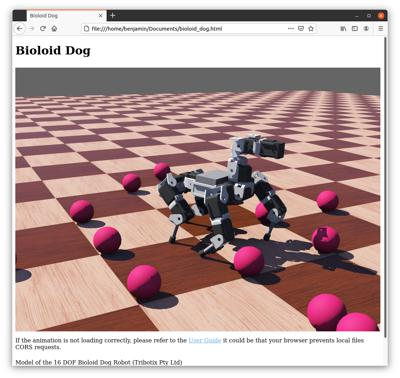

## X3D and Web Scene

### Description

Webots can export a world to an interactive 3D `HTML` page.
This feature is especially useful for publishing Webots-created worlds on the Web.

During the export, a [X3D](http://www.web3d.org/x3d/what-x3d) file, a `HTML5` page and a `CSS`file are generated.

The `X3D` file contains the graphical information of the world.
`X3D` is a modern `XML`-based file format for representing 3D computer graphics.
In Webots, the `X3D` file uses a custom format that is heavily based on the `X3D` file format.

The `CSS` file is used to style the following `HTML5` page.

The `HTML5` page contains a Webots player which displays the `X3D` file as shown in the [figure below](#screenshot-of-a-web-scene-page-generated-by-webots).
It can be open in any recent Web browser as documented in the [section below](#remarks-on-the-used-technologies-and-their-limitations).
The 3D navigation in the player is possible using the mouse or the touch screen, similarly to the Webots navigation.

%figure "Screenshot of a Web scene page generated by Webots"



%end

### How to Export a Web Scene

Select the `Share...` menu item, choose if you want to upload it to [webots.cloud](https://webots.cloud) or to save it locally, then click the `Export scene` button.
When the export is completed, Webots will ask to playback the resulting file in the default Web browser.

**Note**: The `CSS` file, the `X3D` file and the required textures are exported in the same directory as the target `HTML` file.

**Note**: The `CSS` file is meant to be used as a styling guide but can be modified/removed.

**Note**: The playback option may not work correctly depending on your default Web browser.
In this case, please refer to the [section below](#remarks-on-the-used-technologies-and-their-limitations).

### How to Embed a Web Scene in Your Website

The exported `HTML` page is designed to be simple, and is the reference for an integration in an external Website. The exported `CSS` file can be replaced during the process.
Alternatively, an `<iframe>` tag pointing to the generated Webots page is a less elegant but simpler solution.

The resources (`CSS`, `JavaScript`, etc.) on the [Cyberbotics Website](https://www.cyberbotics.com) will be stored for long term, and can be used from an external Website.

### Programming Interface

The web scene is displayed by a web component from the [WebotsView.js] package called `webots-view`.

The following attributes are available:
* `data-thumbnail`: the name of the .jpg file containing the thumbnail. If the `data-thumbnail` attribute is not set, a default thumbnail will be displayed during load.
* `data-scene`: the name of the .x3d file containing the 3d scene. It is evaluated only once: when the page is loaded. If the `data-scene` attribute is set, the `webots-view` web-component will automatically try to load the web scene .

For more complex interaction with the web component, the following functions are available:
* `close()`: close the current scene. Note that if the `webots-view` element is removed from the HTML page or `loadScene`, `loadAnimation` or `connect` is called, `close` will be automatically called.
* `onready()`: a function that can be overridden. It will be called once the scene is loaded.
* `loadScene(scene, mobileDevice, thumbnail)`: load and display the scene.
  * `scene`: name of the .x3d file.
  * `mobileDevice`: boolean variable specifying if the application is running on a mobile device.
  * `thumbnail`: the URL of the scene thumbnail.
* `setAmbientOcclusion(level)`: change the intensity of the ambient occlusion to the given level.
  * `level`: the new level of ambient occlusion. Integer between 1 and 4.

### Limitations

- All the graphical nodes ([Box](../reference/box.md), [Sphere](../reference/sphere.md), [Appearance](../reference/appearance.md), [Material](../reference/material.md), [ImageTexture](../reference/imagetexture.md), [Light](../reference/light.md), [Transform](../reference/transform.md), etc.) are supported.

- The rendering of the Webots player is performed using `WRENJS`, a version of `WREN` (Webots Rendering ENgine) compiled in WebAssembly.
It may occur that the rendering in the Webots application and in the exported Web page are not strictly equivalent.

- The `Skin` node is not supported.
- The [Pen](../reference/pen.md) device is not supported.

- It is not possible to have more than one `webots-view` element on one page.

- Once removed, it is not possible to recreate a `webots-view` element on the same page. However there is some workarounds:
    - Reload the page
    - Close the simulation with `close()` and hide the `webots-view` with the help of css.
    - Keeping a reference to the `webots-view` element allows you to remove it from the page and insert it again. As in the following example:
    ```
    let webotsView;
    function create() {
      if (typeof webotsView === 'undefined') {
        webotsView = document.createElement('webots-view');
        webotsView.style = "height:80%; display:block;"
      }
      document.body.appendChild(webotsView);

      webotsView.loadScene("scene.x3d");
    }

    function remove() {
      document.body.removeChild(webotsView);
    }
    ```

### Remarks on the Used Technologies and Their Limitations

The Webots player is using internally the `WRENJS` library (based on `WebGL 2`).

`WebGL 2` is supported in recent versions of Firefox, Chrome and Edge.
Unfortunately it is not yet supported by Safari (see details on the [deployment of WebGL 2](https://caniuse.com/webgl2)).
In case of related issues, make sure that `WebGL 2` is enabled in your Web browser settings.

Some web browsers (for example Chrome and Firefox 68 or later) cannot open local files using the `file` protocol by default, while this is required by the Webots player to open the `X3D` file and the textures.
Here are some workarounds:
- run a local HTTP server in the directory containing the exported files, and launch the scene or animation through the server by navigating to the `HTML` file.
    - Python 3:

        ```sh
        python3 -m http.server
        ```
    - Python 2:

        ```sh
        python -m SimpleHTTPServer
        ```
    - NodeJS:

        ```sh
        sudo npm install -g http-server
        http-server
        ```
    - More ways to run a local HTTP server can be found [here](https://gist.github.com/willurd/5720255)
- disable browser security flags:
    - Chrome: launch with the `--allow-file-access-from-files`  or `--disable-web-security --user-data-dir=.chrome` option.
    - Firefox:
        1. Open Firefox browser and in the address bar type ``about:config``, hit Enter button and click on `I'll be careful, I promise!`.
        2. Search for `privacy.file_unique_origin` or `security.fileuri.strict_origin_policy` and double click on it to change the status from true to false.
