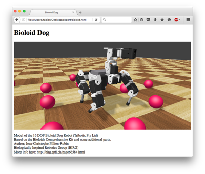
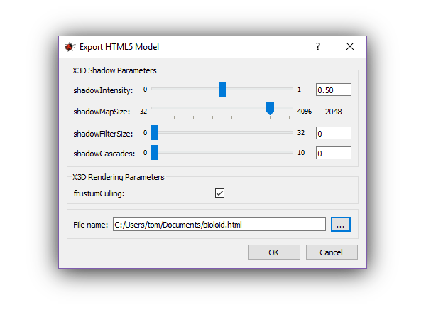

## X3D and Web Scene

### Description

Webots can export a world to an interactive 3D `HTML` page.
This feature is especially useful for publishing Webots-created worlds on the Web.

During the export, a [X3D](http://www.web3d.org/x3d/what-x3d) file and a `HTML5` page are generated.

The `X3D` file contains the graphical information of the world.
`X3D` is a modern `XML`-based file format for representing 3D computer graphics.
It can be imported in many 3D modeling or visualizing applications.

The `HTML5` page contains a Webots player which displays the `X3D` file as shown in the [figure below](#screenshot-of-a-web-scene-page-generated-by-webots).
It can be open in any recent Web browser as documented in the [section below](#remarks-on-the-used-technologies-and-their-limitations).
The 3D navigation in the player is possible using the mouse or the touch screen, similarly to the Webots navigation.

%figure "Screenshot of a Web scene page generated by Webots"



%end

### How to Export a Web Scene

Select the `File / Export HTML5 Model...` menu item, select the desired `X3D` parameters and choose the target `HTML` file in the pop-up dialog.
When the export is completed, Webots will ask to playback the resulting file in the default Web browser.

%figure "The HTML export dialog."

%end

The chosen `X3D` parameters are stored in the [project file](the-standard-file-hierarchy-of-a-project.md#the-project-files) and automatically proposed during the next HTML export.

**Note**: The `X3D` file and the required textures are exported in the same directory as the target `HTML` file.

**Note**: The playback option may not work correctly depending on your default Web browser.
In this case, please refer to the [section below](#remarks-on-the-used-technologies-and-their-limitations).

### How to Embed a Web Scene in Your Website

The exported `HTML` page is designed to be as simple as possible, and is the reference for an integration in an external Website.
Alternatively, an `<iframe>` tag pointing to the generated Webots page is a less elegant but simpler solution.

The resources (`CSS`, `JavaScript`, etc.) on the [Cyberbotics Website](https://www.cyberbotics.com) will be stored for long term, and can be used from an external Website.

### Limitations

- All the graphical nodes ([Box](../reference/box.md), [Sphere](../reference/sphere.md), [Appearance](../reference/appearance.md), [Material](../reference/material.md), [ImageTexture](../reference/imagetexture.md), [Light](../reference/light.md), [Transform](../reference/transform.md), etc.) are supported.

- The rendering of the Webots player is performed using the [three.js](https://threejs.org/) library.
It may occur that the rendering in the Webots application and in the exported Web page are not strictly equivalent.

- The [Background](../reference/background.md) cube maps are wrongly displayed if [WorldInfo](../reference/worldinfo.md).`coordinateSytem` is set to "ENU".

### Remarks on the Used Technologies and Their Limitations

The Webots player is using internally the `three.js` library (based on `WebGL`).

`three.js` is supported in recent versions of Firefox, Chrome, Edge, Internet Explorer and Safari on macOS (see details on the [three.js website](https://threejs.org/)).
In case of related issues, make sure that `WebGL` is enabled in your Web browser settings.

Some web browsers (for example Chrome and Firefox 68 or later) cannot open local files using the `file` protocol by default, while this is this is required by the Webots player to open the `X3D` file and the textures.
Here are some workarounds:
- run a local HTTP server in the directory containing the exported files.
    - Python 3:

        ```sh
        python3 -m http.server
        ```
    - Python 2:

        ```sh
        python -m SimpleHTTPServer
        ```
    - NodeJS:

        ```sh
        sudo npm install -g http-server
        http-server
        ```

- disable browser security flags:
    - Chrome: launch with the `--allow-file-access-from-files` option
    - Firefox:
        1. Open Firefox browser and in the address bar type ``about:config``, hit Enter button and click on `I'll be careful, I promise!`.
        2. Search for `privacy.file_unique_origin` or `security.fileuri.strict_origin_policy` and double click on it to change the status from true to false.
