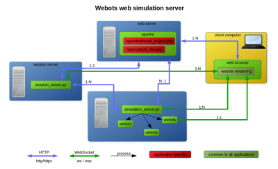

## Web Simulation

### Description

This section describes how to setup a simulation web service similar to [robotbenchmark.net](https://robotbenchmark.net) to run Webots in the cloud.
Such a system may be distributed on several machines to provide a powerful cluster of simulation servers.
One machine runs a session server that communicates with several simulation servers.
Each machine runs one instance of a simulation server that receives requests from the session server and starts for each connected client a new instance of Webots that communicates directly with the client.

Webots instances can be executed in a secure environment using [Docker](https://www.docker.com).
This is needed if the simulations are coming from the outside world and may contain some malicious code that could compromise the simulation server.
That is the case with [robotbenchmark.net](https://robotbenchmark.net) where robot controllers are python programs written by external users and may potentially harm the simulation server.
Other use cases include simulations created by external users that include binary code for a physics plug-in or a robot window.
Running them in a Docker container ensures the integrity of the simulation server.
However, if the simulations executed on a simulation server can't contain any malicious code, then it is safe to run the Webots instances without Docker.
This is the case if the simulation servers run only simulations from a limited list of allowed GitHub repositories controlled by the owner of the simulation servers.

**Note:** The Web Simulation system is still work in progress and could change in the next releases of Webots.

### Streaming Server

#### Prerequisites

The prerequisites for the server machine(s) are the following:

- Ubuntu 20.04 LTS or newer
- Web service dependencies ([Linux instructions](https://github.com/omichel/webots/wiki/Linux-Optional-Dependencies#webots-web-service)):

The simulation server machines have to met the [Webots system requirements](system-requirements.md).
They may however be virtual machine, such as AWS instances.
GPU instances are strongly recommended for performance reasons, especially if the simulation involves sensors relying on OpenGL rendering (cameras, lidars, range-finders).

#### Overview

In order to run Webots in the cloud, you need to run at least one session server and one or more simulation servers.
The simulation servers should run on different machines while the session server may run on a machine where a simulation server is running.
Both servers are Python scripts named `simulation_server.py` and `session_server.py` and located in "[WEBOTS\_HOME/resources/web/server/](https://github.com/cyberbotics/webots/tree/released/resources/web/server/)".

Either Docker or Webots has to be installed on all the machines where a simulation server is running.

%figure "Web simulation server network infrastructure"

%end

#### How to Embed a Web Scene in Your Website

Similarly to [this section](web-streaming.md#how-to-embed-a-web-scene-in-your-website), to embed the simulation it is enough to instantiate a `webots-view` web component from the [WebotsView.js] package.

This is the API of the `webots-streaming` web component:
* `connect(servers, mode, broadcast, mobileDevice, timeout) `: function instantiating the simulation web interface and taking as argument:
  * `server`: The URL of the server. Different URL formats are supported:
      * URL to a session server: "https://beta.webots.cloud/ajax/server/session.php?url=https://github.com/cyberbotics/webots/projects/languages/python/worlds/example.wbt"
      * WebSocket URL (i.e. "ws://localhost:80"): this format is used for web broadcast streaming.
      * URL to a X3D file (i.e. "file.x3d"): this format is used for showing a [web scene](web-scene.md) or a [web animation](web-animation.md).
  * `mode`: `x3d` or `mjpeg`.
  * `broadcast`: boolean variable enabling or not the broadcast.
  * `isMobileDevice`: boolean variable specifying if the application is running on a mobile device.
  * `timeout`: the time (in seconds) after which the simulation will be automatically paused (until the play button is pressed again). By default, no timeout is set.
* `close()`: close the simulation web scene. Note that if the `webots-view` element is removed from the HTML page or `loadScene`, `connect` or `loadAnimation` is called, `close` will be automatically called.
* `hasView()`: return true if a view exist, false otherwise.
* `hideToolbar()`: hide the toolbar. Must be called after connect.
* `ondisconnect()`: a function that can be overridden. It will be called when the simulation disconnects.
* `onready()`: a function that can be overridden. It will be called once the simulation is loaded.
* `resize()`: automatically resize the web-component.
* `showToolbar()`: show the toolbar. Must be called after connect. The toolbar is displayed by default.
* `sendMessage(message)`: send a message to the streaming server through the web socket. Examples of messages could be:
    * `real-time:-1`: to play the simulation.
    * `pause`: to pause the simulation.
    * `robot:{"name":"supervisor","message":"reset"}`: to send a message to the controller of a robot named "supervisor".
* `setAmbientOcclusion(level)`: change the intensity of the ambient occlusion to the given level.
    * `level`: the new level of ambient occlusion. Integer between 1 and 4.
* `setWebotsMessageCallback(callback)`: define a function that will be called every time a message is sent by Webots.
    * `callback`: the function to be called when a message is received, the text of the message is passed to this function as the only argument.
* `setWebotsErrorMessageCallback(callback)`: define a function that will be called every time an error is send by Webots.
    * `callback`: the function to be called when an error is received, the text of the error is passed to this function as the only argument.

Moreover, the following attributes are available:
* `data-server`: URL of the server.
* `data-mode`: `x3d` or `mjpeg`.
* `data-broadcast`: boolean variable enabling or not the broadcast.
* `data-isMobileDevice`: boolean variable specifying if the application is running on a mobile device.
* `showIde`: specify if the IDE button must be displayed on the toolbar. Must be called before connect. The IDE button is displayed by default.
* `showPlay`: specify if the play button must be displayed on the toolbar. Must be called before connect. The play button is displayed by default.
* `showQuit`: specify if the quit button must be displayed on the toolbar. Must be called before connect. The quit button is displayed by default.
* `showReload `: specify if the reload button must be displayed on the toolbar. Must be called before connect. The reload button is hidden by default.
* `showReset`: specify if the reset button must be displayed on the toolbar. Must be called before connect. The reset button is displayed by default.
* `showRobotWindow`: specify if the robot window button must be displayed on the toolbar. Must be called before connect. The robot window button is displayed by default.
* `showStep`: specify if the step button must be displayed on the toolbar. Must be called before connect. The step button is displayed by default.
* `showWorldSelection`: specify if the world selection button must be displayed on the toolbar. Must be called before connect. The world selection is displayed by default.

The attributes of `webots-view` are only evaluated once: when the page is loaded. If the `data-server` attribute is set, the `webots-view` web-component will automatically connect to the `server`.

Warning: note that if the `data-scene` attribute (see [web animation](web-animation.md)) and the `data-server` are both set, the `data-scene` will take precedence and try to load a scene.

An example of a file using this API is available [here](https://cyberbotics1.epfl.ch/open-roberta/setup_viewer.js) and is used to run [this sample](https://cyberbotics1.epfl.ch/open-roberta/).

### Scene Refresh Rate

The scene refresh rate is defined by the `WorldInfo.FPS` field.
The same fields as in the [web animation](web-animation.md#limitations) are updated.

### Technologies and Limitations

The streaming server has the same limitations as the [Web animation](web-animation.md#remarks-on-the-used-technologies-and-their-limitations) and the [Web streaming](web-streaming.md#limitations).
The data is sent to the clients using [WebSockets](https://www.websocket.org/).
The WebSockets should therefore be enabled in your Web browser (this is the default setting).
