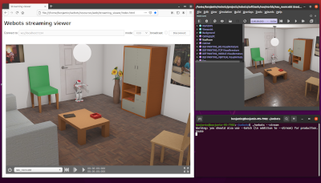

## Web Streaming

### Description

Webots can be used as a Web streaming server, i.e., to stream a simulation to several interactive 3D `HTML` pages, as shown in the [figure below](web-streaming.md#screenshot-of-webots-streaming-server).
In this mode the user can watch an already running simulation and navigate into the scene but cannot interact with the simulation, i.e. controlling the execution of the simulation and modifying the robot controller program.
Please refer to the [Web simulation](web-simulation.md) documentation to setup a platform where users can run individual simulations.

Two different streaming modes are available:
- `x3d` (default): the simulation is streamed using a mechanism similar to the [web animation export](web-animation.md) except that the `X3D` file and the animation are sent on the fly to the web browser clients.
- `mjpeg`: the Webots scene rendered on the server is directly sent as an `MJPEG` image to the web browser client.
You should choose between the `x3d` and `mjpeg` depending on the type of application you are developing.
The following table summarizes the advantages (`+`) and disadvantages (`-`) of the the two modes:

| feature / mode          | `x3d` | `mjpeg` |
|:-----------------------:|:-----:|:-------:|
| high resolution images  | +     | -       |
| 3D navigation latency   | +     | -       |
| bandwidth requirements  | +     | -       |
| simulation server load  | +     | -       |
| page loading time       | -     | +       |
| high fidelity to Webots | +     | +       |

%figure "Screenshot of Webots streaming server"



%end

The web interface displays a toolbar with the following items:

- **Simulation time**: this item indicates the current simulation time on the first line.
The second line is not used with this streaming solution.
-  **Quit**: close the Webots web view.
-  **Reset**: reset the simulation and the viewpoint.
-  **Step**: execute one step of the simulation.
-  **Play**: play the Webots simulation.
-  **Pause**: pause the Webots simulation.
-  **Fullscreen**: enter full screen mode.
-  **Exit fullscreen**: exit full screen mode.

### How to Stream a Webots Simulation

Start Webots with the streaming server using the `--stream` option.
Please refer to the [command line documentation](starting-webots.md#command-line-arguments) for details about the sub-options.

Open the streaming viewer page in your Web browser:

```
$(WEBOTS_HOME)/resources/web/streaming_viewer/index.html
```

Use the buttons on the top of the page to connect to the Webots streaming server.

**Note**: `IP` address and port for the streaming server and the client page should match.
The port should not be used by another application.

### Network Settings

The Webots streaming server is simply running on the local computer on a given port (`1234` by default, but it can be modified from the [command line arguments](starting-webots.md#command-line-arguments)).
This port should not be used by another application.
In order to be visible from the outside network, the port should be open (e.g. on simple networks, this can be done by modifying the NAT settings of the router).
The firewall of the local computer may complain about this operation, in this case, please modify its settings.

### How to Embed a Web Scene in Your Website

Similarly to [this section](web-animation.md#how-to-embed-a-web-animation-in-your-website), please refer to the streaming viewer page to embed a Webots stream in your Website.

### Scene Refresh Rate

The scene refresh rate is defined by the `WorldInfo.FPS` field.
The same fields than for the [web animation](web-animation.md#limitations) are updated.

### Limitations

If using the `x3d` streaming mode (default), the streaming server has the same limitations as the [Web animation](web-animation.md#limitations).
Except that adding and deleting objects from Webots is propagated to the clients.

### Technologies and Limitations

The data is sent to the clients using [WebSockets](https://www.websocket.org/).
In case of related issues, make sure that `WebSockets` are enabled in your Web browser settings.

If using the `x3d` streaming mode (default), please also refer to the limitations described in [this section](web-animation.md#remarks-on-the-used-technologies-and-their-limitations).
