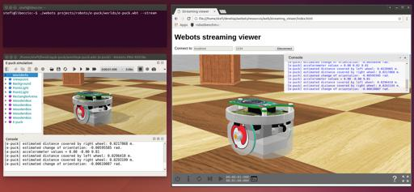

## Web Streaming

### Description

Webots can be used as a Web streaming server, i.e., to stream a simulation to several interactive 3D `HTML` pages, as shown in the [figure below](web-streaming.md#screenshot-of-webots-streaming-server).
In this mode the user can watch an already running simulation and navigate into the scene but cannot interact with the simulation, i.e. controlling the execution of the simulation and modifying the robot controller program.

Two different streaming modes are available:
- `x3d` (default): the simulation is streamed using a mechanism similar to the [web animation export](web-animation.md) except that the `X3D` file and the animation are sent on the fly to the web browser clients.
- `mjpeg`: the Webots scene rendered on the server is directly sent as an `MJPEG` image to the web browser client.
You should choose between the `x3d` and `mjpeg` depending on the type of application you are developing.
The following table summarizes the advantages (`+`) and disadvantages (`-`) of the the two modes:

| feature / mode          | `x3d` | `mjpeg` |
|:-----------------------:|:-----:|:-------:|
| high resolution images  | +     | -       |
| 3D navigation latency   | +     | -       |
| bandwidth requirements  | +     | -       |
| simulation server load  | +     | -       |
| page loading time       | -     | +       |
| high fidelity to Webots | +     | +       |

%figure "Screenshot of Webots streaming server"



%end

The web interface displays a toolbar with the following items:

- **Simulation time**: this item indicates the current simulation time.
-  **Quit**: close the Webots web view.
-  **Reset**: reset the simulation and the viewpoint.
-  **Step**: execute one step of the simulation.
-  **Play**: play the Webots simulation.
-  **Pause**: pause the Webots simulation.
-  **Terminal**: display the non-interactive terminal.
-  **Source code editor**: display the web code editor.
-  **Robot window**: display the different robot windows.
-  **Info**: display information about the simulation.
-  **Settings**: open the settings panel.
-  **Fullscreen**: enter full screen mode.
-  **Exit fullscreen**: exit full screen mode.

### How to Stream a Webots Simulation

Start Webots with the streaming server using the `--stream` option.
Please refer to the [command line documentation](starting-webots.md#command-line-arguments) for details about the sub-options.

Open the streaming viewer page in your Web browser by connecting to:

```
http://IP:port/index.html
```

Use the buttons on the top of the page to connect to the Webots streaming server.

**Note**: `IP` address and port for the streaming server and the client page should match.
The port should not be used by another application.

Connecting with the default setting from the machine were Webots is running can be done via:
```
http://localhost:1234/index.html
```

### Network Settings

The Webots streaming server is simply running on the local computer on a given port (`1234` by default, but it can be modified from the [command line arguments](starting-webots.md#command-line-arguments)).
This port should not be used by another application.
In order to be visible from the outside network, the port should be open (e.g. on simple networks, this can be done by modifying the NAT settings of the router).
The firewall of the local computer may complain about this operation, in this case, please modify its settings.

### How to Embed a Web Scene in your Website

Similarly to [this section](web-streaming.md#how-to-embed-a-web-scene-in-your-website), to embed the simulation it is enough to instantiate a `webots-view` web component from the [WebotsView.js] package.

### Programming Interface

This is the API of the `webots-streaming` web component:
* `connect(server, mode, broadcast, mobileDevice, timeout, thumbnail) `: function instantiating the simulation web interface and taking as argument:
  * `server`: The URL of the server. Different URL formats are supported:
      * URL to a session server: "https://webots.cloud/ajax/server/session.php?url=https://github.com/cyberbotics/webots/projects/languages/python/worlds/example.wbt"
      * WebSocket URL (i.e. "ws://localhost:1234"): this format is used for web broadcast streaming.
      * URL to a X3D file (i.e. "file.x3d"): this format is used for showing a [web scene](web-scene.md) or a [web animation](web-animation.md).
  * `mode`: `x3d` or `mjpeg`.
  * `broadcast`: boolean variable enabling or not the broadcast.
  * `isMobileDevice`: boolean variable specifying if the application is running on a mobile device.
  * `timeout`: the time (in seconds) after which the simulation will be automatically paused (until the play button is pressed again). By default, no timeout is set.
  * `thumbnail`: The URL of the thumbnail representing your simulation. It is used for the loading screen and can also be accessed for other functionalities such as previews. If not defined, a default thumbnail is loaded.
* `close()`: close the simulation web scene. Note that if the `webots-view` element is removed from the HTML page or `loadScene`, `connect` or `loadAnimation` is called, `close` will be automatically called.
* `hasView()`: return true if a view exist, false otherwise.
* `hideToolbar()`: hide the toolbar. Must be called after connect.
* `ondisconnect()`: a function that can be overridden. It will be called when the simulation disconnects.
* `onready()`: a function that can be overridden. It will be called once the simulation is loaded.
* `resize()`: automatically resize the web-component.
* `showToolbar()`: show the toolbar. Must be called after connect. The toolbar is displayed by default.
* `sendMessage(message)`: send a message to the streaming server through the web socket. Examples of messages could be:
    * `real-time:-1`: to play the simulation.
    * `pause`: to pause the simulation.
    * `robot:{"name":"supervisor","message":"reset"}`: to send a message to the controller of a robot named "supervisor".
* `setAmbientOcclusion(level)`: change the intensity of the ambient occlusion to the given level.
    * `level`: the new level of ambient occlusion. Integer between 1 and 4.
* `setWebotsMessageCallback(callback)`: define a function that will be called every time a message is sent by Webots.
    * `callback`: the function to be called when a message is received, the text of the message is passed to this function as the only argument.
* `setWebotsErrorMessageCallback(callback)`: define a function that will be called every time an error is send by Webots.
    * `callback`: the function to be called when an error is received, the text of the error is passed to this function as the only argument.

Moreover, the following attributes are available:
* `data-server`: URL of the server.
* `data-mode`: `x3d` or `mjpeg`.
* `data-broadcast`: boolean variable enabling or not the broadcast.
* `data-isMobileDevice`: boolean variable specifying if the application is running on a mobile device.
* `data-thumbnail`: the name of the .jpg file containing the thumbnail. If the `data-thumbnail` attribute is not set, a default thumbnail will be displayed during load.
* `showIde`: specify if the IDE button must be displayed on the toolbar. Must be called before connect. The IDE button is displayed by default if an IDE is available.
* `showPlay`: specify if the play button must be displayed on the toolbar. Must be called before connect. The play button is displayed by default.
* `showQuit`: specify if the quit button must be displayed on the toolbar. Must be called before connect. The quit button is displayed by default.
* `showReload `: specify if the reload button must be displayed on the toolbar. Must be called before connect. The reload button is hidden by default.
* `showReset`: specify if the reset button must be displayed on the toolbar. Must be called before connect. The reset button is displayed by default.
* `showRobotWindow`: specify if the robot window button must be displayed on the toolbar. Must be called before connect. The robot window button is displayed by default.
* `showStep`: specify if the step button must be displayed on the toolbar. Must be called before connect. The step button is displayed by default.
* `showTerminal`: specify if the terminal button must be displayed on the toolbar. Must be called before connect. The step button is displayed by default.
* `showWorldSelection`: specify if the world selection button must be displayed on the toolbar. Must be called before connect. The world selection is displayed by default.

The attributes of `webots-view` are only evaluated once: when the page is loaded. If the `data-server` attribute is set, the `webots-view` web-component will automatically connect to the `server`.

Warning: note that if the `data-scene` attribute (see [web animation](web-animation.md)) and the `data-server` are both set, the `data-scene` will take precedence and try to load a scene.

An example of a file using this API is available [here](https://cyberbotics1.epfl.ch/open-roberta/setup_viewer.js) and is used to run [this sample](https://cyberbotics1.epfl.ch/open-roberta/).

### Scene Refresh Rate

The scene refresh rate is defined by the `WorldInfo.FPS` field.
The same fields as in the [web animation](web-animation.md#limitations) are updated.

### Technologies and Limitations

The streaming server has the same limitations as the [Web Scene](web-scene.md#remarks-on-the-used-technologies-and-their-limitations).
The data is sent to the clients using [WebSockets](https://www.websocket.org/).
The WebSockets should therefore be enabled in your Web browser (this is the default setting).
