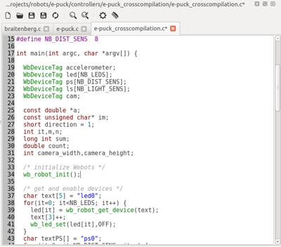

## Webots Built-in Editor

Webots source code editor is a multi-tab text editor specially adapted for developing Webots controllers.
It is usually recommended to use this editor as it makes the compilation straightforward.
The editor features syntax highlighting for Webots supported language (C/C++, Java, Python and *MATLAB*TM) and auto-completion for Webots C API.

%figure "Webots Text Editor"

%end

### Compiling with the Source Code Editor

The Source Code Editor can be used to compile C/C++ or Java source files into binary executable or bytecode (Java) files that can be executed in a simulation.
The compilation output is printed to the Webots console; errors and warnings appear in red.
If you double-click an error message, Webots will highlight the corresponding source line in the editor.

Note that, for compiling source code it is necessary to have the appropriate development tools installed.
You will find information on the development tools [here](language-setup.md).

The possible compilation actions are listed below.
Some of them are only accessible in the **Build** menu, whereas `Build` and `Clean` actions have a shortcut in the Text Editor toolbar.

-  The **Build** button builds the whole project by invoking `make` in the selected file's directory.
With C/C++, the `Build` button compiles and links the whole project into an executable file.
C/C++ source file dependencies are automatically generated and updated when necessary.
With Java, the `Build` button compiles the whole project into bytecode (.class files).

-  The **Clean** button invokes `make clean` to delete the intermediate compilation files in the current file's directory.
The source files remain untouched.

- The **Make JAR file** menu item rebuilds the whole project and packs all the .class in a ".jar".
This is a convenience function that can be used to pack a complete controller prior to uploading it to one of our online contest website.

- The **Cross-compile** menu item allows to cross-compile the current text editor's file.
Note that a specific Makefile is required in the controller's directory for performing this operation.
For an e-puck robot, this Makefile must be named "Makefile.e-puck".

- The **Cross-compilation clean** menu item allows you to clean the cross-compilation files.
Note that a specific Makefile is required in the controller's directory for performing this operation.
For an e-puck robot, this Makefile must be named "Makefile.e-puck".
