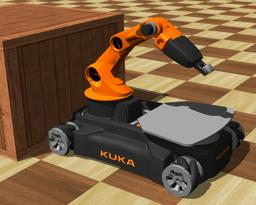
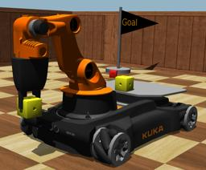

## KUKA's youBot

%robot youbot images/robots/youbot/model.thumbnail.png

The youBot is a mobile robotic arm developed by [KUKA](http://www.youbot-store.com/).
Its arm has five degrees of freedom and a linear gripper.
Its base has four [Mecanum wheels](https://en.wikipedia.org/wiki/Mecanum_wheel) allowing for omnidirectional movement.
These wheels are efficiently modeled using asymmetric friction.

### Movie Presentation


### Youbot PROTO

Derived from [Robot](../reference/robot.md).

```
Youbot {
  SFVec3f    translation     0 0.12 0
  SFRotation rotation        1 0 0 -1.5708
  SFString   name            "youBot"
  SFString   controller      "youbot"
  MFString   controllerArgs  []
  SFString   customData      ""
  SFBool     supervisor      FALSE
  SFBool     synchronization TRUE
  MFNode     bodySlot        []
  SFInt32    numberOfArms    1
}
```

> **File location**: "WEBOTS\_HOME/projects/robots/kuka/youbot/protos/Youbot.proto"

#### Youbot Field Summary

- `bodySlot`: Extends the robot with new nodes in the body slot.
- `numberOfArms`: Defines the number of arms on the robot (0, 1 or 2).

### Samples

You will find some samples in this folder: "WEBOTS\_HOME/projects/robots/kuka/youbot/worlds".

> **Note:** For the mecanum wheels to behave correctly, the following [ContactProperties](../reference/contactproperties.md) should be added in the `contactProperties` field of the [WorldInfo](../reference/worldinfo.md) node:
```
  contactProperties [
    ContactProperties {
      material1 "InteriorWheelMat"
      coulombFriction [
        0, 2, 0
      ]
      frictionRotation -0.785398 0
      bounce 0
      forceDependentSlip [
        10, 0
      ]
    }
    ContactProperties {
      material1 "ExteriorWheelMat"
      coulombFriction [
        0, 2, 0
      ]
      frictionRotation 0.785398 0
      bounce 0
      forceDependentSlip [
        10, 0
      ]
    }
  ]
```
#### youbot.wbt

 This simulation shows the youBot grabbing a box, releasing it on its plate, moving to a target, and leaving it on the ground.
Once this automatic behavior is completed, you can move the robot and its arm using the computer keyboard (please refer to the instruction displayed in the Webots console).
A small C library called "youbot\_control" (and located there: "WEBOTS\_HOME/projects/robots/kuka/youbot/libraries/youbot\_control") facilitate the robot control.

#### youbot\_matlab.wbt

 The same simulation as above, but with a controller written in MATLAB.

#### tower\_of\_hanoi.wbt

 In this simulation, the youBot is moving a pyramid of colored blocks from one position to another, using a temporary slot.
This example is based on the [Tower of Hanoi](https://en.wikipedia.org/wiki/Tower_of_Hanoi) mathematical game.
