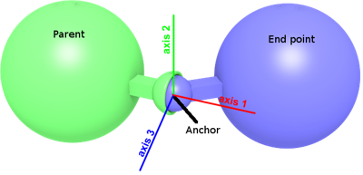

## BallJoint

Derived from [Hinge2Joint](hinge2joint.md).

```
BallJoint {
  SFNode  jointParameters3 NULL   # {JointParameters, PROTO}
  MFNode  device3          [ ]    # {RotationalMotor, PositionSensor, Brake, PROTO}
  SFFloat position3        0      # [0, inf)
}
```

### Description

%figure "Ball joint"



%end

The [BallJoint](#balljoint) node can be used to model a ball joint.
A ball joint, also called ball-and-socket, prevents translation motion while allowing rotation around its anchor (3 degrees of freedom).
It supports spring and damping parameters which can be used to simulate the elastic deformation of ropes and flexible beams.

Its 3 perpendicular axes can be controlled independently using [RotationalMotors](rotationalmotor.md).
The axes are defined in the [JointParameters](jointparameters.md) nodes in the `jointParameters2` and `jointParameters3` fields (the third axis is computed automatically to be perpendicular to the two first one).
If the `jointParameters2` and/or `jointParameters3` fields are empty, the default axes are used instead (respectively `(1, 0, 0)` and `(0, 0, 1)`).

> **Note**: The `minPosition` and `maxPosition` fields of the [RotationalMotor](rotationalmotor.md) in the `device2` field are constrained to the range [-pi/2; pi/2].

### Field Summary

- `jointParameters3`: This field optionally specifies a [JointParameters](jointparameters.md) node.
It contains, among others, the joint position, the axis position expressed in relative coordinates and the stop positions.
If this field is empty, the `springConstant`, `dampingConstant` and `staticFriction` are homogeneous along each rotation axes.

- `device3`: this field optionally specifies a [RotationalMotor](rotationalmotor.md), an angular [PositionSensor](positionsensor.md) and/or a [Brake](brake.md) device for the third axis.
If no motor is specified, the corresponding axis is passive.

- `position3`: This field is not visible from the Scene Tree, see [joint's hidden position field](joint.md#joints-hidden-position-fields).
