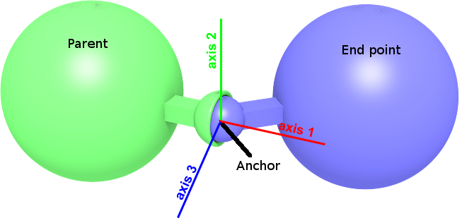

## BallJoint

Derived from [Joint](joint.md).

```
BallJoint {
}
```

### Description

%figure "Ball joint"



%end

The [BallJoint](#balljoint) node can be used to model a ball joint.
A ball joint, also called ball-and-socket, prevents translation motion while allowing rotation around its anchor (3 degrees of freedom).
It supports spring and damping parameters which can be used to simulate the elastic deformation of ropes and flexible beams.

It inherits [Joint](joint.md)'s `jointParameters` field.
This field can be filled with a [BallJointParameters](balljointparameters.md) node only.
If empty, [BallJointParameters](balljointparameters.md) default values apply.
