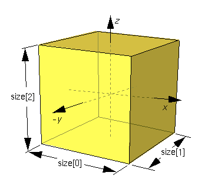

## Box

```
Box {
  SFVec3f size 2 2 2   # any positive vector
}
```

### Description

The [Box](#box) node specifies a rectangular parallelepiped box centered at (0,0,0) in the local coordinate system and aligned with the local coordinate axes.
By default, the box measures 2 meters in each dimension, from -1 to +1.

The `size` field specifies the extents of the box along the *x*-, *y*-, and *z*-axes respectively.
See [this figure](#box-node).
Three positive values display the outside faces while three negative values display the inside faces.

%figure "Box node"



%end

Textures are applied individually to each face of the box.
On the front (+*z*), back (-*z*), right (+*x*), and left (-*x*) faces of the box, when viewed from the outside with the positive y-axis up, the texture is mapped onto each face with the same orientation as if the image were displayed normally in 2D.
On the top face of the box (+*y*), when viewed from above and looking down the y-axis toward the origin with the negative z-axis as the view up direction, the texture is mapped onto the face with the same orientation as if the image were displayed normally in 2D.
On the bottom face of the box (-*y*), when viewed from below looking up the y-axis toward the origin with the positive z-axis as the view up direction, the texture is mapped onto the face with the same orientation as if the image were displayed normally in 2D.
[TextureTransform](texturetransform.md) affects the texture coordinates of the Box.
