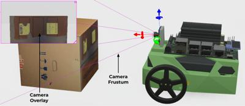
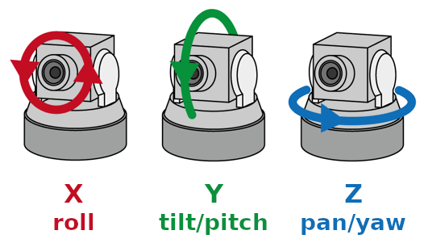
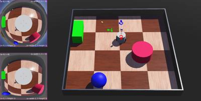
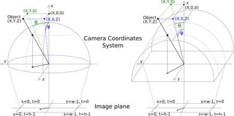
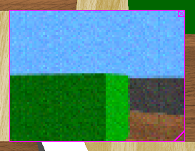
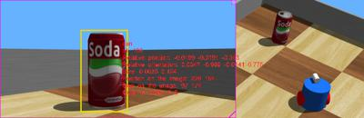

## Camera

Derived from [Device](device.md) and [Solid](solid.md).

```
Camera {
  SFFloat  fieldOfView            0.7854   # [0, pi]
  SFInt32  width                  64       # [0, inf)
  SFInt32  height                 64       # [0, inf)
  SFString projection             "planar" # {"planar", "spherical", "cylindrical"}
  SFFloat  near                   0.01     # [0, inf)
  SFFloat  far                    0.0      # [0, inf)
  SFFloat  exposure               1.0      # [near, inf)
  SFBool   antiAliasing           FALSE    # {TRUE, FALSE}
  SFFloat  ambientOcclusionRadius 0        # [0, inf)
  SFFloat  bloomThreshold         -1.0     # [-1, inf)
  SFFloat  motionBlur             0.0      # [0, inf)
  SFFloat  noise                  0.0      # [0, 1]
  SFString noiseMaskUrl           ""       # any string
  SFNode   lens                   NULL     # {Lens, PROTO}
  SFNode   focus                  NULL     # {Focus, PROTO}
  SFNode   zoom                   NULL     # {Zoom, PROTO}
  SFNode   recognition            NULL     # {Recognition, PROTO}
  SFNode   lensFlare              NULL     # {LensFlare, PROTO}
}
```

### Description

%figure "Camera Coordinate System"



%end

%figure "Roll Tilt Pan Axes"



%end

The [Camera](#camera) node is used to model a robot's on-board camera.
The resulting image can be displayed on the 3D window.
Depending on its setup, the Camera node can model a linear camera, a typical RGB camera or even a fish eye which is spherically distorted.

### Field Summary

- `fieldOfView`: horizontal field of view angle of the camera.
The value is limited to the range 0 to &pi; radians if the `projection` field is set to "planar", otherwise there is no upper limit.
Since camera pixels are squares, the vertical field of view can be computed from the `width`, `height` and horizontal `fieldOfView`:

    *vertical FOV = 2 * atan(tan(fieldOfView * 0.5) * (height / width))*

- `width`: width of the image in pixels.

- `height`: height of the image in pixels.

- `projection`: switch between a planar, spherical, or cylindrical projection.
The spherical projection simulates a fisheye lens and the cylindrical projection generates equirectangular images.
More information on spherical and cylindrical projections in the corresponding subsection below.

- The `near` field defines the distance from the camera to the near clipping plane.
This plane is parallel to the camera retina (i.e. projection plane).
The near field determines the precision of the OpenGL depth buffer.
A too small value produces depth fighting between overlaid polygons, resulting in random polygon overlaps.
More information on frustums in the corresponding subsection below.

- The `far` field defines the distance from the camera to the far clipping plane.

- The `exposure` field defines the photometric exposure of the scene in joule per square meter (J/m^2).

- The `antiAliasing` field switches on or off (the default) anti-aliasing effect on the camera images.
Aliasing artifacts can appear as jagged edges (or moiré patterns, strobing, etc.).
Anti-aliasing is a technique that selectively blurs these jagged edges (and thus makes them look more smooth) in the rendered camera image, similar to an anti-aliasing filter in real camera sensors.

- The `ambientOcclusionRadius` field denotes the radius of geometric occlusion searches in the scene.
Increasing the radius can increase occlusion from further objects.
However, at lower quality levels, near-field occlusion can start to disappear as the radius increases.
This effect is disabled by default on cameras for performance reasons, with a value of `0`.
Setting this field to any positive non-zero value enables the effect.

- The `bloomThreshold` field denotes the luminosity above which pixels start to "bloom" - i.e. overexpose the camera and leak light around themselves.
Decreasing the threshold means pixels bloom more easily, as if the camera were more easily overexposed.
The effect is disabled by default, with a default threshold of `-1`.
Setting this value to 0 or any positive value enables the effect.
Please note this effect is not physically based, like with Ambient Occlusion (GTAO) or PBR.
It serves as a good approximation of camera overexposure, however.

- If the `motionBlur` field is greater than 0.0, the image is blurred by the motion of the camera or objects in the field of view.
It means the image returned is a mix between the current view and the previous images returned by the camera.
The value of this field represents the response time of the camera pixels in milliseconds, which is the amount of time a pixel takes to reach 99.5% of a new color value (the value of 99.5% was chosen since above this threshold it is not possible any more to detect color changes with a color component resolution of 8 bits).
Of course smaller the time step is, better the effect is.
Note that this feature is computationally expensive and can considerably reduce the simulation speed.
Furthermore, it is useless to set a value smaller than the camera time step as it would not have any visible effect.

- If the `noise` field is greater than 0.0, this adds a gaussian noise to each RGB channel of a color image.
A value of 0.0 corresponds to remove the noise and thus saving computation time.
A value of 1.0 corresponds to a gaussian noise having a standard derivation of 255 in the channel representation.
More information on noise in the corresponding subsection below.

- The `noiseMaskUrl` field specifies a user-defined noise mask as a transparent PNG image.
If the `noiseMaskUrl` value starts with `http://` or `https://`, Webots will get the file from the web.
Otherwise the file should be specified with a relative path (cf. [this section](imagetexture.md#search-rule-of-the-texture-path)).
Absolute paths work as well, but they are not recommended because they are not portable across different systems.
Ideally, the texture file should lie next to the world file, possibly inside a "textures" subfolder.
It is suggested to use textures with power of 2 resolution (e.g. 8x8, 2048x64, etc.) and bigger than the camera resolution to avoid internal scaling that could cause the loss of pixel precision.
The mask is randomly translated during the simulation in order to produce a flickering noise effect.
Thus the bigger the noise texture the better the randomness quality, because the probabily to see the same patterns will decrease.
Using a noise mask instead of the default gaussian noise reduces the computation overhead and thus improves the simulation speed.
If both types of noise are enabled, the noise mask is applied before the gaussian noise.
This feature is not available for spherical cameras.

- The `lens` field may contain a [Lens](lens.md) node to specify the image distortion due to the camera lens.

- The `focus` field may contain a [Focus](focus.md) node to provide the camera device with a controllable focusing system.
If this field is set to NULL, then no focus is available on the camera device.

- The `zoom` field may contain a [Zoom](zoom.md) node to provide the camera device with a controllable zoom system.
If this field is set to NULL, then no zoom is available on the camera device.

- The `recognition` field may contain a [Recognition](recognition.md) node to provide the camera device with object recognition capabilities.
The camera can only recognize [Solid](solid.md) nodes whose `recognitionColors` is not empty.
The object size is estimated using the `boundingObject` of the [Solid](solid.md) and the ones of all its children.
Note that the returned size is an estimation and can be in some cases overestimated.
In case the [Solid](solid.md) and its children don't have any bounding object, the dimension is estimated using the shape, this estimation is usually widely overestimated.

- The `lensFlare` field may contain a [LensFlare](lensflare.md) node to add a lens flare effect to the camera image (if any light casts flares).

### Camera Image

The camera device computes OpenGL rendered images.
The pixel information can be obtained from the `wb_camera_get_image` function.
The red, green and blue channels (RGB) can be extracted from the resulting image by the `wb_camera_image_get_*`-like functions.

Each time a camera is refreshed, an OpenGL rendering is performed, and the color information is copied into the buffer returned by the `wb_camera_get_image` function.
The contents of the buffer are subject to change between a call to `wb_robot_step_begin` and the subsequent call to `wb_robot_step_end`.
As a result, if you want to access the buffer during a step, you should copy it before the step begins and access the copy.
The format of this buffer is BGRA (32 bits).
We recommend to use the `wb_camera_image_get_*`-like functions to access the buffer because the internal format could change.

> **Note** [MATLAB]: The MATLAB API uses a language-specific representation of color images consisting of a 3D array of RGB triplets.
Please look at the [MATLAB example](#wb_camera_get_image) in the `wb_camera_get_image` function's description.

### Frustum

The frustum is the truncated pyramid defining what is visible from the camera.
Any 3D shape completely outside this frustum won't be rendered.
Hence, shapes located too close to the camera (standing between the camera and the near plane) won't appear.
It can be displayed with magenta lines by enabling the `View|Optional Rendering|Show Camera Frustums` menu item.
The `near` field defines the position of the near clipping plane (x, y, -near).
The `fieldOfView` field defines the horizontal angle of the frustum.
The `fieldOfView`, `width` and `height` fields define the vertical angle of the frustum according to the above formula.

The far clipping plane is defined by the `far` field, it can be set at an infinite distance by setting the `far` field to 0.
Setting a far clipping plane will filter out far objects and can therefore greatly improve the rendering performance.

Generally speaking there is no far clipping plane while this is common in other OpenGL programs.
In Webots, a camera can see as far as needed.

In the case of the spherical cameras, the frustum is quite different and difficult to represent.
In comparison with the frustum description above, the near and the far planes are transformed to be sphere parts having their center at the camera position, and the `fieldOfView` can be greater than Pi.

### Noise

It is possible to quickly add some noise on the cameras by using the `noise` field.
A value of `0.0` corresponds to an image without noise.
For each channel of the image and at each camera refresh, a gaussian noise is computed and added to the channel.
This gaussian noise has a standard deviation corresponding to the noise field times the channel range.
The channel range is 256 for a color camera.

### Spherical and Cylindrical Projections

OpenGL is designed to have only planar projections.
However cylindrical and spherical projections are very useful for simulating a camera pointing on a curved mirror or a fisheye effect as found in many biological eyes.
Therefore we implemented a camera mode rendering spherical and cylindrical projections.
It can be enabled simply by switching on the corresponding `projection` field described above.

Internally, depending on the field of view, a spherical and cylindrical cameras are implemented by using between 1 to 6 OpenGL cameras oriented towards the faces of a cube (the activated cameras are displayed by magenta squares when the `View|Optional Rendering|Show Camera Frustums` menu item is enabled).
Moreover an algorithm computing the spherical or cylindrical projection is applied on the result of the subcameras.

So this mode is costly in terms of performance! Reducing the resolution of the cameras and using a `fieldOfView` which minimizes the number of activated cameras helps a lot to improve the performance if needed.

%figure "Spherical and cylindrical camera images"



%end

When the camera is spherical, the image returned by the `wb_camera_get_image` function is a 2-dimensional array (s,t) representing the projection of the scene on a sphere.
Respectively, when the camera projection is cylindrical, the image returned by the `wb_camera_get_image` function is a 2-dimensional array (s,t) representing the projection of the scene on a cylinder.

%figure "Spherical (left) and cylindrical (right) projections"



%end

Let assume a 3D target point is located at coordinates `(X, Y, Z)` relative to the camera origin.

Let `hFov` be the horizontal field of view, and let `theta` be the angle in radian between vector `(X, 0, 0)` and vector `(X, Y, 0)`.
Then `s=0` corresponds to a `theta` angle of `hFov/2`, `s=(width-1)/2` corresponds to a `theta` angle of 0, and `s=width-1` corresponds to a `theta` angle of `-hFov/2`.

Similarly, let `vFov` be the vertical field of view (defined just above), and `phi` the angle in radian between vector `(X, 0, 0)` and vector `(X, 0, Z)`.
Then `t=0` corresponds to a `phi` angle of `vFov/2`, `t=(height-1)/2` corresponds to a `phi` angle of 0, and `t=height-1` corresponds to a `phi` angle of `-vFov/2`.

### Overlay Image

%figure "Camera overlay image"



%end

The camera image is shown by default on top of the 3D window with a magenta border, see [this figure](#camera-overlay-image).
The user can move this camera image at the desired position using the mouse drag and drop and resize it by clicking on the icon at the bottom right corner.
Additionally a close button is available on the top right corner to hide the image.
If the mouse cursor is over the overlay image and the simulation is paused, the RGB value of the selected pixel is displayed in the status bar at the bottom of the Webots window.
Once the robot is selected, it is also possible to show or hide the overlay images from the `Camera Devices` item in `Robot` menu.

It is also possible to show the camera image in an external window by double-clicking on it.
After doing it, the overlay disappears and a new window pops up.
Then, after closing the window, the overlay will be automatically restored.

When the [recognition mode](#wb_camera_has_recognition) is enabled, rectangles surround the recognized objects.
If the mouse cursor is over one of these rectangles and the simulator is paused, then a complete description of the recognized object is displayed in red, as shown in [the following figure](#display-of-a-recognized-object).
If the [Recognition](recognition.md).`segmentation` field is also set to TRUE, a mask representing the segmentation ground truth image is applied on the camera image displayed in the overlay.

%figure "Display of a recognized object."



%end

### Camera Functions

#### `wb_camera_enable`
#### `wb_camera_disable`
#### `wb_camera_get_sampling_period`

%tab-component "language"

%tab "C"

```c
#include <webots/camera.h>

void wb_camera_enable(WbDeviceTag tag, int sampling_period);
void wb_camera_disable(WbDeviceTag tag);
int wb_camera_get_sampling_period(WbDeviceTag tag);
```

%tab-end

%tab "C++"

```cpp
#include <webots/Camera.hpp>

namespace webots {
  class Camera : public Device {
    virtual void enable(int samplingPeriod);
    virtual void disable();
    int getSamplingPeriod() const;
    // ...
  }
}
```

%tab-end

%tab "Python"

```python
from controller import Camera

class Camera (Device):
    def enable(self, samplingPeriod):
    def disable(self):
    def getSamplingPeriod(self):
    # ...
```

%tab-end

%tab "Java"

```java
import com.cyberbotics.webots.controller.Camera;

public class Camera extends Device {
  public void enable(int samplingPeriod);
  public void disable();
  public int getSamplingPeriod();
  // ...
}
```

%tab-end

%tab "MATLAB"

```MATLAB
wb_camera_enable(tag, sampling_period)
wb_camera_disable(tag)
period = wb_camera_get_sampling_period(tag)
```

%tab-end

%tab "ROS"

| name | service/topic | data type | data type definition |
| --- | --- | --- | --- |
| `/<device_name>/image` | `topic` | [`sensor_msgs::Image`](http://docs.ros.org/api/sensor_msgs/html/msg/Image.html) | [`Header`](http://docs.ros.org/api/std_msgs/html/msg/Header.html) `header`<br/>`uint32 height`<br/>`uint32 width`<br/>`string encoding`<br/>`uint8 is_bigendian`<br/>`uint32 step`<br/>`uint8[] data` |
| `/<device_name>/enable` | `service` | [`webots_ros::set_int`](ros-api.md#common-services) | |
| `/<device_name>/get_sampling_period` | `service` | [`webots_ros::get_int`](ros-api.md#common-services) | |

%tab-end

%end

##### Description

*enable and disable camera updates*

The `wb_camera_enable` function allows the user to enable a camera.
Once the camera is enabled, it will copy images from GPU memory to CPU memory at each time step, regardless of `wb_camera_get_image` calls.

The `sampling_period` argument specifies the sampling period of the sensor and is expressed in milliseconds.
Note that the first measurement will be available only after the first sampling period elapsed.

The `wb_camera_disable` function turns the camera off, saving computation time.

The `wb_camera_get_sampling_period` function returns the period given to the `wb_camera_enable` function, or 0 if the device is disabled.

---

#### `wb_camera_get_fov`
#### `wb_camera_get_min_fov`
#### `wb_camera_get_max_fov`
#### `wb_camera_set_fov`

%tab-component "language"

%tab "C"

```c
#include <webots/camera.h>

double wb_camera_get_fov(WbDeviceTag tag);
double wb_camera_get_min_fov(WbDeviceTag tag);
double wb_camera_get_max_fov(WbDeviceTag tag);
void wb_camera_set_fov(WbDeviceTag tag, double fov);
```

%tab-end

%tab "C++"

```cpp
#include <webots/Camera.hpp>

namespace webots {
  class Camera : public Device {
    double getFov() const;
    double getMinFov() const;
    double getMaxFov() const;
    virtual void setFov(double fov);
    // ...
  }
}
```

%tab-end

%tab "Python"

```python
from controller import Camera

class Camera (Device):
    def getFov(self):
    def getMinFov(self):
    def getMaxFov(self):
    def setFov(self, fov):
    # ...
```

%tab-end

%tab "Java"

```java
import com.cyberbotics.webots.controller.Camera;

public class Camera extends Device {
  public double getFov();
  public double getMinFov();
  public double getMaxFov();
  public void setFov(double fov);
  // ...
}
```

%tab-end

%tab "MATLAB"

```MATLAB
fov = wb_camera_get_fov(tag)
fov = wb_camera_get_min_fov(tag)
fov = wb_camera_get_max_fov(tag)
wb_camera_set_fov(tag, fov)
```

%tab-end

%tab "ROS"

| name | service/topic | data type | data type definition |
| --- | --- | --- | --- |
| `/<device_name>/get_info` | `service` | `webots_ros::camera_get_info` | `uint8 ask`<br/>`---`<br/>`uint32 width`<br/>`uint32 height`<br/>`float64 Fov`<br/>`float64 nearRange` |
| `/<device_name>/set_fov` | `service` | [`webots_ros::set_float`](ros-api.md#common-services) | |
| `/<device_name>/get_zoom_info` | `service` | `webots_ros::camera_get_zoom_info` | `uint8 ask`<br/>`---`<br/>`float64 minFov`<br/>`float64 maxFov` |

%tab-end

%end

##### Description

*get and set field of view for a camera*

These functions allow the controller to get and set the value for the field of view (fov) of a camera.
The original value for this field of view is defined in the [Camera](#camera) node, as `fieldOfView`.
Note that changing the field of view using the `wb_camera_set_fov` function is possible only if the camera device has a [Zoom](zoom.md) node defined in its `zoom` field.
The minimum and maximum values for the field of view are defined in this [Zoom](zoom.md) node, if the zoom is not defined, then the `wb_camera_get_min_fov` and `wb_camera_get_max_fov` functions will return the camera's field of view.

---

#### `wb_camera_get_exposure`
#### `wb_camera_set_exposure`

%tab-component "language"

%tab "C"

```c
#include <webots/camera.h>

double wb_camera_get_exposure(WbDeviceTag tag);
void wb_camera_set_exposure(WbDeviceTag tag, double exposure);
```

%tab-end

%tab "C++"

```cpp
#include <webots/Camera.hpp>

namespace webots {
  class Camera : public Device {
    double getExposure() const;
    virtual void setExposure(double exposure);
    // ...
  }
}
```

%tab-end

%tab "Python"

```python
from controller import Camera

class Camera (Device):
    def getExposure(self):
    def setExposure(self, exposure):
    # ...
```

%tab-end

%tab "Java"

```java
import com.cyberbotics.webots.controller.Camera;

public class Camera extends Device {
  public double getExposure();
  public void setExposure(double exposure);
  // ...
}
```

%tab-end

%tab "MATLAB"

```MATLAB
exposure = wb_camera_get_exposure(tag)
wb_camera_set_exposure(tag, exposure)
```

%tab-end

%tab "ROS"

| name | service/topic | data type | data type definition |
| --- | --- | --- | --- |
| `/<device_name>/get_exposure` | `service` | [`webots_ros::get_float`](ros-api.md#common-services) | |
| `/<device_name>/set_exposure` | `service` | [`webots_ros::set_float`](ros-api.md#common-services) | |

%tab-end

%end

##### Description

*get and set exposure of a camera*

These functions allow the controller to get and set the value of the exposure of a camera.
The original value for this exposure is defined in the [Camera](#camera) node, as `exposure`.

---

#### `wb_camera_get_focal_length`
#### `wb_camera_get_focal_distance`
#### `wb_camera_get_max_focal_distance`
#### `wb_camera_get_min_focal_distance`
#### `wb_camera_set_focal_distance`

%tab-component "language"

%tab "C"

```c
#include <webots/camera.h>

double wb_camera_get_focal_length(WbDeviceTag tag);
double wb_camera_get_focal_distance(WbDeviceTag tag);
double wb_camera_get_max_focal_distance(WbDeviceTag tag);
double wb_camera_get_min_focal_distance(WbDeviceTag tag);
void wb_camera_set_focal_distance(WbDeviceTag tag, double focal_distance);
```

%tab-end

%tab "C++"

```cpp
#include <webots/Camera.hpp>

namespace webots {
  class Camera : public Device {
    double getFocalLength() const;
    double getFocalDistance() const;
    double getMaxFocalDistance() const;
    double getMinFocalDistance() const;
    virtual void setFocalDistance(double focalDistance);
    // ...
  }
}
```

%tab-end

%tab "Python"

```python
from controller import Camera

class Camera (Device):
    def getFocalLength(self):
    def getFocalDistance(self):
    def getMaxFocalDistance(self):
    def getMinFocalDistance(self):
    def setFocalDistance(self, focalDistance):
    # ...
```

%tab-end

%tab "Java"

```java
import com.cyberbotics.webots.controller.Camera;

public class Camera extends Device {
  public double getFocalLength();
  public double getFocalDistance();
  public double getMaxFocalDistance();
  public double getMinFocalDistance();
  public void setFocalDistance(double focalDistance);
  // ...
}
```

%tab-end

%tab "MATLAB"

```MATLAB
fov = wb_camera_get_focal_length(tag)
fov = wb_camera_get_focal_distance(tag)
fov = wb_camera_get_max_focal_distance(tag)
fov = wb_camera_get_min_focal_distance(tag)
wb_camera_set_focal_distance(tag, focal_distance)
```

%tab-end

%tab "ROS"

| name | service/topic | data type | data type definition |
| --- | --- | --- | --- |
| `/<device_name>/get_focus_info` | `service` | `webots_ros::camera_get_focus_info` | `uint8 ask`<br/>---<br/>`float64 focalLength`<br/>`float64 focalDistance`<br/>`float64 maxFocalDistance`<br/>`float64 minFocalDistance` |
| `/<device_name>/set_focal_distance` | `service` | [`webots_ros::set_float`](ros-api.md#common-services) | |

%tab-end

%end

##### Description

*get and set the focusing parmeters*

These functions allow the controller to get and set the focusing parameters.
Note that if the camera device has no [Focus](focus.md) node defined in its `focus` field, it is not possible to call the `wb_camera_set_focal_distance` function and the other functions will return 0.

---

#### `wb_camera_get_width`
#### `wb_camera_get_height`

%tab-component "language"

%tab "C"

```c
#include <webots/camera.h>

int wb_camera_get_width(WbDeviceTag tag);
int wb_camera_get_height(WbDeviceTag tag);
```

%tab-end

%tab "C++"

```cpp
#include <webots/Camera.hpp>

namespace webots {
  class Camera : public Device {
    int getWidth() const;
    int getHeight() const;
    // ...
  }
}
```

%tab-end

%tab "Python"

```python
from controller import Camera

class Camera (Device):
    def getWidth(self):
    def getHeight(self):
    # ...
```

%tab-end

%tab "Java"

```java
import com.cyberbotics.webots.controller.Camera;

public class Camera extends Device {
  public int getWidth();
  public int getHeight();
  // ...
}
```

%tab-end

%tab "MATLAB"

```MATLAB
width = wb_camera_get_width(tag)
height = wb_camera_get_height(tag)
```

%tab-end

%tab "ROS"

| name | service/topic | data type | data type definition |
| --- | --- | --- | --- |
| `/<device_name>/get_info` | `service` | `webots_ros::camera_get_info` | `uint8 ask`<br/>`---`<br/>`uint32 width`<br/>`uint32 height`<br/>`float64 Fov`<br/>`float64 nearRange` |

%tab-end

%end

##### Description

*get the size of the camera image*

These functions return the width and height of a camera image as defined in the corresponding [Camera](#camera) node.

---

#### `wb_camera_get_near`

%tab-component "language"

%tab "C"

```c
#include <webots/camera.h>

double wb_camera_get_near(WbDeviceTag tag);
```

%tab-end

%tab "C++"

```cpp
#include <webots/Camera.hpp>

namespace webots {
  class Camera : public Device {
    double getNear() const;
    // ...
  }
}
```

%tab-end

%tab "Python"

```python
from controller import Camera

class Camera (Device):
    def getNear(self):
    # ...
```

%tab-end

%tab "Java"

```java
import com.cyberbotics.webots.controller.Camera;

public class Camera extends Device {
  public double getNear();
  // ...
}
```

%tab-end

%tab "MATLAB"

```MATLAB
near = wb_camera_get_near(tag)
```

%tab-end

%tab "ROS"

| name | service/topic | data type | data type definition |
| --- | --- | --- | --- |
| `/<device_name>/get_info` | `service` | `webots_ros::camera_get_info` | `uint8 ask`<br/>`---`<br/>`uint32 width`<br/>`uint32 height`<br/>`float64 Fov`<br/>`float64 nearRange` |

%tab-end

%end

##### Description

*get the near parameter of the camera device*

This function returns the near parameter of a camera device as defined in the corresponding [Camera](#camera) node.

---

#### `wb_camera_get_image`
#### `wb_camera_image_get_red`
#### `wb_camera_image_get_green`
#### `wb_camera_image_get_blue`
#### `wb_camera_image_get_gray`

%tab-component "language"

%tab "C"

```c
#include <webots/camera.h>

const unsigned char *wb_camera_get_image(WbDeviceTag tag);
unsigned char wb_camera_image_get_red(const unsigned char *image, int width, int x, int y);
unsigned char wb_camera_image_get_green(const unsigned char *image, int width, int x, int y);
unsigned char wb_camera_image_get_blue(const unsigned char *image, int width, int x, int y);
unsigned char wb_camera_image_get_gray(const unsigned char *image, int width, int x, int y);
```

%tab-end

%tab "C++"

```cpp
#include <webots/Camera.hpp>

namespace webots {
  class Camera : public Device {
    const unsigned char *getImage() const;
    static unsigned char imageGetRed(const unsigned char *image, int width, int x, int y);
    static unsigned char imageGetGreen(const unsigned char *image, int width, int x, int y);
    static unsigned char imageGetBlue(const unsigned char *image, int width, int x, int y);
    static unsigned char imageGetGray(const unsigned char *image, int width, int x, int y);
    // ...
  }
}
```

%tab-end

%tab "Python"

```python
from controller import Camera

class Camera (Device):
    def getImage(self):
    def getImageArray(self):
    @staticmethod
    def imageGetRed(image, width, x, y):
    @staticmethod
    def imageGetGreen(image, width, x, y):
    @staticmethod
    def imageGetBlue(image, width, x, y):
    @staticmethod
    def imageGetGray(image, width, x, y):
    # ...
```

%tab-end

%tab "Java"

```java
import com.cyberbotics.webots.controller.Camera;

public class Camera extends Device {
  public int[] getImage();
  public static int imageGetRed(int[] image, int width, int x, int y);
  public static int imageGetGreen(int[] image, int width, int x, int y);
  public static int imageGetBlue(int[] image, int width, int x, int y);
  public static int imageGetGray(int[] image, int width, int x, int y);
  public static int pixelGetRed(int pixel);
  public static int pixelGetGreen(int pixel);
  public static int pixelGetBlue(int pixel);
  public static int pixelGetGray(int pixel);
  // ...
}
```

%tab-end

%tab "MATLAB"

```MATLAB
image = wb_camera_get_image(tag)
```

%tab-end

%tab "ROS"

| name | service/topic | data type | data type definition |
| --- | --- | --- | --- |
| `/<device_name>/image` | `topic` | `sensor_msgs::Image` | [`Header`](http://docs.ros.org/api/std_msgs/html/msg/Header.html) `header`<br/>`uint32 height`<br/>`uint32 width`<br/>`string encoding`<br/>`uint8 is_bigendian`<br/>`uint32 step`<br/>`uint8[] data` |

%tab-end

%end

##### Description

*get the image data from a camera*

The `wb_camera_get_image` function reads the last image grabbed by the camera.
The image is coded as a sequence of four bytes representing the blue, green, red and alpha levels of a pixel.
Pixels are stored in horizontal lines ranging from the top left hand side of the image down to bottom right hand side.
The memory chunk returned by this function must not be freed, as it is handled by the camera itself.
The size in bytes of this memory chunk can be computed as follows:

```
byte_size = camera_width * camera_height * 4
```

Attempting to read outside the bounds of this chunk will cause an error.
The contents of the image are subject to change between a call to `wb_robot_step_begin` and the subsequent call to `wb_robot_step_end`.
As a result, if you want to access the image during a step, you should copy it before the step begins and access the copy.
Internal pixel format of the buffer is BGRA (32 bits).
Note that the Java API uses little-endian format and stores the pixel integer value in ARGB format.

The `wb_camera_image_get_red`, `wb_camera_image_get_green` and `wb_camera_image_get_blue` macros can be used for directly accessing the pixel RGB levels from the pixel coordinates.
The `wb_camera_image_get_gray` macro works in a similar way but returns the gray level of the specified pixel by averaging the three RGB components.
In the C version, these four macros return an `unsigned char` in the range [0..255].
Here is a C usage example:

```c
const unsigned char *image = wb_camera_get_image(camera);
for (int x = 0; x < image_width; x++)
  for (int y = 0; y < image_height; y++) {
    int r = wb_camera_image_get_red(image, image_width, x, y);
    int g = wb_camera_image_get_green(image, image_width, x, y);
    int b = wb_camera_image_get_blue(image, image_width, x, y);
    printf("red=%d, green=%d, blue=%d", r, g, b);
  }
```

> **Note** [Java]: The `Camera.getImage` function returns an array of int (`int[]`).
The length of this array corresponds to the number of pixels in the image, that is the width multiplied by the height of the image.
Each `int` element of the array represents one pixel coded in ARGB (32 bits).
For example red is `0x00ff0000`, green is `0x0000ff00`, etc.
The `Camera.pixelGetRed`, `Camera.pixelGetGreen` and `Camera.pixelGetBlue` functions can be used to decode a pixel value for the red, green and blue components.
The `Camera.pixelGetGray` function works in a similar way, but returns the gray level of the pixel by averaging the three RGB components.
Each of these four functions take an `int` pixel argument and return an `int` color/gray component in the range [0..255].
Here is an example:

> ```java
> int[] image = camera.getImage();
> for (int i=0; i < image.length; i++) {
>   int pixel = image[i];
>   int r = Camera.pixelGetRed(pixel);
>   int g = Camera.pixelGetGreen(pixel);
>   int b = Camera.pixelGetBlue(pixel);
>   System.out.println("red=" + r + " green=" + g + " blue=" + b);
> }
> ```

<!-- -->

> **Note** [Python]: The `getImage` function returns a `string`.
This `string` is closely related to the `const char *` of the C API.
`imageGet*`-like functions can be used to get the channels of the camera Here is an example:

> ```python
> #...
> cameraData = camera.getImage()
>
> # get the gray component of the pixel (5,10)
> gray = Camera.imageGetGray(cameraData, camera.getWidth(), 5, 10)
> ```

> Another way to get the camera image in Python is to use the `getImageArray` method which returns a `list<list<list<int>>>`.
This three dimensional list can be directly used for accessing the RGB pixels value. However, this method runs significantly slower than the `getImage` method.
Here is an example:

> ```python
> image = camera.getImageArray()
> if image:
>     # display the components of each pixel
>     for x in range(0,camera.getWidth()):
>         for y in range(0,camera.getHeight()):
>             red   = image[x][y][0]
>             green = image[x][y][1]
>             blue  = image[x][y][2]
>             gray  = (red + green + blue) / 3
>             print('r='+str(red)+' g='+str(green)+' b='+str(blue))
> ```

<!-- -->

> **Note** [MATLAB]: The `wb_camera_get_image` function returns a 3-dimensional array of `uint(8)`.
The first two dimensions of the array are the width and the height of camera's image, the third being the RGB code: 1 for red, 2 for blue and 3 for green.
The `wb_camera_get_range_image` function returns a 2-dimensional array of `float('single')`.
The dimensions of the array are the width and the length of camera's image and the float values are the metric distance values deduced from the OpenGL z-buffer.

> ```MATLAB
> camera = wb_robot_get_device('camera');
> wb_camera_enable(camera,TIME_STEP);
> half_width = floor(wb_camera_get_width(camera) / 2);
> half_height = floor(wb_camera_get_height(camera) / 2);
> % color camera image
> image = wb_camera_get_image(camera);
> red_middle_point = image(half_width,half_heigth,1);% red color component of the pixel lying in the middle of the image
> green_middle_line = sum(image(half_width,:,2));% sum of the green color over the vertical middle line of the image
> blue_overall = sum(sum(image(:,:,3));% sum of the blue color over all the pixels in the image
> fprintf('red_middle_point = %d, green_middle_line = %d, blue_overall = %d\n', red_middle_point, green_middle_line, blue_overall);
> % range-finder camera image
> image = wb_camera_get_range_image(camera);
> imagesc(image,[0 1]);
> colormap(gray);
> drawnow;
> distance = min(min(image))% distance to the closest point seen by the camera
> ```

---

#### `wb_camera_save_image`

%tab-component "language"

%tab "C"

```c
#include <webots/camera.h>

int wb_camera_save_image(WbDeviceTag tag, const char *filename, int quality);
```

%tab-end

%tab "C++"

```cpp
#include <webots/Camera.hpp>

namespace webots {
  class Camera : public Device {
    int saveImage(const std::string &filename, int quality) const;
    // ...
  }
}
```

%tab-end

%tab "Python"

```python
from controller import Camera

class Camera (Device):
    def saveImage(self, filename, quality):
    # ...
```

%tab-end

%tab "Java"

```java
import com.cyberbotics.webots.controller.Camera;

public class Camera extends Device {
  public int saveImage(String filename, int quality);
  // ...
}
```

%tab-end

%tab "MATLAB"

```MATLAB
success = wb_camera_save_image(tag, 'filename', quality)
```

%tab-end

%tab "ROS"

| name | service/topic | data type | data type definition |
| --- | --- | --- | --- |
| `/<device_name>/save_image` | `service` | `webots_ros::save_image` | `string filename`<br/>`int32 quality`<br/>`---`<br/>`int8 success` |

%tab-end

%end

##### Description

*save a camera image in either PNG or JPEG format*

The `wb_camera_save_image` function allows the user to save a `tag` image which was previously obtained with the `wb_camera_get_image` function.
The image is saved in a file in either PNG or JPEG format.
The image format is specified by the `filename` parameter.
If `filename` is terminated by `.png`, the image format is PNG.
If `filename` is terminated by `.jpg` or `.jpeg`, the image format is JPEG.
Other image formats are not supported.
The `quality` parameter is useful only for JPEG images.
It defines the JPEG quality of the saved image.
The `quality` parameter should be in the range 1 (worst quality) to 100 (best quality).
Low quality JPEG files will use less disk space.
For PNG images, the `quality` parameter is ignored.

`wb_camera_save_image` should not be called between a call to `wb_robot_step_begin` and the subsequent call to `wb_robot_step_end`,
because the image is subject to change during that period.

The return value of the `wb_camera_save_image` function is 0 in case of success.
It is -1 in case of failure (unable to open the specified file or unrecognized image file extension).

---

#### `wb_camera_has_recognition`
#### `wb_camera_recognition_enable`
#### `wb_camera_recognition_disable`
#### `wb_camera_recognition_get_sampling_period`
#### `wb_camera_recognition_get_number_of_objects`
#### `wb_camera_recognition_get_objects`
#### `wb_camera_recognition_has_segmentation`
#### `wb_camera_recognition_enable_segmentation`
#### `wb_camera_recognition_disable_segmentation`
#### `wb_camera_recognition_get_segmentation_image`
#### `wb_camera_recognition_save_segmentation_image`

%tab-component "language"

%tab "C"

```c
#include <webots/camera.h>

bool wb_camera_has_recognition(WbDeviceTag tag);
void wb_camera_recognition_enable(WbDeviceTag tag, int sampling_period);
void wb_camera_recognition_disable(WbDeviceTag tag);
int wb_camera_recognition_get_sampling_period(WbDeviceTag tag);
int wb_camera_recognition_get_number_of_objects(WbDeviceTag tag);
const WbCameraRecognitionObject *wb_camera_recognition_get_objects(WbDeviceTag tag);
bool wb_camera_recognition_has_segmentation(WbDeviceTag tag);
void wb_camera_recognition_enable_segmentation(WbDeviceTag tag);
void wb_camera_recognition_disable_segmentation(WbDeviceTag tag);
void wb_camera_recognition_is_segmentation_enabled(WbDeviceTag tag);
const unsigned char* wb_camera_recognition_get_segmentation_image(WbDeviceTag tag);
int wb_camera_recognition_save_segmentation_image(WbDeviceTag tag, const char *filename, int quality);
```

%tab-end

%tab "C++"

```cpp
#include <webots/Camera.hpp>

namespace webots {
  class Camera : public Device {
    bool hasRecognition() const;
    void recognitionEnable(int samplingPeriod);
    void recognitionDisable();
    int getRecognitionSamplingPeriod() const;
    int getRecognitionNumberOfObjects() const;
    const CameraRecognitionObject *getRecognitionObjects() const;
    bool hasRecognitionSegmentation() const;
    void enableRecognitionSegmentation();
    void disableRecognitionSegmentation();
    bool isRecognitionSegmentationEnabled() const;
    const unsigned char *getRecognitionSegmentationImage() const;
    int saveRecognitionSegmentationImage(const std::string &filename, int quality) const;
    // ...
  }
}
```

%tab-end

%tab "Python"

```python
from controller import Camera

class Camera (Device):
    def hasRecognition(self):
    def recognitionEnable(self, samplingPeriod):
    def recognitionDisable(self):
    def getRecognitionSamplingPeriod(self):
    def getRecognitionNumberOfObjects(self):
    def getRecognitionObjects(self):
    def hasRecognitionSegmentation(self):
    def enableRecognitionSegmentation(self):
    def disableRecognitionSegmentation(self):
    def isRecognitionSegmentationEnabled(self):
    def getRecognitionSegmentationImage(self):
    def getRecognitionSegmentationImageArray(self):
    def saveRecognitionSegmentationImage(self, filename, quality):
    # ...
```

%tab-end

%tab "Java"

```java
import com.cyberbotics.webots.controller.Camera;

public class Camera extends Device {
  public boolean hasRecognition();
  public void recognitionEnable(int samplingPeriod);
  public void recognitionDisable();
  public int getRecognitionSamplingPeriod();
  public int getRecognitionNumberOfObjects();
  public CameraRecognitionObject[] getRecognitionObjects();
  public boolean hasRecognitionSegmentation();
  public void enableRecognitionSegmentation();
  public void disableRecognitionSegmentation();
  public boolean isRecognitionSegmentationEnabled();
  public int[] getRecognitionSegmentationImage();
  public int saveRecognitionSegmentationImage(String filename, int quality);
  // ...
}
```

%tab-end

%tab "MATLAB"

```MATLAB
value = wb_camera_has_recognition(tag)
wb_camera_recognition_disable(tag)
wb_camera_recognition_enable(tag, sampling_period)
number = wb_camera_recognition_get_number_of_objects(tag)
objects = wb_camera_recognition_get_objects(tag)
period = wb_camera_recognition_get_sampling_period(tag)
value = wb_camera_recognition_has_segmentation(tag)
wb_camera_recognition_enable_segmentation(tag)
wb_camera_recognition_disable_segmentation(tag)
wb_camera_recognition_is_segmentation_enabled(tag)
image = wb_camera_recognition_get_segmentation_image(tag)
success = wb_camera_recognition_save_segmentation_image(tag, 'filename', quality)
```

%tab-end

%tab "ROS"

| name | service/topic | data type | data type definition |
| --- | --- | --- | --- |
| `/<device_name>/has_recognition` | `service`| `webots_ros::get_bool` | |
| `/<device_name>/recognition_enable` | `service`| `webots_ros::set_int` | |
| `/<device_name>/recognition_get_sampling_period` | `service`| `webots_ros::get_int` | |
| `/<device_name>/recognition_objects` | `topic`| `webots_ros::RecognitionObjects` | [`Header`](http://docs.ros.org/api/std_msgs/html/msg/Header.html) `header`<br/>[`RecognitionObject`](ros-api.md#webots-messages)`[]` `objects` |
| `/<device_name>/recognition_has_segmentation` | `service`| `webots_ros::get_bool` | |
| `/<device_name>/recognition_enable_segmentation` | `service`| `webots_ros::get_bool` | |
| `/<device_name>/recognition_disable_segmentation` | `service`| `webots_ros::get_bool` | |
| `/<device_name>/recognition_is_segmentation_enabled` | `service`| `webots_ros::get_bool` | |
| `/<device_name>/recognition_segmentation_image` | `topic` | `sensor_msgs::Image` | [`Header`](http://docs.ros.org/api/std_msgs/html/msg/Header.html) `header`<br/>`uint32 height`<br/>`uint32 width`<br/>`string encoding`<br/>`uint8 is_bigendian`<br/>`uint32 step`<br/>`uint8[] data` |
| `/<device_name>/save_recognition_segmentation_image` | `service` | `webots_ros::save_image` | `string filename`<br/>`int32 quality`<br/>`---`<br/>`int8 success` |

%tab-end

%end

##### Description

*camera recognition functions*

If a [Recognition](recognition.md) node is present in the `recognition` field, the camera can recognize objects in its image.

The `wb_camera_has_recognition` function can be used to determine whether a [Recognition](recognition.md) node is present or not.

The `wb_camera_recognition_enable` function allows the user to enable recognition.
It is not necessary to enable the camera for recognition to work.

The `wb_camera_recognition_disable` function turns off the recognition, saving computation time.

The `wb_camera_recognition_get_sampling_period` function returns the period given to the `wb_camera_recognition_enable` function, or 0 if the recognition is disabled.

The `wb_camera_recognition_get_number_of_objects` and `wb_camera_recognition_get_objects` functions allow the user to get the current number of recognized objects and the objects array.
The objects array is allocated and automatically released by the controller library at each call to the `step` function.
Therefore it should not be released by the controller program.
Moreover, object data should be copied to avoid dangling pointer problems if it needs to be used after the next call to the `step` function.

*camera recognition segmentation functions*

If a [Recognition](recognition.md) node is present in the `recognition` field and the [Recognition](recognition.md).`segmentation` field is set to TRUE, the camera generates a segmentation ground truth image corresponding to the camera image.
The segmented image is generated at the same sampling period as the recognition objects.
For the segmentation to work it is necessary to enable the recognition, but it is not necessary to enable the camera.
Even if the [Recognition](recognition.md).`segmentation` field is TRUE, the generation of the segmented image is not automatically enabled when calling the [`wb_camera_recognition_enable`](#wb_camera_recognition_enable) function and it is necessary to call explicitly the [`wb_camera_recognition_enable_segmentation`](#wb_camera_recognition_enable_segmentation).

The `wb_camera_recognition_has_segmentation` function can be used to check if the [Recognition](recognition.md).`segmentation` field is set to TRUE.
If the [Recognition](recognition.md) node is not defined, the function returns FALSE.

The `wb_camera_recognition_enable_segmentation` and `wb_camera_recognition_disable_segmentation` functions toggle the generation of the segmented image.
Note that the generation of the segmented image can only be enabled if the recognition functionality is enabled (see [`wb_camera_has_recognition`](#wb_camera_has_recognition) and [`wb_camera_recognition_enable`](#wb_camera_recognition_enable)).
Once the camera segmentation is enabled, it will copy images from GPU memory to CPU memory at each time step, regardless of `wb_camera_recognition_get_segmentation_image` calls.

The `wb_camera_recognition_is_segmentation_enabled` function returns TRUE if the generation of the segmented image is enabled and FALSE otherwise.
If the recognition functionality is disabled, the segmentation functionality will be disabled as well.

The `wb_camera_recognition_get_segmentation_image` reads the last generated segmentation image.
The segmentation image has the exact same properties as the camera image retrieved using the [`wb_camera_get_image`](#wb_camera_get_image).
It is also possible to extract the different channels using the [`wb_camera_image_get_red`](#wb_camera_image_get_red), [`wb_camera_image_get_green`](#wb_camera_image_get_green), [`wb_camera_image_get_blue`](#wb_camera_image_get_blue) and [`wb_camera_image_get_gray`](#wb_camera_image_get_gray) functions.
Sample code showing how to use the returned segmentation image object in the different programming languages can be find in the [`wb_camera_get_image`](#wb_camera_get_image) function description.

The `wb_camera_recognition_save_segmentation_image` function allows the user to save the latest segmentation image.
Further details about the arguments and the return value can be found in the description of the [`wb_camera_save_image`](#wb_camera_save_image) function.

### Camera Recognition Object

A camera recognition object is defined by the following structure:

%tab-component "language"

%tab "C"

```c
#include <webots/camera_recognition_object.h>

typedef struct {
 int      id;
 double   position[3];
 double   orientation[4];
 double   size[2];
 int      position_on_image[2];
 int      size_on_image[2];
 int      number_of_colors;
 double  *colors;
 char    *model;
} WbCameraRecognitionObject;
```

%tab-end

%tab "C++"

```cpp
#include <webots/Camera.hpp>

namespace webots {
  typedef struct {
    int      id;
    double   position[3];
    double   orientation[4];
    double   size[2];
    int      position_on_image[2];
    int      size_on_image[2];
    int      number_of_colors;
    double  *colors;
    char    *model;
  } CameraRecognitionObject;
}
```

%tab-end

%tab "Python"

```python
from controller import CameraRecognitionObject

class CameraRecognitionObject:
    def getId(self):
    def getPosition(self):
    def getOrientation(self):
    def getSize(self):
    def getPositionOnImage(self):
    def getSizeOnImage(self):
    def getNumberOfColors(self):
    def getColors(self):
    def getModel(self):
```

%tab-end

%tab "Java"

```java
import com.cyberbotics.webots.controller.CameraRecognitionObject;

public class CameraRecognitionObject {
  public int getId();
  public double[] getPosition();
  public double[] getOrientation();
  public double[] getSize();
  public int[] getPositionOnImage();
  public int[] getSizeOnImage();
  public int getNumberOfColors();
  public double[] getColors();
  public String getModel();
}
```

%tab-end

%tab "MATLAB"

```MATLAB
structs.WbCameraRecognitionObject.members = struct(
  'id', 'int32',
  'position', 'double#3',
  'orientation', 'double#4',
  'size', 'double#2',
  'position_on_image', 'int32#2',
  'size_on_image', 'int32#2',
  'number_of_colors', 'int32',
  'colors', 'doublePtr',
  'model', 'cstring'
);
```

%tab-end

%tab "ROS"

> `CameraRecognitionObject` data is directly accessible from the related [`/<device_name>/recognition_objects`](#wb_camera_recognition_get_objects) topic.

%tab-end

%end

The `id` represents the node id corresponding to the object, and it is possible to use this id directly in the [`wb_supervisor_node_get_from_id`](supervisor.md#wb_supervisor_node_get_from_def) supervisor function.
The `position` and `orientation` are expressed relatively to the camera (the relative position is the one of the center of the object which can differ from its origin) and the units are meter and radian.
The `size` represents the Y and Z sizes in meters relatively to the camera (it is of course impossible to know the depth of the object along the [Camera](camera.md) X axis).
The `position_on_image` and `size_on_image` can be used to determine the bounding box of the object in the camera image, the units are pixels.
The `number_of_colors` and `colors` returns respectively the number of colors of the objects and pointer to the colors array, each color is represented by 3 doubles (R, G and B), therefore the size of the array is equal to 3 * `number_of_colors`.
Finally `model` returns the `model` field of the [Solid](solid.md) node.
