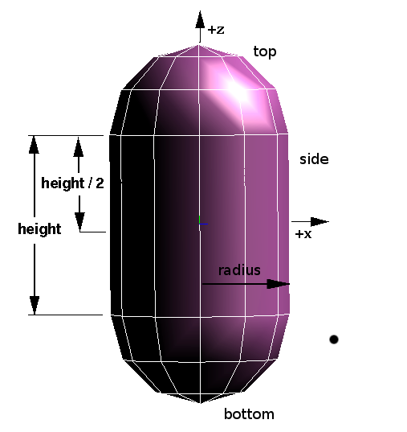

## Capsule

```
Capsule {
  SFBool  bottom      TRUE   # {TRUE, FALSE}
  SFFloat height      2      # [0, inf)
  SFFloat radius      1      # [0, inf)
  SFBool  side        TRUE   # {TRUE, FALSE}
  SFBool  top         TRUE   # {TRUE, FALSE}
  SFInt32 subdivision 12     # [3, inf)
}
```

### Description

A [Capsule](#capsule) node is like a [Cylinder](cylinder.md) node except it has half-sphere caps at its ends.
The capsule's height, not counting the caps, is given by the `height` field.
The radius of the caps, and of the cylinder itself, is given by the `radius` field.
Capsules are aligned along the local z-axis.

The capsule can be used either as a graphical or collision detection primitive (when placed in a `boundingObject`).
The capsule is a particularly fast and accurate collision detection primitive.

A capsule has three optional parts: the `side`, the `top` and the `bottom`.
Each part has an associated boolean field that indicates whether the part should be drawn or not.
For collision detection, all parts are considered to be present, regardless of the value of these boolean fields.

The `subdivision` field defines the number of triangles that must be used to represent the capsule and so its resolution.
More precisely, it corresponds to the number of faces that compose the capsule's side.
This field has no effect on collision detection.

%figure "The Capsule node"



%end

When a texture is mapped to a capsule, the texture map is vertically divided in three equally sized parts (e.g., like the German flag).
The top part is mapped to the capsule's top.
The middle part is mapped to the capsule's side (body).
The bottom part is mapped to the capsule's bottom.
On each part, the texture wraps counterclockwise (seen from above) starting from the intersection with the *z*- and positive *y*-plane.
