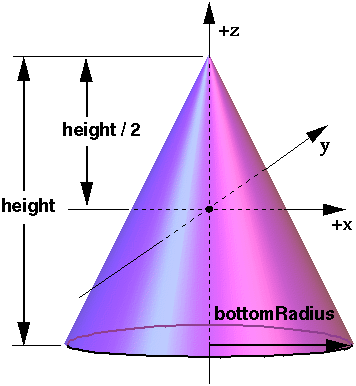

## Cone

```
Cone {
  SFFloat bottomRadius 1      # [0, inf)
  SFFloat height       2      # [0, inf)
  SFBool  side         TRUE   # {TRUE, FALSE}
  SFBool  bottom       TRUE   # {TRUE, FALSE}
  SFInt32 subdivision  12     # [3, inf)
}
```

The [Cone](#cone) node specifies a cone which is centered in the local coordinate system and whose central axis is aligned with the local z-axis.
The `bottomRadius` field specifies the radius of the cone's base, and the `height` field specifies the height of the cone from the center of the base to the apex.
By default, the cone has a radius of 1 meter at the bottom and a height of 2 meters, with its apex at z = height/2 and its bottom at z = -height/2.
See [this figure](#the-cone-node).

The `side` field specifies whether the sides of the cone are created, and the `bottom` field specifies whether the bottom cap of the cone is created.
A value of `TRUE` specifies that this part of the cone exists, while a value of `FALSE` specifies that this part does not exist.

The `subdivision` field defines the number of polygons used to represent the cone and so its resolution.
More precisely, it corresponds to the number of lines used to represent the bottom of the cone.

%figure "The Cone node"



%end

When a texture is applied to the sides of the cone, the texture wraps counterclockwise (from above) starting on the left of the cone.
The texture has a vertical seam on the left in the *yz* plane, from the apex (0, 0, `height`/2) to the point (0, r, 0).
For the bottom cap, a circle is cut out of the unit texture square centered at (0, 0, -`height`/2) with dimensions (2 * `bottomRadius`) by (2 * `bottomRadius`).
The bottom cap texture appears right side up when the top of the cone is rotated towards the positive y-axis.
[TextureTransform](texturetransform.md) affects the texture coordinates of the Cone.

[Cone](#cone) geometries cannot be used as primitives for collision detection in bounding objects.
