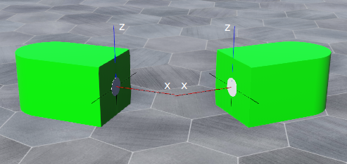

## Connector

Derived from [Device](device.md) and [Solid](solid.md).

```
Connector {
  SFString type              "symmetric"   # {"symmetric", "active", "passive"}
  SFBool   isLocked          FALSE         # {TRUE, FALSE}
  SFBool   autoLock          FALSE         # {TRUE, FALSE}
  SFBool   unilateralLock    TRUE          # {TRUE, FALSE}
  SFBool   unilateralUnlock  TRUE          # {TRUE, FALSE}
  SFFloat  distanceTolerance 0.01          # [0, inf)
  SFFloat  axisTolerance     0.2           # [0, pi]
  SFFloat  rotationTolerance 0.2           # [0, pi]
  SFInt32  numberOfRotations 4             # [0, inf)
  SFBool   snap              TRUE          # {TRUE, FALSE}
  SFFloat  tensileStrength   -1            # {-1, [0, inf)}
  SFFloat  shearStrength     -1            # {-1, [0, inf)}
}
```

### Description

[Connector](#connector) nodes are used to simulate mechanical docking systems, or any other type of device, that can dynamically create a physical link (or *connection*) with another device of the same type.

Unlike other [Devices](device.md), a [Connector](#connector) may lie outside of a [Robot](robot.md) node.
This is useful, for example, to allow some object equipped with a "passive" connector to be grasped by a robotic gripper equipped with a corresponding active connector.

[Connector](#connector) nodes can only connect to other [Connector](#connector) nodes.
At any time, each connection involves exactly two [Connector](#connector) nodes (peer to peer).
The physical connection between two [Connector](#connector) nodes can be created and destroyed at run time by the robot's controller.
The primary idea of [Connector](#connector) nodes is to enable the dynamic reconfiguration of modular robots, but more generally, [Connector](#connector) nodes can be used in any situation where solids need to be attached to other solids.

[Connector](#connector) nodes were designed to simulate various types of docking hardware:

- Mechanical links held in place by a latch.
- Gripping mechanisms.
- Magnetic links between permanent magnets (or electromagnets).
- Pneumatic suction systems, etc.

Connectors can be classified into two types, independent of the actual hardware system:

*Symmetric connectors*, where the two connecting faces are mechanically (and electrically) equivalent.
In such cases both connectors are active.

*Asymmetric connectors*, where the two connecting interfaces are mechanically different.
In asymmetric systems there is usually one active and one passive connector.

The detection of the presence of a peer [Connector](#connector) is based on simple distance and angle measurements, and therefore the [Connector](#connector) nodes are a computationally inexpensive way of simulating docking mechanisms.

### Field Summary

- `model`: specifies the [Connector](#connector)'s model.
Two [Connector](#connector) nodes can connect only if their model strings are identical.

- `type`: specifies the connector's type, this must be one of: "symmetric", "active", or "passive".
A "symmetric" connector can only lock to (and unlock from) another "symmetric" connector.
An "active" connector can only lock to (and unlock from) a "passive" connector.
A "passive" connector cannot lock or unlock (this is particularly useful for connectors which are part of the static environment).

- `isLocked`: represents the locking state of the [Connector](#connector).
The locking state can be changed through the `wb_connector_lock` and `wb_connector_unlock` API functions.
The *locking state* means the current state of the locking hardware, it does not indicates whether or not an actual physical link exists between two connectors.
For example, according to the hardware type, `isLocked` can mean that a mechanical latch or a gripper is closed, that electro-magnets are activated, that permanent magnets were moved to an attraction state, or that a suction pump was activated, etc. But the actual physical link exists only if the `wb_connector_lock` function was called when a compatible peer was present (or if the [Connector](#connector) was auto-locked).

    > **Note**:
If `Connector` nodes are locked and correctly aligned (and compatible) in the
.wbt file then the simulation will start with these connectors already attached
by a physical link. You can take advantage of this feature to start your
simulation with the desired mechanical configuration.

- `autoLock`: specifies if auto-locking is enabled or disabled.
Auto-locking allows a connector to automatically lock when a compatible peer becomes present.
In order to successfully auto-lock, both the `autoLock` and the `isLocked` fields must be TRUE when the peer becomes present, this means that the `wb_connector_lock` function must have been invoked earlier.
The general idea of `autoLock` is to allow passive locking.
Many spring mounted latching mechanisms or magnetic systems passively lock their peer.

- `unilateralLock`: indicate that locking one peer only is sufficient to create a physical link.
This field must be set to FALSE for systems that require both sides to be in the locked state in order to create a physical link.
For example, symmetric connectors using rotating magnets fall into this category, because both connectors must be simultaneously in a magnetic "attraction" state in order to create a link.
Note that this field should always be TRUE for "active" connectors, otherwise locking would be impossible for them.

- `unilateralUnlock`: indicates that unlocking one peer only is sufficient to break the physical link.
This field must be set to FALSE for systems that require both sides to be in an unlocked state in order to break the physical link.
For example, connectors often use bilateral latching mechanisms, and each side must release its own latch in order for the link to break.
Note that this field should always be TRUE for "active" connectors, otherwise unlocking would be impossible for them.

- `distanceTolerance`: the maximum distance [in meters] between two connectors which still allows them to lock successfully.
The distance is measured between the origins of the coordinate systems of the connectors.

- `axisTolerance`: the maximum angle [in radians] between the *x*-axes of two connectors at which they may successfully lock.
Two [Connector](#connector) nodes can lock when their *x*-axes are parallel (within tolerance), but pointed in opposite directions.

- `rotationTolerance`: the tolerated angle difference with respect to each of the allowed docking rotations (see [this figure](#example-of-rotational-alignment-numberofrotations4-and-rotationaltolerance22-5-deg)).

- `numberOfRotations`: specifies how many different docking rotations are allowed in a full 360 degree rotation around the [Connector](#connector)'s x-axis.
For example, modular robots' connectors are often 1-, 2- or 4-way dockable depending on mechanical and electrical interfaces.
As illustrated in [this figure](#example-of-rotational-alignment-numberofrotations4-and-rotationaltolerance22-5-deg), if `numberOfRotations` is 4 then there will be 4 different docking positions (one every 90 degrees).
If you don't wish to check the rotational alignment criterion this field should be set to zero.

%figure "Example of rotational alignment (numberOfRotations=4 and rotationalTolerance=22.5 deg)"


%end

> **Note**: For the `autoLock`, `distanceTolerance`, `axisTolerance`, `rotationTolerance` and `numberOfRotations` fields, the value of these fields in the other connector doesn't matter, each connector will check independently if it does satisfy the conditions or not.

- `snap`: when TRUE: the two connectors do automatically snap (align, adjust, etc.) when they become docked.
The alignment is threefold: 1) the two bodies are rotated such that their x-axes become parallel (but pointed in opposite directions), 2) the two bodies are rotated such that their z-axes match one of the possible rotational docking position, 3) the two bodies are shifted towards each other such that the origin of their coordinate system match.
Note that when the `numberOfRotations` field is 0, step 2 is omitted, and therefore the rotational alignment remains free.
As a result of steps 1 and 3, the connector surfaces always become superimposed.
It is recommended to set the same `snap` value for both connectors.

- `tensileStrength`: maximum tensile force in *newton* [N] that the docking mechanism can withstand before it breaks.
This can be used to simulate the rupture of the docking mechanism.
The tensile force corresponds to a force that pulls the two connectors apart (in the negative *x*-axes direction).
When the tensile force exceeds the tensile strength, the link breaks.
Note that if both connectors are locked, the effective tensile strength corresponds to the sum of both connectors' `tensileStrength` fields.
The default value -1 indicates an infinitely strong docking mechanism that does not break no matter how much force is applied (in case both connectors are locked, it is sufficient to set the `tensileStrength` field of one of the connectors to -1).

- `shearStrength`: indicates the maximum shear force in *newtons* [N] that the docking mechanism can withstand before it breaks.
This can be used to simulate the rupture of the docking mechanism.
The `shearStrength` field specifies the ability of two connectors to withstand a force that would makes them slide against each other in opposite directions (in the *yz*-plane).
Note that if both connectors are locked, the effective shear strength corresponds to the sum of both connectors' `shearStrength` fields.
The default value -1 indicates an infinitely strong docking mechanism that does not break no matter how much force is applied (in case both connectors are locked, it is sufficient to set the `shearStrength` field of one of the connectors to -1).

### Connector Axis System

A [Connector](#connector)'s axis system is displayed by Webots when the corresponding robot is selected or when *Display Axes* is checked in Webots *Preferences*.
The x-axis is drawn as a 5 cm red line, the z-axis (a potential docking rotation) is drawn as a 5 cm blue line, and each additional potential docking rotation is displayed as a 4 cm black line.
The bounding objects and graphical objects of a [Connector](#connector) should normally be designed such that the docking surface corresponds exactly to the *yz*-plane of the local coordinate system.
Furthermore, the [Connector](#connector)'s x-axis should be perpendicular to the docking surface and point outward from the robot body.
Finally, the bounding objects should allow the superposition of the origin of the coordinate systems.
If these design criteria are not met, the [Connector](#connector) nodes will not work properly and may be unable to connect.

%figure "Connector axis"



%end

> **Note**: To be functional, at least one of the two [Connector](#connector) nodes requires the presence of a [Physics](physics.md) node in its definition or in a parent node.

### Connector Functions

#### `wb_connector_enable_presence`
#### `wb_connector_disable_presence`
#### `wb_connector_get_presence_sampling_period`
#### `wb_connector_get_presence`
#### `wb_connector_is_locked`

%tab-component "language"

%tab "C"

```c
#include <webots/connector.h>

void wb_connector_enable_presence(WbDeviceTag tag, int sampling_period);
void wb_connector_disable_presence(WbDeviceTag tag);
int wb_connector_get_presence_sampling_period(WbDeviceTag tag);
int wb_connector_get_presence(WbDeviceTag tag);
bool wb_connector_is_locked(WbDeviceTag tag);
```

%tab-end

%tab "C++"

```cpp
#include <webots/Connector.hpp>

namespace webots {
  class Connector : public Device {
    virtual void enablePresence(int samplingPeriod);
    virtual void disablePresence();
    int getPresenceSamplingPeriod() const;
    int getPresence() const;
    bool isLocked() const;
    // ...
  }
}
```

%tab-end

%tab "Python"

```python
from controller import Connector

class Connector (Device):
    def enablePresence(self, samplingPeriod):
    def disablePresence(self):
    def getPresenceSamplingPeriod(self):
    def getPresence(self):
    def isLocked(self):
    # ...
```

%tab-end

%tab "Java"

```java
import com.cyberbotics.webots.controller.Connector;

public class Connector extends Device {
  public void enablePresence(int samplingPeriod);
  public void disablePresence();
  public int getPresenceSamplingPeriod();
  public int getPresence();
  public boolean isLocked();
  // ...
}
```

%tab-end

%tab "MATLAB"

```MATLAB
wb_connector_enable_presence(tag, sampling_period)
wb_connector_disable_presence(tag)
period = wb_connector_get_presence_sampling_period(tag)
presence = wb_connector_get_presence(tag)
locked = wb_connector_is_locked(tag)
```

%tab-end

%tab "ROS"

| name | service/topic | data type | data type definition |
| --- | --- | --- | --- |
| `/<device_name>/presence` | `topic` | `webots_ros::Int8Stamped` | [`Header`](http://docs.ros.org/api/std_msgs/html/msg/Header.html) `header`<br/>`int8 data` |
| `/<device_name>/presence_sensor/enable` | `service` | [`webots_ros::set_int`](ros-api.md#common-services) | |
| `/<device_name>/presence_sensor/get_sampling_period` | `service` | [`webots_ros::get_int`](ros-api.md#common-services) | |

%tab-end

%end

##### Description

*detect the presence of another connector*

The `wb_connector_enable_presence` function starts querying the presence sensor of the [Connector](#connector).
The `sampling_period` argument specifies the sampling period of the presence sensor.
It is expressed in milliseconds.
Note that it will be active only after the first sampling period elapsed.

The `wb_connector_disable_presence` function stops querying the presence sensor of the [Connector](#connector).

The `wb_connector_get_presence_sampling_period` function returns the period at which the presence sensor of the [Connector](#connector) is queried.
The `wb_connector_get_presence` function returns the current *presence* state of this connector, it returns:

- 1: in case of the presence of a peer connector
- 0: in case of the absence of a peer connector
- -1: not applicable (if this connector is of "passive" type)

The *presence* state is defined as the correct positioning of a compatible peer [Connector](#connector).

The `wb_connector_is_locked` function returns the current *isLocked* state of this connector.

Two connectors are in position if they are axis-aligned, rotation-aligned and near enough.
To be axis-aligned, the angle between the *x*-axes of the two connectors must be smaller than the `axisTolerance` field.
To be rotation-aligned, the angle between the z-axis of both connectors must be within `distanceTolerance` of one of the possible `numberOfRotations` subdivisions of 360 degrees.
Two connectors are near enough if the distance between them (measured between the origins of the coordinate systems) is smaller than `distanceTolerance`.

Two connectors are compatible if both types are "symmetric" or if one is "active" and the other is "passive".
A further requirement for the compatibility is that the `model` fields of the connectors must be identical.
The conditions for detecting presence can be summarized this way:

```
presence         := in_position AND compatible
compatible       := type_compatible AND model_compatible
type_compatible  := both connectors are "symmetric" OR one connector
                    is "active" AND the other one is "passive"
model_compatible := both models strings are equal
in_position      := near_enough AND axis_aligned AND rotation_aligned
near_enough      := the distance between the connectors < tolerance
axis_aligned     := the angle between the x-axes < tolerance
rotation_aligned := the n-ways rotational angle is within tolerance
```

---

#### `wb_connector_lock`
#### `wb_connector_unlock`

%tab-component "language"

%tab "C"

```c
#include <webots/connector.h>

void wb_connector_lock(WbDeviceTag tag);
void wb_connector_unlock(WbDeviceTag tag);
```

%tab-end

%tab "C++"

```cpp
#include <webots/Connector.hpp>

namespace webots {
  class Connector : public Device {
    virtual void lock();
    virtual void unlock();
    // ...
  }
}
```

%tab-end

%tab "Python"

```python
from controller import Connector

class Connector (Device):
    def lock(self):
    def unlock(self):
    # ...
```

%tab-end

%tab "Java"

```java
import com.cyberbotics.webots.controller.Connector;

public class Connector extends Device {
  public void lock();
  public void unlock();
  // ...
}
```

%tab-end

%tab "MATLAB"

```MATLAB
wb_connector_lock(tag)
wb_connector_unlock(tag)
```

%tab-end

%tab "ROS"

| name | service/topic | data type | data type definition |
| --- | --- | --- | --- |
| `/<device_name>/lock` | `service` | [`webots_ros::set_bool`](ros-api.md#common-services) | |

%tab-end

%end

##### Description

*create / destroy the physical connection between two connector nodes*

The `wb_connector_lock` and `wb_connector_unlock` functions can be used to set or unset the [Connector](#connector)'s locking state (`isLocked` field) and eventually create or destroy the physical connection between two [Connector](#connector) nodes.

If the `wb_connector_lock` function is invoked while a peer connector is *present* (see the definition of *presence* above), a physical link will be created between the two connectors.
If both the `isLocked` and `autoLock` fields are TRUE, then the physical link will be created automatically as soon as the peer's *presence* is detected.
If the `wb_connector_lock` function succeeds in creating the link, the two connected bodies will keep a constant distance and orientation with respect to each other from this moment on.

If the `wb_connector_unlock` function is invoked while there is a physical link between two connectors, the link will be destroyed, unless `unilateralUnlock` is FALSE and the peer connector is still in the `isLocked` state.
