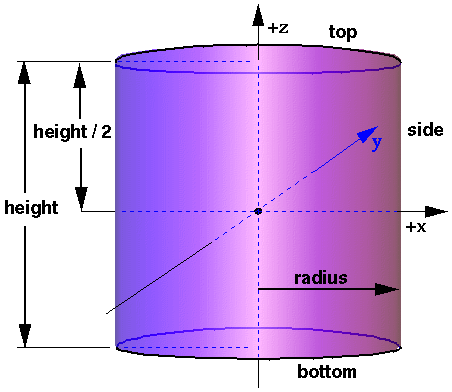

## Cylinder

```
Cylinder {
  SFBool  bottom      TRUE   # {TRUE, FALSE}
  SFFloat height      2      # [0, inf)
  SFFloat radius      1      # [0, inf)
  SFBool  side        TRUE   # {TRUE, FALSE}
  SFBool  top         TRUE   # {TRUE, FALSE}
  SFInt32 subdivision 12     # [2, inf)
}
```

### Description

The [Cylinder](#cylinder) node specifies a cylinder centered at (0,0,0) in the local coordinate system and with a central axis oriented along the local y-axis.
By default, the cylinder spans -1 to +1 in all three dimensions.
The `radius` field specifies the radius of the cylinder and the `height` field specifies the height of the cylinder along the central axis.
See [this figure](#the-cylinder-node).

The cylinder has three parts: the side, the top (y = +`height`/2) and the bottom (y = -`height+`/2).
Each part has an associated `SFBool` field that indicates whether the part exists (`TRUE`) or does not exist (`FALSE`).
Parts which do not exist are not rendered.
However, all parts are used for collision detection, regardless of their associated `SFBool` field.

The `subdivision` field defines the number of polygons used to represent the cylinder and so its resolution.
More precisely, it corresponds to the number of lines used to represent the bottom or the top of the cylinder.

%figure "The Cylinder node"



%end

When a texture is applied to a cylinder, it is applied differently to the sides, top, and bottom.
On the sides, the texture wraps counterclockwise (from above) starting at the back of the cylinder.
The texture has a vertical seam at the back, intersecting the yz plane.
For the top and bottom caps, a circle is cut out of the unit texture squares centered at (0, +/- `height`, 0) with dimensions 2*`radius` by 2*`radius`.
The top texture appears right side up when the top of the cylinder is tilted toward the +*z* axis, and the bottom texture appears right side up when the top of the cylinder is tilted toward the -*z* axis.
[TextureTransform](texturetransform.md) affects the texture coordinates of the Cylinder.
