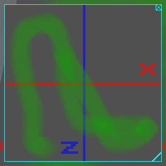
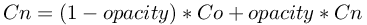

## Display

Derived from [Device](device.md) and [Solid](solid.md).

```
Display {
  SFInt32 width  64   # [1, inf)
  SFInt32 height 64   # [1, inf)
}
```

### Description

The [Display](#display) node allows to handle a 2D pixel array using simple API functions, and render it into a 2D overlay on the 3D view, into a 2D texture of any [Shape](shape.md) node, or both.
It can model an embedded screen or it can display any graphical information such as graphs, text, robot trajectory, filtered camera images and so on.

To model an embedded screen, the first child of the [Display](#display) node should be or contain (recursive search if the first node is a [Group](group.md)) a [Shape](shape.md) node having an appearance and an [ImageTexture](imagetexture.md) node, then the internal texture of the [ImageTexture](imagetexture.md) node is replaced by the texture of the [Display](#display).
Both [Appearance](appearance.md) and [PBRAppearance](pbrappearance.md) nodes are supported.
In case of [PBRAppearance](pbrappearance.md) node, at least `PBRAppearance.baseColorMap` or `PBRAppearance.emissiveColorMap` [ImageTexture](imagetexture.md) node should be defined. If both are defined, then both textures will be internally replaced by the [Display](#display) texture.
Using the [Appearance](appearance.md) node and setting the [Material](material.md).emissiveColor field to `1 1 1` helps preserving the original colors of the loaded [Display](#display) texture.
Additionally, it is necessary to set the `filtering` field of the [ImageTexture](imagetexture.md) nodes to 0 in order to prevent issues when distancing oneself from the display.

### Field Summary

- `width`: width of the display in pixels

- `height`: height of the display in pixels

### Coordinates System

Internally, the [Display](#display) image is stored in a 2D pixel array.
The RGBA value (4x8 bits) of a pixel is dislayed in the status bar (the bar at the bottom of the console window) when the mouse hovers over the pixel in the [Display](#display).
The 2D array has a fixed size defined by the `width` and `height` fields.
The (0,0) coordinate corresponds to the top left pixel, while the (`width`-1,`height`-1) coordinate corresponds to the bottom right pixel.

### Command Stack

Each function call of the [Display](#display) device API (except for the `wb_display_get_width` and `wb_display_get_height` functions) is storing a specific command into an internal stack.
This command stack is sent to Webots during the next call of the `wb_robot_step` function, using a FIFO scheme (First In, First Out), so that commands are executed in the same order as the corresponding function calls.

### Context

The [Display](#display) device has among other things two kinds of functions; the contextual ones which allow to set the current state of the display, and the drawing ones which allow to draw specific primitives.
The behavior of the drawing functions depends on the display context.
For example, in order to draw two red lines, the `wb_display_set_color` contextual function must be called for setting the display's internal color to red before calling twice the `wb_display_draw_line` drawing function to draw the two lines.

### Overlay Image

%figure "Display overlay image"



%end

The display image is shown by default on top of the 3D window with a cyan border, see [this figure](#display-overlay-image).
The user can move this display image at the desired position using the mouse drag and drop and resize it by clicking on the icon at the bottom right corner.
Additionally a close button is available on the top right corner to hide the image.
If the mouse cursor is over the overlay image and the simulation is paused, the RGBA value of the selected pixel is displayed in the status bar at the bottom of the Webots window.
Once the robot is selected, it is also possible to show or hide the overlay image from the `Display Devices` item in `Robot` menu.

It is also possible to show the display image in an external window by double-clicking on it.
After doing it, the overlay disappears and a new window pops up.
Then, after closing the window, the overlay will be automatically restored.

### Display Functions

#### `wb_display_get_width`
#### `wb_display_get_height`

%tab-component "language"

%tab "C"

```c
#include <webots/display.h>

int wb_display_get_width(WbDeviceTag tag);
int wb_display_get_height(WbDeviceTag tag);
```

%tab-end

%tab "C++"

```cpp
#include <webots/Display.hpp>

namespace webots {
  class Display : public Device {
    int getWidth() const;
    int getHeight() const;
    // ...
  }
}
```

%tab-end

%tab "Python"

```python
from controller import Display

class Display (Device):
    def getWidth(self):
    def getHeight(self):
    # ...
```

%tab-end

%tab "Java"

```java
import com.cyberbotics.webots.controller.Display;

public class Display extends Device {
  public int getWidth();
  public int getHeight();
  // ...
}
```

%tab-end

%tab "MATLAB"

```MATLAB
width = wb_display_get_width(tag)
height = wb_display_get_height(tag)
```

%tab-end

%tab "ROS"

| name | service/topic | data type | data type definition |
| --- | --- | --- | --- |
| `/<device_name>/get_info` | `service` | `webots_ros::display_get_info` | `uint8 ask`<br/>`---`<br/>`uint32 width`<br/>`uint32 height` |

%tab-end

%end

##### Description

*get the size of a display*

These functions return respectively the values of the `width` and `height` fields.

---

#### `wb_display_set_color`
#### `wb_display_set_alpha`
#### `wb_display_set_opacity`
#### `wb_display_set_font`

%tab-component "language"

%tab "C"

```c
#include <webots/display.h>

void wb_display_set_color(WbDeviceTag tag, int color);
void wb_display_set_alpha(WbDeviceTag tag, double alpha);
void wb_display_set_opacity(WbDeviceTag tag, double opacity);
void wb_display_set_font(WbDeviceTag tag, const char *font, int size, bool anti_aliasing);
```

%tab-end

%tab "C++"

```cpp
#include <webots/Display.hpp>

namespace webots {
  class Display : public Device {
    virtual void setColor(int color);
    virtual void setAlpha(double alpha);
    virtual void setOpacity(double opacity);
    virtual void setFont(const std::string &font, int size, bool antiAliasing);
    // ...
  }
}
```

%tab-end

%tab "Python"

```python
from controller import Display

class Display (Device):
    def setColor(self, color):
    def setAlpha(self, alpha):
    def setOpacity(self, opacity):
    def setFont(self, font, size, antiAliasing):
    # ...
```

%tab-end

%tab "Java"

```java
import com.cyberbotics.webots.controller.Display;

public class Display extends Device {
  public void setColor(int color);
  public void setAlpha(double alpha);
  public void setOpacity(double opacity);
  public void setFont(String font, int size, boolean antiAliasing);
  // ...
}
```

%tab-end

%tab "MATLAB"

```MATLAB
wb_display_set_color(tag, [r g b])
wb_display_set_alpha(tag, alpha)
wb_display_set_opacity(tag, opacity)
wb_display_set_font(tag, font, size, anti_aliasing)
```

%tab-end

%tab "ROS"

| name | service/topic | data type | data type definition |
| --- | --- | --- | --- |
| `/<device_name>/set_color` | `service` | [`webots_ros::set_int`](ros-api.md#common-services) | |
| `/<device_name>/set_alpha` | `service` | [`webots_ros::set_float`](ros-api.md#common-services) | |
| `/<device_name>/set_opacity` | `service` | [`webots_ros::set_float`](ros-api.md#common-services) | |
| `/<device_name>/set_font` | `service` | `webots_ros::display_set_font` | `string font`<br/>`int32 size`<br/>`uint8 antiAliasing`<br/>`---`<br/>`int8 success` |

%tab-end

%end

###### Description

*set the drawing properties of a display*

These four functions define the context in which the subsequent drawing commands (see [draw primitive functions](#wb_display_draw_pixel)) will be applied.

The `wb_display_set_color` function defines the color for the subsequent drawing commands.
It is expressed as a 3 bytes RGB integer, the most significant byte (leftmost byte in hexadecimal representation) represents the red component, the second most significant byte represents the green component and the third byte represents the blue component.
For example, `0xFF00FF` (a mix of the red and blue components) represents the magenta color.
Before the first call to the `wb_display_set_color` function, the default color is white (`0xFFFFFF`).

The `wb_display_set_alpha` function defines the alpha channel for the subsequent drawing commands.
This function should be used only with special displays that can be transparent or semi-transparent (for which one can see through the display).
The alpha channel defines the opacity of a pixel of the display.
It is expressed as a floating point value between 0.0 and 1.0 representing respectively fully transparent and fully opaque.
Intermediate values correspond to semi-transparent levels.
Before the first call to the `wb_display_set_alpha` function, the default value for alpha is 1 (opaque).

The `wb_display_set_opacity` function defines with which opacity the new pixels will replace the old ones for the following drawing instructions.
It is expressed as a floating point value between 0.0 and 1.0; while 0 means that the new pixel has no effect over the old one and 1 means that the new pixel replaces entirely the old one.
Only the color channel is affected by the `opacity` according to the [blending](#blending-formula-used-to-compute-the-new-color-channels-cn-of-a-pixel-from-the-old-color-channels-co-of-the-background-pixel-and-from-the-opacity) formula.

%figure "Blending formula used to compute the new color channels (Cn) of a pixel from the old color channels (Co) of the background pixel and from the opacity."



%end

The `wb_display_set_font` function defines the font and its `size` (i.e. the character height in pixel) used for the characters drawn with the `wb_display_draw_text` function, the `anti_aliasing` argument defines whether anti-aliasing filtering should be used to render the characters.
The following standard fonts are available:

- Arial
-  Arial Black
-  Comic Sans MS
-  Courier New
-  Georgia
-  Impact
-  Lucida Console
-  Lucida Sans Unicode
-  Palatino Linotype
-  Tahoma
-  Times New Roman
-  Trebuchet MS
-  Verdana

In addition to these fonts, it is possible to add other TrueType fonts file in your `PROJECT_HOME/fonts` directory.
The default font is `Lucida Console, 8 pixels, with anti-aliasing`.

> **Note** [MATLAB]: In the MATLAB version of the `wb_display_set_color` function, the `color` argument must be a vector containing the three RGB components: `[RED GREEN BLUE]`.
Each component must be a value between 0.0 and 1.0.
For example the vector `[1 0 1]` represents the magenta color.

---

#### `wb_display_attach_camera`
#### `wb_display_detach_camera`

%tab-component "language"

%tab "C"

```c
#include <webots/display.h>

void wb_display_attach_camera(WbDeviceTag tag, WbDeviceTag camera_tag);
void wb_display_detach_camera(WbDeviceTag tag);
```

%tab-end

%tab "C++"

```cpp
#include <webots/Display.hpp>

namespace webots {
  class Display : public Device {
    virtual void attachCamera(Camera *camera);
    virtual void detachCamera();
    // ...
  }
}
```

%tab-end

%tab "Python"

```python
from controller import Display

class Display (Device):
    def attachCamera(self, camera):
    def detachCamera(self):
    # ...
```

%tab-end

%tab "Java"

```java
import com.cyberbotics.webots.controller.Display;

public class Display extends Device {
  public void attachCamera(Camera camera);
  public void detachCamera();
  // ...
}
```

%tab-end

%tab "MATLAB"

```MATLAB
wb_display_attach_camera(tag, camera_tag)
wb_display_detach_camera(tag)
```

%tab-end

%tab "ROS"

| name | service/topic | data type | data type definition |
| --- | --- | --- | --- |
| `/<device_name>/attach_camera` | `service` | [`webots_ros::set_string`](ros-api.md#common-services) | |
| `/<device_name>/detach_camera` | `service` | [`webots_ros::get_bool`](ros-api.md#common-services) | |

%tab-end

%end

##### Description

*attach/detach a camera to a display*

These functions are used to attach/detach a camera to a display.
When a camera is attached to a display, the camera images are efficiently copied to the background of the display.
This is useful for example to draw over some camera rendering or to simulate mirrors.

After detaching a camera, the pixels that have not been manually drawn will be transparent, i.e. their color will be black (0x000000) and their alpha value will be 0.0.

---

#### `wb_display_draw_pixel`
#### `wb_display_draw_line`
#### `wb_display_draw_rectangle`
#### `wb_display_draw_oval`
#### `wb_display_draw_polygon`
#### `wb_display_draw_text`
#### `wb_display_fill_rectangle`
#### `wb_display_fill_oval`
#### `wb_display_fill_polygon`

%tab-component "language"

%tab "C"

```c
#include <webots/display.h>

void wb_display_draw_pixel(WbDeviceTag tag, int x, int y);
void wb_display_draw_line(WbDeviceTag tag, int x1, int y1, int x2, int y2);
void wb_display_draw_rectangle(WbDeviceTag tag, int x, int y, int width, int height);
void wb_display_draw_oval(WbDeviceTag tag, int cx, int cy, int a, int b);
void wb_display_draw_polygon(WbDeviceTag tag, const int *x, const int *y, int size);
void wb_display_draw_text(WbDeviceTag tag, const char *text, int x, int y);
void wb_display_fill_rectangle(WbDeviceTag tag, int x, int y, int width, int height);
void wb_display_fill_oval(WbDeviceTag tag, int cx, int cy, int a, int b);
void wb_display_fill_polygon(WbDeviceTag tag, const int *x, const int *y, int size);
```

%tab-end

%tab "C++"

```cpp
#include <webots/Display.hpp>

namespace webots {
  class Display : public Device {
    virtual void drawPixel(int x, int y);
    virtual void drawLine(int x1, int y1, int x2, int y2);
    virtual void drawRectangle(int x, int y, int width, int height);
    virtual void drawOval(int cx, int cy, int a, int b);
    virtual void drawPolygon(const int *x, const int *y, int size);
    virtual void drawText(const std::string &text, int x, int y);
    virtual void fillRectangle(int x, int y, int width, int height);
    virtual void fillOval(int cx, int cy, int a, int b);
    virtual void fillPolygon(const int *x, const int *y, int size);
    // ...
  }
}
```

%tab-end

%tab "Python"

```python
from controller import Display

class Display (Device):
    def drawPixel(self, x, y):
    def drawLine(self, x1, y1, x2, y2):
    def drawRectangle(self, x, y, width, height):
    def drawOval(self, cx, cy, a, b):
    def drawPolygon(self, x, y):
    def drawText(self, text, x, y):
    def fillRectangle(self, x, y, width, height):
    def fillOval(self, cx, cy, a, b):
    def fillPolygon(self, x, y):
    # ...
```

%tab-end

%tab "Java"

```java
import com.cyberbotics.webots.controller.Display;

public class Display extends Device {
  public void drawPixel(int x, int y);
  public void drawLine(int x1, int y1, int x2, int y2);
  public void drawRectangle(int x, int y, int width, int height);
  public void drawOval(int cx, int cy, int a, int b);
  public void drawPolygon(int[] x, int[] y, int size);
  public void drawText(String text, int x, int y);
  public void fillRectangle(int x, int y, int width, int height);
  public void fillOval(int cx, int cy, int a, int b);
  public void fillPolygon(int[] x, int[] y, int size);
  // ...
}
```

%tab-end

%tab "MATLAB"

```MATLAB
wb_display_draw_pixel(tag, x, y)
wb_display_draw_line(tag, x1, y1, x2, y2)
wb_display_draw_rectangle(tag, x, y, width, height)
wb_display_draw_oval(tag, cx, cy, a, b)
wb_display_draw_polygon(tag, [x1 x2 ... xn], [y1 y2 ... yn])
wb_display_draw_text(tag, 'text', x, y)
wb_display_fill_rectangle(tag, x, y, width, height)
wb_display_fill_oval(tag, cx, cy, a, b)
wb_display_fill_polygon(tag, [x1 x2 ... xn], [y1 y2 ... yn])
```

%tab-end

%tab "ROS"

| name | service/topic | data type | data type definition |
| --- | --- | --- | --- |
| `/<device_name>/draw_pixel` | `service` | `webots_ros::display_draw_pixel` | `int32 x`<br/>`int32 y`<br/>`---`<br/>`int8 success` |
| `/<device_name>/draw_line` | `service` | `webots_ros::display_draw_line` | `int32 x1`<br/>`int32 y1`<br/>`int32 x2`<br/>`int32 y2`<br/>`---`<br/>`int8 success` |
| `/<device_name>/draw_rectangle` | `service` | `webots_ros::display_draw_rectangle` | `int32 x`<br/>`int32 y`<br/>`int32 width`<br/>`int32 height`<br/>`---`<br/>`int8 success` |
| `/<device_name>/draw_oval` | `service` | `webots_ros::display_draw_oval` | `int32 cx`<br/>`int32 cy`<br/>`int32 a`<br/>`int32 b`<br/>`---`<br/>`int8 success` |
| `/<device_name>/draw_polygon` | `service` | `webots_ros::display_draw_polygon` | `int32[] x`<br/>`int32[] y`<br/>`int32 size`<br/>`---`<br/>`int8 success` |
| `/<device_name>/draw_text` | `service` | `webots_ros::display_draw_text` | `string text`<br/>`int32 x`<br/>`int32 y`<br/>`---`<br/>`int8 success` |
| `/<device_name>/fill_rectangle` | `service` | `webots_ros::display_draw_rectangle` | `int32 x`<br/>`int32 y`<br/>`int32 width`<br/>`int32 height`<br/>`---`<br/>`int8 success` |
| `/<device_name>/fill_oval` | `service` | `webots_ros::display_draw_oval` | `int32 cx`<br/>`int32 cy`<br/>`int32 a`<br/>`int32 b`<br/>`---`<br/>`int8 success` |
| `/<device_name>/fill_polygon` | `service` | `webots_ros::display_draw_polygon` | `int32[] x`<br/>`int32[] y`<br/>`int32 size`<br/>`---`<br/>`int8 success` |

%tab-end

%end

##### Description

*draw a graphic primitive on a display*

These functions order the execution of a drawing primitive on a display.
They depend on the context of the display as defined by the contextual functions (see [set context functions](#wb_display_set_color)).

The `wb_display_draw_pixel` function draws a pixel at the (`x`,`y`) coordinate.

The `wb_display_draw_line` function draws a line between the (`x1`,`y1`) and the (`x2`,`y2`) coordinates using the *Bresenham's line drawing algorithm*.

The `wb_display_draw_rectangle` function draws the outline of a rectangle having a size of `width`*`height`.
Its top left pixel is defined by the (`x`,`y`) coordinate.

The `wb_display_draw_oval` function draws the outline of an oval.
The center of the oval is specified by the (`cx`,`cy`) coordinate.
The horizontal and vertical radius of the oval are specified by the (`a`,`b`) parameters.
If `a` equals `b`, this function draws a circle.

The `wb_display_draw_polygon` function draws the outline of a polygon having `size` vertices.
The list of vertices must be defined into `px` and `py`.
If the first pixel coordinates are not identical to the last ones, the loop is automatically closed.
Here is an example :

```c
  const int px[] = {10,20,10, 0};
  const int py[] = {0, 10,20,10};
  wb_display_draw_polygon(display,px,py,4); // draw a diamond
```

The `wb_display_draw_text` function draws an ASCII text from the (`x`,`y`) coordinate.
The font used for drawing the text is defined by the [`wb_display_set_font`](#wb_display_set_color) function.

The `wb_display_fill_rectangle` function draws a rectangle having the same properties as the rectangle drawn by the `wb_display_draw_rectangle` function except that it is filled instead of outlined.

The `wb_display_fill_oval` function draws an oval having the same properties as the oval drawn by the `wb_display_draw_oval` function except that it is filled instead of outlined.

The `wb_display_fill_polygon` function draws a polygon having the same properties as the polygon drawn by the `wb_display_draw_polygon` function except that it is filled instead of outlined.

> **Note** [Java, Python, MATLAB]: The Java, Python and MATLAB equivalent of the `wb_display_draw_polygon` and `wb_display_fill_polygon` functions don't have a `size` argument because in these languages the size is determined directly from the `x` and `y` arguments.

---

#### `wb_display_image_new`
#### `wb_display_image_load`
#### `wb_display_image_copy`
#### `wb_display_image_paste`
#### `wb_display_image_save`
#### `wb_display_image_delete`

%tab-component "language"

%tab "C"

```c
#include <webots/display.h>

#define WB_IMAGE_RGB  3
#define WB_IMAGE_RGBA 4
#define WB_IMAGE_ARGB 5
#define WB_IMAGE_BGRA 6
#define WB_IMAGE_ABGR 7

typedef struct WbImageStructPrivate *WbImageRef;

WbImageRef wb_display_image_new(WbDeviceTag tag, int width, int height, const void *data, int format);
WbImageRef wb_display_image_load(WbDeviceTag tag, const char *filename);
WbImageRef wb_display_image_copy(WbDeviceTag tag, int x, int y, int width, int height);
void wb_display_image_paste(WbDeviceTag tag, WbImageRef ir, int x, int y, bool blend);
void wb_display_image_save(WbDeviceTag tag, WbImageRef ir, const char *filename);
void wb_display_image_delete(WbDeviceTag tag, WbImageRef ir);
```

%tab-end

%tab "C++"

```cpp
#include <webots/Display.hpp>
#include <webots/ImageRef.hpp>

namespace webots {
  class ImageRef {
    // ...
  };

  class Display : public Device
    enum {RGB, RGBA, ARGB, BGRA, ABGR};

    ImageRef *imageNew(int width, int height, const void *data, int format) const;
    ImageRef *imageLoad(const std::string &filename) const;
    ImageRef *imageCopy(int x, int y, int width, int height) const;
    virtual void imagePaste(ImageRef *ir, int x, int y, blend=false);
    void imageSave(ImageRef *ir, const std::string &filename) const;
    void imageDelete(ImageRef *ir) const;
    // ...
  }
}
```

%tab-end

%tab "Python"

```python
from controller import Display

class Display (Device):
    RGB, RGBA, ARGB, BGRA, ABGR

    def imageNew(self, data, format, width=None, height=None):
    def imageLoad(self, filename):
    def imageCopy(self, x, y, width, height):
    def imagePaste(self, ir, x, y, blend=False):
    def imageSave(self, ir, filename):
    def imageDelete(self, ir):
    # ...
```

%tab-end

%tab "Java"

```java
import com.cyberbotics.webots.controller.Display;
import com.cyberbotics.webots.controller.ImageRef;

public class ImageRef {
  // ...
}

public class Display extends Device {
  public final static int RGB, RGBA, ARGB, BGRA, ABGR;

  public ImageRef imageNew(int width, int height, int[] data, int format);
  public ImageRef imageLoad(String filename);
  public ImageRef imageCopy(int x, int y, int width, int height);
  public void imagePaste(ImageRef ir, int x, int y, boolean blend);
  public void imageSave(ImageRef ir, String filename);
  public void imageDelete(ImageRef ir);
  // ...
}
```

%tab-end

%tab "MATLAB"

```MATLAB
RGB, RGBA, ARGB, BGRA, ABGR

image = wb_display_image_new(tag, data, format)
image = wb_display_image_load(tag, 'filename')
image = wb_display_image_copy(tag, x, y, width, height)
wb_display_image_paste(tag, image, x, y, blend)
wb_display_image_save(tag, image, 'filename')
wb_display_image_delete(tag, image)
```

%tab-end

%tab "ROS"

| name | service/topic | data type | data type definition |
| --- | --- | --- | --- |
| `/<device_name>/image_new` | `service` | `webots_ros::display_image_new` | `int32 width`<br/>`int32 height`<br/>`char[] data`<br/>`int32 format`<br/>`---`<br/>`uint64 ir` |
| `/<device_name>/image_load` | `service` | `webots_ros::display_image_load` | `string filename`<br/>`---`<br/>`uint64 ir` |
| `/<device_name>/image_copy` | `service` | `webots_ros::display_image_copy` | `int32 x`<br/>`int32 y`<br/>`int32 width`<br/>`int32 height`<br/>`---`<br/>`uint64 ir` |
| `/<device_name>/image_paste` | `service` | `webots_ros::display_image_paste` | `uint64 ir`<br/>`int32 x`<br/>`int32 y`<br/>`uint8 blend`<br/>`---`<br/>`int8 success` |
| `/<device_name>/image_save` | `service` | `webots_ros::display_image_save` | `string filename`<br/>`uint64 ir`<br/>`---`<br/>`int8 success` |
| `/<device_name>/image_delete` | `service` | `webots_ros::display_image_delete` | `uint64 ir`<br/>`---`<br/>`int8 success` |

%tab-end

%end

##### Description

*image manipulation functions*

In addition to the main display image, each [Display](#display) node also contains a list of clipboard images used for various image manipulations.
This list is initially empty.
The functions described below use a reference (corresponding to the `WbImageRef` data type) to refer to a specific image.
Clipboard images can be created either with the `wb_display_image_new`, `wb_display_image_load` or `wb_display_image_copy` functions.
They should be deleted with the `wb_display_image_delete` function when they are no more used.
Finally, note that both the main display image and the clipboard images have an alpha channel.

The `wb_display_image_new` function creates a new clipboard image, with the specified `with` and `height`, and loads the image `data` into it with respect to the defined image `format`.
Five images format are supported: `WB_IMAGE_BGRA` which is the recommended one and the image format returned by a `Camera` device, `WB_IMAGE_RGB`, `WB_IMAGE_RGBA`, `WB_IMAGE_ARGB`,  and `WB_IMAGE_ABGR`.

The `wb_display_image_load` function creates a new clipboard image, loads an image file into it and returns a reference to the new clipboard image.
The image file is specified with the `filename` parameter (relatively to the controller directory).
An image file can be in either PNG or JPEG format.
Note that this function involves sending an image from the controller process to Webots, thus possibly affecting the overall simulation speed.

The `wb_display_image_copy` function creates a new clipboard image and copies the specified sub-image from the main display image to the new clipboard image.
It returns a reference to the new clipboard image containing the copied sub-image.
The copied sub-image is defined by its top left coordinate (`x`,`y`) and its dimensions (`width`,`height`).

The `wb_display_image_paste` function pastes a clipboard image referred to by the `ir` parameter to the main display image.
The (`x`,`y`) coordinates define the top left point of the pasted image.
If the `blend` parameter is true, the resulting pixels displayed in the main display image are computed using a blending operation (similar to the one defined in the [blending](#blending-formula-used-to-compute-the-new-color-channels-cn-of-a-pixel-from-the-old-color-channels-co-of-the-background-pixel-and-from-the-opacity) formula but involving the alpha channels of the old and new pixels instead of the opacity).
In the `blend` parameter is set to false, the resulting pixels are simply copied from the clipboard image.
The paste operation is much faster if `blend` is set to false.

The `wb_display_image_save` function saves a clipboard image referred to by the `ir` parameter to a file.
If the `ir` parameter is NULL, then the current display image is saved.
The file name is defined by the `filename` parameter (relatively to the controller directory).
The image is saved in a file using either the PNG format or the JPEG format depending on the end of the `filename` parameter (respectively ".png" and ".jpg").
Note that this function involves sending an image from Webots to the controller process, thus possibly affecting the overall simulation speed.

The `wb_display_image_delete` function releases the memory used by a clipboard image specified by the `ir` parameter.
After this call the value of `ir` becomes invalid and should not be used any more.
Using this function is recommended after a clipboard image is not needed any more.

The following controller snippet shows how to copy a [Camera](camera.md) image to the main display image.
This is particularly useful if you need to modify the [Camera](camera.md) image before copying it to the main display image, otherwise you should use the [`wb_display_attach_camera`](#wb_display_attach_camera) function that provides a better performance.

%tab-component "language"
%tab "C"
```c
#include <webots/robot.h>
#include <webots/camera.h>
#include <webots/display.h>

int main() {
  wb_robot_init();

  const int time_step = wb_robot_get_basic_time_step();
  WbDeviceTag camera = wb_robot_get_device("camera");
  wb_camera_enable(camera, time_step);
  const int width = wb_camera_get_width(camera);
  const int height = wb_camera_get_height(camera);
  WbDeviceTag display = wb_robot_get_device("display");

  while(wb_robot_step(time_step) != -1) {
    const unsigned char *data = wb_camera_get_image(camera);
    if (data) {
      WbImageRef ir = wb_display_image_new(display, width, height, data, WB_IMAGE_BGRA);
      wb_display_image_paste(display, ir, 0, 0, false);
      wb_display_image_delete(display, ir);
    }
  }

  wb_robot_cleanup();
  return 0;
}
```
%tab-end

%tab "C++"
```cpp
#include <webots/Robot.hpp>
#include <webots/Camera.hpp>
#include <webots/Display.hpp>

using namespace webots;

int main() {
  Robot *robot = new Robot();
  const int timeStep = robot->getBasicTimeStep();

  Camera *camera = robot->getCamera("camera");
  camera->enable(timeStep);
  const int width = camera->getWidth();
  const int height = camera->getHeight();
  Display *display = robot->getDisplay("display");

  while (robot->step(timeStep) != -1) {
    const unsigned char *data = camera->getImage();
    if (data) {
      ImageRef *ir = display->imageNew(width, height, data, Display::BGRA);
      display->imagePaste(ir, 0, 0, false);
      display->imageDelete(ir);
    }
  }

  delete robot;
  return 0;
}
```
%tab-end

%tab "Python"
```python
from controller import Robot, Camera, Display

robot = Robot()
timestep = int(robot.getBasicTimeStep())

camera = robot.getCamera('camera')
camera.enable(timestep)
width = camera.getWidth()
height = camera.getHeight()
display = robot.getDisplay('display');

while robot.step(32) != -1:
    data = camera.getImage()
    if data:
        ir = display.imageNew(data, Display.BGRA, width, height)
        display.imagePaste(ir, 0, 0, False)
        display.imageDelete(ir)
```
%tab-end

%tab "Java"
```java
import com.cyberbotics.webots.controller.Robot;
import com.cyberbotics.webots.controller.Camera;
import com.cyberbotics.webots.controller.Display;
import com.cyberbotics.webots.controller.ImageRef;

public class ShowCameraInDisplay {

  public static void main(String[] args) {

    final Robot robot = new Robot();
    int timeStep = (int) Math.round(robot.getBasicTimeStep());

    Camera camera = robot.getCamera("camera");
    camera.enable(timeStep);
    int width = camera.getWidth();
    int height = camera.getHeight();
    Display display = robot.getDisplay("display");

    while (robot.step(32) != -1) {
      int[] data = camera.getImage();
      if (data != null) {
        ImageRef ir = display.imageNew(width, height, data, Display.ARGB);
        display.imagePaste(ir, 0, 0, false);
        display.imageDelete(ir);
      }
    }
  }
}
```
%tab-end

%tab "MATLAB"
```MATLAB
time_step = wb_robot_get_basic_time_step();
camera = wb_robot_get_device("camera");
wb_camera_enable(camera, time_step);
width = wb_camera_get_width(camera);
height = wb_camera_get_height(camera);
display = wb_robot_get_device("display");

while wb_robot_step(time_step) ~= -1
  data = wb_camera_get_image(camera);
  if data
    ir = wb_display_image_new(display, width, height, data, BGRA);
    wb_display_image_paste(display, ir, 0, 0, false);
    wb_display_image_delete(display, ir);
  end
end
```
%tab-end
%end

 **Note**: The Java `Display.imageNew` function can display the image returned by the `Camera.getImage` function directly if the pixel format argument is set to ARGB.
In the other programming languages the pixel format should be set to BGRA.
