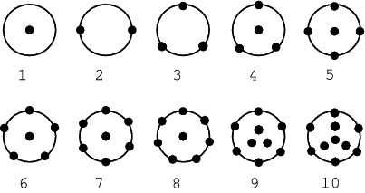
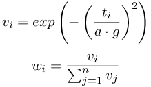
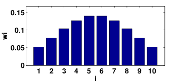
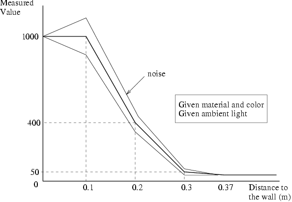
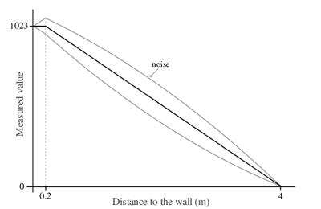
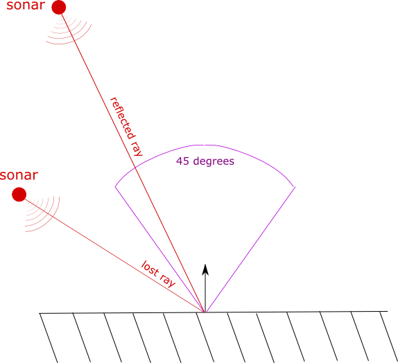

## DistanceSensor

Derived from [Device](device.md) and [Solid](solid.md).

```
DistanceSensor {
  MFVec3f  lookupTable              [ 0 0 0, 0.1 1000 0 ] # lookup table
  SFString type                     "generic"             # {"generic", "infra-red", "sonar", "laser"}
  SFInt32  numberOfRays             1                     # [1, inf)
  SFFloat  aperture                 1.5708                # [0, 2*pi]
  SFFloat  gaussianWidth            1                     # [0, inf)
  SFFloat  resolution               -1                    # {-1, [0, inf)}
  SFFloat  redColorSensitivity      1                     # [0, inf)
}
```

### Description

The [DistanceSensor](#distancesensor) node can be used to model a generic sensor, an infra-red sensor, a sonar sensor, or a laser range-finder.
This device simulation is performed by detecting the collisions between one or several sensor rays and objects in the environment.
In case of generic, sonar and laser type the collision occurs with the bounding objects of [Solid](solid.md) nodes, whereas infra-red rays collision detection uses the [Solid](solid.md) nodes themselves.

The rays of the [DistanceSensor](#distancesensor) nodes can be displayed by checking the menu `View / Optional Rendering / Show Distance Sensor Rays`.
The red/green transition on the rays indicates the points of intersection with the bounding objects.

### Field Summary

- `lookupTable`: a table used for specifying the desired response curve and noise of the device (see [below](#lookup-table) for more details).

- `type`: one of "generic" (the default), "infra-red", "sonar" or "laser".
Sensors of type "infra-red" can be sensitive to the objects' colors; light and red (RGB) obstacles have a higher response than dark and non-red obstacles (see below for more details).
Sensors of type "sonar" and "laser" return the distance to the nearest object while "generic" and "infa-red" computes the average distance of all rays.
Note however that sensors of type "sonar" will return the sonar range for each ray whose angle of incidence is greater than &pi;/8 radians (see below for more details).
Sensors of type "laser" can have only one ray and they have the particularity to draw a red spot at the point where this ray hits an obstacle. This red spot is visible on the camera images. If the red spot disappears due to depth fighting, then it could help increasing the `lineScale` value in [WorldInfo](worldinfo.md) node that is used for computing its position offset.

- `numberOfRays`: number of rays cast by the sensor.
The number of rays must be equal to, or greater than 1 for "infra-red" and "sonar" sensors.
`numberOfRays` must be exactly 1 for "laser" sensors.
If this number is larger than 1, then several rays are used and the sensor measurement value is computed from the weighted average of the individual rays' responses.
By using multiple rays, a more accurate model of the physical infra-red or ultrasound sensor can be obtained.
The sensor rays are distributed inside 3D-cones whose opening angles can be tuned through the `aperture` field.
See [this figure](#predefined-configurations-for-1-through-10-sensor-rays) for the ray distributions from one to ten rays.
The spacial distribution of the rays is as much as possible uniform and has a left/right symmetry.
There is no upper limit on the number of rays; however, Webots' performance drops as the number of rays increases.

%figure "Predefined configurations for 1 through 10 sensor rays"



%end

- `aperture`: sensor aperture angle or laser beam radius.
For the "infra-red" and "sonar" sensor types, this field controls the opening angle (in radians) of the cone of rays when multiple rays are used.
For the "laser" sensor type, this field specifies (in meters) the radius of the red spot drawn where the laser beam hits an obstacle.

%figure "Weight distribution formulas"



%end

- `gaussianWidth`: width of the Gaussian distribution of sensor ray weights (for "generic" and "infra-red" sensors).
When averaging the sensor's response, the individual weight of each sensor ray is computed according to a Gaussian distribution as described in [this figure](#weight-distribution-formulas).
where *w<sub>i</sub>* is the weight of the *i*th ray, *t<sub>i</sub>* is the angle between the *i*th ray and the sensor axis, *a* is the aperture angle of the sensor, *g* is the Gaussian width, and *n* is the number of rays.
As depicted in [this figure](#example-distribution-for-10-rays-using-a-gaussian-width-of-0-5), rays in the center of the sensor cone are given a greater weight than rays in the periphery.
A wider or narrower distribution can be obtained by tuning the `gaussianWidth` field.
An approximation of a flat distribution is obtained if a sufficiently large number is chosen for the `gaussianWidth`.
This field is ignored for the "sonar" and "laser" DistanceSensor types.

%figure "Example distribution for 10 rays using a Gaussian width of 0.5"



%end

- `resolution`: This field allows to define the resolution of the sensor, the resolution is the smallest change that it is able to measure.
Setting this field to -1 (default) means that the sensor has an 'infinite' resolution (it can measure any infinitesimal change).
The raw measurement is first interpolated according to the lookup table and subsequently sampled with respect to the specified resolution, if one is defined.
This field accepts any value in the interval (0.0, inf).

- `redColorSensitivity`: red color sensitivity factor.
This allows to tune (or even disable) red color sensitivity for infra-red distance sensor type.
A value of 1 corresponds to the default behavior.
Values greater that 1 increase the red color sensitivity and values lower than 1 decrease it.
A value of 0 disables the effect of the red color completely.
See details [below](#infra-red-sensors).

### Lookup Table

A lookup table indicates how the value measured by Webots must be mapped to response values returned by the sensor (the distance returned by the `wb_distance_sensor_get_value` function in case of [DistanceSensor](#distancesensor)).
The first column of the table specifies the input distances, the second column specifies the corresponding desired response values, and the third column indicates the desired standard deviation of the noise.
The noise on the return value is computed according to a gaussian random number distribution whose range is calculated as a percent of the response value (two times the standard deviation is often referred to as the signal quality).
Note that the input values of a lookup table must always be positive and sorted in increasing order.

Let us consider a first example:

```
lookupTable [ 0     1000  0,
              0.1   1000  0.1,
              0.2    400  0.1,
              0.3     50  0.1,
              0.37    30  0   ]
```

The above lookup table means that for a distance of 0 meters, the sensor will return a value of 1000 without noise (0); for a distance of 0.1 meter, the sensor will return 1000 with a noise of standard deviation of 10 percent (100); for a distance value of 0.2 meters, the sensor will return 400 with a standard deviation of 10 percent (40), etc.
Distance values not directly specified in the lookup table will be linearly interpolated. This can be better understood in [this figure](#sensor-response-versus-obstacle-distance) below.

%figure "Sensor response versus obstacle distance"



%end

A different graph is produced when the trend of the desired response value and the trend of the desired noise standard deviation have opposite sign.
This is the case in the following example, where the response value increases with the input values but the noise decreases:

```
lookupTable [ 0     1023  0,
              0.02  1023  0.05,
              4        0  0.4  ]
```

The resulting range of measured values is shown in [this figure](#sensor-response-versus-obstacle-distance-with-opposite-response-noise-increase).

%figure "Sensor response versus obstacle distance with opposite response-noise increase"



%end

### DistanceSensor Types

This table summarizes the difference between the three types of DistanceSensor.

Two different methods are used for calculating the distance from an object.
*Average* method computes the average of the distances measured by all the rays, whereas *Nearest* method uses the shortest distance measured by any of the rays.

%figure "Summary of DistanceSensor types"

| type (field)               | "generic" | "infra-red" | "sonar" | "laser" |
| -------------------------- | --------- | ----------- | ------- | ------- |
| numberOfRays (field)       | `>` 0     | `>` 0       | `>` 0   | 1       |
| Distance calculation       | Average   | Average     | Nearest | Nearest |
| gaussianWidth (field)      | Used      | Used        | Ignored | Ignored |
| Sensitive to red objects   | No        | Yes         | No      | No      |
| Draws a red spot           | No        | No          | No      | Yes     |
| Ignore transparent objects | No        | Yes         | No      | Yes     |

%end

A transparent object is not perceived by "laser" and "infra-red" distance sensors if its bounding object has transparency set to 1.0.

### Infra-Red Sensors

In the case of an "infra-red" sensor, the value returned by the lookup table is modified by a reflection factor depending on the color, roughness and occlusion properties of the object hit by the sensor ray.
The `redColorSensitivity` field also applies and can be used to tune this functionality. Value of 0 will completely disable red color sensitivity.
The reflection factor is computed as follows: *f = 0.2 + 0.8 * red\_level * (1 - 0.5 * roughness) * (1 - 0.5 * occlusion)* where *red\_level* is the level of red color of the object hit by the sensor ray.
This level is evaluated combining the `diffuseColor` (in case of [Appearance](appearance.md)), `baseColor` (in case of [PBRAppearance](pbrappearance.md)) and `transparency` values of the object, the pixel value of the image texture and the paint color applied on the object with the [Pen](pen.md) device.
The *roughness* is evaluated (only in case of [PBRAppearance](pbrappearance.md), otherwise roughness is 0) using the `roughness` value and the pixel value of the `roughnessMap` image texture.
The *occlusion* is evaluated (only in case of [PBRAppearance](pbrappearance.md), otherwise occlusion is 0) using the pixel value of the `occlusionMap` image texture.
Then, the distance value computed by the simulator is multiplied by the `redColorSensitivity` field value and divided by the reflection factor before the lookup table is used to compute the output value.

> **Note**: Unlike other distance sensor rays, "infra-red" rays can detect solid parts of the robot itself.
It is thus important to ensure that no solid geometries interpose between the sensor and the area to inspect.

### Sonar Sensors

In the case of a "sonar" sensor, the return value will be the last value entered in the lookup table, i.e. the value corresponding to sonar sensor's range, if the angle of incidence is greater than 22.5 degrees (&pi;/8 radians).
In other words, sonar rays which lie outside the reflexion cone of aperture 45 degrees never return and thus are lost for distance computation (see [this figure](#sonar-sensor)).

%figure "Sonar sensor"



%end

### Line Following Behavior

Some support for [DistanceSensor](#distancesensor) nodes used for reading the red color level of a textured floor is implemented.
This is useful to simulate line following behaviors.
This feature is demonstrated in the "rover.wbt" example (see in the "projects/robots/mindstorms/worlds" directory of Webots).
The ground texture must be placed in a [Plane](plane.md).

### DistanceSensor Functions

#### `wb_distance_sensor_enable`
#### `wb_distance_sensor_disable`
#### `wb_distance_sensor_get_sampling_period`
#### `wb_distance_sensor_get_value`

%tab-component "language"

%tab "C"

```c
#include <webots/distance_sensor.h>

void wb_distance_sensor_enable(WbDeviceTag tag, int sampling_period);
void wb_distance_sensor_disable(WbDeviceTag tag);
int wb_distance_sensor_get_sampling_period(WbDeviceTag tag);
double wb_distance_sensor_get_value(WbDeviceTag tag);
```

%tab-end

%tab "C++"

```cpp
#include <webots/DistanceSensor.hpp>

namespace webots {
  class DistanceSensor : public Device {
    virtual void enable(int samplingPeriod);
    virtual void disable();
    int getSamplingPeriod() const;
    double getValue() const;
    // ...
  }
}
```

%tab-end

%tab "Python"

```python
from controller import DistanceSensor

class DistanceSensor (Device):
    def enable(self, samplingPeriod):
    def disable(self):
    def getSamplingPeriod(self):
    def getValue(self):
    # ...
```

%tab-end

%tab "Java"

```java
import com.cyberbotics.webots.controller.DistanceSensor;

public class DistanceSensor extends Device {
  public void enable(int samplingPeriod);
  public void disable();
  public int getSamplingPeriod();
  public double getValue();
  // ...
}
```

%tab-end

%tab "MATLAB"

```MATLAB
wb_distance_sensor_enable(tag, sampling_period)
wb_distance_sensor_disable(tag)
period = wb_distance_sensor_get_sampling_period(tag)
value = wb_distance_sensor_get_value(tag)
```

%tab-end

%tab "ROS"

| name | service/topic | data type | data type definition |
| --- | --- | --- | --- |
| `/<device_name>/value` | `topic` | [`sensor_msgs::Range`](http://docs.ros.org/api/sensor_msgs/html/msg/Range.html) | [`Header`](http://docs.ros.org/api/std_msgs/html/msg/Header.html) `header`<br/>`uint8 ULTRASOUND=0`<br/>`uint8 INFRARED=1`<br/>`uint8 radiation_type`<br/>`float32 field_of_view`<br/>`float32 min_range`<br/>`float32 max_range`<br/>`float32 range` |
| `/<device_name>/enable` | `service` | [`webots_ros::set_int`](ros-api.md#common-services) | |
| `/<device_name>/get_sampling_period` | `service` | [`webots_ros::get_int`](ros-api.md#common-services) | |

%tab-end

%end

##### Description

*enable, disable and read distance sensor measurements*

The `wb_distance_sensor_enable` function allows the user to enable distance sensor measurements.
The `sampling_period` argument specifies the sampling period of the sensor and is expressed in milliseconds.
Note that the first measurement will be available only after the first sampling period elapsed.

The `wb_distance_sensor_disable` function turns the distance sensor off, saving computation time.

The `wb_distance_sensor_get_sampling_period` function returns the period given into the `wb_distance_sensor_enable` function, or 0 if the device is disabled.

The `wb_distance_sensor_get_value` function returns the last value measured by the specified distance sensor.
This value is computed by the simulator according to the lookup table of the [DistanceSensor](#distancesensor) node.
Hence, the range of the return value is defined by this lookup table.

---

#### `wb_distance_sensor_get_max_value`
#### `wb_distance_sensor_get_min_value`
#### `wb_distance_sensor_get_aperture`
#### `wb_distance_sensor_get_lookup_table_size`
#### `wb_distance_sensor_get_lookup_table`

%tab-component "language"

%tab "C"

```c
#include <webots/distance_sensor.h>

double wb_distance_sensor_get_max_value(WbDeviceTag tag);
double wb_distance_sensor_get_min_value(WbDeviceTag tag);
double wb_distance_sensor_get_aperture(WbDeviceTag tag);
int wb_distance_sensor_get_lookup_table_size(WbDeviceTag tag);
const double *wb_distance_sensor_get_lookup_table(WbDeviceTag tag);
```

%tab-end

%tab "C++"

```cpp
#include <webots/DistanceSensor.hpp>

namespace webots {
  class DistanceSensor : public Device {
    double getMaxValue() const;
    double getMinValue() const;
    double getAperture() const;
    int getLookupTableSize() const;
    const double *getLookupTable() const;
    // ...
  }
}
```

%tab-end

%tab "Python"

```python
from controller import DistanceSensor

class DistanceSensor (Device):
    def getMaxValue(self):
    def getMinValue(self):
    def getAperture(self):
    def getLookupTable(self):
    # ...
```

%tab-end

%tab "Java"

```java
import com.cyberbotics.webots.controller.DistanceSensor;

public class DistanceSensor extends Device {
  public double getMaxValue();
  public double getMinValue();
  public double getAperture();
  public double[] getLookupTable();
  // ...
}
```

%tab-end

%tab "MATLAB"

```MATLAB
max_value = wb_distance_sensor_get_max_value(tag)
min_value = wb_distance_sensor_get_min_value(tag)
aperture = wb_distance_sensor_get_aperture(tag)
lookup_table_array = wb_distance_sensor_get_lookup_table(tag)
```

%tab-end

%tab "ROS"

| name | service/topic | data type | data type definition |
| --- | --- | --- | --- |
| `/<device_name>/get_max_value` | `service` | [`webots_ros::get_float`](ros-api.md#common-services) | |
| `/<device_name>/get_min_value` | `service` | [`webots_ros::get_float`](ros-api.md#common-services) | |
| `/<device_name>/get_aperture` | `service` | [`webots_ros::get_float`](ros-api.md#common-services) | |
| `/<device_name>/get_lookup_table` | `service` | [`webots_ros::get_float_array`](ros-api.md#common-services) | |

%tab-end

%end

##### Description

*Get the maximum value, minimum value and aperture*

The `wb_distance_sensor_get_max_value` function returns the maximum value which can be returned by the distance sensor.
This value is the maximum of the second column of the `DistanceSensor.lookupTable` field.

The `wb_distance_sensor_get_min_value` function returns the minimum value which can be returned by the distance sensor.
This value is the minimum of the second column of the `DistanceSensor.lookupTable` field.

The `wb_distance_sensor_get_aperture` function returns the aperture of the distance sensor in radians.

The `wb_distance_sensor_get_lookup_table_size` function returns the number of rows in the [lookup table](#lookup-table).

The `wb_distance_sensor_get_lookup_table` function returns lookup table fields of the [lookup table](#lookup-table).
This function returns a matrix containing exactly N * 3 values (N represents the number of mapped values optained with the `wb_distance_sensor_get_lookup_table_size` function) that shall be interpreted as a N x 3 table.

---

#### `wb_distance_sensor_get_type`

%tab-component "language"

%tab "C"

```c
#include <webots/distance_sensor.h>

typedef enum {
  WB_DISTANCE_SENSOR_GENERIC,
  WB_DISTANCE_SENSOR_INFRA_RED,
  WB_DISTANCE_SENSOR_SONAR,
  WB_DISTANCE_SENSOR_LASER
} WbDistanceSensorType;

WbDistanceSensorType wb_distance_sensor_get_type(WbDeviceTag tag);
```

%tab-end

%tab "C++"

```cpp
#include <webots/DistanceSensor.hpp>

namespace webots {
  class DistanceSensor : public Device {
    typedef enum {GENERIC, INFRA_RED, SONAR, LASER} Type;

    Type getType() const;
    // ...
  }
}
```

%tab-end

%tab "Python"

```python
from controller import DistanceSensor

class DistanceSensor (Device):
    GENERIC, INFRA_RED, SONAR, LASER

    def getType(self):
    # ...
```

%tab-end

%tab "Java"

```java
import com.cyberbotics.webots.controller.DistanceSensor;

public class DistanceSensor extends Device {
  public final static int GENERIC, INFRA_RED, SONAR, LASER;
  public int getType();
  // ...
}
```

%tab-end

%tab "MATLAB"

```MATLAB
WB_DISTANCE_SENSOR_GENERIC, WB_DISTANCE_SENSOR_INFRA_RED, WB_DISTANCE_SENSOR_SONAR, WB_DISTANCE_SENSOR_LASER

type = wb_distance_sensor_get_type(tag)
```

%tab-end

%tab "ROS"

| name | service/topic | data type | data type definition |
| --- | --- | --- | --- |
| `/<device_name>/get_type` | `service` | [`webots_ros::get_int`](ros-api.md#common-services) | |

%tab-end

%end

##### Description

*Return the sensor type*

This function allows the user to retrieve the distance sensor type defined by the `type` field.
If the value of the `type` field is "laser" then this function returns `WB_DISTANCE_SENSOR_LASER`, if it is "infra-red" then it returns `WB_DISTANCE_SENSOR_INFRA_RED`, if it is "sonar" then it returns `WB_DISTANCE_SENSOR_SONAR` and otherwise it returns `WB_DISTANCE_SENSOR_GENERIC`.

%figure "Return values for the `wb_distance_sensor_get_type_*` functions"

| DistanceSensor.type | return value                     |
| ------------------- | -------------------------------- |
| "generic"           | WB\_DISTANCE\_SENSOR\_GENERIC    |
| "infra-red"         | WB\_DISTANCE\_SENSOR\_INFRA\_RED |
| "sonar"             | WB\_DISTANCE\_SENSOR\_SONAR      |
| "laser"             | WB\_DISTANCE\_SENSOR\_LASER      |

%end
