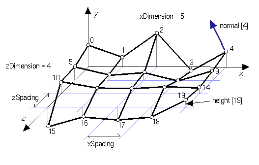

## ElevationGrid

```
ElevationGrid {
  MFFloat height         [ ]    # (-inf, inf)
  SFInt32 xDimension     0      # [0, inf)
  SFFloat xSpacing       1      # [0, inf)
  SFInt32 yDimension     0      # [0, inf)
  SFFloat ySpacing       1      # [0, inf)
  SFFloat thickness      1      # [0, inf)
}
```

### Description

The [ElevationGrid](#elevationgrid) node specifies a uniform rectangular grid of varying height in the *z=0* plane of the local coordinate system.
The geometry is described by a scalar array of height values that specify the height of the surface above each point of the grid.
The [ElevationGrid](#elevationgrid) node is the most appropriate to model an uneven terrain.

### Field Summary

The `xDimension` and `yDimension` fields indicate the number of points in the grid height array in the *x* and *y* directions.
Both `xDimension` and `yDimension` shall be greater than or equal to zero.
If either the `xDimension` or the `yDimension` is less than two, the [ElevationGrid](#elevationgrid) contains no quadrilaterals.
The vertex locations for the quadrilaterals are defined by the `height` field and the `xSpacing` and `ySpacing` fields:

- The `height` field is an `xDimension` by `yDimension` array of scalar values representing the height above the grid for each vertex.

- The `xSpacing` and `ySpacing` fields indicate the distance between vertices in the *x* and *y* directions respectively, and shall be greater than zero.

%figure "ElevationGrid node"



%end

Thus, the vertex corresponding to the point P[i,j] on the grid is placed at:

```
P[i,j].x = xSpacing * i
P[i,j].y = ySpacing * j
P[i,j].z = height[ i + j * xDimension]

where 0 <= i < xDimension and 0 <= j < yDimension,
and P[0,0] is height[0] units above/below the origin of the local
coordinate system
```

The `thickness` field specifies the thickness of the bounding box which is added below the lowest point of the `height` field, to prevent objects from falling through very thin [ElevationGrid](#elevationgrid)s.

When a texture is applied to the elevation grid, the texture is mapped onto the elevation grid (seen from above) with the same orientation as if the image was displayed normally in 2D (along the *x* and *y* axis).
