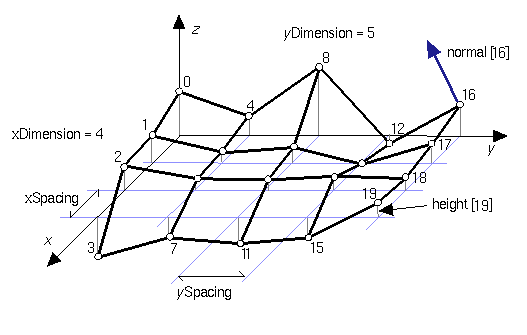

## ElevationGrid

```
ElevationGrid {
  MFFloat height         [ ]    # (-inf, inf)
  SFInt32 xDimension     0      # [0, inf)
  SFFloat xSpacing       1      # [0, inf)
  SFInt32 zDimension     0      # [0, inf)
  SFFloat zSpacing       1      # [0, inf)
  SFFloat thickness      1      # [0, inf)
}
```

### Description

The [ElevationGrid](#elevationgrid) node specifies a uniform rectangular grid of varying height in the *y=0* plane of the local coordinate system.
The geometry is described by a scalar array of height values that specify the height of the surface above each point of the grid.
The [ElevationGrid](#elevationgrid) node is the most appropriate to model an uneven terrain.

### Field Summary

The `xDimension` and `zDimension` fields indicate the number of points in the grid height array in the *x* and *z* directions.
Both `xDimension` and `zDimension` shall be greater than or equal to zero.
If either the `xDimension` or the `zDimension` is less than two, the [ElevationGrid](#elevationgrid) contains no quadrilaterals.
The vertex locations for the quadrilaterals are defined by the `height` field and the `xSpacing` and `zSpacing` fields:

- The `height` field is an `xDimension` by `zDimension` array of scalar values representing the height above the grid for each vertex.

- The `xSpacing` and `zSpacing` fields indicate the distance between vertices in the *x* and *z* directions respectively, and shall be greater than zero.

%figure "ElevationGrid node"



%end

Thus, the vertex corresponding to the point P[i,j] on the grid is placed at:

```
P[i,j].x = xSpacing * i
P[i,j].y = height[ i + j * xDimension]
P[i,j].z = zSpacing * j

where 0 <= i < xDimension and 0 <= j < zDimension,
and P[0,0] is height[0] units above/below the origin of the local
coordinate system
```

The `thickness` field specifies the thickness of the bounding box which is added below the lowest point of the `height` field, to prevent objects from falling through very thin [ElevationGrid](#elevationgrid)s.

### Texture Mapping

The default texture mapping produces a texture that is upside down when viewed from the positive y-axis.
To orient the texture with a more intuitive mapping, use a `TextureTransform` node to reverse the texture coordinate, like this:

```
Shape {
  appearance Appearance {
    textureTransform TextureTransform {
      scale 1 -1
    }
  }
  geometry ElevationGrid {
    ...
  }
}
```

This will produce a compact [ElevationGrid](#elevationgrid) with texture mapping that aligns with the natural orientation of the image.
