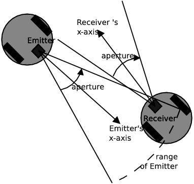

## Emitter

Derived from [Device](device.md) and [Solid](solid.md).

```
Emitter {
  SFString type             "radio"   # {"radio", "serial", "infra-red"}
  SFFloat  range            -1        # {-1, [0, inf)}
  SFFloat  maxRange         -1        # {-1, [0, inf)}
  SFFloat  aperture         -1        # {-1 ,[0, 2*pi]}
  SFInt32  channel          0         # [0, inf)
  SFInt32  baudRate         -1        # {-1, [0, inf)}
  SFInt32  byteSize         8         # [8, inf)
  SFInt32  bufferSize       -1        # {-1, [0, inf)}
  MFInt32  allowedChannels  [ ]       # [0, inf)
}
```

### Description

The [Emitter](#emitter) node is used to model radio, serial or infra-red emitters.
An [Emitter](#emitter) node must be added to the children of a robot or a supervisor.
Please note that an emitter can send data but it cannot receive data.
In order to simulate a unidirectional communication between two robots, one robot must have an [Emitter](#emitter) while the other robot must have a [Receiver](receiver.md).
To simulate a bidirectional communication between two robots, each robot needs to have both an [Emitter](#emitter) and a [Receiver](receiver.md).
Note that messages are never transmitted from one robot to itself.

### Field Summary

- `type`: type of signals: "radio", "serial" or "infra-red".
Signals of type "radio" (the default) and "serial" are transmitted without taking obstacles into account.
Signals of type "infra-red," however, do take potential obstacles between the emitter and the receiver into account.
Any solid object (solid, robots, etc ...) with a defined bounding object is a potential obstacle to an "infra-red" communication.
The structure of the emitting or receiving robot itself will not block an "infra-red" transmission.
Currently, there is no implementation difference between the "radio" and "serial" types.

- `range`: radius of the emission sphere (in meters).
A receiver can only receive a message if it is located within the emission sphere.
A value of -1 (the default) for `range` is considered to be an infinite range.

- `maxRange`: defines the maximum value allowed for `range`.
This field defines the maximum value that can be set using the `wb_emitter_set_range` function.
A value of -1 (the default) for `maxRange` is considered to be infinite.

- `aperture` opening angle of the emission cone (in radians); for "infra-red" only.
The cone's apex is located at the origin ([0 0 0]) of the emitter's coordinate system and the cone's axis coincides with the x-axis of the emitter coordinate system.
An "infra-red" emitter can only send data to receivers currently located within its emission cone.
An `aperture` of -1 (the default) is considered to be infinite, meaning that the emitted signals are omni-directional.
For "radio" and "serial" emitters, this field is ignored.
See [this figure](#illustration-of-aperture-and-range-for-infra-red-emitter-receiver) for an illustration of `range` and `aperture`.

%figure "Illustration of aperture and range for infra-red Emitter/Receiver"



%end

- `channel`: transmission channel.
This is an identification number for an "infra-red" emitter or a frequency for a "radio" emitter.
Normally a receiver must use the same channel as an emitter to receive the emitted data.
However, the special channel -1 allows broadcasting messages on all channels.
Channel 0 (the default) is reserved for communicating with a physics plugin.
For inter-robot communication, please use positive channel numbers.

- `baudRate`: the baud rate is the communication speed expressed in number of bits per second.
A `baudRate` of -1 (the default) is regarded as infinite and causes the data to be transmitted immediately (within one basic time step) from emitter to receiver.

- `byteSize`: the byte size is the number of bits required to transmit one byte of information.
This is usually 8 (the default), but can be more if control bits are used.

- `bufferSize`: specifies the size (in bytes) of the transmission buffer.
The total number of bytes in the packets enqueued in the emitter cannot exceed this number.
A `bufferSize` of -1 (the default) is regarded as unlimited buffer size.

- `allowedChannels`: specifies allowed channels [Emitter](#emitter) is allowed to emit to.
Empty list (default) gives unlimited access.

> **Note**: [Emitter](#emitter) nodes can also be used to communicate with the physics plugin (see [this chapter](physics-plugin.md)).
In this case the channel must be set to 0 (the default).
In addition it is highly recommended to choose -1 for the baudRate, in order to enable the fastest possible communication; the `type, range` and `aperture` will be ignored.

### Emitter Functions

#### `wb_emitter_send`

%tab-component "language"

%tab "C"

```c
#include <webots/emitter.h>

int wb_emitter_send(WbDeviceTag tag, const void *data, int size);
```

%tab-end

%tab "C++"

```cpp
#include "<webots/Emitter.hpp>"

namespace webots {
  class Emitter : public Device {
    virtual int send(const void *data, int size);
    // ...
  }
}
```

%tab-end

%tab "Python"

```python
from controller import Emitter

class Emitter (Device):
    def send(self, data):
    # ...
```

%tab-end

%tab "Java"

```java
import com.cyberbotics.webots.controller.Emitter;

public class Emitter extends Device {
  public int send(byte[] data);
  // ...
}
```

%tab-end

%tab "MATLAB"

```MATLAB
success = wb_emitter_send(tag, data)
```

%tab-end

%tab "ROS"

| name | service/topic | data type | data type definition |
| --- | --- | --- | --- |
| `/<device_name>/send` | `service` | [`webots_ros::set_string`](ros-api.md#common-services) |

%tab-end

%end

##### Description

*send a data packet to potential receivers*

The `wb_emitter_send` function adds to the emitter's queue a packet of `size` bytes located at the address indicated by `data`.
The enqueued data packets will then be sent to potential receivers (and removed from the emitter's queue) at the rate specified by the `baudRate` field of the [Emitter](#emitter) node.
Note that independently from the `baudRate`, the [Emitter](#emitter) node will need at least one basic time step to send the packet but the [Receiver](receiver.md) node will receive it immediately.
Moreover a packet will not be sent to its emitter robot.
This function returns 1 if the message was placed in the sending queue, 0 if the sending queue was full.
The queue is considered to be *full* when the sum of bytes of all the currently enqueued packets exceeds the buffer size specified by the `bufferSize` field.
Note that a packet must have at least 1 byte.

The Emitter/Receiver API does not impose any particular format on the data being transmitted.
Any user chosen format is suitable, as long as the emitter and receiver codes agree.
The following example shows how to send a null-terminated ascii string using the C API:

```c
char message[128];
sprintf(message, "hello%d", i);
wb_emitter_send(tag, message, strlen(message) + 1);
```

And here an example on how to send binary data with the C API:

```c
double array[5] = { 3.0, x, y, -1/z, -5.5 };
wb_emitter_send(tag, array, 5 * sizeof(double));
```

> **Note** [Python]: The `send` function sends a string.
For sending primitive data types into this string, the *struct* module can be used.
This module performs conversions between Python values and C structs represented as Python strings.
Here is an example:

> ```python
> import struct
> #...
> message = struct.pack("chd","a",45,120.08)
> emitter.send(message)
> ```

<!-- -->

> **Note** [Java]: The Java `send` method does not have a `size` argument because the size is implicitly passed with the `data` argument.
Here is an example of sending a Java string in a way that is compatible with a C string, so that it can be received in a C/C++ controller.

> ```java
> String request = "You are number " + num + "\0";
> try {
>   emitter.send(request.getBytes("US-ASCII"));
> }
> catch (java.io.UnsupportedEncodingException e) {
>   System.out.println(e);
> }
> ```

<!-- -->

> **Note** [Matlab]: If you want to send strings you have to convert them to unsigned integer arrays:

> ```MATLAB
>   wb_emitter_send(emitter, uint8('Hello World'));
> ```

---

#### `wb_emitter_set_channel`
#### `wb_emitter_get_channel`

%tab-component "language"

%tab "C"

```c
#include <webots/emitter.h>

#define WB_CHANNEL_BROADCAST -1

void wb_emitter_set_channel(WbDeviceTag tag, int channel);
int wb_emitter_get_channel(WbDeviceTag tag);
```

%tab-end

%tab "C++"

```cpp
#include "<webots/Emitter.hpp>"

namespace webots {
  class Emitter : public Device {
    enum {CHANNEL_BROADCAST};

    virtual void setChannel(int channel);
    int getChannel() const;
    // ...
  }
}
```

%tab-end

%tab "Python"

```python
from controller import Emitter

class Emitter (Device):
    CHANNEL_BROADCAST

    def setChannel(self, channel):
    def getChannel(self):
    # ...
```

%tab-end

%tab "Java"

```java
import com.cyberbotics.webots.controller.Emitter;

public class Emitter extends Device {
  public final static int CHANNEL_BROADCAST;

  public void setChannel(int channel);
  public int getChannel();
  // ...
}
```

%tab-end

%tab "MATLAB"

```MATLAB
WB_CHANNEL_BROADCAST

wb_emitter_set_channel(tag, channel)
channel = wb_emitter_get_channel(tag)
```

%tab-end

%tab "ROS"

| name | service/topic | data type | data type definition |
| --- | --- | --- | --- |
| `/<device_name>/set_channel` | `service` | [`webots_ros::set_int`](ros-api.md#common-services) |
| `/<device_name>/get_channel` | `service` | [`webots_ros::get_int`](ros-api.md#common-services) |

%tab-end

%end

##### Description

*set and get the emitter's channel.*

The `wb_emitter_set_channel` function allows the controller to change the transmission channel.
The target channel must be included in `allowedChannels` or `allowedChannels` should be empty.
This modifies the `channel` field of the corresponding [Emitter](#emitter) node.
Normally, an emitter can send data only to receivers that use the same channel.
However, the special WB\_CHANNEL\_BROADCAST value can be used for broadcasting to all channels.
By switching the channel number an emitter can selectively send data to different receivers.
The `wb_emitter_get_channel` function returns the current channel number of the emitter.

> **Note** [C++, Java, Python]: In the oriented-object APIs, the WB\_CHANNEL\_BROADCAST constant is available as static integer of the [Emitter](#emitter) class (Emitter::CHANNEL\_BROADCAST).

---

#### `wb_emitter_set_range`
#### `wb_emitter_get_range`

%tab-component "language"

%tab "C"

```c
#include <webots/emitter.h>

void wb_emitter_set_range(WbDeviceTag tag, double range);
double wb_emitter_get_range(WbDeviceTag tag);
```

%tab-end

%tab "C++"

```cpp
#include "<webots/Emitter.hpp>"

namespace webots {
  class Emitter : public Device {
    virtual void setRange(double range);
    double getRange() const;
    // ...
  }
}
```

%tab-end

%tab "Python"

```python
from controller import Emitter

class Emitter (Device):
    def setRange(self, range):
    def getRange(self):
    # ...
```

%tab-end

%tab "Java"

```java
import com.cyberbotics.webots.controller.Emitter;

public class Emitter extends Device {
  public void setRange(double range);
  public double getRange();
  // ...
}
```

%tab-end

%tab "MATLAB"

```MATLAB
wb_emitter_set_range(tag, range)
range = wb_emitter_get_range(tag)
```

%tab-end

%tab "ROS"

| name | service/topic | data type | data type definition |
| --- | --- | --- | --- |
| `/<device_name>/set_range` | `service` | [`webots_ros::set_float`](ros-api.md#common-services) |
| `/<device_name>/get_range` | `service` | [`webots_ros::get_float`](ros-api.md#common-services) |

%tab-end

%end

##### Description

*set and get the emitter's range.*

The `wb_emitter_set_range` function allows the controller to change the transmission range at run-time.
Data packets can only reach receivers located within the emitter's range.
This function modifies the `range` field of the corresponding [Emitter](#emitter) node.
If the specified `range` argument is larger than the `maxRange` field of the [Emitter](#emitter) node then the current range will be set to `maxRange`.
The `wb_emitter_get_range` function returns the current emitter's range.
For both the `wb_emitter_set_range` and `emitter_get_range` functions, a value of -1 indicates an infinite range.

---

#### `wb_emitter_get_buffer_size`

%tab-component "language"

%tab "C"

```c
#include <webots/emitter.h>

int wb_emitter_get_buffer_size(WbDeviceTag tag);
```

%tab-end

%tab "C++"

```cpp
#include "<webots/Emitter.hpp>"

namespace webots {
  class Emitter : public Device {
    int getBufferSize() const;
    // ...
  }
}
```

%tab-end

%tab "Python"

```python
from controller import Emitter

class Emitter (Device):
    def getBufferSize(self):
    # ...
```

%tab-end

%tab "Java"

```java
import com.cyberbotics.webots.controller.Emitter;

public class Emitter extends Device {
  public int getBufferSize();
  // ...
}
```

%tab-end

%tab "MATLAB"

```MATLAB
size = wb_emitter_get_buffer_size(tag)
```

%tab-end

%tab "ROS"

| name | service/topic | data type | data type definition |
| --- | --- | --- | --- |
| `/<device_name>/get_buffer_size` | `service` | [`webots_ros::get_int`](ros-api.md#common-services) |

%tab-end

%end

##### Description

*get the transmission buffer size*

The `wb_emitter_get_buffer_size` function returns the size (in bytes) of the transmission buffer.
This corresponds to the value specified by the `bufferSize` field of the [Emitter](#emitter) node.
The buffer size indicates the maximum number of data bytes that the emitter's queue can hold in total, if the size is -1, the number of data bytes is not limited.
When the buffer is full, calls to the `wb_emitter_send` function will fail and return 0.
