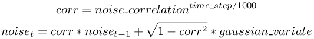

## GPS

Derived from [Device](device.md) and [Solid](solid.md).

```
GPS {
  SFString type             "satellite"   # {"satellite", "laser"}
  SFFloat  accuracy         0             # [0, inf)
  SFFloat  noiseCorrelation 0             # [0, 1]
  SFFloat  resolution       -1            # {-1, [0, inf)}
  SFFloat  speedNoise       0             # [0, inf)
  SFFloat  speedResolution  -1            # {-1, [0, inf)}
}
```

### Description

The [GPS](#gps) node is used to model a Global Positioning Sensor (GPS) which can obtain information about its absolute position from the controller program.

### Field Summary

- `type`: This field defines the type of GPS technology used like "satellite" or "laser" (currently ignored).

- `accuracy`: This field defines the precision of the GPS, that is the standard deviation (expressed in meter) of the gaussian noise added to the position.

- `noiseCorrelation`: If a more accurate gps noise model than the simple gaussian noise is required, this field can be used to define the noise correlation level.
The noise model is then approximated by a gaussian-correlated phenomena, which capture for example the drift phenomena present in GPS.
The value should be between 0 and 1 and represents how much the noise from 1 second ago influence the current noise, 0 means no influence (i.e. no correlation) and 1 means that the noise will be constant (noise fully correlated with the noise from one second ago).
Internally the correlation factor corresponding to the sensor time step is computed and the current noise is estimated using a Gauss-Markov process as described in [this figure](#gauss-markov-process).

%figure "Gauss-Markov process"



%end

- `resolution`: This field allows to define the resolution of the sensor, the resolution is the smallest change that it is able to measure.
Setting this field to -1 (default) means that the sensor has an 'infinite' resolution (it can measure any infinitesimal change).
This field accepts any value in the interval (0.0, inf).

- `speedNoise`: This field defines the standard deviation (expressed in meter) of the gaussian noise added to the speed measurements of the GPS.

- `speedResolution`: This field defines the resolution of the speed measurements, the resolution is the smallest speed change that the GPS is able to measure.
Setting this field to -1 (default) means that the sensor has an 'infinite' resolution (it can measure any infinitesimal change).
This field accepts any value in the interval (0.0, inf).

### GPS Functions

#### `wb_gps_enable`
#### `wb_gps_disable`
#### `wb_gps_get_sampling_period`
#### `wb_gps_get_values`
#### `wb_gps_get_speed`
#### `wb_gps_get_speed_vector`

%tab-component "language"

%tab "C"

```c
#include <webots/gps.h>

void wb_gps_enable(WbDeviceTag tag, int sampling_period);
void wb_gps_disable(WbDeviceTag tag);
int wb_gps_get_sampling_period(WbDeviceTag tag);
const double *wb_gps_get_values(WbDeviceTag tag);
double wb_gps_get_speed(WbDeviceTag tag);
const double *wb_gps_get_speed_vector(WbDeviceTag tag);
```

%tab-end

%tab "C++"

```cpp
#include "<webots/GPS.hpp>"

namespace webots {
  class GPS : public Device {
    virtual void enable(int samplingPeriod);
    virtual void disable();
    int getSamplingPeriod() const;
    const double *getValues() const;
    double getSpeed() const;
    const double *getSpeedVector() const;
    // ...
  }
}
```

%tab-end

%tab "Python"

```python
from controller import GPS

class GPS (Device):
    def enable(self, samplingPeriod):
    def disable(self):
    def getSamplingPeriod(self):
    def getValues(self):
    def getSpeed(self):
    def getSpeedVector(self):
    # ...
```

%tab-end

%tab "Java"

```java
import com.cyberbotics.webots.controller.GPS;

public class GPS extends Device {
  public void enable(int samplingPeriod);
  public void disable();
  public int getSamplingPeriod();
  public double[] getValues();
  public double getSpeed();
  public double[] getSpeedVector();
  // ...
}
```

%tab-end

%tab "MATLAB"

```MATLAB
wb_gps_enable(tag, sampling_period)
wb_gps_disable(tag)
period = wb_gps_get_sampling_period(tag)
x_y_z_array = wb_gps_get_values(tag)
speed = wb_gps_get_speed(tag)
```

%tab-end

%tab "ROS"

| name | service/topic | data type | data type definition |
| --- | --- | --- | --- |
| `/<device_name>/values` | `topic` | [`sensor_msgs::NavSatFix`](http://docs.ros.org/api/sensor_msgs/html/msg/NavSatFix.html) for `WGS84` GPS coordinate system<br/><br/>or<br/><br/>[`geometry_msgs::PointStamped`](http://docs.ros.org/api/geometry_msgs/html/msg/PointStamped.html) for `local` GPS coordinate system | [`Header`](http://docs.ros.org/api/std_msgs/html/msg/Header.html) `header`<br/>[`sensor_msgs/NavSatStatus`](http://docs.ros.org/api/sensor_msgs/html/msg/NavSatStatus.html) `status`<br/>`float64 latitude`<br/>`float64 longitude`<br/>`float64 altitude`<br/>`float64[9] position_covariance`<br/>`uint8 COVARIANCE_TYPE_UNKNOWN=0`<br/>`uint8 COVARIANCE_TYPE_APPROXIMATED=1`<br/>`uint8 COVARIANCE_TYPE_DIAGONAL_KNOWN=2`<br/>`uint8 COVARIANCE_TYPE_KNOWN=3`<br/>`uint8 position_covariance_type`<br/><br/>or<br/><br/>[`Header`](http://docs.ros.org/api/std_msgs/html/msg/Header.html) `header`<br/>`float64 x`<br/>`float64 y`<br/>`float64 z`|
| `/<device_name>/speed` | `topic` | webots_ros::Float64Stamped | [`Header`](http://docs.ros.org/api/std_msgs/html/msg/Header.html) `header`<br/>`float64 data` |
| `/<device_name>/speed_vector` | `topic` | [`geometry_msgs::PointStamped`](http://docs.ros.org/api/geometry_msgs/html/msg/PointStamped.html) | [`Header`](http://docs.ros.org/api/std_msgs/html/msg/Header.html) `header`<br/>`float64 x` <br/>`float64 y`<br/>`float64 z`|
| `/<device_name>/enable` | `service` | [`webots_ros::set_int`](ros-api.md#common-services) | |
| `/<device_name>/get_sampling_period` | `service` | [`webots_ros::get_int`](ros-api.md#common-services) | |

%tab-end

%end

##### Description

*enable, disable and read the GPS measurements*

The `wb_gps_enable` function allows the user to enable GPS measurements.
The `sampling_period` argument specifies the sampling period of the sensor and is expressed in milliseconds.
Note that the first measurement will be available only after the first sampling period elapsed.

The `wb_gps_disable` function turns the GPS off, saving computation time.

The `wb_gps_get_sampling_period` function returns the period given into the `wb_gps_enable` function, or 0 if the device is disabled.

The `wb_gps_get_values` function returns the current [GPS](#gps) measurement.
The values are returned as a 3D-vector, therefore only the indices 0, 1, and 2 are valid for accessing the vector.
The returned vector indicates the absolute position of the [GPS](#gps) device.
This position can either be expressed in the cartesian coordinate system of Webots or using latitude-longitude-altitude, depending on the value of the `gpsCoordinateSystem` field of the [WorldInfo](worldinfo.md) node.
The `gpsReference` field of the [WorldInfo](worldinfo.md) node can be used to define the reference point of the GPS.

The `wb_gps_get_speed` function returns the current [GPS](#gps) speed in meters per second.
If there is no physics node on the parent node, the first returned value will be *NaN*.

The `wb_gps_get_speed_vector` function returns the current [GPS](#gps) speed vector in meters per second.
If there is no physics node on the parent node, the first returned vector will be *NaN*.

> **Note** [C, C++]: The returned vector is a pointer to the internal values managed by the [GPS](#gps) node, therefore it is illegal to free this pointer.
Furthermore, note that the pointed values are only valid until the next call to the `wb_robot_step` or `Robot::step` functions.
If these values are needed for a longer period they must be copied.

<!-- -->

> **Note** [Python]: The `getValues` function returns the 3D-vector as a list containing three floats.

---

#### `wb_gps_get_coordinate_system`

%tab-component "language"

%tab "C"

```c
#include <webots/gps.h>

typedef enum {
  WB_GPS_LOCAL_COORDINATE,
  WB_GPS_WGS84_COORDINATE
} WbGpsCoordinateSystem;

WbGpsCoordinateSystem wb_gps_get_coordinate_system(WbDeviceTag tag);
```

%tab-end

%tab "C++"

```cpp
#include "<webots/GPS.hpp>"

namespace webots {
  class GPS : public Device {
    typedef enum {LOCAL, WGS84} CoordinateSystem;

    const CoordinateSystem getCoordinateSystem() const;
    // ...
  }
}
```

%tab-end

%tab "Python"

```python
from controller import GPS

class GPS (Device):
    LOCAL, WGS84

    def getCoordinateSystem(self):
    # ...
```

%tab-end

%tab "Java"

```java
import com.cyberbotics.webots.controller.GPS;

public class GPS extends Device {
  public final static int LOCAL, WGS84;

  public int getCoordinateSystem();
  // ...
}
```

%tab-end

%tab "MATLAB"

```MATLAB
WB_GPS_LOCAL_COORDINATE, WB_GPS_WGS84_COORDINATE

coordinate_system = wb_gps_get_coordinate_system(tag)
```

%tab-end

%tab "ROS"

| name | service/topic | data type | data type definition |
| --- | --- | --- | --- |
| `/<device_name>/get_coordinate_system` | `service` | [`webots_ros::get_int`](ros-api.md#common-services) | |

%tab-end

%end

##### Description

*get the gps coordinate system*

This function allows the user to retrieve the coordinate system type defined by the `gpsCoordinateSystem` field of the [WorldInfo](worldinfo.md) node.
If the value of the `gpsCoordinateSystem` field is "local" then this function returns WB\_GPS\_LOCAL\_COORDINATE, and otherwise it returns WB\_GPS\_WGS84\_COORDINATE.

---

#### `wb_gps_convert_to_degrees_minutes_seconds`

%tab-component "language"

%tab "C"

```c
#include <webots/gps.h>

const char * wb_gps_convert_to_degrees_minutes_seconds(double decimal_degrees);
```

%tab-end

%tab "C++"

```cpp
#include "<webots/GPS.hpp>"

namespace webots {
  class GPS : public Device {
    static std::string convertToDegreesMinutesSeconds(double decimalDegree);
    // ...
  }
}
```

%tab-end

%tab "Python"

```python
from controller import GPS

class GPS (Device):
    @staticmethod
    def convertToDegreesMinutesSeconds(decimalDegree):
    # ...
```

%tab-end

%tab "Java"

```java
import com.cyberbotics.webots.controller.GPS;

public class GPS extends Device {
  public static String convertToDegreesMinutesSeconds(double decimalDegree);
  // ...
}
```

%tab-end

%tab "MATLAB"

```MATLAB
coordinate = wb_gps_convert_to_degrees_minutes_seconds(decimal_degrees)
```

%tab-end

%tab "ROS"

| name | service/topic | data type | data type definition |
| --- | --- | --- | --- |
| `/<device_name>/decimal_degrees_to_degrees_minutes_seconds` | `service` | `webots_ros::gps_decimal_degrees_to_degrees_minutes_seconds` | `float32 decimalDegrees`<br/>`---`<br/>`string degreesMinutesSeconds` |

%tab-end

%end

##### Description

*convert decimal degrees to degrees minutes seconds*

This function converts a decimal degrees coordinate into a string representing the coordinate in the degrees minutes seconds format.

> **Note**: Your system should support UTF-8 otherwise you may get strange characters instead of the degree, minute and second symbols.

<!-- -->

> **Note** [C]: The returned string should be deallocated by the user.
