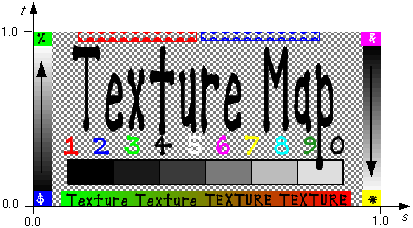

## ImageTexture

```
ImageTexture {
  MFString url       [ ]
  SFBool   repeatS   TRUE   # {TRUE, FALSE}
  SFBool   repeatT   TRUE   # {TRUE, FALSE}
  SFInt32  filtering 4      # [0, 5]
}
```

### Description

The [ImageTexture](#imagetexture) node defines a texture map by specifying an image file and general parameters for mapping to geometry.
Texture maps are defined in a 2D coordinate system *(s,t)* that ranges from 0.0 to 1.0 in both directions.
The bottom edge of the image corresponds to the *s*-axis of the texture map, and left edge of the image corresponds to the *t*-axis of the texture map.
The lower-left pixel of the image corresponds to *s=0, t=0*, and the top-right pixel of the image corresponds to *s=1, t=1*.
These relationships are depicted below.

%figure "Texture map coordinate system"



%end

The texture is read from the file specified by the `url` field.
If the `url` value starts with `http://` or `https://`, Webots will get the file from the web.
Otherwise, the file should be specified with a relative path (cf. [this section](#search-rule-of-the-texture-path)).
Absolute paths work as well, but they are not recommended because they are not portable across systems.
Ideally, the texture file should lie next to the world file, possibly inside a "textures" subfolder.
Supported image formats include both JPEG and PNG.
The rendering of the PNG alpha transparency is supported.
It is strongly recommended to use texture images with power of two resolution (e.g. 8x8, 2048x64, etc.) to optimize memory usage on the GPU and maximize texture quality.
If the width or the height of a texture image is not a power of two, then an internal upscaling is performed and a warning is displayed in the Webots console.

A PNG image may contain an alpha channel.
If such an alpha channel exists, the texture becomes semi-transparent.
This is useful to render for example a scissor cut texture.
Semi-transparent objects are sorted according to their center (the local position of the parent Pose) and are rendered in the same rendering queue as the objects having a transparent material (see the `transparency` field of the [Material](material.md) node).
Semi-transparent objects cannot receive and cannot cast shadows.

If the image contains an alpha channel no texture filtering is performed, otherwise both a trilinear interpolation and an anisotropic texture filtering is applied (the texture is subsampled according to the distance and the angle between the textured polygon and the camera).

The `repeatS` and `repeatT` fields specify how the texture wraps in the *s* and *t* directions.
If `repeatS` is `TRUE` (the default), the texture map is repeated outside the [0.0,1.0] texture coordinate range in the *s* direction so that it fills the shape.
If `repeatS` is `FALSE`, the texture coordinates are clamped in the *s* direction to lie within the [0.0,1.0] range.
The `repeatT` field is analogous to the `repeatS` field.

The `filtering` field defines the level of quality obtained from filtering techniques applied to the texture.
This parameter ranges from 0 to an integer value related to the maximum supported anisotropy level.
This value usually is 5.
If the maximum supported level is exceeded, the filtering level will be silently brought back to the value corresponding to it.
0 corresponds to no filtering, only performing simple nearest-neighbor pixel interpolation.
At 1, simple mipmapping is applied.
From 2 onwards additional anisotropic filtering is applied with an increasing sampling factor.
Using filtering doesn't significantly affect the run-time performance for values up to 4, however it may increase slightly the initialization time due to mipmap generation.
A setting of 0 can produce artifacts caused by aliasing, while low filtering gets rid of such artifacts at the cost of a blurred texture.
Increasing the `filtering` value beyond 1 restores sharpness to distant textures when viewed at extreme angles.

### Search Rule of the Texture Path

The texture path is searched from the corresponding `url` element according to the following rule:

```
i = current_url_index
generic_textures_path = "$WEBOTS_HOME/projects/default/worlds"
if is_absolute(url[i]) then
  if is_existing(url[i])
    return url[i]
  else
    return Error
else
  if defined_in_a_project_PROTO(current_node) and exists(PROTO_path + url[i])
    return PROTO_path + url[i]
  else if exists(world_path + url[i])
    return world_path + url[i]
  else if defined_in_a_webots_PROTO(current_node) and exists(PROTO_path + url[i])
    return PROTO_path + url[i]
  else if exists(generic_textures_path + url[i])
    return generic_textures_path + url[i]
  endif
endif
return Error
```
