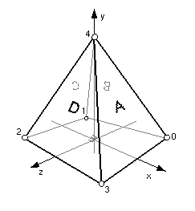

## IndexedFaceSet

```
IndexedFaceSet {
  SFNode  coord           NULL   # {Coordinate, PROTO}
  SFNode  normal          NULL   # {Normal, PROTO}
  SFNode  texCoord        NULL   # {TextureCoordinate, PROTO}
  SFBool  solid           TRUE   # {TRUE, FALSE}
  SFBool  ccw             TRUE   # {TRUE, FALSE}
  SFBool  convex          TRUE   # {TRUE, FALSE}
  SFBool  normalPerVertex TRUE   # {TRUE, FALSE}
  MFInt32 coordIndex      [ ]    # [-1, inf)
  MFInt32 normalIndex     [ ]    # [-1, inf)
  MFInt32 texCoordIndex   [ ]    # [-1, inf)
  SFFloat creaseAngle     0      # [0, inf)
}
```

### Description

The [IndexedFaceSet](#indexedfaceset) node represents a 3D shape formed by constructing faces (polygons) from vertices listed in the `coord` field.
The [IndexedFaceSet](#indexedfaceset) node can be used either as a graphical or as a collision detection primitive (in a boundingObject).
[IndexedFaceSet](#indexedfaceset) nodes can be easily imported from 3D modeling programs after a triangle mesh conversion.

### Field Summary

The `coord` field contains a [Coordinate](coordinate.md) node that defines the 3D vertices referenced by the `coordIndex` field.
[IndexedFaceSet](#indexedfaceset) uses the indices in its `coordIndex` field to specify the polygonal faces by indexing into the coordinates in the [Coordinate](coordinate.md) node.
An index of "-1" indicates that the current face has ended and the next one begins.
The last face may be (but does not have to be) followed by a "-1" index.
If the greatest index in the `coordIndex` field is N, the [Coordinate](coordinate.md) node shall contain N+1 coordinates (indexed as 0 to N).
Each face of the [IndexedFaceSet](#indexedfaceset) shall have:

- at least three non-coincident vertices;
- vertices that define a planar polygon;
- vertices that define a non-self-intersecting polygon.

Otherwise, the results are undefined.

When used for collision detection (boundingObject), each face of the [IndexedFaceSet](#indexedfaceset) must contain exactly three vertices, hence defining a triangle mesh (or trimesh).

If the `normal` field is not NULL, then it must contain a [Normal](normal.md) node.
The normals in that node are applied to the vertices or faces of the [IndexedFaceSet](#indexedfaceset) as follows:

If the `normalPerVertex` field is TRUE, the `normalIndex` is used to determine the normal at each vertex.
The `normalCoordIndex` field must contain at least as many indices as the `coordIndex` field, and must contain end-of-face markers (-1) in exactly the same places as the `coordIndex` field.

If the `normalPerVertex` field is FALSE, each normal defines the normal of one face.

If the `texCoord` field is not NULL, then it must contain a [TextureCoordinate](texturecoordinate.md) node.
The texture coordinates in that node are applied to the vertices of the [IndexedFaceSet](#indexedfaceset) as follows:

If the `texCoordIndex` field is not empty, then it is used to choose texture coordinates for each vertex of the [IndexedFaceSet](#indexedfaceset) in exactly the same manner that the `coordIndex` field is used to choose coordinates for each vertex from the [Coordinate](coordinate.md) node.
The `texCoordIndex` field must contain at least as many indices as the `coordIndex` field, and must contain end-of-face markers (-1) in exactly the same places as the `coordIndex` field.
If the greatest index in the `texCoordIndex` field is N, then there must be N+1 texture coordinates in the [TextureCoordinate](texturecoordinate.md) node.

The `ccw` field indicates whether the vertices are ordered in a counter-clockwise direction when the mesh is viewed from the outside (TRUE).
If the order is clockwise, this field value has to be set to FALSE.
Beware that setting a negative scale may flip all the faces of the [IndexedFaceSet](#indexedfaceset) object.

The `solid` and `convex` fields are currently ignored in Webots.
They provide hints about the mesh shape to optimize certain rendering features: whether it is solid and whether it contains convex faces.

The `creaseAngle` field, affects how default normals are generated.
For example, when an [IndexedFaceSet](#indexedfaceset) has to generate default normals, it uses the `creaseAngle` field to determine which edges should be smoothly shaded and which ones should have a sharp crease.
The crease angle is the positive angle between surface normals on adjacent polygons.
For example, a crease angle of .5 radians means that an edge between two adjacent polygonal faces will be smooth shaded if the normals to the two faces form an angle that is less than .5 radians (about 30 degrees).
Otherwise, it will be faceted.
Crease angles must be greater than or equal to 0.0.

### Example

```
IndexedFaceSet {
  coord Coordinate {
    point [ 1 0 -1, -1 0 -1, -1 0 1, 1 0 1, 0 2 0 ]
  }
  coordIndex [ 0 4 3 -1   # face A, right
               1 4 0 -1   # face B, back
               2 4 1 -1   # face C, left
               3 4 2 -1   # face D, front
               0 3 2  1 ] # face E, bottom
}
```

%figure "A simple IndexedFaceSet example"



%end
