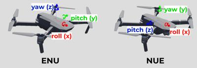

## InertialUnit

Derived from [Device](device.md) and [Solid](solid.md).

```
InertialUnit {
  SFBool  xAxis       TRUE   # {TRUE, FALSE}
  SFBool  zAxis       TRUE   # {TRUE, FALSE}
  SFBool  yAxis       TRUE   # {TRUE, FALSE}
  SFFloat resolution  -1     # {-1, [0, inf)}
  SFFloat noise       0      # {0, [0, 1)}
}
```

### Description

The [InertialUnit](#inertialunit) computes and returns its attitude (*roll*, *pitch* and *yaw* angles) with respect to a global coordinate system defined in the [WorldInfo](worldinfo.md) node.
Note that the returned values correspond to the ground truth attitude of the device.
No sensor fusion or complex calculations are performed in the background to obtain the output values.
If you would like to measure an acceleration or an angular velocity, please use the [Accelerometer](accelerometer.md) or [Gyro](gyro.md) node instead.
The *roll*, *pitch*, and *yaw* angles for ENU and NUE coordinate systems (the `coordinateSystem` field in the [WorldInfo](worldinfo.md) node) are depicted in the picture below.
For the NUE coordinate system, convention is commonly referred to as the *x-z-y* extrinsic sequence; it corresponds to the composition of elemental rotations denoted by YZX.
For the ENU coordinate system, convention is commonly referred to as the *x-y-z* extrinsic sequence; it corresponds to the composition of elemental rotations denoted by ZYX.

> **Note**: To avoid gimbal lock situation you can use the `wb_inertial_unit_get_quaternion` function.

### Field Summary

- `xAxis, yAxis, zAxis`: Each of these boolean fields specifies if the computation should be enabled or disabled for the specified axis.
The `xAxis` field defines whether the *roll* angle should be computed.
The `yAxis` field defines whether the *yaw* angle should be computed.
The `zAxis` field defines whether the *pitch* angle should be computed.
If one of these fields is set to FALSE, then the corresponding angle element will not be computed and it will return *NaN* (Not a Number).
For example if `zAxis` is FALSE, then the second element of the array returned by the `wb_inertial_unit_get_values` function returns *NaN*.
The default is that all three axes are enabled (TRUE).

%figure "Roll, pitch and yaw angles in Webots' Inertial Unit"



%end

- `resolution`: This field allows to define the resolution of the sensor, the resolution is the smallest change that it is able to measure.
Setting this field to -1 (default) means that the sensor has an 'infinite' resolution (it can measure any infinitesimal change).
This field accepts any value in the interval (0.0, inf).

- `noise`: If the noise field is greater than 0.0, a gaussian noise is added to each orientation component, roll, pitch and yaw.
A value of 0.0 corresponds to no noise and thus saves computation time.
A value of 1.0 corresponds to a gaussian noise having a standard derivation of &pi;/2 radians.

### InertialUnit Functions

#### `wb_inertial_unit_enable`
#### `wb_inertial_unit_disable`
#### `wb_inertial_unit_get_sampling_period`
#### `wb_inertial_unit_get_roll_pitch_yaw`
#### `wb_inertial_unit_get_quaternion`
#### `wb_inertial_unit_get_noise`

%tab-component "language"

%tab "C"

```c
#include <webots/inertial_unit.h>

void wb_inertial_unit_enable(WbDeviceTag tag, int sampling_period);
void wb_inertial_unit_disable(WbDeviceTag tag);
int wb_inertial_unit_get_sampling_period(WbDeviceTag tag);
const double *wb_inertial_unit_get_roll_pitch_yaw(WbDeviceTag tag);
const double *wb_inertial_unit_get_quaternion(WbDeviceTag tag);
double wb_inertial_unit_get_noise(WbDeviceTag tag);
```

%tab-end

%tab "C++"

```cpp
#include <webots/InertialUnit.hpp>

namespace webots {
  class InertialUnit : public Device {
    virtual void enable(int samplingPeriod);
    virtual void disable();
    int getSamplingPeriod() const;
    const double *getRollPitchYaw() const;
    const double *getQuaternion() const;
    double getNoise() const;
    // ...
  }
}
```

%tab-end

%tab "Python"

```python
from controller import InertialUnit

class InertialUnit (Device):
    def enable(self, samplingPeriod):
    def disable(self):
    def getSamplingPeriod(self):
    def getRollPitchYaw(self):
    def getQuaternion(self):
    def getNoise(self):
    # ...
```

%tab-end

%tab "Java"

```java
import com.cyberbotics.webots.controller.InertialUnit;

public class InertialUnit extends Device {
  public void enable(int samplingPeriod);
  public void disable();
  public int getSamplingPeriod();
  public double[] getRollPitchYaw();
  public double[] getQuaternion();
  public double getNoise();
  // ...
}
```

%tab-end

%tab "MATLAB"

```MATLAB
wb_inertial_unit_enable(tag, sampling_period)
wb_inertial_unit_disable(tag)
period = wb_inertial_unit_get_sampling_period(tag)
roll_pitch_yaw_array = wb_inertial_unit_get_roll_pitch_yaw(tag)
quaternion_array = wb_inertial_unit_get_quaternion(tag)
noise = wb_inertial_unit_get_noise(tag)
```

%tab-end

%tab "ROS"

| name | service/topic | data type | data type definition |
| --- | --- | --- | --- |
| `/<device_name>/quaternion` | `topic` | [`sensor_msgs::Imu`](http://docs.ros.org/api/sensor_msgs/html/msg/Imu.html) | [`Header`](http://docs.ros.org/api/std_msgs/html/msg/Header.html) `header`<br/>[`geometry_msgs/Quaternion`](http://docs.ros.org/api/geometry_msgs/html/msg/Quaternion.html) `orientation`<br/>`float64[9] orientation_covariance`<br/>[`geometry_msgs/Vector3`](http://docs.ros.org/api/geometry_msgs/html/msg/Vector3.html) `angular_velocity`<br/>`float64[9] angular_velocity_covariance`<br/>[`geometry_msgs/Vector3`](http://docs.ros.org/api/geometry_msgs/html/msg/Vector3.html) `linear_acceleration`<br/>`float64[9] linear_acceleration_covariance`<br/><br/>Note: only the orientation is filled in |
| `/<device_name>/enable` | `service` | [`webots_ros::set_int`](ros-api.md#common-services) | |
| `/<device_name>/get_sampling_period` | `service` | [`webots_ros::get_int`](ros-api.md#common-services) | |
| `/<device_name>/get_noise` | `service` | [`webots_ros::get_float`](ros-api.md#common-services) | |


%tab-end

%end

##### Description

*enable, disable and read the output values of the inertial unit*

The `wb_inertial_unit_enable` function turns on the angle measurements.
The `sampling_period` argument specifies the sampling period of the sensor and is expressed in milliseconds.
Note that the first measurement will be available only after the first sampling period elapsed.

The `wb_inertial_unit_disable` function turns off the [InertialUnit](#inertialunit) device.

The `wb_inertial_unit_get_sampling_period` function returns the period given into the `wb_inertial_unit_enable` function, or 0 if the device is disabled.

The `wb_inertial_unit_get_roll_pitch_yaw` function returns the current *roll*, *pitch* and *yaw* angles of the [InertialUnit](#inertialunit).
The values are returned as an array of 3 components therefore only the indices 0, 1, and 2 are valid for accessing the returned array.
Note that the indices 0, 1 and 2 return the *roll*, *pitch* and *yaw* angles respectively.

The `wb_inertial_unit_get_quaternion` function returns the current orientation of the [InertialUnit](#inertialunit) expressed as a quaternion.
The values are returned as an array of 4 components therefore only the indices 0, 1, 2, and 3 are valid for accessing the returned array.
Note that the indices 0, 1, 2, and 3 return the *x*, *y*, *z*, and *w* components respectively.

The `wb_inertial_unit_get_noise` function returns value of `noise` field. 

The *roll* angle indicates the unit's rotation angle about its x-axis, in the interval [-&pi;,&pi;].
The *roll* angle is zero when the [InertialUnit](#inertialunit) is horizontal, i.e., when its y-axis has the opposite direction of the gravity ([WorldInfo](worldinfo.md) defines the coordinate system).

The *pitch* angle indicates the unit's rotation angle about is z-axis, in the interval [-&pi;/2,&pi;/2].
The *pitch* angle is zero when the [InertialUnit](#inertialunit) is horizontal, i.e., when its y-axis has the opposite direction of the gravity.
If the [InertialUnit](#inertialunit) is placed on the [Robot](robot.md) with a standard orientation, then the *pitch* angle is negative when the [Robot](robot.md) is going down, and positive when the robot is going up.

The *yaw* angle indicates the unit orientation, in the interval [-&pi;,&pi;], with respect to [WorldInfo](worldinfo.md).`coordinateSystem`.
The *yaw* angle is zero when the [InertialUnit](#inertialunit)'s x-axis is aligned with the north direction, it is &pi;/2 when the unit is heading east, and -&pi;/2 when the unit is oriented towards the west.
The *yaw* angle can be used as a compass.

> **Note** [C, C++]: The returned vector is a pointer to internal values managed by the Webots, therefore it is illegal to free this pointer.
Furthermore, note that the pointed values are only valid until the next call to the `wb_robot_step` or `Robot::step` functions.
If these values are needed for a longer period they must be copied.

<!-- -->

> **Note** [Python]: The `getRollPitchYaw` function returns the angles as a list containing three floats.

<!-- -->

> **Note** [ROS]: The `/<device_name>/quaternion` topic publishes quaternions that follow ROS coordinate system convention when `coordinateSystem` in [WorldInfo](worldinfo.md) is set to `ENU`.
