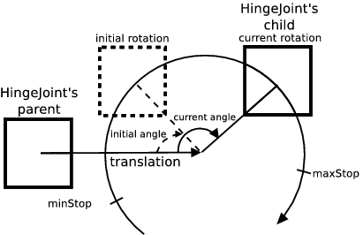
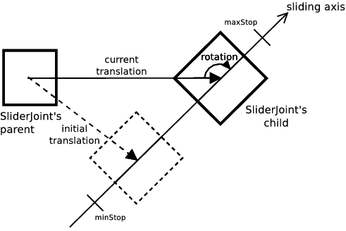
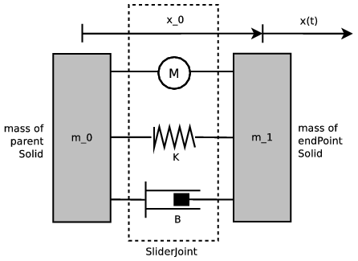

## JointParameters

```
JointParameters {
  SFFloat position        0       # (-inf, inf)
  SFVec3f axis            0 0 1   # unit axis
  SFFloat minStop         0       # (-inf, inf)
  SFFloat maxStop         0       # (-inf, inf)
  SFFloat springConstant  0       # [0, inf)
  SFFloat dampingConstant 0       # [0, inf)
  SFFloat staticFriction  0       # [0, inf)
}
```

> **Note**: The axis field may change in a derived class.
For instance, the axis default value of an [HingeJointParameters](hingejointparameters.md) is `1 0 0`, and there is no `axis` field in a [BallJointParameters](balljointparameters.md)

### Description

The [JointParameters](#jointparameters) node is a concrete base node used to specify various joint parameters related to an axis along which, or around which, the motion is allowed.
As an instantiated node it can be used within the jointParameters field of [SliderJoint](sliderjoint.md) or within the jointParameters2 field of [Hinge2Joint](hinge2joint.md) or [BallJointParameters](balljointparameters.md) and jointParameters3 field of [BallJointParameters](balljointparameters.md).
Unlike the other joint parameters node, it has no anchor.

### Field Summary

- The `position` field represents the current *position* of the joint, in radians or meters.
For an hinge or ball, it is the current rotation angle in radians.
For a slider, it is the magnitude of the current translation in meters.
When changing the `position` field from the Webots scene tree, Webots also changes the corresponding `rotation` (for a hinge or ball) or `translation` (for a slider) field in the `endPoint` solid of the parent joint node to keep the consistency of the model.
Similarly, when changing the `position` field of a [JointParameters](#jointparameters) node in a text editor, you should take care of also changing the corresponding `rotation` or `translation` field accordingly.

- The `minStop` and `maxStop` fields specify the position of physical (or mechanical) stops.
These fields are described in more detail in the [Joint Limits section](#joint-limits), see below.

- The `springConstant` and `dampingConstant` fields allow the addition of spring and/or damping behavior to the joint.
These fields are described in more detail in the "Springs and Dampers" section, see below.

- The `staticFriction` field defines add a simple static friction force opposed to the joint motion.

### Units

The position of a rotational joint ([HingeJoint](hingejoint.md), [Hinge2Joint](hinge2joint.md) or [BallJoint](balljoint.md)) is expressed in *radians* while the position of a linear joint ([SliderJoint](sliderjoint.md)) is expressed in *meters*.
See [this table](#joint-units):

%figure "Joint Units"

|  &nbsp;  | Rotational    | Linear     |
| -------- | ------------- | ---------- |
| Position | rad (radians) | m (meters) |

%end

### Initial Transformation and Position

%figure "HingeJoint"



%end

%figure "SliderJoint"



%end

The `position` field is a scalar representing an angle (in radians) or a distance (in meters) computed with respect to the initial `translation` and `rotation` of the [Joint](joint.md)'s [Solid](solid.md) child.
If its value is zero, then the [Joint](joint.md)'s child is *by definition* set with its initial `translation` and `rotation`.
For a joint with one, two or three rotational degrees of freedom (e.g., [HingeJoint](hingejoint.md), [Hinge2Joint](hinge2joint.md), [BallJoint](balljoint.md)), the `position` field value is the rotation angle around one of the joint axes that was applied to the [Joint](joint.md)'s child initially in zero position.
For a slider joint, `position` is the translation length along the sliding axis that was applied to the [Joint](joint.md)'s child initially in zero position.

For example if we have a [HingeJoint](hingejoint.md) and a `position` field value of 1.5708, this means that this [HingeJoint](joint.md) is 90 degrees from its initial rotation with respect to the hinge rotation axis.
The values passed to the `wb_motor_set_position` function are specified with respect to the zero position.
The values of the `minStop` and `maxStop` fields are also defined with respect to the zero position.

### Joint Limits

The `minStop` and `maxStop` fields define the *hard limits* of the joint.
Hard limits represent physical (or mechanical) bounds that cannot be overrun by any force; they are defined with respect to the joint `position`.
Hard limits can be used, for example, to simulate both end caps of a hydraulic or pneumatic piston or to restrict the range of rotation of a hinge.
When used for a rotational motion the value of `minStop` must be in the range [-&pi;, 0] and `maxStop` must be in the range [0, &pi;].
When both `minStop` and `maxStop` are zero (the default), the hard limits are deactivated.
The joint hard limits use ODE joint stops (for more information see the ODE documentation on `dParamLoStop` and `dParamHiStop`).

Finally, note that when both soft (`minPosition` and `maxPosition`, see the [Motor](motor.md)'s "Motor Limits" section) and hard limits (`minStop` and `maxStop`) are activated, the range of the soft limits must be included in the range of the hard limits, such that `minStop <= minPosition` and `maxStop >= maxPosition`.

### Springs and Dampers

The `springConstant` field specifies the value of the spring constant (or spring stiffness), usually denoted as *K*.
The `springConstant` must be positive or zero.
If the `springConstant` is zero (the default), no spring torque/force will be applied to the joint.
If the `springConstant` is greater than zero, then a spring force will be computed and applied to the joint in addition to the other forces (i.e., motor force, damping force).
In case of a linear joint it is expressed in *N/m* and the spring force is calculated according to Hooke's law: *F = -Kx*, where *K* is the `springConstant` and *x* is the current joint position as represented by the `position` field.
Therefore, the spring force is computed so as to be proportional to the current joint position, and to move the joint back to its initial position.
Similarly, in case of a rotational joint, the spring constant is expressed in *N.m/rad* and the resulting torque *T* is computed in from this formula: *T = -Kx*.
When designing a robot model that uses springs, it is important to remember that the spring's resting position for each joint will correspond to the initial position of the joint.
The only exception arises when the closest upper [Solid](solid.md) of the [Joint](joint.md) is passive, i.e. the `physics` field is not defined.
In this case the spring force direction is inverted.

The `dampingConstant` field specifies the value of the joint damping constant.
The value of `dampingConstant` must be positive or zero.
If `dampingConstant` is zero (the default), no damping torque/force will be added to the joint.
If `dampingConstant` is greater than zero, a damping torque/force will be applied to the joint in addition to the other forces (i.e., motor force, spring force).
This damping torque/force *F* is proportional to the effective joint velocity: *F = -Bv*, where *B* is the damping constant, and *v = dx/dt* is the effective joint velocity computed by the physics simulator.
The unit of the damping constant for a rotational joint is expressed in *N.m.s/rad* whereas the unit of the damping constant for a linear joint is expressed in *N.s/m*.

%figure "Mechanical Diagram of a Slider Joint"



%end

As you can see in (see [this figure](#mechanical-diagram-of-a-slider-joint)), a [Joint](joint.md) creates a joint between two masses *m<sub>0</sub>* and *m<sub>1</sub>*.
The mass *m<sub>0</sub>* is defined by the [Physics](physics.md) node in the closest upper [Solid](solid.md) of the [Joint](joint.md).
The mass *m<sub>1</sub>* is defined by the [Physics](physics.md) node of the [Solid](solid.md) placed into the `endPoint` of the [Joint](joint.md).
The value *x<sub>0</sub>* corresponds to the anchor position of the [Joint](joint.md) defined in the `anchor` field of a [JointParameters](#jointparameters) node.
The position *x* corresponds to the current position of the [Joint](joint.md) defined in the `position` field of a [JointParameters](#jointparameters) node.
