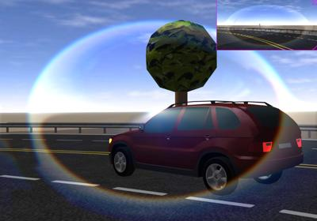

## LensFlare

```
LensFlare {
  SFFloat transparency      0.4    # [0, 1]
  SFFloat scale             1.5    # (-inf, inf)
  SFFloat bias             -0.9    # (-inf, inf)
  SFFloat dispersal         0.6    # (-inf, inf)
  SFInt32 samples           4      # [0, inf)
  SFFloat haloWidth         0.4    # [0, inf)
  SFFloat chromaDistortion  2.0    # (-inf, inf)
  SFInt32 blurIterations    2      # [0, inf)
}
```

### Description

%figure "Lens flare effect"



%end

The [LensFlare](#lensflare) node can be added in the `lensFlare` field of any [Camera](camera.md) or [Viewpoint](viewpoint.md) to simulate lens flares.
The lens flare effect is due to the light being scattered in lens systems through generally unwanted image formation mechanisms, such as internal reflections and scattering from material inhomogeneities in the lens.
To simulate a lens flare, a post-processing shader that generates ghosts and halos is applied to the render, which can be tweaked with the parameters to achieve the desired effect.

### Field Summary

- The `transparency` field specifies the blending between the lens flare and the corresponding render (viewpoint or camera).

- The `scale` field specifies the strength of the lens flare.

- The `bias` field specifies the intensity threshold for lens flare features generation.

- The `dispersal` field specifies the dispersal of the ghost samples.

- The `samples` field specifies how many samples are taken to generate the ghosts.

- The `haloWidth` field specifies the lens flare halo width.

- The `chromaDistortion` field specifies the amount of chromatic distortion induced by the lens.

- The `blurIterations` field specifies the amount of blur that is applied to the lens flare.
