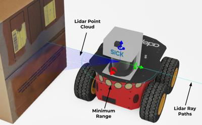

## Lidar

Derived from [Device](device.md) and [Solid](solid.md).

```
Lidar {
  SFFloat  tiltAngle            0.0           # [-pi/2, pi/2]
  SFInt32  horizontalResolution 512           # [0, inf)
  SFFloat  fieldOfView          1.5708        # [0, 2*pi]
  SFFloat  verticalFieldOfView  0.2           # [0, pi]
  SFInt32  numberOfLayers       4             # [0, inf)
  SFFloat  near                 0.01          # [0, inf)
  SFFloat  minRange             0.01          # [near, inf)
  SFFloat  maxRange             1.0           # [minRange, inf)
  SFString type                 "fixed"       # {"fixed", "rotating"}
  SFString projection           "cylindrical" # {"planar", "cylindrical"}
  SFFloat  noise                0.0           # [0, inf)
  SFFloat  resolution           -1.0          # {-1, [0, inf)}
  SFFloat  defaultFrequency     10            # [minFrequency, maxFrequency]
  SFFloat  minFrequency         1             # [0, maxFrequency)
  SFFloat  maxFrequency         25            # [minFrequency, inf)
  SFNode   rotatingHead         NULL          # {Solid (or derived), PROTO}
}
```

### Description

%figure "Lidar Image"



%end

The [Lidar](#lidar) node is used to model a robot's on-board lidar (laser-scanner).

The lidar measures depth information (in meters) from an OpenGL rendering, like the [RangeFinder](rangefinder.md) node does.
Whereas a [RangeFinder](rangefinder.md) node is used to simulate a depth camera (like for example a Kinect), the [Lidar](#lidar) node is used to simulate laser scans.
The main difference is that for the [RangeFinder](rangefinder.md) node the vertical field of view is imposed by the size (width and height) of the image (because of the constraint of square pixels) and not in the case of the [Lidar](#lidar) node where lines of pixels (laser scan) are extracted from the depth buffer.

Lidar detects semi-transparent objects as if they were not transparent.
An object can be semi-transparent either if its texture has an alpha channel, or if its [Material](material.md) `transparency` field is not equal to 1.

By default the [Lidar](#lidar) node outputs the depth values in an array, the depth values are order from left to right and from the top to the bottom layer (like a [RangeFinder](rangefinder.md) node does).
Complementary the point cloud mode can be enabled thanks to the [`wb_lidar_enable_point_cloud`](#wb_lidar_enable) function.
It is then possible to call the [`wb_lidar_get_point_cloud`](#wb_lidar_get_point_cloud) to get the lidar output as a point cloud (array of points).
Be aware that the point cloud mode is computationally expensive and can therefore slow-down the simulation speed.

#### WbLidarPoint

A point of the lidar point cloud is defined like this:

%tab-component "language"

%tab "C"

```c
typedef struct {
  float x;
  float y;
  float z;
  int layer_id;
  float time;
} WbLidarPoint;
```

%tab-end

%tab "C++"

```cpp
#include <webots/Lidar.hpp>

namespace webots {
  typedef struct {
    float x;
    float y;
    float z;
    int layer_id;
    float time;
  } LidarPoint;
}
```

%tab-end

%tab "Python"

```python
from controller import LidarPoint

class LidarPoint:
    @property
    x, y, z, layer_id, time
```

%tab-end

%tab "Java"

```java
import com.cyberbotics.webots.controller.LidarPoint;

public class LidarPoint {
  public float getX();
  public float getY();
  public float getZ();
  public int getLayerId();
  public float getTime();
}
```

%tab-end

%tab "MATLAB"

```MATLAB
structs.WbLidarPoint.members = struct(
  'x', 'single',
  'y', 'single',
  'z', 'single',
  'layer_id', 'int32',
  'time', 'single'
);
```

%tab-end

%tab "ROS"

> `LidarPoint` data is directly accessible from the related [topics](#wb_lidar_get_point_cloud).

%tab-end

%end

The X, Y and Z coordinates are relative to the [Lidar](#lidar) node origin.
The `layer_id` field specifies to which layer this point belongs to (from 0 to `numberOfLayers` - 1) and the `time` field specifies the exact time at which the point was acquired.
With lidar devices, all the points are not acquired at the exact same time but rather sequentially.

### Field Summary

- The `tiltAngle` field defines the tilt angle of the sensor (rotation around the x-axis of to the [Lidar](#lidar) node).

- The `horizontalResolution` field defines the number of points returned by layers.

- The `fieldOfView` field defines the horizontal field of view angle of the lidar.
The value is limited to the range 0 to &pi; radians if the `projection` field is set to "planar", otherwise there is no upper limit.

- The `verticalFieldOfView` field defines the vertical repartition of the layers (angle between first and last layer).

- The `numberOfLayers` field defines the number of layers (number of lasers).

- The `near` field defines the distance from the depth camera (used internally by the lidar) to the near clipping plane.
Objects closer to the lidar than the near value are not detected by the lidar.
This plane is parallel to the camera retina (i.e., projection plane).
The near field determines the precision of the OpenGL depth buffer.
A too big value produces underestimated distance values.
A typically good value for this field is to set it just big enough so that the shape of the lidar object is not visible.
More information about the frustum is provided in the [frustum](camera.md#frustum) section of the [Camera](camera.md) node.

- The `minRange` field defines the minimum range of the lidar, objects closer to the lidar than the minimum range are not detected (but still occlude other objects).
If the range value is smaller than the `minRange` value then infinity is returned.

- The `maxRange` field defines the distance between the lidar and the far clipping plane of the OpenGL view frustum.
This field defines the maximum range that the lidar can achieve and so the maximum possible value of the range image (in meter).
If the range value is bigger than the `maxRange` value then infinity is returned.

- The `type` field should either be 'fixed' or 'rotating', it defines if the lidar has a rotating or fixed head.

- `projection`: switch between a planar or a cylindrical projection.
It is highly recommended to use the cylindrical projection in case of fixed-head lidar.
More information on cylindrical projections is provided in the [projections](camera.md#spherical-and-cylindrical-projections) section of the [Camera](camera.md) node.
The "spherical" projection is not available for a lidar device.

- If the `noise` field is greater than 0.0, a gaussian noise is added to each depth value of a lidar image.
A value of 0.0 corresponds to no noise and thus saves computation time.
A value of 1.0 corresponds to a gaussian noise having a standard derivation of `maxRange` meters.

- The `resolution` field defines the depth resolution of the lidar, that is the smallest depth difference that it is able to measure.
Setting this field to -1 (default) corresponds to an 'infinite' resolution (it can measure any infinitesimal change).
This field accepts any value in the interval (0.0, inf).

- The `defaultFrequency` field defines the default rotation frequency (defined in Hz) of the head if the `type` field is set to 'rotating'.
The value of this field should be smaller or equal to the value of the `maxFrequency` field and bigger or equal to the value of the `minFrequency` field.

- The `minFrequency` field defines the minimum rotation frequency (defined in Hz) of the head if the `type` field is set to 'rotating'.

- The `maxFrequency` field defines the maximum rotation frequency (defined in Hz) of the head if the `type` field is set to 'rotating'.

- A node can be inserted in the `rotatingHead` field to define the rotating head of the lidar.

> **Note**: The fields `numberOfLayers`, `verticalFieldOfView`, `horizontalResolution` and `fieldOfView` should respect the following constraint in order to be able to simulate the lidar:
> ```
> numberOfLayers < verticalFieldOfView * horizontalResolution / fieldOfView
> ```
> In case of 'rotating' lidar, the `fieldOfView` term in the constraint is replaced by 2 * &pi;.

#### Rotating Lidar

A lidar is said rotating if its `type` field is set to 'rotating'.
In that case, the node inserted in the `rotatingHead` rotates along the y-axis at the frequency defined in the `defaultFrequency` field.
This rotation starts as soon as the lidar is enabled.
The internal depth camera is attached to this node and is therefore also rotating along the y-axis.

> **Note**: The internal depth camera is using a horizontal field of view defined in the `fieldOfView` field, but since it is rotating, the actual field of view is 2 * &pi;.

> **Note**: If the resulting point cloud of a rotating lidar looks distorted, it probably means that you have to reduce the simulation time step.

### Lidar Functions

#### `wb_lidar_enable`
#### `wb_lidar_disable`
#### `wb_lidar_get_sampling_period`

%tab-component "language"

%tab "C"

```c
#include <webots/lidar.h>

void wb_lidar_enable(WbDeviceTag tag, int sampling_period);
void wb_lidar_disable(WbDeviceTag tag);
int wb_lidar_get_sampling_period(WbDeviceTag tag);
```

%tab-end

%tab "C++"

```cpp
#include <webots/Lidar.hpp>

namespace webots {
  class Lidar : public Device {
    virtual void enable(int samplingPeriod);
    virtual void disable();
    int getSamplingPeriod() const;
    // ...
  }
}
```

%tab-end

%tab "Python"

```python
from controller import Lidar

class Lidar (Device):
    def enable(self, samplingPeriod):
    def disable(self):
    def getSamplingPeriod(self):
    # ...
```

%tab-end

%tab "Java"

```java
import com.cyberbotics.webots.controller.Lidar;

public class Lidar extends Device {
  public void enable(int samplingPeriod);
  public void disable();
  public int getSamplingPeriod();
  // ...
}
```

%tab-end

%tab "MATLAB"

```MATLAB
wb_lidar_enable(tag, sampling_period)
wb_lidar_disable(tag)
period = wb_lidar_get_sampling_period(tag)
```

%tab-end

%tab "ROS"

| name | service/topic | data type | data type definition |
| --- | --- | --- | --- |
| `/<device_name>/enable` | `service` | [`webots_ros::set_int`](ros-api.md#common-services) | |
| `/<device_name>/get_sampling_period` | `service` | [`webots_ros::get_int`](ros-api.md#common-services) | |

%tab-end

%end

##### Description

*enable and disable lidar updates*

The `wb_lidar_enable` function allows the user to enable lidar updates.
Once the lidar is enabled, it will copy range images from GPU memory to CPU memory at each time step, regardless of `wb_lidar_get_range_image` calls.

The `sampling_period` argument specifies the sampling period of the sensor and is expressed in milliseconds.
Note that the first measurement will be available only after the first sampling period elapsed.

The `wb_lidar_disable` function turns the lidar off, saving computation time.

The `wb_lidar_get_sampling_period` function returns the period given into the `wb_lidar_enable` function, or 0 if the device is disabled.

---

#### `wb_lidar_enable_point_cloud`
#### `wb_lidar_disable_point_cloud`
#### `wb_lidar_is_point_cloud_enabled`

%tab-component "language"

%tab "C"

```c
#include <webots/lidar.h>

void wb_lidar_enable_point_cloud(WbDeviceTag tag);
void wb_lidar_disable_point_cloud(WbDeviceTag tag);
bool wb_lidar_is_point_cloud_enabled(WbDeviceTag tag);
```

%tab-end

%tab "C++"

```cpp
#include <webots/Lidar.hpp>

namespace webots {
  class Lidar : public Device {
    void enablePointCloud();
    void disablePointCloud();
    bool isPointCloudEnabled() const;
    // ...
  }
}
```

%tab-end

%tab "Python"

```python
from controller import Lidar

class Lidar (Device):
    def enablePointCloud(self):
    def disablePointCloud(self):
    def isPointCloudEnabled(self):
    # ...
```

%tab-end

%tab "Java"

```java
import com.cyberbotics.webots.controller.Lidar;

public class Lidar extends Device {
  public void enablePointCloud();
  public void disablePointCloud();
  public boolean isPointCloudEnabled();
  // ...
}
```

%tab-end

%tab "MATLAB"

```MATLAB
wb_lidar_enable_point_cloud(tag)
wb_lidar_disable_point_cloud(tag)
state = wb_lidar_is_point_cloud_enabled(tag)
```

%tab-end

%tab "ROS"

| name | service/topic | data type | data type definition |
| --- | --- | --- | --- |
| `/<device_name>/enable_point_cloud` | `service` | [`webots_ros::set_bool`](ros-api.md#common-services) | |
| `/<device_name>/is_point_cloud_enabled` | `service` | `webots_ros::node_get_status` | `uint8 ask`<br/>`---`<br/>`uint8 status` |

%tab-end

%end

##### Description

*enable and disable lidar point cloud mode*

The `wb_lidar_enable_point_cloud` function allows the user to enable the lidar point cloud update, the point cloud array is then updated with the same sampling period as the range image.

The `wb_lidar_disable_point_cloud` function allows the user to disable the lidar point cloud update.

The `wb_lidar_is_point_cloud_enabled` function returns true if the point cloud update is enabled or false otherwise.

> **Note**: To get the point cloud array, enabling the point cloud is not sufficient.
First the lidar should be enabled using the `wb_lidar_enable` function.

---

#### `wb_lidar_get_range_image`
#### `wb_lidar_get_layer_range_image`

%tab-component "language"

%tab "C"

```c
#include <webots/lidar.h>

const float *wb_lidar_get_range_image(WbDeviceTag tag);
const float *wb_lidar_get_layer_range_image(WbDeviceTag tag, int layer);
```

%tab-end

%tab "C++"

```cpp
#include <webots/Lidar.hpp>

namespace webots {
  class Lidar : public Device {
    const float *getRangeImage() const;
    const float *getLayerRangeImage(int layer) const;
    // ...
  }
}
```

%tab-end

%tab "Python"

```python
from controller import Lidar

class Lidar (Device):
    def getRangeImage(self):
    def getLayerRangeImage(self, layer):
    # ...
```

%tab-end

%tab "Java"

```java
import com.cyberbotics.webots.controller.Lidar;

public class Lidar extends Device {
  public float[] getRangeImage();
  public float[] getLayerRangeImage(int layer);
  // ...
}
```

%tab-end

%tab "MATLAB"

```MATLAB
range = wb_lidar_get_range_image(tag)
range = wb_lidar_get_layer_range_image(tag, layer)
```

%tab-end

%tab "ROS"

| name | service/topic | data type | data type definition |
| --- | --- | --- | --- |
| `/<device_name>/range_image` | `topic` | [`sensor_msgs::Image`](http://docs.ros.org/api/sensor_msgs/html/msg/Image.html) | [`Header`](http://docs.ros.org/api/std_msgs/html/msg/Header.html) `header`<br/>`uint32 height`<br/>`uint32 width`<br/>`string encoding`<br/>`uint8 is_bigendian`<br/>`uint32 step`<br/>`uint8[] data` |

%tab-end

%end

##### Description

*get the range image and range image associated with a specific layer*

The `wb_lidar_get_range_image` function allows the user to read the contents of the last range image grabbed by a lidar.
It should not be called if the lidar was in point cloud mode during the most recent step.
The range image is computed using the depth buffer produced by the OpenGL rendering.
The range image is coded as an array of single precision floating point values corresponding to the range value of each pixel of the image.
The precision of the lidar values decreases when the objects are located farther from the near clipping plane.
Pixels are stored in scan lines running from left to right and from first to last layer.
The memory chunk returned by this function shall not be freed, as it is managed by the lidar internally.
The contents of the image are subject to change between a call to `wb_robot_step_begin` and the subsequent call to `wb_robot_step_end`.
As a result, if you want to access the image during a step, you should copy it before the step begins and access the copy.
The size in bytes of the range image can be computed as follows:

```
size = lidar_horizontal_resolution * lidar_number_of_layers * sizeof(float)
```

Attempting to read outside the bounds of this memory chunk will cause an error.

The `wb_lidar_get_layer_range_image` function is a convenient way of getting directly the sub range image associated with one layer.

> **Note** [Python]: The Lidar class has two methods for getting the lidar image.
The `getRangeImage` function returns a one-dimensional list of floats, while the `getRangeImageArray` function returns a two-dimensional list of floats.
Their content are identical but their handling is of course different.

---

#### `wb_lidar_get_point_cloud`
#### `wb_lidar_get_layer_point_cloud`
#### `wb_lidar_get_number_of_points`

%tab-component "language"

%tab "C"

```c
#include <webots/lidar.h>

const WbLidarPoint *wb_lidar_get_point_cloud(WbDeviceTag tag);
const WbLidarPoint *wb_lidar_get_layer_point_cloud(WbDeviceTag tag, int layer);
int wb_lidar_get_number_of_points(WbDeviceTag tag);
```

%tab-end

%tab "C++"

```cpp
#include <webots/Lidar.hpp>

namespace webots {
  class Lidar : public Device {
    const LidarPoint *getPointCloud() const;
    const LidarPoint *getLayerPointCloud(int layer) const;
    int getNumberOfPoints() const;
    // ...
  }
}
```

%tab-end

%tab "Python"

```python
from controller import Lidar

class Lidar (Device):
    def getPointCloud(self, data_type='list'):
    def getLayerPointCloud(self, layer, data_type='list'):
    def getNumberOfPoints(self):
    # ...
```

%tab-end

%tab "Java"

```java
import com.cyberbotics.webots.controller.Lidar;

public class Lidar extends Device {
  public LidarPoint[] getPointCloud();
  public LidarPoint[] getLayerPointCloud(int layer);
  public int getNumberOfPoints();
  // ...
}
```

%tab-end

%tab "MATLAB"

```MATLAB
points = wb_lidar_get_point_cloud(tag)
points = wb_lidar_get_layer_point_cloud(tag, layer)
number_of_points = wb_lidar_get_number_of_points(tag)
```

%tab-end

%tab "ROS"

| name | service/topic | data type | data type definition |
| --- | --- | --- | --- |
| `/<device_name>/point_cloud` | `topic` | [`sensor_msgs::PointCloud`](http://docs.ros.org/api/sensor_msgs/html/msg/PointCloud.html) | [`Header`](http://docs.ros.org/api/std_msgs/html/msg/Header.html) `header`<br/>[`geometry_msgs/Point32[]`](http://docs.ros.org/api/geometry_msgs/html/msg/Point32.html) `points`<br/>[`sensor_msgs/ChannelFloat32[]`](http://docs.ros.org/api/sensor_msgs/html/msg/ChannelFloat32.html) `channels`<br/>Note: the first channel is filled with the corresponding layer id. |
| `/<device_name>/laser_scan (only present if the lidar has exactly one layer)` | `topic` | [`sensor_msgs::LaserScan`](http://docs.ros.org/api/sensor_msgs/html/msg/LaserScan.html) | [`Header`](http://docs.ros.org/api/std_msgs/html/msg/Header.html) `header`<br/>`float32 angle_min`<br/>`float32 angle_max`<br/>`float32 angle_increment`<br/>`float32 time_increment`<br/>`float32 scan_time`<br/>`float32 range_min`<br/>`float32 range_max`<br/>`float32[] ranges`<br/>`float32[] intensities` |
| `/<device_name>/get_layer_point_cloud` | `service` | `webots_ros::lidar_get_layer_point_cloud` | `int32 layer`<br/>`---`<br/>[`sensor_msgs::PointCloud`](http://docs.ros.org/api/sensor_msgs/html/msg/PointCloud.html) pointCloud |

%tab-end

%end

##### Description

*get the points array, points array associate with a specific layer and total number of point*

The `wb_lidar_get_point_cloud` function returns the pointer to the point cloud array, each point consists of a [`WbLidarPoint`](#wblidarpoint).
It should not be called unless the lidar was in point cloud mode during the most recent step.
The memory chunk returned by this function shall not be freed, as it is managed by the lidar internally.
The size in bytes of the point cloud can be computed as follows:

```
size = lidar_number_of_points * sizeof(WbLidarPoint)
```

Attempting to read outside the bounds of this memory chunk will cause an error.
The contents of the point cloud are subject to change between a call to `wb_robot_step_begin` and the subsequent call to `wb_robot_step_end`.
As a result, if you want to access the point cloud during a step, you should copy it before the step begins and access the copy.

The `wb_lidar_get_layer_point_cloud` function is a convenient way of getting directly the sub point cloud associated with one layer.

The `wb_lidar_get_number_of_points` function returns the total number of points contained in the point cloud (each layer is assumed to have the same number of points associated to).

> **Note** [Python]: The `getPointCloud` and `getLayerPointCloud` methods have `data_type` parameter which can be `list` (default) or `buffer`.
If `data_type` is equal to `list` then the function returns a list of points, but it is slow as it has to create a list of objects.
If `data_type` is equal to `buffer` then the function returns `bytearray` and it is fast as there is no memory copying.

---

#### `wb_lidar_get_frequency`
#### `wb_lidar_set_frequency`

%tab-component "language"

%tab "C"

```c
#include <webots/lidar.h>

double wb_lidar_get_frequency(WbDeviceTag tag);
void wb_lidar_set_frequency(WbDeviceTag tag, double frequency);
```

%tab-end

%tab "C++"

```cpp
#include <webots/Lidar.hpp>

namespace webots {
  class Lidar : public Device {
    double getFrequency() const;
    void setFrequency(double frequency);
    // ...
  }
}
```

%tab-end

%tab "Python"

```python
from controller import Lidar

class Lidar (Device):
    def getFrequency(self):
    def setFrequency(self, frequency):
    # ...
```

%tab-end

%tab "Java"

```java
import com.cyberbotics.webots.controller.Lidar;

public class Lidar extends Device {
  public double getFrequency();
  public void setFrequency(double frequency);
  // ...
}
```

%tab-end

%tab "MATLAB"

```MATLAB
frequency = wb_lidar_get_frequency(tag)
wb_lidar_set_frequency(tag, frequency)
```

%tab-end

%tab "ROS"

| name | service/topic | data type | data type definition |
| --- | --- | --- | --- |
| `/<device_name>/get_frequency_info` | `service` | `webots_ros::lidar_get_frequency_info` | `uint8 ask`<br/>`---`<br/>`float64 frequency`<br/>`float64 minFrequency`<br/>`float64 maxFrequency` |
| `/<device_name>/set_frequency` | `service` | [`webots_ros::set_float`](ros-api.md#common-services) | |

%tab-end

%end

##### Description

*set and get the rotating frequency*

The `wb_lidar_get_frequency` function returns the current rotating frequency of the lidar head (in case of rotating lidar).

The `wb_lidar_set_frequency` function sets the current rotating frequency of the lidar head (in case of rotating lidar).
The `frequency` argument should be in the range [minFrequency; maxFrequency].

---

#### `wb_lidar_get_horizontal_resolution`
#### `wb_lidar_get_number_of_layers`

%tab-component "language"

%tab "C"

```c
#include <webots/lidar.h>

int wb_lidar_get_horizontal_resolution(WbDeviceTag tag);
int wb_lidar_get_number_of_layers(WbDeviceTag tag);
```

%tab-end

%tab "C++"

```cpp
#include <webots/Lidar.hpp>

namespace webots {
  class Lidar : public Device {
    int getHorizontalResolution() const;
    int getNumberOfLayers() const;
    // ...
  }
}
```

%tab-end

%tab "Python"

```python
from controller import Lidar

class Lidar (Device):
    def getHorizontalResolution(self):
    def getNumberOfLayers(self):
    # ...
```

%tab-end

%tab "Java"

```java
import com.cyberbotics.webots.controller.Lidar;

public class Lidar extends Device {
  public int getHorizontalResolution();
  public int getNumberOfLayers();
  // ...
}
```

%tab-end

%tab "MATLAB"

```MATLAB
horizontal_resolution = wb_lidar_get_horizontal_resolution(tag)
number_of_layers = wb_lidar_get_number_of_layers(tag)
```

%tab-end

%tab "ROS"

| name | service/topic | data type | data type definition |
| --- | --- | --- | --- |
| `/<device_name>/get_info` | `service` | `webots_ros::lidar_get_info` | `uint8 ask`<br/>`---`<br/>`uint32 horizontalResolution`<br/>`uint32 numberOfLayers`<br/>`float64 fov`<br/>`float64 verticalFov`<br/>`float64 minRange`<br/>`float64 maxRange` |

%tab-end

%end

##### Description

*get the horizontal resolution and layer number*

The `wb_lidar_get_horizontal_resolution` function returns the horizontal resolution of the lidar.

The `wb_lidar_get_number_of_layers` function returns the number of layers of the lidar.

---

#### `wb_lidar_get_min_frequency`
#### `wb_lidar_get_max_frequency`

%tab-component "language"

%tab "C"

```c
#include <webots/lidar.h>

double wb_lidar_get_min_frequency(WbDeviceTag tag);
double wb_lidar_get_max_frequency(WbDeviceTag tag);
```

%tab-end

%tab "C++"

```cpp
#include <webots/Lidar.hpp>

namespace webots {
  class Lidar : public Device {
    double getMinFrequency() const;
    double getMaxFrequency() const;
    // ...
  }
}
```

%tab-end

%tab "Python"

```python
from controller import Lidar

class Lidar (Device):
    def getMinFrequency(self):
    def getMaxFrequency(self):
    # ...
```

%tab-end

%tab "Java"

```java
import com.cyberbotics.webots.controller.Lidar;

public class Lidar extends Device {
  public double getMinFrequency();
  public double getMaxFrequency();
  // ...
}
```

%tab-end

%tab "MATLAB"

```MATLAB
min_frequency = wb_lidar_get_min_frequency(tag)
max_frequency = wb_lidar_get_max_frequency(tag)
```

%tab-end

%tab "ROS"

| name | service/topic | data type | data type definition |
| --- | --- | --- | --- |
| `/<device_name>/get_frequency_info` | `service` | `webots_ros::lidar_get_frequency_info` | `uint8 ask`<br/>`---`<br/>`float64 frequency`<br/>`float64 minFrequency`<br/>`float64 maxFrequency` |

%tab-end

%end

##### Description

*get the minimum and maximum rotating frequency*

The `wb_lidar_get_min_frequency` and `wb_lidar_get_max_frequency` functions return respectively the minimum and maximum allowed rotating frequency of the head of the lidar (in case of rotating lidar).

---

#### `wb_lidar_get_fov`
#### `wb_lidar_get_vertical_fov`

%tab-component "language"

%tab "C"

```c
#include <webots/lidar.h>

double wb_lidar_get_fov(WbDeviceTag tag);
double wb_lidar_get_vertical_fov(WbDeviceTag tag);
```

%tab-end

%tab "C++"

```cpp
#include <webots/Lidar.hpp>

namespace webots {
  class Lidar : public Device {
    double getFov() const;
    double getVerticalFov() const;
    // ...
  }
}
```

%tab-end

%tab "Python"

```python
from controller import Lidar

class Lidar (Device):
    def getFov(self):
    def getVerticalFov(self):
    # ...
```

%tab-end

%tab "Java"

```java
import com.cyberbotics.webots.controller.Lidar;

public class Lidar extends Device {
  public double getFov();
  public double getVerticalFov();
  // ...
}
```

%tab-end

%tab "MATLAB"

```MATLAB
fov = wb_lidar_get_fov(tag)
vertical_fov = wb_lidar_get_vertical_fov(tag)
```

%tab-end

%tab "ROS"

| name | service/topic | data type | data type definition |
| --- | --- | --- | --- |
| `/<device_name>/get_info` | `service` | `webots_ros::lidar_get_info` | `uint8 ask`<br/>`---`<br/>`uint32 horizontalResolution`<br/>`uint32 numberOfLayers`<br/>`float64 fov`<br/>`float64 verticalFov`<br/>`float64 minRange`<br/>`float64 maxRange` |

%tab-end

%end

##### Description

*get the horizontal and vertical field of view of the lidar*

The `wb_lidar_get_fov` function returns the horizontal field of view of the lidar.

The `wb_lidar_get_vertical_fov` function returns the vertical field of view of the lidar.

---

#### `wb_lidar_get_min_range`
#### `wb_lidar_get_max_range`

%tab-component "language"

%tab "C"

```c
#include <webots/lidar.h>

double wb_lidar_get_min_range(WbDeviceTag tag);
double wb_lidar_get_max_range(WbDeviceTag tag);
```

%tab-end

%tab "C++"

```cpp
#include <webots/Lidar.hpp>

namespace webots {
  class Lidar : public Device {
    double getMinRange() const;
    double getMaxRange() const;
    // ...
  }
}
```

%tab-end

%tab "Python"

```python
from controller import Lidar

class Lidar (Device):
    def getMinRange(self):
    def getMaxRange(self):
    # ...
```

%tab-end

%tab "Java"

```java
import com.cyberbotics.webots.controller.Lidar;

public class Lidar extends Device {
  public double getMinRange();
  public double getMaxRange();
  // ...
}
```

%tab-end

%tab "MATLAB"

```MATLAB
min_range = wb_lidar_get_min_range(tag)
max_range = wb_lidar_get_max_range(tag)
```

%tab-end

%tab "ROS"

| name | service/topic | data type | data type definition |
| --- | --- | --- | --- |
| `/<device_name>/get_info` | `service` | `webots_ros::lidar_get_info` | `uint8 ask`<br/>`---`<br/>`uint32 horizontalResolution`<br/>`uint32 numberOfLayers`<br/>`float64 fov`<br/>`float64 verticalFov`<br/>`float64 minRange`<br/>`float64 maxRange` |

%tab-end

%end

##### Description

*get the minimum and maximum range*

The `wb_lidar_get_min_range` and `wb_lidar_get_max_range` functions return respectively the minimum and maximum range of the lidar.
