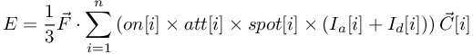
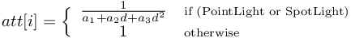
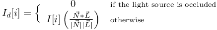
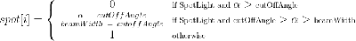
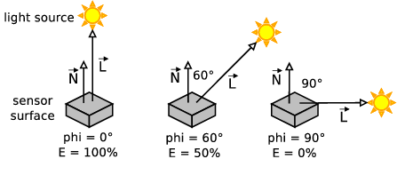

## LightSensor

Derived from [Device](device.md) and [Solid](solid.md).

```
LightSensor {
  MFVec3f lookupTable [ 0 0 0, 1 1000 0 ]   # lookup table
  SFColor colorFilter 1 1 1                 # any color
  SFBool  occlusion   FALSE                 # {TRUE, FALSE}
  SFFloat resolution  -1                    # {-1, [0, inf)}
}
```

### Description

[LightSensor](#lightsensor) nodes are used to model photo-transistors, photo-diodes or any type of device that measures the irradiance of light in a given direction.
*Irradiance* represents the radiant power incident on a surface in *watts per square meter* [W/m²], and is sometimes called *intensity*.
The simulated irradiance is computed by adding the irradiance contributed by every light source ([DirectionalLight](directionallight.md), [SpotLight](spotlight.md) and [PointLight](pointlight.md)) in the world.
Then the total irradiance is multiplied by a color filter and fed into a lookup table that returns the corresponding user-defined value.

The irradiance contribution of each light source is divided into *direct* and *ambient* contributions.
The direct contribution depends on the `position` and the `orientation` of the sensor, the `location` and the `direction` of the light sources and (optionally) on the possible occlusion of the light sources.
The ambient contribution ignores the possible occlusions, and it is not affected by the `orientation` of the sensor nor by the `direction` of a light source.
The direct and ambient contributions of [PointLight](pointlight.md)s and [SpotLight](spotlight.md)s are attenuated according to the distance between the sensor and the light, according to specified attenuation coefficients.
The light radiated by a [DirectionalLight](directionallight.md) is not attenuated.
See also [DirectionalLight](directionallight.md), [SpotLight](spotlight.md) and [PointLight](pointlight.md) node descriptions.

Note that the Webots lighting model does not take reflected light nor object colors into account.

### Field Summary

- `lookupTable`: this table allows Webots to map simulated irradiance values to user-defined sensor output values and to specify a noise level.
The first column contains the input irradiance values [W/m²].
The second column represents the corresponding sensor output values in user-defined units.
The third column specifies the level of noise in percent of the corresponding output value.
See the section on the [DistanceSensor](distancesensor.md#lookup-table) node for more explanation on how a `lookupTable` works.

- `colorFilter`: specifies an RGB filter that can be used to approximate a physical color filter or spectral response.
The total RGB irradiance is multiplied by this filter (see formula below) in order to obtain a scalar irradiance value *E* that is then used as the input to the lookup table.
The `colorFilter` field can, for example, be used to selectively detect light sources according to color.

- `occlusion`: specifies whether or not obstacles between the sensor and light sources should be taken into account in the calculation of irradiance.
If the `occlusion` field is FALSE (the default), all potential obstacles (Walls, other Robots, etc.) are ignored and Webots behaves as if they were transparent.
If the `occlusion` field is TRUE, Webots will detect which light sources are occluded (from the sensor's viewpoint) and it will ignore their direct contributions.
Note that the `occlusion` flag affects only the *direct* light measurement, not the *ambient* light which is always added in.
By default, the `occlusion` field is disabled because the occlusion detection is computationally expensive and should be avoided whenever possible.
For example, in a setup where it is obvious that there will never be an obstacle between a particular sensor and the various light sources, the `occlusion` flag can be set to FALSE.

- `resolution`: This field allows to define the resolution of the sensor, the resolution is the smallest change that it is able to measure.
Setting this field to -1 (default) means that the sensor has an 'infinite' resolution (it can measure any infinitesimal change).
This field accepts any value in the interval (0.0, inf).

Before being interpolated by the `lookupTable`, the total irradiance *E* [W/m²] seen by a sensor is computed according to the equation shown in [this figure](#light-sensor-irradiance-formula):

%figure "Light sensor irradiance formula"



%end

The *F* vector corresponds to the sensor's `colorFilter` field, *n* is the total number of lights in the simulation, *on[i]* corresponds to the `on` field of light *i* (TRUE=1, FALSE=0), the *C[i]* vector is the `color` field of light *i*, and *I<sub>a</sub>* is the `ambientIntensity` field of light *i*.
The value *att[i]* is the attenuation of light *i*, and is calculated as shown in [this figure](#light-attenuation).

%figure "Light attenuation"



%end

Variables *a<sub>1</sub><sub>2</sub>* and *a<sub>3</sub>* correspond to the `attenuation` field of light *i*, and *d* is the distance between the sensor and the light.
There is no attenuation for [DirectionalLight](directionallight.md)s.
*I<sub>d</sub>* is the direct irradiance contributed by light *i*, and is calculated as shown in [this figure](#direct-irradiance).

%figure "Direct irradiance"



%end

Finally, *spot[i]* is a factor used only in case of a [SpotLight](spotlight.md), and that depends on its `cutOffAngle` and `beamWidth` fields, and is calculated as shown in [this figure](#spotlight-factor), where the *alpha* angle corresponds to the angle between *-L* and the `direction` vector of the [SpotLight](spotlight.md).

%figure "SpotLight factor"



%end

The value *I[i]* corresponds to the *intensity* field of light *i*, and *N* is the normal axis (x-axis) of the sensor (see [this figure](#the-irradiance-e-depends-on-the-angle-phi-between-the-n-and-l-vectors)).
In the case of a [PointLight](pointlight.md), *L* is the sensor-to-light-source vector.
In the case of a [DirectionalLight](directionallight.md), *L* corresponds to the negative of the light's `direction` field.
The * operation is a modified dot product: if dot < 0, then 0, otherwise, dot product.
Hence, each light source contributes to the irradiance of a sensor according to the cosine of the angle between the *N* and the *L* vectors, as shown in the figure.
The contribution is zero if the light source is located behind the sensor.
This is derived from the physical fact that a photo-sensitive device is usually built as a surface of semiconductor material and therefore, the closer the angle of incidence is to perpendicular, the more photons will actually hit the surface and excite the device.
When a light source is parallel to (or behind) the semiconductor surface, no photons actually reach the surface.

%figure "The irradiance (E) depends on the angle (phi) between the *N* and *L* vectors"



%end

The "occlusion" condition is true if the light source is hidden by one or more obstacles.
More precisely, "occlusion" is true if (1) the `occlusion` field of the sensor is set to TRUE and (2) there is an obstacle in the line of sight between the sensor and the light source.
Note that [DirectionalLight](directionallight.md) nodes don't have *location* fields; in this case Webots checks for obstacles between the sensor and an imaginary point located 1000m away in the direction opposite to the one indicated by the `direction` field of this [DirectionalLight](directionallight.md).

Like any other type of collision detection in Webots, the [LightSensor](#lightsensor) occlusion detection is based on the `boundingObjects` of [Solid](solid.md) nodes (or derived nodes).
Therefore, even if it has a visible geometric structure, a [Solid](solid.md) node cannot produce any occlusion if its `boundingObject` is not specified.

> **Note**: The default value of the `attenuation` field of [PointLight](pointlight.md)s and [SpotLight](spotlight.md)s is *1 0 0*.
These values correspond to the VRML97 default, and are not appropriate for modeling the attenuation of a real lights.
If a point or spot light radiates uniformly in all directions and there is no absorption, then the irradiance drops off in proportion to the square of the distance from the object.
Therefore, for realistic modeling, the `attenuation` field of a light source should be changed to *0 0 4*&pi;*.
If, in addition, the `intensity` field of the light is set to the radiant power [W] of a real point source (e.g., a light bulb), then the computed sensor irradiance *E* will approximate real world values [W/m²].
Finally, if the sensor's `lookupTable` is filled with correct calibration data, a fairly good approximation of the real world should be achieved.

<!-- -->

> **Note**: If the calibration data for the `lookupTable` was obtained in lux (lx) or *lumens per square meter* [lm/m²] instead of W/m², it makes sense to substitute the radiometry terms and units in this document with their photometry equivalents: *irradiance* becomes *illuminance*, *radiant power* becomes *luminous power* and *W* becomes *lm (lumen)*, etc.

### LightSensor Functions

#### `wb_light_sensor_enable`
#### `wb_light_sensor_disable`
#### `wb_light_sensor_get_sampling_period`
#### `wb_light_sensor_get_value`
#### `wb_light_sensor_get_lookup_table_size`
#### `wb_light_sensor_get_lookup_table`

%tab-component "language"

%tab "C"

```c
#include <webots/light_sensor.h>

void wb_light_sensor_enable(WbDeviceTag tag, int sampling_period);
void wb_light_sensor_disable(WbDeviceTag tag);
int wb_light_sensor_get_sampling_period(WbDeviceTag tag);
double wb_light_sensor_get_value(WbDeviceTag tag);
int wb_light_sensor_get_lookup_table_size(WbDeviceTag tag);
const double *wb_light_sensor_get_lookup_table(WbDeviceTag tag);
```

%tab-end

%tab "C++"

```cpp
#include <webots/LightSensor.hpp>

namespace webots {
  class LightSensor : public Device {
    virtual void enable(int samplingPeriod);
    virtual void disable();
    int getSamplingPeriod() const;
    double getValue() const;
    int getLookupTableSize() const;
    const double *getLookupTable() const;
  }
}
```

%tab-end

%tab "Python"

```python
from controller import LightSensor

class LightSensor (Device):
  def enable(self, samplingPeriod):
  def disable(self):
  def getSamplingPeriod(self):
  def getValue(self):
  def getLookupTable(self):
```

%tab-end

%tab "Java"

```java
import com.cyberbotics.webots.controller.LightSensor;

public class LightSensor extends Device {
  public void enable(int samplingPeriod);
  public void disable();
  public int getSamplingPeriod();
  public double getValue();
  public double[] getLookupTable();
}
```

%tab-end

%tab "MATLAB"

```MATLAB
wb_light_sensor_enable(tag, sampling_period)
wb_light_sensor_disable(tag)
period = wb_light_sensor_get_sampling_period(tag)
value = wb_light_sensor_get_value(tag)
lookup_table_array = wb_light_sensor_get_lookup_table(tag)
```

%tab-end

%tab "ROS"

| name | service/topic | data type | data type definition |
| --- | --- | --- | --- |
| `/<device_name>/value` | `topic` | [`sensor_msgs::Illuminance`](http://docs.ros.org/api/sensor_msgs/html/msg/Illuminance.html) | [`Header`](http://docs.ros.org/api/std_msgs/html/msg/Header.html) `header`<br/>`float64 illuminance`<br/>`float64 variance` |
| `/<device_name>/enable` | `service` | [`webots_ros::set_int`](ros-api.md#common-services) | |
| `/<device_name>/get_sampling_period` | `service` | [`webots_ros::get_int`](ros-api.md#common-services) | |
| `/<device_name>/get_lookup_table` | `service` | [`webots_ros::get_float_array`](ros-api.md#common-services) | |

%tab-end

%end

##### Description

*enable, disable and read light sensor measurement*

The `wb_light_sensor_enable` function enables light sensor measurements.
The provided `sampling_period` argument specifies the sampling period of the sensor and is expressed in milliseconds.
Note that the first measurement will be available only after the first sampling period elapsed.

The `wb_light_sensor_disable` function turns off the light sensor to save CPU time.

The `wb_light_sensor_get_sampling_period` function returns the period given into the `wb_light_sensor_enable` function, or 0 if the device is disabled.

The `wb_light_sensor_get_value` function returns the most recent value measured by the specified light sensor.
The returned value is the result of interpolating the irradiance *E* as described above with the sensor's `lookupTable`.

The `wb_light_sensor_get_lookup_table_size` function returns the number of rows in the lookup table.

The `wb_light_sensor_get_lookup_table` function returns the values of the lookup table.
This function returns a matrix containing exactly N * 3 values (N represents the number of mapped values optained with the `wb_light_sensor_get_lookup_table_size` function) that shall be interpreted as a N x 3 table.
