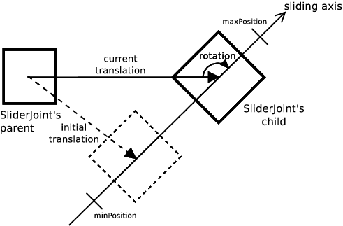
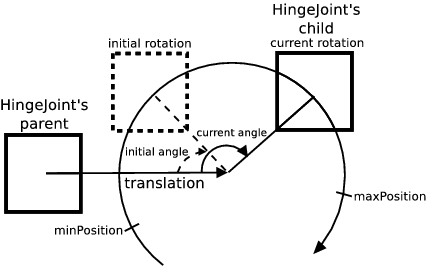

## Motor

Derived from [Device](device.md).

```
Motor {
  SFFloat  acceleration      -1       # {-1, [0, inf)}
  SFFloat  consumptionFactor 10       # [0, inf)
  SFVec3f  controlPID        10 0 0   # any positive vector
  SFFloat  minPosition       0        # (-inf, inf)
  SFFloat  maxPosition       0        # (-inf, inf)
  SFFloat  maxVelocity       10       # [0, inf)
  SFFloat  multiplier        1        # (inf, 0[ or ]0, inf)
  SFString sound             ""       # any string
  MFNode   muscles           []       # {Muscle, PROTO}
}
```

### Description

A [Motor](#motor) node is an abstract node (not instantiated) whose derived classes are [RotationalMotor](rotationalmotor.md) and [LinearMotor](linearmotor.md).
These classes can be used in a mechanical simulation to power a joint hence producing a motion along, or around, one of its axes.

A [RotationalMotor](rotationalmotor.md) can power a [HingeJoint](hingejoint.md) (resp. a [Hinge2Joint](hinge2joint.md)) when set inside the `device` (resp. `device` or `device2`) field of these nodes.
It produces then a rotational motion around the chosen axis.
Likewise, a [LinearMotor](linearmotor.md) can power a [SliderJoint](hingejoint.md), producing a sliding motion along its axis.

### Field Summary

- The `acceleration` field defines the default acceleration of the P-controller.
It is expressed in *meter per second squared* [m/s²] for linear motors and in *radian per second squared* [rad/s²] for rotational motors.
A value of -1 (infinite) means that the acceleration is not limited by the P-controller.
The acceleration can be changed at run-time with the `wb_motor_set_acceleration` function.

- The `consumptionFactor` field defines how much energy is consumed by the motor if battery simulation is enabled in the ancestor [Robot](robot.md) node.
The details on motor energy consumption are provided [below](#energy-consumption).

- The first coordinate of `controlPID` field specifies the initial value of the *P* parameter, which is the *proportional gain* of the motor PID-controller.
A high *P* results in a large response to a small error, and therefore a more sensitive system.
Note that by setting *P* too high, the system can become unstable.
With a small *P*, more simulation steps are needed to reach the target position, but the system is more stable.

    The second coordinate of `controlPID` field specifies the initial value of the
    *I* parameter, which is the *integral gain* of the motor PID-controller. The
    integral term of the PID controller is defined as the product of the error
    integral over time by *I*. This term accelerates the movement towards target
    position and eliminates the residual steady-state error which occurs with a pure
    proportional controller. However, since the integral term represents accumulated
    errors from the past, it can cause the present value to overshoot the target
    position.

    The third coordinate `controlPID` field specifies the initial value of the *D*
    parameter, which is the *derivative gain* of the motor PID-controller. The
    derivative term of the PID-controller is defined as the product of the error
    derivative with respect to time by *D*. This term predicts system behavior and
    thus improves settling time and stability of the system.

    The value of *P, I* and *D* can be changed at run-time with the
    `wb_motor_set_control_pid` function.

- The `minPosition` and `maxPosition` fields specify *soft limits* for the target position.
They are expressed in *meter* [m] for [LinearMotor](linearmotor.md) and in *radian* [rad] for  [RotationalMotor](rotationalmotor.md) .
These fields are described in more detail in the [Motor Limits section](#motor-limits), see below.

- The `maxVelocity` field specifies both the upper limit and the default value for the motor *velocity*.
It is expressed in *meter per second* [m/s] for linear motors and in *radian per second* [rad/s] for rotational motors.
The *velocity* can be changed at run-time with the `wb_motor_set_velocity` function.
The value should always be positive (the default is 10).

- The `multiplier` field specifies the factor by which position, velocity and force/torque commands sent by the controller are multiplied.
Only the following API functions are affected by this field: `wb_motor_set_position`, `wb_motor_set_velocity`, `wb_motor_set_torque` and `wb_motor_set_force`.
By default, this field is 1.

> **Note:** When using a multiplier different from 1, the values `minPosition`, `maxPosition` and `maxVelocity` as displayed in the interface do not reflect the practical limits.
For example, for a motor with `multiplier` = 2 and `maxVelocity` = 10, to remain within this limit the maximal velocity that the controller can set is 5, not 10.

- The `sound` field specifies the URL of a WAVE sound file.
If the `sound` value starts with `http://` or `https://`, Webots will get the file from the web.
Otherwise it is considered as a relative URL with respect to the location of the world file or PROTO file which contains the `Motor` node.
This sound is used to play the sound of the motor.
It is modulated in volume and pitch according to the velocity of the motor to produce a realistic motor sound.

- The `muscles` field optionally specifies one or more [Muscle](muscle.md) nodes that graphically display the contraction of an artificial muscle connecting the parent [Solid](solid.md) node and the `endPoint` node of the [Joint](joint.md).
This functionality is not available for the [Track](track.md) node.

### Units

The position of a motor corresponds to joint position as defined in [JointParameters](jointparameters.md).
The position of a rotational motor is expressed in *radian* [rad] while the position of a linear motor is expressed in *meter* [m].
See [this table](#motor-units):

%figure "Motor Units"

| &nbsp;       | Rotational                         | Linear                           |
| ------------ | -----------------------------------| ---------------------------------|
| Position     | rad (radian)                       | m (meter)                       |
| Velocity     | rad/s (radian per second)          | m/s (meter per second)          |
| Acceleration | rad/s² (radian per second squared) | m/s² (meter per second squared) |

%end

### Initial Transformation and Position

The `minPosition` and `maxPosition` are defined with respect to joint's zero position (see description of the `position` field in [JointParameters](jointparameters.md)).

%figure "Linear Motor"



%end

%figure "Rotational Motor"



%end

### Position Control

The standard way of operating a [Motor](#motor) is to control the position directly (*position control*).
The user specifies a target position using the `wb_motor_set_position` function, then the P-controller takes into account the desired velocity, acceleration and motor force in order to move the motor to the target position.
See [this table](#motor-control-summary).

In Webots, position control is carried out in three stages, as depicted in [this figure](#motor-control).
The first stage is performed by the user-specified controller (1) that decides which position, velocity, acceleration and motor force must be used.
The second stage is performed by the motor P-controller (2) that computes the current velocity of the motor *V<sub>c</sub>*.
Finally, the third stage (3) is carried out by the physics simulator (ODE joint motors).

%figure "Motor control"
%chart
graph LR
  node["Motor node (VRML)"] -->|"wb_motor_set_position(Pt)<br/>wb_motor_set_velocity(Vd)<br/>wb_motor_set_acceleration(A)<br/>wb_motor_set_available_force(F)<br/>wb_motor_set_control_pid(P,I,D)"| PID["2.motor PID-controller (Webots)"]
  robot["1. robot controller (user-code)"] -->|"controlPID(P,I,D)<br/>maxVelocity(Vmax)<br/>acceleration(A)<br/>maxForce(Fmax)"| PID
    PID -->|"motor force/torque(F)</br>motor velocity(Vc)"| ODE["3. physics simulator (ODE)"]
  robot -->|wb_motor_set_force<br/>wb_motor_set_torque| ODE
%end
%end

At each simulation step, the PID-controller (2) recomputes the current velocity *Vc* according to following algorithm:

```
error = Pt - Pc;
error_integral += error * ts;
error_derivative = (previous_error - error) / ts;
Vc = P * error + D * error_derivative + I * error_integral ;
if (abs(Vc) > Vd)
  Vc = sign(Vc) * Vd;
if (A != -1) {
  a = (Vc - Vp) / ts;
  if (abs(a) > A)
    a = sign(a) * A;
  Vc = Vp + a * ts;
}
```

Where *V<sub>c</sub>* is the current motor velocity in rad/s or m/s, *P, I* and *D* are the PID-control gains specified in the `controlPID` field, or set with the `wb_motor_set_control_pid` function, *P<sub>t</sub>* is the *target position* of the motor set by the `wb_motor_set_position` function, *P<sub>c</sub>* is the current motor position, *V<sub>d</sub>* is the desired velocity as specified by the `maxVelocity` field (default) or set with the `wb_motor_set_velocity` function, *a* is the acceleration required to reach *Vc* in one time step, *V<sub>p</sub>* is the motor velocity of the previous time step, *t<sub>s</sub>* is the duration of the simulation time step as specified by the `basicTimeStep` field of the [WorldInfo](worldinfo.md) node (converted in seconds), and *A* is the acceleration of the motor as specified by the `acceleration` field (default) or set with the `wb_motor_set_acceleration` function.

> **Note**: *error_integral* and *previous_error* are both reset to *0* after every call of the `wb_motor_set_control_pid` function.

### Velocity Control

The motors can also be used with *velocity control* instead of *position control*.
This is obtained with two function calls: first the `wb_motor_set_position` function must be called with `INFINITY` as a position parameter, then the desired velocity, which may be positive or negative, must be specified by calling the `wb_motor_set_velocity` function.
This will initiate a continuous motor motion at the desired speed, while taking into account the specified acceleration and motor force.
Example:

```
wb_motor_set_position(motor, INFINITY);
wb_motor_set_velocity(motor, 6.28);  // 1 rotation per second
```

`INFINITY` is a C macro corresponding to the IEEE 754 floating point standard.
It is implemented in the C99 specifications as well as in C++.
In Java, this value is defined as `Double.POSITIVE_INFINITY`.
In Python, you should use `float('inf')`.
Finally, in MATLAB you should use the `inf` constant.

### Force and Torque Control

The position control described above is performed by the Webots PID-controller and ODE's joint motor implementation (see ODE documentation).
As an alternative, Webots also allows the user to directly specify the amount of force (resp. torque) that must be applied by a [Motor](#motor).
This is achieved with the `wb_motor_set_force` (resp. `wb_motor_set_torque`) function which specifies the desired amount of forces (resp. torques) and switches off the PID-controller.
A subsequent call to the `wb_motor_set_position` function restores the original *position control*.
Some care must be taken when using *force control*.
Indeed the force (resp. torque) specified with the `wb_motor_set_force` (resp. `wb_motor_set_torque`) function is applied to the [Motor](#motor) continuously.
Hence the [Motor](#motor) will infinitely accelerate its rotational or linear motion and eventually *explode* unless a functional force control (resp. torque control) algorithm is used.

%figure "Motor Control Summary"

| &nbsp;                                                                         | position control                                 | velocity control                                              | force or torque control                      |
| ------------------------------------------------------------------------------ | ------------------------------------------------ | ------------------------------------------------------------- | -------------------------------------------- |
| uses PID-controller                                                            | yes (PID is applied on the velocity)             | no (internal ODE control loop is applied on the force/torque) | no                                           |
| wb\_motor\_set\_position()                                                     | * specifies the desired position                 | should be set to INFINITY                                     | switches to position/velocity control        |
| wb\_motor\_set\_velocity()                                                     | specifies the max velocity                       | * specifies the desired velocity                              | is ignored                                   |
| wb\_motor\_set\_acceleration()                                                 | specifies the max acceleration                   | specifies the max acceleration                                | is ignored                                   |
| wb\_motor\_set\_available\_force() (resp. wb\_motor\_set\_available\_torque()) | specifies the available force (resp. torque)     | specifies the available force (resp. torque)                  | specifies the max force (resp. max torque)   |
| wb\_motor\_set\_force() (resp. wb\_motor\_set\_torque())                       | switches to force control (resp. torque control) | switches to force control (resp. torque control)              | * specifies the desired force (resp. torque) |

%end

### Motor Limits

The `minPosition` and `maxPosition` fields define the *soft limits* of the motor.
Motor zero position and joint zero position coincide (see description of the `position` field in [JointParameters](jointparameters.md)).
Soft limits specify the *software* boundaries beyond which the PID-controller will not attempt to move.
If the controller calls the `wb_motor_set_position` function with a target position that exceeds the soft limits, the desired target position will be clipped in order to fit into the soft limit range.
Valid limits values depends on the motor position, i.e. `minPosition` must always be less than or equal to the motor position and `maxPosition` must always be greater than or equal to the motor position.
When both `minPosition` and `maxPosition` are zero (the default), the soft limits are deactivated.
Note that the soft limits can be overstepped when an external force which exceeds the motor force is applied to the motor.
For example, it is possible that the weight of a robot exceeds the motor force that is required to hold it up.

Finally, note that when both soft (`minPosition` and `maxPosition`) and hard limits (`minStop` and `maxStop`, see [JointParameters](jointparameters.md#joint-limits)) are activated, the range of the soft limits must be included in the range of the hard limits, such that `minStop <= minPosition` and `maxStop >= maxPosition`.
Moreover a simulation instability can appear if `position` is exactly equal to one of the bounds defined by the `minStop` and `maxStop` fields at the simulation startup.
Warnings are displayed if theses rules are not respected.

### Coupled Motors

If multiple motors, be it [RotationalMotor](rotationalmotor.md), [LinearMotor](linearmotor.md) or a mixture of the two, share the same name structure and they belong to the same [Robot](robot.md) then they are considered as being coupled.
When giving a command to a coupled motor, for instance using the functions [`wb_motor_set_position`](#wb_motor_set_position) or [`wb_motor_set_velocity`](#wb_motor_set_velocity), then the same instruction is relayed to all others.
Although each sibling motor receives the same command, what the motors actually enforce depends on their own `multiplier` value.

> **Note**: The motors are *logically* coupled together, not *mechanically*.
If one of the motors is physically blocked, the others are in no way affected by it.
This provides a useful side-effect: when used in force-control mode, coupled-motors allow to easily simulate a mechanical differential.
The role of a differential is to change the speed of the wheel relatively to each other.
But also, it splits *equally* the motor torque to each wheel.
Therefore it suffices to apply the same torque on multiple (coupled) motors, and the physics engine will adapt the speeds accordingly.
It works for a regular car as well as for a 4x4 vehicle, as long as they have 3 differentials (front, rear, and central).
Using `multiplier` here also makes sense, because some differentials do not split in half: sometimes a central differential splits 40%-60% to get more torque to the rear wheels.
This parameter doesn't depend on the actual speed and characteristics of the wheels, it's only a mechanical setting.

> **Note**: Although any among the coupled motors can be controlled, commands should be given to just one among them at any given time in order to avoid confusion or conflicts.
For instance, it is not possible to do Position Control for one motor and Velocity Control another at the same time.
Whatever command is given to a motor, it is relayed to all of its siblings hence overwriting any prior settings imposed on them.
In other words, only the last command given is the one actually being enforced across the coupling.

#### Naming Convention

The naming convention for coupled motors is `"motor name::specifier name"`.
Note the `::` used as delimiter.
The string before the delimiter, here `"motor name"`, is used to determine to which coupling the specific motor belongs, therefore all the devices that share this same string will be coupled together.
The string after the delimiter, here `"specifier name"`, allows to uniquely identify each motor among its siblings.
When requesting the tag using the `wb_robot_get_device` function it is necessary to provide the full name, specifier included, otherwise no match will be found and `NULL` is returned.

#### Coupled Motor Limits

Since each motor applies the command received according to their own multiplier value, it must be ensured that the position and velocity limits are consistent across coupled motors.
Therefore, in a coupled motor context, these motor limits have to be exactly a factor of each other.

> **Note**: this rule is enforced only for `minPosition`, `maxPosition` and `maxVelocity`.
For `maxForce` and `maxTorque` it is not and if due to the multiplier value a command beyond the limit is demanded, the corresponding warning messages are silenced but the limit itself as specified in the motor fields is nonetheless respected.

For example, assume a set of four coupled motors having `multiplier` values of 2, 0.5, 4 and -4, the table below shows how the limits of motor B, C and D should be set.

| motor (multiplier) | A (2) | B (0.5) | C (4) | D (-4) |
|-------------------:|:-----:|:-------:|:-----:|:------:|
|        minPosition |   -1  |  -0.25  |   -2  |   -4   |
|        maxPosition |   2   |   0.5   |   4   |    2   |
|        maxVelocity |   10  |   2.5   |   20  |   20   |


> **Note**: For negative multipliers, the absolute value of the limit should be set.
`minPosition` and `maxPosition` are an exception and they require additional care as in the presence of negative multipliers the two values might need to be swapped, as is the case here for motor D.

> **Note**: If one motor of a coupling set has unlimited position (`minPosition` = `maxPosition` = 0), all its siblings must be unlimited as well.
This same constraint is not enforced for `acceleration`.

### Energy Consumption

If the [Robot](robot.md) ancestor of a [Motor](motor.md) node has a `battery` field defined, then the energy consumption is computed for the whole robot.
This computation sums up the energy consumption of every device, including this motor.
The energy consumption (expressed in Joule) is computed by integrating the power consumption over time (expressed in Watt).
The power consumption for a rotational motor (`electrical_input_power`) is computed according to the following equation:

`electrical_input_power` = `output_torque` * `consumptionFactor`

Similarly, for a linear motor it is computed according to the following equation:

`electrical_input_power` = `output_force` * `consumptionFactor`

Where `output_torque` is the value returned by the [`wb_motor_get_torque_feedback`](#wb_motor_get_torque_feedback) function, `output_force` is the value returned by the [`wb_motor_get_force_feedback`](#wb_motor_get_force_feedback) function and `consumptionFactor` is a constant provided by the `consumptionFactor` field of the [Motor](motor.md) node.

> **Note**: This is a very simplified model for the energy consumption of an electrical motor (and will not work in case of a motor in a [Track](track.md) node), but it is sufficient for most prototyping purposes.
If a more specific or accurate model is needed, it can be implemented in the robot controller itself.

### Kinematics Mode

In [*kinematics* mode](physics.md#how-to-use-physics-nodes), the joint acceleration is set to `Motor.acceleration`, unless `Motor.acceleration` is not defined (i.e. equals to `-1`) or is bigger than `RotationalMotor.maxTorque` or `LinearMotor.maxForce`.
In such case the joint acceleration is set to `RotationalMotor.maxTorque` or `LinearMotor.maxForce`.

### Motor Functions

#### `wb_motor_set_position`
#### `wb_motor_set_velocity`
#### `wb_motor_set_acceleration`
#### `wb_motor_set_available_force`
#### `wb_motor_set_available_torque`
#### `wb_motor_set_control_pid`
#### `wb_motor_get_target_position`
#### `wb_motor_get_min_position`
#### `wb_motor_get_max_position`
#### `wb_motor_get_velocity`
#### `wb_motor_get_max_velocity`
#### `wb_motor_get_acceleration`
#### `wb_motor_get_available_force`
#### `wb_motor_get_max_force`
#### `wb_motor_get_available_torque`
#### `wb_motor_get_max_torque`
#### `wb_motor_get_multiplier`

%tab-component "language"

%tab "C"

```c
#include <webots/motor.h>

void wb_motor_set_position(WbDeviceTag tag, double position);
void wb_motor_set_velocity(WbDeviceTag tag, double velocity);
void wb_motor_set_acceleration(WbDeviceTag tag, double acceleration);
void wb_motor_set_available_force(WbDeviceTag tag, double force);
void wb_motor_set_available_torque(WbDeviceTag tag, double torque);
void wb_motor_set_control_pid(WbDeviceTag tag, double p, double i, double d);
double wb_motor_get_target_position(WbDeviceTag tag);
double wb_motor_get_min_position(WbDeviceTag tag);
double wb_motor_get_max_position(WbDeviceTag tag);
double wb_motor_get_velocity(WbDeviceTag tag);
double wb_motor_get_max_velocity(WbDeviceTag tag);
double wb_motor_get_acceleration(WbDeviceTag tag);
double wb_motor_get_available_force(WbDeviceTag tag);
double wb_motor_get_max_force(WbDeviceTag tag);
double wb_motor_get_available_torque(WbDeviceTag tag);
double wb_motor_get_max_torque(WbDeviceTag tag);
double wb_motor_get_multiplier(WbDeviceTag tag);
```

%tab-end

%tab "C++"

```cpp
#include <webots/Motor.hpp>

namespace webots {
  class Motor : public Device {
    virtual void setPosition(double position);
    virtual void setVelocity(double velocity);
    virtual void setAcceleration(double acceleration);
    virtual void setAvailableForce(double force);
    virtual void setAvailableTorque(double torque);
    virtual void setControlPID(double p, double i, double d);
    double getTargetPosition() const;
    double getMinPosition() const;
    double getMaxPosition() const;
    double getVelocity() const;
    double getMaxVelocity() const;
    double getAcceleration() const;
    double getAvailableForce() const;
    double getMaxForce() const;
    double getAvailableTorque() const;
    double getMaxTorque() const;
    double getMultiplier() const;
    // ...
  }
}
```

%tab-end

%tab "Python"

```python
from controller import Motor

class Motor (Device):
    def setPosition(self, position):
    def setVelocity(self, velocity):
    def setAcceleration(self, acceleration):
    def setAvailableForce(self, force):
    def setAvailableTorque(self, torque):
    def setControlPID(self, p, i, d):
    def getTargetPosition(self):
    def getMinPosition(self):
    def getMaxPosition(self):
    def getVelocity(self):
    def getMaxVelocity(self):
    def getAcceleration(self):
    def getAvailableForce(self):
    def getMaxForce(self):
    def getAvailableTorque(self):
    def getMaxTorque(self):
    def getMultiplier(self):
    # ...
```

%tab-end

%tab "Java"

```java
import com.cyberbotics.webots.controller.Motor;

public class Motor extends Device {
  public void setPosition(double position);
  public void setVelocity(double velocity);
  public void setAcceleration(double acceleration);
  public void setAvailableForce(double force);
  public void setAvailableTorque(double torque);
  public void setControlPID(double p, double i, double d);
  public double getTargetPosition();
  public double getMinPosition();
  public double getMaxPosition();
  public double getVelocity();
  public double getMaxVelocity();
  public double getAcceleration();
  public double getAvailableForce();
  public double getMaxForce();
  public double getAvailableTorque();
  public double getMaxTorque();
  public double getMultiplier();
  // ...
}
```

%tab-end

%tab "MATLAB"

```MATLAB
wb_motor_set_position(tag, position)
wb_motor_set_velocity(tag, velocity)
wb_motor_set_acceleration(tag, acceleration)
wb_motor_set_available_force(tag, force)
wb_motor_set_available_torque(tag, torque)
wb_motor_set_control_pid(tag, p, i, d)
target = wb_motor_get_target_position(tag)
min = wb_motor_get_min_position(tag)
max = wb_motor_get_max_position(tag)
vel = wb_motor_get_velocity(tag)
vel = wb_motor_get_max_velocity(tag)
acc = wb_motor_get_acceleration(tag)
force = wb_motor_get_available_force(tag)
force = wb_motor_get_max_force(tag)
torque = wb_motor_get_available_torque(tag)
torque = wb_motor_get_max_torque(tag)
multiplier = wb_motor_get_multiplier(tag)
```

%tab-end

%tab "ROS"

| name | service/topic | data type | data type definition |
| --- | --- | --- | --- |
| `/<device_name>/set_position` | `service` | [`webots_ros::set_float`](ros-api.md#common-services) | |
| `/<device_name>/set_velocity` | `service` | [`webots_ros::set_float`](ros-api.md#common-services) | |
| `/<device_name>/set_acceleration` | `service` | [`webots_ros::set_float`](ros-api.md#common-services) | |
| `/<device_name>/set_available_force` | `service` | [`webots_ros::set_float`](ros-api.md#common-services) | |
| `/<device_name>/set_available_torque` | `service` | [`webots_ros::set_float`](ros-api.md#common-services) | |
| `/<device_name>/set_control_pid` | `service` | `webots_ros::motor_set_control_pid` | `float64 controlp`<br/>`float64 controli`<br/>`float64 controld`<br/>`---`<br/>`int8 success` |
| `/<device_name>/get_target_position` | `service` | [`webots_ros::get_float`](ros-api.md#common-services) | |
| `/<device_name>/get_min_position` | `service` | [`webots_ros::get_float`](ros-api.md#common-services) | |
| `/<device_name>/get_max_position` | `service` | [`webots_ros::get_float`](ros-api.md#common-services) | |
| `/<device_name>/get_velocity` | `service` | [`webots_ros::get_float`](ros-api.md#common-services) | |
| `/<device_name>/get_max_velocity` | `service` | [`webots_ros::get_float`](ros-api.md#common-services) | |
| `/<device_name>/get_acceleration` | `service` | [`webots_ros::get_float`](ros-api.md#common-services) | |
| `/<device_name>/get_available_force` | `service` | [`webots_ros::get_float`](ros-api.md#common-services) | |
| `/<device_name>/get_max_force` | `service` | [`webots_ros::get_float`](ros-api.md#common-services) | |
| `/<device_name>/get_available_torque` | `service` | [`webots_ros::get_float`](ros-api.md#common-services) | |
| `/<device_name>/get_max_torque` | `service` | [`webots_ros::get_float`](ros-api.md#common-services) | |
| `/<device_name>/get_multiplier` | `service` | [`webots_ros::get_float`](ros-api.md#common-services) | |

%tab-end

%end

##### Description

*change the parameters of the PID-controller*

The `wb_motor_set_position` function specifies a new target position that the PID-controller will attempt to reach using the current velocity, acceleration and motor torque/force parameters.
The specified position is expressed in *radian* [rad] for rotational motors and in *meter* [m] for linear motors.
This function returns immediately (asynchronous) while the actual motion is carried out in the background by Webots.
The target position will be reached only if the physics simulation allows it, that means, if the specified motor force is sufficient and the motion is not blocked by obstacles, external forces or the motor's own spring force, etc.
It is also possible to wait until the [Motor](#motor) reaches the target position (synchronous) like this:

```c
void motor_set_position_sync(WbDeviceTag tag_motor, WbDeviceTag tag_sensor, double target, int delay) {
  const double DELTA = 0.001;  // max tolerated difference
  wb_motor_set_position(tag_motor, target);
  wb_position_sensor_enable(tag_sensor, TIME_STEP);
  double effective;  // effective position
  do {
    if (wb_robot_step(TIME_STEP) == -1)
      break;
    delay -= TIME_STEP;
    effective = wb_position_sensor_get_value(tag_sensor);
  } while (fabs(target - effective) > DELTA && delay > 0);
  wb_position_sensor_disable(tag_sensor);
}
```

The `INFINITY` (`#include <math.h>`) value can be used as the second argument to the `wb_motor_set_position` function in order to enable an endless rotational (or linear) motion.
The current values for velocity, acceleration and motor torque/force are taken into account.
So for example, the `wb_motor_set_velocity` function can be used for controlling the velocity of the endless rotation:

```c
// velocity control
wb_motor_set_position(tag, INFINITY);
wb_motor_set_velocity(tag, desired_speed);  // rad/s
```

> **Note** [C++]: In C++, use the `std::numeric_limits<double>::infinity` function instead of INFINITY.

<!-- -->

> **Note** [Java]: In Java use `Double.POSITIVE_INFINITY` instead of INFINITY.

<!-- -->

> **Note** [Python]: In Python use `float('+inf')` instead of INFINITY.

<!-- -->

> **Note** [MATLAB]: In MATLAB use `inf` instead of INFINITY.

The `wb_motor_get_target_position` function allows the user to get the target position.
This value matches with the argument given to the last `wb_motor_set_position` function call.

The `wb_motor_set_velocity` function specifies the velocity that a motor should reach while moving to the target position.
The velocity is expressed in *radian per second* [rad/s] for rotational motors and in *meter per second* [m/s] for linear motors.
In other words, this means that the motor will accelerate (using the specified acceleration, see below) until the target velocity is reached.
The velocity argument passed to this function cannot exceed the limit specified in the `maxVelocity` field.
The specified velocity can be retrieved using the `wb_motor_get_velocity` function.
The `wb_motor_get_max_velocity` function returns the limit specified in the `maxVelocity` field.
Note that if the velocity is not explicitly set using the `wb_motor_set_velocity` function, then the `wb_motor_get_velocity` and `wb_motor_get_max_velocity` functions return the same value.

The `wb_motor_set_acceleration` function specifies the acceleration that the PID-controller should use when trying to reach the specified velocity.
The acceleration is expressed in *radian per second squared* [rad/s²] for rotational motors and in *meter per second squared* [m/s²] for linear motors.
Note that an infinite acceleration is obtained by passing -1 as the `acc` argument to this function.
The specified acceleration overwrites the `acceleration` field value and can be retrieved using the `wb_motor_get_acceleration` function.

The `wb_motor_set_available_force` (resp. `wb_motor_set_available_torque`) function specifies the maximum force (resp. torque) that will be available to the motor to carry out the requested motion.
The force is expressed in *newton* [N].
The torque is expressed in *newton meter* [N⋅m].
The motor force/torque specified with this function cannot exceed the value specified in the `maxForce`/`maxTorque` field.
The specified force (resp. torque) can be retrieved using the `wb_motor_get_available_force` (resp. `wb_motor_get_available_torque`) function.
The `wb_motor_get_max_force` (reps. `wb_motor_get_max_torque`) function returns the limit specified in the `maxForce` (resp. `maxTorque`) field.
Note that if the force/torque is not explicitly set using the `wb_motor_set_available_[force|torque]` function, then the `wb_motor_get_available_[force|torque]` and `wb_motor_get_max_[force|torque]` functions return the same value.

The `wb_motor_set_control_pid` function changes the values of the gains *P, I* and *D* in the PID-controller.
These parameters are used to compute the current motor velocity *V<sub>c</sub>* from the current position *P<sub>c</sub>* and target position *P<sub>t</sub>*, such that *V<sub>c</sub>* where *error = P<sub>t</sub><sub>c</sub>*.
With a small *P*, a long time is needed to reach the target position, while too large a *P* can make the system unstable.
The default value of *P, I* and *D* are specified by the `controlPID` field of the corresponding [Motor](#motor) node.

The `wb_motor_get_[min|max]_position` functions allow to get the values of respectively the `minPosition` and the `maxPosition` fields.
Positions are expressed in *radian* [rad] for rotational motors and in *meter* [m] for linear motors.

The `wb_motor_get_multiplier` function allows to retrieve the `multiplier` value specified for the provided motor.

---

#### `wb_motor_enable_force_feedback`
#### `wb_motor_disable_force_feedback`
#### `wb_motor_get_force_feedback`
#### `wb_motor_get_force_feedback_sampling_period`
#### `wb_motor_enable_torque_feedback`
#### `wb_motor_disable_torque_feedback`
#### `wb_motor_get_torque_feedback`
#### `wb_motor_get_torque_feedback_sampling_period`

%tab-component "language"

%tab "C"

```c
#include <webots/motor.h>

void wb_motor_enable_force_feedback(WbDeviceTag tag, int sampling_period);
void wb_motor_disable_force_feedback(WbDeviceTag tag);
int wb_motor_get_force_feedback_sampling_period(WbDeviceTag tag);
double wb_motor_get_force_feedback(WbDeviceTag tag);
void wb_motor_enable_torque_feedback(WbDeviceTag tag, int sampling_period);
void wb_motor_disable_torque_feedback(WbDeviceTag tag);
int wb_motor_get_torque_feedback_sampling_period(WbDeviceTag tag);
double wb_motor_get_torque_feedback(WbDeviceTag tag);
```

%tab-end

%tab "C++"

```cpp
#include <webots/Motor.hpp>

namespace webots {
  class Motor : public Device {
    virtual void enableForceFeedback(int samplingPeriod);
    virtual void disableForceFeedback();
    int getForceFeedbackSamplingPeriod() const;
    double getForceFeedback() const;
    virtual void enableTorqueFeedback(int samplingPeriod);
    virtual void disableTorqueFeedback();
    int getTorqueFeedbackSamplingPeriod() const;
    double getTorqueFeedback() const;
    // ...
  }
}
```

%tab-end

%tab "Python"

```python
from controller import Motor

class Motor (Device):
    def enableForceFeedback(self, samplingPeriod):
    def disableForceFeedback(self):
    def getForceFeedbackSamplingPeriod(self):
    def getForceFeedback(self):
    def enableTorqueFeedback(self, samplingPeriod):
    def disableTorqueFeedback(self):
    def getTorqueFeedbackSamplingPeriod(self):
    def getTorqueFeedback(self):
    # ...
```

%tab-end

%tab "Java"

```java
import com.cyberbotics.webots.controller.Motor;

public class Motor extends Device {
  public void enableForceFeedback(int samplingPeriod);
  public void disableForceFeedback();
  public int getForceFeedbackSamplingPeriod();
  public double getForceFeedback();
  public void enableTorqueFeedback(int samplingPeriod);
  public void disableTorqueFeedback();
  public int getTorqueFeedbackSamplingPeriod();
  public double getTorqueFeedback();
  // ...
}
```

%tab-end

%tab "MATLAB"

```MATLAB
wb_motor_enable_force_feedback(tag, sampling_period)
wb_motor_disable_force_feedback(tag)
period = wb_motor_get_force_feedback_sampling_period(tag)
force = wb_motor_get_force_feedback(tag)
wb_motor_enable_torque_feedback(tag, sampling_period)
wb_motor_disable_torque_feedback(tag)
period = wb_motor_get_torque_feedback_sampling_period(tag)
torque = wb_motor_get_torque_feedback(tag)
```

%tab-end

%tab "ROS"

| name | service/topic | data type | data type definition |
| --- | --- | --- | --- |
| `/<device_name>/force_feedback` | `topic` | webots_ros::Float64Stamped | [`Header`](http://docs.ros.org/api/std_msgs/html/msg/Header.html) `header`<br/>`float64 data` |
| `/<device_name>/torque_feedback` | `topic` | webots_ros::Float64Stamped | [`Header`](http://docs.ros.org/api/std_msgs/html/msg/Header.html) `header`<br/>`float64 data` |
| `/<device_name>/force_feedback_sensor/enable` | `service` | [`webots_ros::set_int`](ros-api.md#common-services) | |
| `/<device_name>/force_feedback_sensor/get_sampling_period` | `service` | [`webots_ros::get_int`](ros-api.md#common-services) | |
| `/<device_name>/torque_feedback_sensor/enable` | `service` | [`webots_ros::set_int`](ros-api.md#common-services) | |
| `/<device_name>/torque_feedback_sensor/get_sampling_period` | `service` | [`webots_ros::get_int`](ros-api.md#common-services) | |

%tab-end

%end

##### Description

*get the motor force or torque currently used by a motor*

The `wb_motor_enable_force_feedback` (resp. `wb_motor_enable_torque_feedback`) function activates force (resp. torque) feedback measurements for the specified motor.
The result must be retrieved with the `wb_motor_get_force_feedback` (resp. `wb_motor_get_torque_feedback`) function.
The provided `sampling_period` argument specifies the sampling period of the sensor and is expressed in milliseconds.
Note that the first measurement will be available only after the first sampling period elapsed.

The `wb_motor_get_force_feedback` (resp. `wb_motor_get_torque_feedback`) function returns the most recent motor force (resp. torque) measurement.
This function measures the amount of motor force (resp. torque) that is currently being used by the motor in order to achieve the desired motion or hold the current position.
For a rotational motor, the returned value is a torque, expressed in *newton meter* [N⋅m].
For a linear motor, the returned value is a force, expressed in *newton* [N].
The returned value is an approximation computed by the physics engine, and therefore it may be inaccurate.
The returned value normally does not exceed the available motor force (resp. torque) specified with the `wb_motor_set_force` (resp. `wb_motor_set_torque`) function.
The default value is provided by the `maxForce` (resp. `maxTorque` field).
Note that this function measures the *current motor force* (resp. *torque*) exclusively, all other external or internal forces (resp. torques) that may apply to the motor are ignored.
In particular, the `wb_motor_get_force_feedback` (resp. `wb_motor_get_torque_feedback`) function does not measure:

- The spring and damping forces that apply when the `springConstant` or `dampingConstant` fields are non-zero.
- The force specified with the `wb_motor_set_force` (resp.
`wb_motor_set_torque`) function.
- The *constraint forces or torques* that restrict the motor motion to one degree of freedom (DOF).
In other words, the forces or torques applied outside of the motor DOF are ignored.
Only the forces or torques applied in the DOF are considered.
For example, in a "linear" motor, a force applied at a right angle to the sliding axis is completely ignored.
In a "rotational" motor, only the torque applied around the rotation axis is considered.

Note that these functions applies only to *physics-based* simulations.
Therefore, the `physics` and `boundingObject` fields of related [Solid](solid.md) nodes must be defined for these functions to work properly.
Moreover they don't work for [Motor](#motor) nodes used to power a [Track](track.md) node.

If the `wb_motor_get_force_feedback` (resp. `wb_motor_get_torque_feedback`) function was not previously enabled, the return value is undefined.

The `wb_motor_get_force_feedback_sampling_period` (resp. `wb_motor_get_torque_feedback_sampling_period`) function returns the period given in the `wb_motor_enable_force_feedback` (resp. `wb_motor_enable_force_feedback`) function, or 0 if the device is disabled.

---

#### `wb_motor_set_force`
#### `wb_motor_set_torque`

%tab-component "language"

%tab "C"

```c
#include <webots/motor.h>

void wb_motor_set_force(WbDeviceTag tag, double force);
void wb_motor_set_torque(WbDeviceTag tag, double torque);
```

%tab-end

%tab "C++"

```cpp
#include <webots/Motor.hpp>

namespace webots {
  class Motor : public Device {
    virtual void setForce(double force);
    virtual void setTorque(double torque);
    // ...
  }
}
```

%tab-end

%tab "Python"

```python
from controller import Motor

class Motor (Device):
    def setForce(self, force):
    def setTorque(self, torque):
    # ...
```

%tab-end

%tab "Java"

```java
import com.cyberbotics.webots.controller.Motor;

public class Motor extends Device {
  public void setForce(double force);
  public void setTorque(double torque);
  // ...
}
```

%tab-end

%tab "MATLAB"

```MATLAB
wb_motor_set_force(tag, force)
wb_motor_set_torque(tag, torque)
```

%tab-end

%tab "ROS"

| name | service/topic | data type | data type definition |
| --- | --- | --- | --- |
| `/<device_name>/set_force` | `service` | [`webots_ros::set_float`](ros-api.md#common-services) | |
| `/<device_name>/set_torque` | `service` | [`webots_ros::set_float`](ros-api.md#common-services) | |

%tab-end

%end

##### Description

*direct force or torque control*

As an alternative to the PID-controller, the `wb_motor_set_force` (resp. `wb_motor_set_torque`) function allows the user to directly specify the amount of force (resp. torque) that must be applied by a motor.
This function bypasses the PID-controller and ODE joint motors; it adds the force to the physics simulation directly.
This allows the user to design a custom controller, for example a PID controller.
Note that when the `wb_motor_set_force` (resp. `wb_motor_set_torque`) function is invoked, this automatically resets the force previously added by the PID-controller.

In a rotational motor, the *torque* parameter specifies the amount of torque expressed in *newton meter* [N⋅m] that will be applied around the motor rotation axis.
In a linear motor, the *force* parameter specifies the amount of force expressed in *newton* [N] that will be applied along the sliding axis.
A positive *force* (resp. *torque*) will move the bodies in the positive direction, which corresponds to the direction of the motor when its position value increases.
When invoking the `wb_motor_set_force` (resp. `wb_motor_set_torque`) function, the specified *force* (resp. *torque*) parameter cannot exceed the currently available force (resp. torque) of the motor.
The currently available force (resp. torque) is specified in the `maxForce` (resp. `maxTorque`) field or by calling the `wb_motor_set_available_force` (resp. `wb_motor_set_available_torque`) function.

Note that this function applies only to *physics-based* simulation.
Therefore, the `physics` and `boundingObject` fields of the [Motor](#motor) node must be defined for this function to work properly.

It is also possible, for example, to use this function to implement springs or dampers with controllable properties.
The example in "projects/samples/howto/force\_control/worlds/force\_control.wbt" demonstrates the usage of the `wb_motor_set_force` function for creating a simple spring and damper system.

---

#### `wb_motor_get_type`

%tab-component "language"

%tab "C"

```c
#include <webots/motor.h>

int wb_motor_get_type(WbDeviceTag tag);
```

%tab-end

%tab "C++"

```cpp
#include <webots/Motor.hpp>

namespace webots {
  enum {ROTATIONAL, LINEAR};

  class Motor : public Device {
    int getType() const;
    // ...
  }
}
```

%tab-end

%tab "Python"

```python
from controller import Motor

class Motor (Device):
    ROTATIONAL, LINEAR

    def getType(self):
    # ...
```

%tab-end

%tab "Java"

```java
import com.cyberbotics.webots.controller.Motor;

public class Motor extends Device {
  public final static int ROTATIONAL, LINEAR;

  public int getType();
  // ...
}
```

%tab-end

%tab "MATLAB"

```MATLAB
WB_MOTOR_ROTATIONAL, WB_MOTOR_LINEAR

type = wb_motor_get_type(tag)
```

%tab-end

%tab "ROS"

| name | service/topic | data type | data type definition |
| --- | --- | --- | --- |
| `/<device_name>/get_type` | `service` | [`webots_ros::get_int`](ros-api.md#common-services) | |

%tab-end

%end

##### Description

*get the motor type*

This function allows the user to retrieve the motor type defined by the `type` field.
If the value of the `type` field is "linear", this function returns WB\_LINEAR, and otherwise it returns WB\_ROTATIONAL.

%figure "Return values for the `wb_motor_get_type` function"

| Motor.type   | return value   |
| ------------ | -------------- |
| "rotational" | WB\_ROTATIONAL |
| "linear"     | WB\_LINEAR     |

%end

---

#### `wb_motor_get_brake`
#### `wb_motor_get_position_sensor`

%tab-component "language"

%tab "C"

```c
#include <webots/motor.h>
#include <webots/brake.h>
#include <webots/position_sensor.h>

WbDeviceTag wb_motor_get_brake(WbDeviceTag tag);
WbDeviceTag wb_motor_get_position_sensor(WbDeviceTag tag);
```

%tab-end

%tab "C++"

```cpp
#include <webots/Motor.hpp>
#include <webots/Brake.hpp>
#include <webots/PositionSensor.hpp>

namespace webots {
  class Motor : public Device {
    Brake *getBrake() const;
    PositionSensor *getPositionSensor() const;
    // ...
  }
}
```

%tab-end

%tab "Python"

```python
from controller import Motor, Brake, PositionSensor

class Motor (Device):
    def getBrake(self):
    def getPositionSensor(self):
    # ...
```

%tab-end

%tab "Java"

```java
import com.cyberbotics.webots.controller.Motor;
import com.cyberbotics.webots.controller.Brake;
import com.cyberbotics.webots.controller.PositionSensor;

public class Motor extends Device {
  public Brake getBrake();
  public PositionSensor getPositionSensor();
  // ...
}
```

%tab-end

%tab "MATLAB"

```MATLAB
tag = wb_brake_get_brake(tag)
tag = wb_brake_get_position_sensor(tag)
```

%tab-end

%tab "ROS"

| name | service/topic | data type | data type definition |
| --- | --- | --- | --- |
| `/<device_name>/get_brake_name` | `service` | [`webots_ros::get_string`](ros-api.md#common-services) | |
| `/<device_name>/get_position_sensor_name` | `service` | [`webots_ros::get_string`](ros-api.md#common-services) | |

%tab-end

%end

##### Description

*get associated devices*

The `wb_motor_get_brake` and `wb_motor_get_position_sensor` functions return the [Brake](brake.md) and [PositionSensor](positionsensor.md) instances defined in the same [Joint](joint.md) or [Track](track.md) `device` field. If none is defined they return 0.
