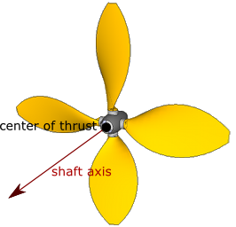

## Propeller

```
Propeller {
  SFVec3f shaftAxis          1 0 0  # unit axis
  SFVec3f centerOfThrust     0 0 0  # any vector
  SFVec2f thrustConstants    1 0    # any vector
  SFVec2f torqueConstants    1 0    # any vector
  SFFloat fastHelixThreshold 75.4   # [0, inf)
  SFNode  device             NULL   # {RotationalMotor, PROTO}
  SFNode  fastHelix          NULL   # {Solid (or derived), PROTO}
  SFNode  slowHelix          NULL   # {Solid (or derived), PROTO}
}
```

### Description

%figure "Propeller axis"



%end

The [Propeller](#propeller) node can be used to model a marine or an aircraft propeller.
When its `device` field is set with a [RotationalMotor](rotationalmotor.md), the propeller turns the motor angular velocity into a thrust and a (resistant) torque.
The resultant thrust is the product of a real number *T* by the unit length shaft axis vector defined in the `shaftAxis` field, with *T* given by the formula:

```
T = t1 * |omega| * omega - t2 * |omega| * V
```

Where *t1* and *t2* are the constants specified in the `thrustConstants` field, *omega* is the motor angular velocity and *V* is the component of the linear velocity of the center of thrust along the shaft axis.
- *t1* somehow represents the volume of fluid moved by the propeller: large helices will have a large *t1* value.
- *t2* roughly represents the friction on the fluid opposing the motion of the propeller: aerodynamic robots evolving in a low viscosity fluid (like air) should have a low *t2* value.

The thrust is applied at the point specified within the `centerOfThrust` field.
The resultant torque is the product of a real number *Q* by the unit length shaft axis vector, with *Q* given by the formula:

```
Q = q1 * |omega| * omega - q2 * |omega| * V
```

Where *q1* and *q2* are the constants specified in the `torqueConstants` field.
The meaning of *q1* and *q2* is pretty similar to the one of *t1* and *t2*.

More details about the above formulae can be found in "Guidance and Control of Ocean Vehicles" from Thor I. Fossen ([ISBN: 9780471941132](https://en.wikipedia.org/wiki/Special:BookSources?isbn=9780471941132)) and "Helicopter Performance, Stability, and Control" from Raymond W. Prouty ([ISBN: 9781575242095](https://en.wikipedia.org/wiki/Special:BookSources?isbn=9781575242095)).

The [propeller.wbt]({{ url.github_tree }}/projects/samples/devices/worlds/propeller.wbt) example shows three different helicopters modeled with [Propeller](#propeller) nodes.

### Field Summary

- `shaftAxis`: defines the axis along which the resultant thrust and torque will be exerted, see [this figure](#propeller-axis).

- `centerOfThrust`: defines the point where the generated thrust applies, see [this figure](#propeller-axis).

- `thrustConstants` and `torqueConstants`: coefficients used to define the resultant thrust and torque as functions of the motor angular velocity and the linear speed of adavance, see above formulae.

- `fastHelixThreshold`: threshold in `[rad/s]` from which the helix representation is switched from `slowHelix` to` fastHelix`.
The default value equals to 24&pi; `[rad/s]`.

- `device`: this field has to be set with a [RotationalMotor](rotationalmotor.md) in order to control the propeller.

- `fastHelix` and `slowHelix`: if not NULL, these fields must be set with [Solid](solid.md) nodes.
The corresponding [Solid](solid.md) nodes define the graphical representation of the propeller according to its motor's angular velocity omega: if `|omega| > fastHelixThreshold`, only the [Solid](solid.md) defined in `fastHelix` is visible, otherwise only the [Solid](solid.md) defined in `slowHelix` is visible.
