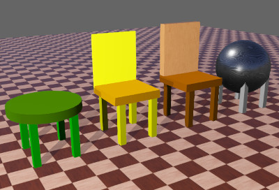

## PROTO Example

A complete example of PROTO definition and instantiation is provided here.
The PROTO is called `TwoColorChair`; it defines a simple chair with four legs and a seating part.
For simplicity, this PROTO does not have bounding objects nor [Physics](physics.md) nodes.
A more complete example of this PROTO named `SimpleChair` is provided in Webots distribution.

The `TwoColorChair` PROTO allows to specify two colors: one for the legs and one for the seating surface of the chair.
The interface also defines a `translation` field and a `rotation` field that are associated with the equally named fields of the PROTO's [Solid](solid.md) base node.
This allows to store the position and orientation of the PROTO instances.

"TwoColorChair.proto":

```
#VRML_SIM {{ webots.version.major }} utf8
# license: Creative Commons Attribution 4.0 International License.
# license url: https://creativecommons.org/licenses/by/4.0/legalcode
# documentation url: https://www.cyberbotics.com/doc/guide/object-chairs
# A two-color chair

PROTO TwoColorChair [
  field SFVec3f    translation       0 0 0.91
  field SFRotation rotation          0 0 1 0
  field SFString   name              "two-color chair"
  field SFColor    legColor          1 1 0
  field SFColor    seatColor         1 0.65 0
  field SFNode     seatGeometry      NULL
  field MFNode     seatExtensionSlot []
]
{
  Solid {
    translation IS translation
    rotation IS rotation
    children [
      Pose {
        translation 0.27 0 0
        children IS seatExtensionSlot
      }
      Pose {
        translation 0 0 -0.35
        children [
          Shape {
            appearance Appearance {
              material Material { diffuseColor IS seatColor }
            }
            geometry IS seatGeometry
          }
        ]
      }
      Pose {
        translation 0.23 -0.25 -0.65
        children [
          DEF LEG_SHAPE Shape {
            appearance Appearance {
              material Material { diffuseColor IS legColor }
            }
            geometry Box { size 0.075 0.075 0.52 }
          }
        ]
      }
      Pose {
        translation 0.23 0.25 -0.65
        children [ USE LEG_SHAPE ]
      }
      Pose {
        translation -0.2 -0.25 -0.65
        children [ USE LEG_SHAPE ]
      }
      Pose {
        translation -0.2 0.25 -0.65
        children [ USE LEG_SHAPE ]
      }
    ]
    name IS name
  }
}
```

As you can observe in this example, it is perfectly valid to have several IS statement for one interface field (`seatColor`), as long as the types match.
It is also possible to use IS statements inside a defined (DEF) node and then to reuse (USE) that node.
This is done here with the `diffuseColor IS legColor` statement placed inside the `DEF LEG_SHAPE Shape` node which is then reused (USE) several times below.

The "ProtoInstantiationExample.wbt" file below exemplifies the instantiation of this PROTO.
PROTO nodes are instantiated using the regular node syntax.
Fields with the default value can be omitted.
Field values which differ from the default must be specified.

"ThreeChairs.wbt":

```
#VRML_SIM {{ webots.version.major }} utf8

EXTERNPROTO "https://raw.githubusercontent.com/cyberbotics/webots/{{ webots.version.major }}/projects/appearances/protos/DamascusSteel.proto"
EXTERNPROTO "https://raw.githubusercontent.com/cyberbotics/webots/{{ webots.version.major }}/projects/appearances/protos/VarnishedPine.proto"
EXTERNPROTO "https://raw.githubusercontent.com/cyberbotics/webots/{{ webots.version.major }}/projects/objects/backgrounds/protos/TexturedBackground.proto"
EXTERNPROTO "https://raw.githubusercontent.com/cyberbotics/webots/{{ webots.version.major }}/projects/objects/backgrounds/protos/TexturedBackgroundLight.proto"
EXTERNPROTO "https://raw.githubusercontent.com/cyberbotics/webots/{{ webots.version.major }}/projects/objects/floors/protos/Floor.proto"
EXTERNPROTO "../protos/TwoColorChair.proto"

WorldInfo {
}
Viewpoint {
  orientation -0.141 0.263 0.954 1.078
  position -0.863 -3.489 1.757
}
TexturedBackground {
}
TexturedBackgroundLight {
  luminosity 0.5
  castShadows FALSE
}
PointLight {
  attenuation 0 0 1
  intensity 20
  location -4 -4 1
  radius 10
  castShadows TRUE
}
Floor {
  size 20 20
}
DEF GREEN_STOOL TwoColorChair {
  translation 0 0 0.9
  name "two-color chair(2)"
  legColor 0 0.666667 0
  seatColor 0.235294 0.470588 0
  seatGeometry Cylinder {
    height 0.1
    radius 0.4
  }
}
DEF YELLOW_CHAIR TwoColorChair {
  translation 1 0 0.9
  seatGeometry Box {
    size 0.6 0.6 0.1
  }
  seatExtensionSlot [
    Pose {
      translation -0.27 0.28 -0.014
      children [
        Shape {
          appearance PBRAppearance {
            baseColor 1 1 0
            roughness 1
            metalness 0
          }
          geometry Box {
            size 0.6 0.03 0.7
          }
        }
      ]
    }
  ]
}
DEF DAMACUS_SPHERE TwoColorChair {
  translation 3 0 0.9
  name "two-color chair(1)"
  legColor 0.678431 0.678431 0.678431
  seatExtensionSlot [
    Pose {
      translation -0.27 0 -0.29
      children [
        Shape {
          appearance DamascusSteel {
          }
          geometry Sphere {
            radius 0.4
            subdivision 5
          }
        }
      ]
    }
  ]
}
DEF WOODEN_CHAIR TwoColorChair {
  translation 2 0 0.9
  name "two-color chair(3)"
  legColor 0.478431 0.239216 0
  seatColor 0.666667 0.333333 0
  seatGeometry Box {
    size 0.6 0.6 0.1
  }
  seatExtensionSlot [
    Pose {
      translation -0.27 0.25 0.05
      children [
        Shape {
          appearance VarnishedPine {
          }
          geometry Box {
            size 0.6 0.1 0.7
          }
        }
      ]
    }
  ]
}
```

The "ThreeChairs.wbt" file once loaded by Webots appears as shown in [this figure](#three-instances-of-the-twocolorchair-proto-in-webots).

As you can observe in this example, defining MFNode fields in the PROTO interface allows to reuse the same model for slightly different objects or robots.
Extension slots like `seatExtensionSlot` field could, for example, be used to add additional devices to a base robot without needing to copy the robot definition or creating a new PROTO.
In this example, a chair backrest has been added as well as a sphere to create a decorative object.


%figure "Three instances of the TwoColorChair PROTO in Webots"



%end
