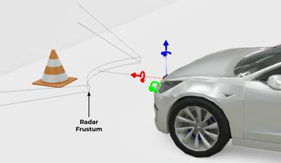

## Radar

Derived from [Device](device.md) and [Solid](solid.md).

```
Radar {
  SFFloat minRange               1       # [0, maxRange)
  SFFloat maxRange               50.0    # (minRange, inf)
  SFFloat horizontalFieldOfView  0.78    # [0, pi]
  SFFloat verticalFieldOfView    0.1     # [0, pi]
  SFFloat minAbsoluteRadialSpeed 0.0     # [0, inf)
  SFFloat minRadialSpeed         1       # [0, maxRadialSpeed]
  SFFloat maxRadialSpeed         -1      # {-1, [minRadialSpeed, inf)}
  SFFloat cellDistance           0.0     # [0, inf)
  SFFloat cellSpeed              0.0     # [0, inf)
  SFFloat rangeNoise             0.0     # [0, inf)
  SFFloat speedNoise             0.0     # [0, inf)
  SFFloat angularNoise           0.0     # [0, inf)
  SFFloat antennaGain            20.0    # (-inf, inf)
  SFFloat frequency              24.0    # [0, inf)
  SFFloat transmittedPower       1.0     # (-inf, inf)
  SFFloat minDetectableSignal    -100    # (-inf, inf)
  SFBool  occlusion              FALSE   # {TRUE, FALSE}
}
```

### Description

%figure "Radar Coordinate System"



%end

The [Radar](#radar) node is used to model a radar sensor.

The [Radar](#radar) node can be used to measure other solids distance, angle, and relative speed.
Any [Solid](solid.md) node is a potential radar target if its `radarCrossSection` field is bigger than 0.

#### WbRadarTarget

A radar target is defined like this:

%tab-component "language"

%tab "C"

```c
typedef struct {
  double distance;
  double received_power;
  double speed;
  double azimuth;
} WbRadarTarget;
```

%tab-end

%tab "C++"

```cpp
#include <webots/Radar.hpp>

namespace webots {
  typedef struct {
    double distance;
    double received_power;
    double speed;
    double azimuth;
  } RadarTarget;
}
```

%tab-end

%tab "Python"

```python
from controller import RadarTarget

class RadarTarget:
    @property
    distance, received_power, speed, azimuth
```

%tab-end

%tab "Java"

```java
import com.cyberbotics.webots.controller.RadarTarget;

public class RadarTarget {
  public double getDistance();
  public double getReceivedPower();
  public double getSpeed();
  public double getAzimuth();
}
```

%tab-end

%tab "MATLAB"

```MATLAB
structs.WbRadarTarget.members = struct(
  'distance', 'double',
  'received_power', 'double',
  'speed', 'double',
  'azimuth', 'double'
);
```

%tab-end

%tab "ROS"

> `RadarTarget` data is directly accessible from the related [`/<device_name>/targets`](#wb_radar_get_targets) topic.

%tab-end

%end

The `distance` is the radial distance between the radar and the target.
The `received_power` is the power received back by the radar from this target in dBm (see the [returned power](#received-power) formulas).
The `speed` is the speed of the target relative to the radar sensor.
The `azimuth` is the horizontal angle of the target relative to the radar.

### Field Summary

- `minRange`: Defines the minimum range of the radar.
Any object closer to the radar than this value will not be seen.

- `maxRange`: Defines the maximum range of the radar.
Any object farther to the radar than this value will not be seen (even if the returned power is sufficient).

- `horizontalFieldOfView`: Defines the horizontal field of view of the radar detection frustum.

- `verticalFieldOfView`: Defines the vertical field of view of the radar detection frustum.

- `minAbsoluteRadialSpeed`: Defines the minimum absolute radial speed (relative to the radar) of the object to be considered as a target.

- `minRadialSpeed` and `maxRadialSpeed`: Defines the minimum and maximum radial speed (relative to the radar) of the object to be visible.
If both `minRadialSpeed` and `maxRadialSpeed` are zero (the default), the radial speed limits are deactivated.

- `cellDistance`: Defines the minimum radial distance between two targets for the radar to be able to distinguish between them.

- `cellSpeed`: Defines the minimum radial speed difference between two targets for the radar to be able to distinguish between them.
A value of 0 means the speed is not used to distinguish objects but only the distance.

- `rangeNoise`: Defines the gaussian noise of the distance measurements.

- `speedNoise`: Defines the gaussian noise of the speed measurements.

- `angularNoise`: Defines the gaussian noise of the angle measurements.

- `antennaGain`: Defines the gain of the antenna in dBi.

- `frequency`: Defines the frequency of the radar in Ghz.

- `transmittedPower`: Defines the power transmitted by the radar in dBm.

- `minDetectableSignal`: Defines the minimum detectable power in dBm.
A returned power lower than this threshold will not produce any target.

- `occlusion`: Defines if occlusions between the object and the radar should be checked before generating a target.
This feature can become computationally expensive as the number of targets increase.

### Target Detection

For each [Solid](solid.md) node having a `radarCrossSection` greater than 0, the following pseudo code is used to compute if a new target should be generated:

```
if (a part of the solid is closer to the radar than maxRange) {
  if (a part of the solid is farther from the radar than minRange) {
    if (object is in the radar detection frustum defined by horizontalFieldOfView and verticalFieldOfView) {
      compute relative radial speed
      if (minRadialSpeed < speed < maxRadialSpeed and abs(speed) > minAbsoluteRadialSpeed) {
        compute returned power
        if (returned power > minDetectableSignal)
          create target
      }
    }
  }
}
if (target created) {
  if (cellSpeed <= 0 and target is closer to another target than cellDistance)
    merge both targets
  else if (cellSpeed > cellSpeed and speed difference between the two target < cellSpeed) {
    if (target is closer to another target than cellDistance)
      merge both targets
  }
}
```

The power returned by the target is computed using the following formulas:

%figure "Received power"


%end

### Radar Functions

#### `wb_radar_enable`
#### `wb_radar_disable`
#### `wb_radar_get_sampling_period`

%tab-component "language"

%tab "C"

```c
#include <webots/radar.h>

void wb_radar_enable(WbDeviceTag tag, int sampling_period);
void wb_radar_disable(WbDeviceTag tag);
int wb_radar_get_sampling_period(WbDeviceTag tag);
```

%tab-end

%tab "C++"

```cpp
#include <webots/Radar.hpp>

namespace webots {
  class Radar : public Device {
    virtual void enable(int samplingPeriod);
    virtual void disable();
    int getSamplingPeriod() const;
    // ...
  }
}
```

%tab-end

%tab "Python"

```python
from controller import Radar

class Radar (Device):
    def enable(self, samplingPeriod):
    def disable(self):
    def getSamplingPeriod(self):
    # ...
```

%tab-end

%tab "Java"

```java
import com.cyberbotics.webots.controller.Radar;

public class Radar extends Device {
  public void enable(int samplingPeriod);
  public void disable();
  public int getSamplingPeriod();
  // ...
}
```

%tab-end

%tab "MATLAB"

```MATLAB
wb_radar_enable(tag, sampling_period)
wb_radar_disable(tag)
period = wb_radar_get_sampling_period(tag)
```

%tab-end

%tab "ROS"

| name | service/topic | data type | data type definition |
| --- | --- | --- | --- |
| `/<device_name>/enable` | `service` | [`webots_ros::set_int`](ros-api.md#common-services) | |
| `/<device_name>/get_sampling_period` | `service` | [`webots_ros::get_int`](ros-api.md#common-services) | |

%tab-end

%end

##### Description

*enable and disable radar updates*

The `wb_radar_enable` function allows the user to enable radar updates.
The `sampling_period` argument specifies the sampling period of the sensor and is expressed in milliseconds.
Note that the first measurement will be available only after the first sampling period elapsed.

The `wb_radar_disable` function turns the radar off, saving computation time.

The `wb_radar_get_sampling_period` function returns the period given into the `wb_radar_enable` function, or 0 if the device is disabled.

---

#### `wb_radar_get_min_range`
#### `wb_radar_get_max_range`

%tab-component "language"

%tab "C"

```c
#include <webots/radar.h>

double wb_radar_get_min_range(WbDeviceTag tag);
double wb_radar_get_max_range(WbDeviceTag tag);
```

%tab-end

%tab "C++"

```cpp
#include <webots/Radar.hpp>

namespace webots {
  class Radar : public Device {
    double getMinRange() const;
    double getMaxRange() const;
    // ...
  }
}
```

%tab-end

%tab "Python"

```python
from controller import Radar

class Radar (Device):
    def getMinRange(self):
    def getMaxRange(self):
    # ...
```

%tab-end

%tab "Java"

```java
import com.cyberbotics.webots.controller.Radar;

public class Radar extends Device {
  public double getMinRange();
  public double getMaxRange();
  // ...
}
```

%tab-end

%tab "MATLAB"

```MATLAB
min_range = wb_radar_get_min_range(tag)
max_range = wb_radar_get_max_range(tag)
```

%tab-end

%tab "ROS"

| name | service/topic | data type | data type definition |
| --- | --- | --- | --- |
| `/<device_name>/get_min_range` | `service` | [`webots_ros::get_float`](ros-api.md#common-services) | |
| `/<device_name>/get_max_range` | `service` | [`webots_ros::get_float`](ros-api.md#common-services) | |

%tab-end

%end

##### Description

*get the minimum and maximum range of the radar*

These functions allow the controller to get the value of the minimum and maximum range of the radar.

---

#### `wb_radar_get_horizontal_fov`
#### `wb_radar_get_vertical_fov`

%tab-component "language"

%tab "C"

```c
#include <webots/radar.h>

double wb_radar_get_horizontal_fov(WbDeviceTag tag);
double wb_radar_get_vertical_fov(WbDeviceTag tag);
```

%tab-end

%tab "C++"

```cpp
#include <webots/Radar.hpp>

namespace webots {
  class Radar : public Device {
    double getHorizontalFov() const;
    double getVerticalFov() const;
    // ...
  }
}
```

%tab-end

%tab "Python"

```python
from controller import Radar

class Radar (Device):
    def getHorizontalFov(self):
    def getVerticalFov(self):
    # ...
```

%tab-end

%tab "Java"

```java
import com.cyberbotics.webots.controller.Radar;

public class Radar extends Device {
  public double getHorizontalFov();
  public double getVerticalFov();
  // ...
}
```

%tab-end

%tab "MATLAB"

```MATLAB
horizontal_fov = wb_radar_get_horizontal_fov(tag)
vertical_fov = wb_radar_get_vertical_fov(tag)
```

%tab-end

%tab "ROS"

| name | service/topic | data type | data type definition |
| --- | --- | --- | --- |
| `/<device_name>/get_vertical_fov` | `service` | [`webots_ros::get_float`](ros-api.md#common-services) | |
| `/<device_name>/get_horizontal_fov` | `service` | [`webots_ros::get_float`](ros-api.md#common-services) | |

%tab-end

%end

##### Description

*get the horizontal and vertical field of view of the radar*

These functions allow the controller to get the value of the horizontal and vertical field of view of the radar.

---

#### `wb_radar_get_number_of_targets`

%tab-component "language"

%tab "C"

```c
#include <webots/radar.h>

int wb_radar_get_number_of_targets(WbDeviceTag tag);
```

%tab-end

%tab "C++"

```cpp
#include <webots/Radar.hpp>

namespace webots {
  class Radar : public Device {
    int getNumberOfTargets() const;
    // ...
  }
}
```

%tab-end

%tab "Python"

```python
from controller import Radar

class Radar (Device):
    def getNumberOfTargets(self):
    # ...
```

%tab-end

%tab "Java"

```java
import com.cyberbotics.webots.controller.Radar;

public class Radar extends Device {
  public int getNumberOfTargets();
  // ...
}
```

%tab-end

%tab "MATLAB"

```MATLAB
targets_number = wb_radar_get_number_of_targets(tag)
```

%tab-end

%tab "ROS"

| name | service/topic | data type | data type definition |
| --- | --- | --- | --- |
| `/<device_name>/number_of_targets` | `topic` | webots_ros::Int8Stamped | [`Header`](http://docs.ros.org/api/std_msgs/html/msg/Header.html) `header`<br/>`int8 data` |

%tab-end

%end

##### Description

*get the current number of targets*

This function allows the controller to get the number of targets currently seen by the radar.

---

#### `wb_radar_get_targets`

%tab-component "language"

%tab "C"

```c
#include <webots/radar.h>

const WbRadarTarget *wb_radar_get_targets(WbDeviceTag tag);
```

%tab-end

%tab "C++"

```cpp
#include <webots/Radar.hpp>

namespace webots {
  class Radar : public Device {
    const RadarTarget *getTargets() const;
    // ...
  }
}
```

%tab-end

%tab "Python"

```python
from controller import Radar

class Radar (Device):
    def getTargets(self):
    # ...
```

%tab-end

%tab "Java"

```java
import com.cyberbotics.webots.controller.Radar;

public class Radar extends Device {
  public RadarTarget[] getTargets();
  // ...
}
```

%tab-end

%tab "MATLAB"

```MATLAB
targets = wb_radar_get_targets(tag)
```

%tab-end

%tab "ROS"

| name | service/topic | data type | data type definition |
| --- | --- | --- | --- |
| `/<device_name>/targets` | `topic` | `webots_ros::RadarTarget` | [`Header`](http://docs.ros.org/api/std_msgs/html/msg/Header.html) `header`<br/>`float64 distance`<br/>`float64 receivedPower`<br/>`float64 speed`<br/>`float64 azimuth` |

%tab-end

%end

##### Description

*get the targets array*

This function returns the targets array.
The size of the array can be get using the function `wb_radar_get_number_of_targets`.
