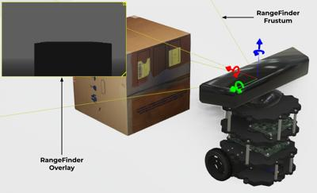
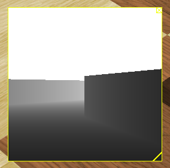

## RangeFinder

Derived from [Device](device.md) and [Solid](solid.md).

```
RangeFinder {
  SFFloat  fieldOfView 0.7854   # [0, 2*pi]
  SFInt32  width       64       # [0, inf)
  SFInt32  height      64       # [0, inf)
  SFString projection  "planar" # {"planar", "spherical", "cylindrical"}
  SFFloat  near        0.01     # [0, inf)
  SFFloat  minRange    0.01     # [near, maxRange]
  SFFloat  maxRange    1.0      # [minRange, inf)
  SFFloat  motionBlur  0.0      # [0, inf)
  SFFloat  noise       0.0      # [0, inf)
  SFFloat  resolution  -1.0     # {-1, [0, inf)}
  SFNode   lens        NULL     # {Lens, PROTO}
}
```

### Description

%figure "RangeFinder Coordinate System"



%end

The [RangeFinder](#rangefinder) node is used to model a robot's on-board range-finder (depth camera).
The resulting image can be displayed on the 3D window.

The range-finder measures depth information (in meters) from an OpenGL rendering.
Each time a range-finder is refreshed, an OpenGL rendering is computed, and the z-buffer is copied into a buffer of `float`.
As the z-buffer contains scaled and logarithmic values, an algorithm linearizes the buffer to metric values between `minRange` and `maxRange`.
This is the buffer which is accessible by the `wb_range_finder_get_range_image` function.

Range-finder detects semi-transparent objects as if they were not transparent.
An object can be semi-transparent either if its texture has an alpha channel, or if its [Material](material.md) `transparency` field is not equal to 1.

### Field Summary

- `fieldOfView`: horizontal field of view angle of the range-finder.
The value is limited to the range 0 to &pi; radians if the `projection` field is set to "planar", otherwise there is no upper limit.
Since range-finder pixels are squares, the vertical field of view can be computed from the `width`, `height` and horizontal `fieldOfView`:

    *vertical FOV = 2 * atan(tan(fieldOfView * 0.5) * (height / width))*

- `width`: width of the image in pixels

- `height`: height of the image in pixels

- `projection`: switch between a planar, a cylindrical or a spherical projection.
More information on cylindrical projections is provided in the [projections](camera.md#spherical-and-cylindrical-projections) section of the [Camera](camera.md) node.

- The `near` field defines the distance from the depth camera to the near clipping plane.
Objects closer to the range-finder than the near value are not detected by the range-finder.
This plane is parallel to the camera retina (i.e., projection plane).
The near field determines the precision of the OpenGL depth buffer.
A too big value produces underestimated distance values.
A typically good value for this field is to set it just big enough so that the shape of the range-finder object is not visible.
More information about the frustum is provided in the [frustum](camera.md#frustum) section of the [Camera](camera.md) node.

- The `minRange` field defines the minimum range of the range-finder (objects closer to the range-finder than the minimum range are not detected (but still occlude other objects).
If the depth is smaller than the `minRange` value then infinity is returned.

- The `maxRange` defines the distance between the range-finder and the far clipping plane of the OpenGL view frustum.
This field defines the maximum range that a range-finder can achieve and so the maximum possible value of the range image (in meter).
If the depth is bigger than the `maxRange` value then infinity is returned.

- If the `motionBlur` field is greater than 0.0, the image is blurred by the motion of the range-finder or objects in the field of view.
More information on motion blur is provided in the [motionBlur](camera.md) field description of the [Camera](camera.md) node.

- If the `noise` field is greater than 0.0, a gaussian noise is added to each depth value of a range-finder image.
A value of 0.0 corresponds to no noise and thus saves computation time.
A value of 1.0 corresponds to a gaussian noise having a standard derivation of `maxRange` meters.

- `resolution`: This field defines the depth resolution of the range-finder, that is the smallest depth difference that it is able to measure.
Setting this field to -1 (default) corresponds to an 'infinite' resolution (it can measure any infinitesimal change).
This field is accepts any value in the interval (0.0, inf).

- The `lens` field may contain a [Lens](lens.md) node to specify the image distortion due to the lens geometry.

### Overlay Image

%figure "RangeFinder overlay image"



%end

The range-finder image is shown by default on top of the 3D window with a yellow border, see [this figure](#rangefinder-overlay-image).
The user can move this range-finder image at the desired position using the mouse drag and drop and resize it by clicking on the icon at the bottom right corner.
Additionally a close button is available on the top right corner to hide the image.
Once the robot is selected, it is also possible to show or hide the overlay images from the `RangeFinder Devices` item in `Robot` menu.

It is also possible to show the range-finder image in an external window by double-clicking on it.
After doing it, the overlay disappears and a new window pops up.
Then, after closing the window, the overlay will be automatically restored.

### RangeFinder Functions

#### `wb_range_finder_enable`
#### `wb_range_finder_disable`
#### `wb_range_finder_get_sampling_period`

%tab-component "language"

%tab "C"

```c
#include <webots/range_finder.h>

void wb_range_finder_enable(WbDeviceTag tag, int sampling_period);
void wb_range_finder_disable(WbDeviceTag tag);
int wb_range_finder_get_sampling_period(WbDeviceTag tag);
```

%tab-end

%tab "C++"

```cpp
#include <webots/RangeFinder.hpp>

namespace webots {
  class RangeFinder : public Device {
    virtual void enable(int samplingPeriod);
    virtual void disable();
    int getSamplingPeriod() const;
    // ...
  }
}
```

%tab-end

%tab "Python"

```python
from controller import RangeFinder

class RangeFinder (Device):
    def enable(self, samplingPeriod):
    def disable(self):
    def getSamplingPeriod(self):
    # ...
```

%tab-end

%tab "Java"

```java
import com.cyberbotics.webots.controller.RangeFinder;

public class RangeFinder extends Device {
  public void enable(int samplingPeriod);
  public void disable();
  public int getSamplingPeriod();
  // ...
}
```

%tab-end

%tab "MATLAB"

```MATLAB
wb_range_finder_enable(tag, sampling_period)
wb_range_finder_disable(tag)
period = wb_range_finder_get_sampling_period(tag)
```

%tab-end

%tab "ROS"

| name | service/topic | data type | data type definition |
| --- | --- | --- | --- |
| `/<device_name>/enable` | `service` | [`webots_ros::set_int`](ros-api.md#common-services) | |
| `/<device_name>/get_sampling_period` | `service` | [`webots_ros::get_int`](ros-api.md#common-services) | |

%tab-end

%end

##### Description

*enable and disable range-finder updates*

The `wb_range_finder_enable` function allows the user to enable range-finder updates.
Once the range-finder is enabled, it will copy depth images from GPU memory to CPU memory at each time step, regardless of `wb_range_finder_get_range_image` calls.

The `sampling_period` argument specifies the sampling period of the sensor and is expressed in milliseconds.
Note that the first measurement will be available only after the first sampling period elapsed.

The `wb_range_finder_disable` function turns the range-finder off, saving computation time.

The `wb_range_finder_get_sampling_period` function returns the period given into the `wb_range_finder_enable` function, or 0 if the device is disabled.

---

#### `wb_range_finder_get_fov`

%tab-component "language"

%tab "C"

```c
#include <webots/range_finder.h>

double wb_range_finder_get_fov(WbDeviceTag tag);
```

%tab-end

%tab "C++"

```cpp
#include <webots/RangeFinder.hpp>

namespace webots {
  class RangeFinder : public Device {
    double getFov() const;
    // ...
  }
}
```

%tab-end

%tab "Python"

```python
from controller import RangeFinder

class RangeFinder (Device):
    def getFov(self):
    # ...
```

%tab-end

%tab "Java"

```java
import com.cyberbotics.webots.controller.RangeFinder;

public class RangeFinder extends Device {
  public double getFov();
  // ...
}
```

%tab-end

%tab "MATLAB"

```MATLAB
fov = wb_range_finder_get_fov(tag)
```

%tab-end

%tab "ROS"

| name | service/topic | data type | data type definition |
| --- | --- | --- | --- |
| `/<device_name>/get_info` | `service` | `webots_ros::range_finder_get_info` | `uint8 ask`<br/>`---`<br/>`uint32 width`<br/>`uint32 height`<br/>`float64 Fov`<br/>`float64 minRange`<br/>`float64 maxRange` |

%tab-end

%end

##### Description

*get field of view for a range-finder*

These functions allow the controller to get the value of the field of view (fov) of a range-finder.

---

#### `wb_range_finder_get_width`
#### `wb_range_finder_get_height`

%tab-component "language"

%tab "C"

```c
#include <webots/range_finder.h>

int wb_range_finder_get_width(WbDeviceTag tag);
int wb_range_finder_get_height(WbDeviceTag tag);
```

%tab-end

%tab "C++"

```cpp
#include <webots/RangeFinder.hpp>

namespace webots {
  class RangeFinder : public Device {
    int getWidth() const;
    int getHeight() const;
    // ...
  }
}
```

%tab-end

%tab "Python"

```python
from controller import RangeFinder

class RangeFinder (Device):
    def getWidth(self):
    def getHeight(self):
    # ...
```

%tab-end

%tab "Java"

```java
import com.cyberbotics.webots.controller.RangeFinder;

public class RangeFinder extends Device {
  public int getWidth();
  public int getHeight();
  // ...
}
```

%tab-end

%tab "MATLAB"

```MATLAB
width = wb_range_finder_get_width(tag)
height = wb_range_finder_get_height(tag)
```

%tab-end

%tab "ROS"

| name | service/topic | data type | data type definition |
| --- | --- | --- | --- |
| `/<device_name>/get_info` | `service` | `webots_ros::range_finder_get_info` | `uint8 ask`<br/>`---`<br/>`uint32 width`<br/>`uint32 height`<br/>`float64 Fov`<br/>`float64 minRange`<br/>`float64 maxRange` |

%tab-end

%end

##### Description

*get the size of the range-finder image*

These functions return the width and height of a range-finder image as defined in the corresponding [RangeFinder](#rangefinder) node.

---

#### `wb_range_finder_get_min_range`
#### `wb_range_finder_get_max_range`

%tab-component "language"

%tab "C"

```c
#include <webots/range_finder.h>

double wb_range_finder_get_min_range(WbDeviceTag tag);
double wb_range_finder_get_max_range(WbDeviceTag tag);
```

%tab-end

%tab "C++"

```cpp
#include <webots/RangeFinder.hpp>

namespace webots {
  class RangeFinder : public Device {
    double getMinRange() const;
    double getMaxRange() const;
    // ...
  }
}
```

%tab-end

%tab "Python"

```python
from controller import RangeFinder

class RangeFinder (Device):
    def getMinRange(self):
    def getMaxRange(self):
    # ...
```

%tab-end

%tab "Java"

```java
import com.cyberbotics.webots.controller.RangeFinder;

public class RangeFinder extends Device {
  public double getMinRange();
  public double getMaxRange();
  // ...
}
```

%tab-end

%tab "MATLAB"

```MATLAB
min_range = wb_range_finder_get_min_range(tag)
max_range = wb_range_finder_get_max_range(tag)
```

%tab-end

%tab "ROS"

| name | service/topic | data type | data type definition |
| --- | --- | --- | --- |
| `/<device_name>/get_info` | `service` | `webots_ros::range_finder_get_info` | `uint8 ask`<br/>`---`<br/>`uint32 width`<br/>`uint32 height`<br/>`float64 Fov`<br/>`float64 minRange`<br/>`float64 maxRange` |

%tab-end

%end

##### Description

*get the minimum and maximum range of the range-finder device*

These functions return the minRange and maxRange parameters of a range-finder device as defined in the corresponding [RangeFinder](#rangefinder) node.

---

#### `wb_range_finder_get_range_image`
#### `wb_range_finder_image_get_depth`

%tab-component "language"

%tab "C"

```c
#include <webots/range_finder.h>

const float *wb_range_finder_get_range_image(WbDeviceTag tag);
float wb_range_finder_image_get_depth(const float *image, int width, int x, int y);
```

%tab-end

%tab "C++"

```cpp
#include <webots/RangeFinder.hpp>

namespace webots {
  class RangeFinder : public Device {
    const float *getRangeImage() const;
    static float rangeImageGetDepth(const float *image, int width, int x, int y);
    // ...
  }
}
```

%tab-end

%tab "Python"

```python
from controller import RangeFinder

class RangeFinder (Device):
    def getRangeImage(self, data_type='list'):
    def getRangeImageArray(self):
    @staticmethod
    def rangeImageGetDepth(image, width, x, y):
    # ...
```

%tab-end

%tab "Java"

```java
import com.cyberbotics.webots.controller.RangeFinder;

public class RangeFinder extends Device {
  public float[] getRangeImage();
  public static float rangeImageGetDepth(float[] image, int width, int x, int y);
  // ...
}
```

%tab-end

%tab "MATLAB"

```MATLAB
image = wb_range_finder_get_range_image(tag)
depth = wb_range_finder_image_get_depth(image, width, x, y)
```

%tab-end

%tab "ROS"

| name | service/topic | data type | data type definition |
| --- | --- | --- | --- |
| `/<device_name>/range_image` | `topic` | [`sensor_msgs::Image`](http://docs.ros.org/api/sensor_msgs/html/msg/Image.html) | [`Header`](http://docs.ros.org/api/std_msgs/html/msg/Header.html) `header`<br/>`uint32 height`<br/>`uint32 width`<br/>`string encoding`<br/>`uint8 is_bigendian`<br/>`uint32 step`<br/>`uint8[] data` |

%tab-end

%end

##### Description

*get the range image and range data from a range-finder*

The `wb_range_finder_get_range_image` macro allows the user to read the contents of the last range image grabbed by a range-finder.
The range image is computed using the depth buffer produced by the OpenGL rendering.
Each pixel corresponds to the distance expressed in meter from the object to the plane defined by the equation *z = 0* within the coordinates system of the range-finder.
The bounds of the range image is determined by the near clipping plane (defined by the `minRange` field) and the far clipping plane (defined by the `maxRange` field).
Infinity will be returned for any depth lesser than the `minRange` value or greater than the `maxRange` value.
The range image is coded as an array of single precision floating point values corresponding to the range value of each pixel of the image.
The precision of the range-finder values decreases when the objects are located farther from the near clipping plane.
Pixels are stored in scan lines running from left to right and from top to bottom.
The memory chunk returned by this function shall not be freed, as it is managed by the range-finder internally.
The contents of the image are subject to change between a call to `wb_robot_step_begin` and the subsequent call to `wb_robot_step_end`.
As a result, if you want to access the image during a step, you should copy it before the step begins and access the copy.
The size in bytes of the range image can be computed as follows:

```
size = range_finder_width * range_finder_height * sizeof(float)
```

Attempting to read outside the bounds of this memory chunk will cause an error.

The `wb_range_finder_image_get_depth` macro is a convenient way to access a range value, directly from its pixel coordinates.
The `range_finder_width` parameter can be obtained from the `wb_range_finder_get_width` function.
The `x` and `y` parameters are the coordinates of the pixel in the image.

> **Note** [Python]: The RangeFinder class has two methods for getting the range-finder image.
The `getRangeImage` function, by default, returns a one-dimensional list of floats, while the `getRangeImageArray` function returns a two-dimensional list of floats.
Their content are identical but their handling is of course different.

> `getRangeImage` takes a `data_type` keyword parameter, supporting either `list` (default) or `buffer`.
> If `buffer`, the function will return a `bytes` object containing the native machine encoding for a buffer of `float` values, closely resembling the C API.
> `buffer` is significantly faster than `list`, and can easily be wrapped using external libraries such as NumPy:

> ```python
> image_c_ptr = range_finder.getRangeImage(data_type="buffer")
> image_np = np.ctypeslib.as_array(image_c_ptr, (range_finder.getWidth() * range_finder.getHeight(),))
> ```

---

#### `wb_range_finder_save_image`

%tab-component "language"

%tab "C"

```c
#include <webots/range_finder.h>

int wb_range_finder_save_image(WbDeviceTag tag, const char *filename, int quality);
```

%tab-end

%tab "C++"

```cpp
#include <webots/RangeFinder.hpp>

namespace webots {
  class RangeFinder : public Device {
    int saveImage(const std::string &filename, int quality) const;
    // ...
  }
}
```

%tab-end

%tab "Python"

```python
from controller import RangeFinder

class RangeFinder (Device):
    def saveImage(self, filename, quality):
    # ...
```

%tab-end

%tab "Java"

```java
import com.cyberbotics.webots.controller.RangeFinder;

public class RangeFinder extends Device {
  public int saveImage(String filename, int quality);
  // ...
}
```

%tab-end

%tab "MATLAB"

```MATLAB
success = wb_range_finder_save_image(tag, 'filename', quality)
```

%tab-end

%tab "ROS"

| name | service/topic | data type | data type definition |
| --- | --- | --- | --- |
| `/<device_name>/save_image` | `service` | `webots_ros::save_image` | `string filename`<br/>`int32 quality`<br/>`---`<br/>`int8 success` |

%tab-end

%end

##### Description

*save a range-finder image in PNG, JPEG or HDR format*

The `wb_range_finder_save_image` function allows the user to save a `tag` image which was previously obtained with the `wb_range_finder_get_range_image` function.
The image can be saved in a file using the PNG, JPEG, or HDR format.
The image format is specified by the `filename` parameter.
If `filename` is terminated by `.png`, the image format is PNG.
Similarly, if `filename` is terminated by `.jpg` or `.jpeg`, the image format is JPEG.
Lastly, if `filename` is terminated by `.hdr` or `.HDR`, the image format is HDR.
Other image formats are not supported.
The `quality` parameter is useful only for JPEG images.
It defines the JPEG quality of the saved image.
The `quality` parameter should be in the range 1 (worst quality) to 100 (best quality).
Low quality JPEG files will use less disk space.
For PNG and HDR images, the `quality` parameter is ignored.

PNG and JPEG images are saved using an 8-bit RGB (grayscale) encoding.
HDR images are saved as 32-bit floating-point single-channel images.
For PNG and JPEG, depth data is stored in the range `0` to `255`.
This depth data can thus be extracted for further use by reading the image file.

`wb_range_finder_save_image` should not be called between a call to `wb_robot_step_begin` and the subsequent call to `wb_robot_step_end`, because the image is subject to change during that period.

The return value of the `wb_range_finder_save_image` function is 0 in case of success.
It is -1 in case of failure (unable to open the specified file or unrecognized image file extension).
