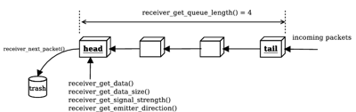

## Receiver

Derived from [Device](device.md) and [Solid](solid.md).

```
Receiver {
  SFString type                "radio"   # {"radio", "serial", "infra-red"}  
  SFFloat  aperture            -1        # {-1, [0, 2*pi]}
  SFInt32  channel             0         # [-1, inf)
  SFInt32  baudRate            -1        # {-1, [0, inf)}
  SFInt32  byteSize            8         # [8, inf)
  SFInt32  bufferSize          -1        # {-1, [0, inf)}
  SFFloat  signalStrengthNoise 0         # [0, inf)
  SFFloat  directionNoise      0         # [0, inf)
  MFInt32  allowedChannels     [ ]       # [0, inf)
}
```

### Description

The [Receiver](#receiver) node is used to model radio, serial or infra-red receivers.
A [Receiver](#receiver) node must be added to the children of a robot or supervisor.
Please note that a [Receiver](#receiver) can receive data but it cannot send it.
In order to achieve bidirectional communication, a robot needs to have both an [Emitter](emitter.md) and a [Receiver](#receiver) on board.

### Field Summary

- `type`: type of signal: "radio", "serial" or "infra-red".
Signals of type "radio" (the default) and "serial" are transmitted without taking obstacles into account.
Signals of type "infra-red," however, do take potential obstacles between the emitter and the receiver into account.
Any solid object (solid, robots, etc ...) with a defined bounding object is a potential obstacle for an "infra-red" communication.
The structure of the emitting or receiving robot itself will not block an "infra-red" transmission.
Currently, there is no implementation difference between the "radio" and "serial" types.

- `aperture`: opening angle of the reception cone (in radians); for "infra-red" only.
The receiver can only receive messages from emitters currently located within its reception cone.
The cone's apex is located at the origin ([0 0 0]) of the receiver's coordinate system and the cone's axis coincides with the x-axis of the receiver coordinate system (see [this figure](emitter.md#illustration-of-aperture-and-range-for-infra-red-emitter-receiver) in [this section](emitter.md)).
An `aperture` of -1 (the default) is considered to be infinite, meaning that a signal can be received from any direction.
For "radio" receivers, the `aperture` field is ignored.

- `channel`: reception channel.
The value is an identification number for an "infra-red" receiver or a frequency for a "radio" receiver.
Normally, both emitter and receiver must use the same channel in order to be able to communicate.
However, the special -1 channel number allows the receiver to listen to all channels.

- `baudRate`: the baud rate is the communication speed expressed in bits per second.
It should be the same as the speed of the emitter.
Currently, this field is ignored.

- `byteSize`: the byte size is the number of bits used to represent one byte of transmitted data (usually 8, but may be more if control bits are used).
It should be the same size as the emitter byte size.
Currently, this field is ignored.

- `bufferSize`: size (in bytes) of the reception buffer.
The size of the received data should not exceed the buffer size at any time, otherwise data may be lost.
A `bufferSize` of -1 (the default) is regarded as unlimited buffer size.
If the previous data has not been read when new data is received, the previous data is lost.

- `signalStrengthNoise`: standard deviation of the gaussian noise added to the signal strength returned by `wb_receiver_get_signal_strength`.
The noise is proportionnal to the signal strength, e.g., a `signalStrengthNoise` of 0.1 will add a noise with a standard deviation of 0.1 for a signal strength of 1 and 0.2 for a signal strength of 2.

- `directionNoise`: standard deviation of the gaussian noise added to each of the components of the direction returned by `wb_receiver_get_emitter_direction`.
The noise is not dependent on the distance between emitter-receiver.

- `allowedChannels`: specifies allowed channels [Receiver](#receiver) is allowed to listen to.
Empty list (default) gives unlimited access.

### Receiver Functions

#### `wb_receiver_enable`
#### `wb_receiver_disable`
#### `wb_receiver_get_sampling_period`

%tab-component "language"

%tab "C"

```c
#include <webots/receiver.h>

void wb_receiver_enable(WbDeviceTag tag, int sampling_period);
void wb_receiver_disable(WbDeviceTag tag);
int wb_receiver_get_sampling_period(WbDeviceTag tag);
```

%tab-end

%tab "C++"

```cpp
#include <webots/Receiver.hpp>

namespace webots {
  class Receiver : public Device {
    virtual void enable(int samplingPeriod);
    virtual void disable();
    int getSamplingPeriod() const;
    // ...
  }
}
```

%tab-end

%tab "Python"

```python
from controller import Receiver

class Receiver (Device):
    def enable(self, samplingPeriod):
    def disable(self):
    def getSamplingPeriod(self):
    # ...
```

%tab-end

%tab "Java"

```java
import com.cyberbotics.webots.controller.Receiver;

public class Receiver extends Device {
  public void enable(int samplingPeriod);
  public void disable();
  public int getSamplingPeriod();
  // ...
}
```

%tab-end

%tab "MATLAB"

```MATLAB
wb_receiver_enable(tag, sampling_period)
wb_receiver_disable(tag)
period = wb_receiver_get_sampling_period(tag)
```

%tab-end

%tab "ROS"

| name | service/topic | data type | data type definition |
| --- | --- | --- | --- |
| `/<device_name>/enable` | `service` | [`webots_ros::set_int`](ros-api.md#common-services) | |
| `/<device_name>/get_sampling_period` | `service` | [`webots_ros::get_int`](ros-api.md#common-services) | |

%tab-end

%end

##### Description

*enable and disable receiver*

The `wb_receiver_enable` function starts the receiver listening for incoming data packets.
Data reception is activated in the background of the controller's loop at a rate of once every `sampling_period` (expressed in milliseconds).
Incoming data packets are appended to the tail of the reception queue (see [this figure](#receivers-packet-queue)).
Incoming data packets will be discarded if the receiver's buffer size (specified in the [Receiver](#receiver) node) is exceeded.
To avoid buffer overflow, the data packets should be read at a high enough rate by the controller program.
The `sampling_period` argument specifies the sampling period of the [Receiver](#receiver) and is expressed in milliseconds.
The [Receiver](#receiver) node receives and queues the incoming packets since it is enabled, but the first data packets can only be retrieved after the first sampling period elapsed.

The `wb_receiver_disable` function stops the background listening.

The `wb_receiver_get_sampling_period` function returns the period given into the `wb_receiver_enable` function, or 0 if the device is disabled.

---

#### `wb_receiver_get_queue_length`
#### `wb_receiver_next_packet`

%tab-component "language"

%tab "C"

```c
#include <webots/receiver.h>

int wb_receiver_get_queue_length(WbDeviceTag tag);
void wb_receiver_next_packet(WbDeviceTag tag);
```

%tab-end

%tab "C++"

```cpp
#include <webots/Receiver.hpp>

namespace webots {
  class Receiver : public Device {
    int getQueueLength() const;
    virtual void nextPacket();
    // ...
  }
}
```

%tab-end

%tab "Python"

```python
from controller import Receiver

class Receiver (Device):
    def getQueueLength(self):
    def nextPacket(self):
    # ...
```

%tab-end

%tab "Java"

```java
import com.cyberbotics.webots.controller.Receiver;

public class Receiver extends Device {
  public int getQueueLength();
  public void nextPacket();
  // ...
}
```

%tab-end

%tab "MATLAB"

```MATLAB
length = wb_receiver_get_queue_length(tag)
wb_receiver_next_packet(tag)
```

%tab-end

%tab "ROS"

| name | service/topic | data type | data type definition |
| --- | --- | --- | --- |
| `/<device_name>/get_queue_length` | `service` | [`webots_ros::get_int`](ros-api.md#common-services) | |
| `/<device_name>/next_packet` | `service` | [`webots_ros::get_bool`](ros-api.md#common-services) | |

%tab-end

%end

##### Description

*check for the presence of data packets in the receivers queue*

The `wb_receiver_get_queue_length` function returns the number of data packets currently present in the receiver's queue (see [this figure](#receivers-packet-queue)).

The [Receiver](#receiver) node receives and queues the data packets immediately so that they will be available at the next sampling period.
But the [Emitter](emitter.md) node needs one basic time step to send the message.

The `wb_receiver_next_packet` function deletes the head packet.
The next packet in the queue, if any, becomes the new head packet.
The user must copy useful data from the head packet, before calling the `wb_receiver_next_packet` function.
It is illegal to call the `wb_receiver_next_packet` function when the queue is empty (i.e. when `wb_receiver_get_queue_length() == 0`).
Here is a usage example:

```c
while (wb_receiver_get_queue_length(tag) > 0) {
  const char *message = wb_receiver_get_data(tag);
  const double *dir = wb_receiver_get_emitter_direction(tag);
  double signal = wb_receiver_get_signal_strength(tag);
  printf("received: %s (signal=%g, dir=[%g %g %g])\n",
         message, signal, dir[0], dir[1], dir[2]);
  wb_receiver_next_packet(tag);
}
```

This example assumes that the data (*message*) was sent in the form of a null-terminated string.
The Emitter/Receiver API does not put any restriction on the type of data that can be transmitted.
Any user chosen format is suitable, as long as emitters and receivers agree.

%figure "Receiver's packet queue"



%end

> **Note**: Webots' Emitter/Receiver API guarantees that:

- Packets will be received in the same order they were sent
- Packets will be transmitted atomically (no byte-wise fragmentation)

However, the Emitter/Receiver API does not guarantee a specific schedule for the transmission.
Sometimes several packets may be bundled and received together.
For example, imagine a simple setup where two robots have an [Emitter](emitter.md) and a [Receiver](#receiver) on board.
If both robots use the same controller time step and each one sends a packet at every time step, then the Receivers will receive, on average, one data packet at each step, but they may sometimes get zero packets, and sometimes two! Therefore it is recommend to write code that is tolerant to variations in the transmission timing and that can deal with the eventuality of receiving several or no packets at all during a particular time step.
The `wb_receiver_get_queue_length` function should be used to check how many packets are actually present in the [Receiver](#receiver)'s queue.
Making assumptions based on timing will result in code that is not robust.

---

#### `wb_receiver_get_data`
#### `wb_receiver_get_data_size`

%tab-component "language"

%tab "C"

```c
#include <webots/receiver.h>

const void *wb_receiver_get_data(WbDeviceTag tag);
int wb_receiver_get_data_size(WbDeviceTag tag);
```

%tab-end

%tab "C++"

```cpp
#include <webots/Receiver.hpp>

namespace webots {
  class Receiver : public Device {
    const void *getData() const;
    int getDataSize() const;
    // ...
  }
}
```

%tab-end

%tab "Python"

```python
from controller import Receiver

class Receiver (Device):
    def getBytes(self):
    def getString(self):
    def getFloats(self):
    def getInts(self):
    def getBools(self):
    def getDataSize(self):
    # ...
```

%tab-end

%tab "Java"

```java
import com.cyberbotics.webots.controller.Receiver;

public class Receiver extends Device {
  public byte[] getData();
  public int getDataSize();
  // ...
}
```

%tab-end

%tab "MATLAB"

```MATLAB
size = wb_receiver_get_data_size(tag)
data = wb_receiver_get_data(tag, type)
```

%tab-end

%tab "ROS"

| name | service/topic | data type | data type definition |
| --- | --- | --- | --- |
| `/<device_name>/data` | `topic` | `webots_ros::StringStamped` | [`Header`](http://docs.ros.org/api/std_msgs/html/msg/Header.html) `header`<br/>`string data` |
| `/<device_name>/get_data_size` | `service` | [`webots_ros::get_int`](ros-api.md#common-services) | |

%tab-end

%end

##### Description

*get data and size of the current packet*

The `wb_receiver_get_data` function returns the data of the packet at the head of the reception queue (see [this figure](#receivers-packet-queue)).
The returned data pointer is only valid until the next call to the `wb_receiver_next_packet` function.
It is illegal to call the `wb_receiver_get_data` function when the queue is empty (i.e. when `wb_receiver_get_queue_length() == 0`).
The [Receiver](#receiver) node knows nothing about that structure of the data being sent but its byte size.
The emitting and receiving code is responsible to agree on a specific format.

The `wb_receiver_get_data_size` function returns the number of data bytes present in the head packet of the reception queue.
The *data size* is always equal to the *size* argument of the corresponding `emitter_send_packet` function call.
It is illegal to call the `wb_receiver_get_data_size` function when the queue is empty (i.e. when `wb_receiver_get_queue_length() == 0`).

> **Note** [Python]: In the Python API, instead of having a single function returning the data, multiple functions are defined that automatically convert the data to the expected return type (bytes, string, list of floats, list of integers, list of booleans).

<!-- -->

> **Note** [MATLAB]: The MATLAB `wb_receiver_get_data` function returns a MATLAB *libpointer* if the `type` argument is not set (type should be `uint8`, `double` or `string`).
The receiving code is responsible for extracting the data from the *libpointer* using MATLAB's `setdatatype` and `get` functions.
Here is an example on how to send and receive a 2x3 MATLAB matrix.

> ```MATLAB
> % sending robot
> emitter = wb_robot_get_device('emitter');
>
> A = [1, 2, 3; 4, 5, 6];
> wb_emitter_send(emitter, A);

> % receiving robot
> receiver = wb_robot_get_device('receiver');
> wb_receiver_enable(receiver, TIME_STEP);
>
> while wb_receiver_get_queue_length(receiver) > 0
>   pointer = wb_receiver_get_data(receiver);
>   setdatatype(pointer, 'doublePtr', 2, 3);
>   A = get(pointer, 'Value');
>   wb_receiver_next_packet(receiver);
> end
> ```

> The MATLAB `wb_receiver_get_data` function can also take a second argument that specifies the type of the expected data.
In this case the function does not return a *libpointer* but an object of the specified type, and it is not necessary to call `setdatatype` and `get` functions.
For example the `wb_receiver_get_data` function can be used like this:

> ```MATLAB
> % receiving robot
> receiver = wb_robot_get_device('receiver');
> wb_receiver_enable(receiver, TIME_STEP);
>
> while wb_receiver_get_queue_length(receiver) > 0
>   A = wb_receiver_get_data(receiver, 'double');
>   wb_receiver_next_packet(receiver);
> end
> ```

> The available types are 'uint8', 'double' and 'string'.
More sophisticated data typed must be accessed explicitly using `setdatatype` and `get` functions.

---

#### `wb_receiver_get_signal_strength`
#### `wb_receiver_get_emitter_direction`

%tab-component "language"

%tab "C"

```c
#include <webots/receiver.h>

double wb_receiver_get_signal_strength(WbDeviceTag tag);
const double *wb_receiver_get_emitter_direction(WbDeviceTag tag);
```

%tab-end

%tab "C++"

```cpp
#include <webots/Receiver.hpp>

namespace webots {
  class Receiver : public Device {
    double getSignalStrength() const;
    const double *getEmitterDirection() const;
    // ...
  }
}
```

%tab-end

%tab "Python"

```python
from controller import Receiver

class Receiver (Device):
    def getSignalStrength(self):
    def getEmitterDirection(self):
    # ...
```

%tab-end

%tab "Java"

```java
import com.cyberbotics.webots.controller.Receiver;

public class Receiver extends Device {
  public double getSignalStrength();
  public double[] getEmitterDirection();
  // ...
}
```

%tab-end

%tab "MATLAB"

```MATLAB
strength = wb_receiver_get_signal_strength(tag)
x_y_z_array = wb_receiver_get_emitter_direction(tag)
```

%tab-end

%tab "ROS"

| name | service/topic | data type | data type definition |
| --- | --- | --- | --- |
| `/<device_name>/get_signal_strength` | `service` | [`webots_ros::get_float`](ros-api.md#common-services) | |
| `/<device_name>/get_emitter_direction` | `service` | `webots_ros::receiver_get_emitter_direction` | `uint8 ask`<br/>`---`<br/>`float64[] direction` |

%tab-end

%end

##### Description

*get signal strength and emitter direction*

The `wb_receiver_get_signal_strength` function operates on the head packet in the receiver's queue (see [this figure](#receivers-packet-queue)).
It returns the simulated signal strength at the time the packet was transmitted.
This signal strength is equal to the inverse of the distance between the emitter and the receiver squared.
In other words, *s = 1 / r²*, where *s* is the signal strength and *r* is the distance between emitter and receiver.
If the packet is sent from a physics plugin, the returned value will be positive infinity.
It is illegal to call this function if the receiver's queue is empty (i.e. when `wb_receiver_get_queue_length() == 0`).

The `wb_receiver_get_emitter_direction` function also operates on the head packet in the receiver's queue.
It returns a normalized (length=1) vector that indicates the direction of the emitter with respect to the receiver's coordinate system.
The three vector components indicate the *x, y*, and *z*-directions of the emitter, respectively.
For example, if the emitter was exactly in front of the receiver, then the vector would be [1 0 0].
In the usual orientation used for 2D simulations (robots moving in the *xy*-plane and the *z*-axis oriented upwards), a positive *y*-component indicates that the emitter is located to the left of the receiver while a negative *y*-component indicates that the emitter is located to the right.
If the packet is sent from a physics plugin, the returned values will be NaN (Not a Number).
The returned vector is valid only until the next call to the `wb_receiver_next_packet` function.
It is illegal to call this function if the receiver's queue is empty (i.e. when `wb_receiver_get_queue_length() == 0`).

> **Note** [Python]: The `getEmitterDirection` function returns the vector as a list containing three floats.

---

#### `wb_receiver_set_channel`
#### `wb_receiver_get_channel`

%tab-component "language"

%tab "C"

```c
#include <webots/receiver.h>

#define WB_CHANNEL_BROADCAST

void wb_receiver_set_channel(WbDeviceTag tag, int channel);
int wb_receiver_get_channel(WbDeviceTag tag);
```

%tab-end

%tab "C++"

```cpp
#include <webots/Receiver.hpp>

namespace webots {
  class Receiver : public Device {
    enum {CHANNEL_BROADCAST};

    virtual void setChannel(int channel);
    int getChannel() const;
    // ...
  }
}
```

%tab-end

%tab "Python"

```python
from controller import Receiver

class Receiver (Device):
    CHANNEL_BROADCAST

    def setChannel(self, channel):
    def getChannel(self):
    # ...
```

%tab-end

%tab "Java"

```java
import com.cyberbotics.webots.controller.Receiver;

public class Receiver extends Device {
  public final static int CHANNEL_BROADCAST;

  public void setChannel(int channel);
  public int getChannel();
  // ...
}
```

%tab-end

%tab "MATLAB"

```MATLAB
WB_CHANNEL_BROADCAST

wb_receiver_set_channel(tag, channel)
channel = wb_receiver_get_channel(tag)
```

%tab-end

%tab "ROS"

| name | service/topic | data type | data type definition |
| --- | --- | --- | --- |
| `/<device_name>/set_channel` | `service` | [`webots_ros::set_int`](ros-api.md#common-services) | |
| `/<device_name>/get_channel` | `service` | [`webots_ros::get_int`](ros-api.md#common-services) | |

%tab-end

%end

##### Description

*set and get the receiver's channel.*

The `wb_receiver_set_channel` function allows a receiver to change its reception channel.
The target channel must be included in `allowedChannels` or `allowedChannels` should be empty.
It modifies the `channel` field of the corresponding [Receiver](#receiver) node.
Normally, a receiver can only receive data packets from emitters that use the same channel.
However, the special WB\_CHANNEL\_BROADCAST value can be used to listen simultaneously to all channels.

The `wb_receiver_get_channel` function returns the current channel number of the receiver.
