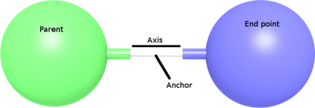

## SliderJoint

Derived from [Joint](joint.md).

```
SliderJoint {
  MFNode  device   [ ]   # {LinearMotor, PositionSensor, Brake, PROTO}
  # hidden fields
  SFFloat position 0     # [0, inf)
}
```

### Description

%figure "Slider joint"



%end

The [SliderJoint](#sliderjoint) node can be used to model a slider, i.e. a joint allowing only a translation motion along a given axis (1 degree of freedom).
It inherits [Joint](joint.md)'s `jointParameters` field.
This field can be filled with a [JointParameters](jointparameters.md) only.
If empty, [JointParameters](jointparameters.md) default values apply.

### Field Summary

- `device`: This field optionally specifies a [LinearMotor](linearmotor.md), a linear [PositionSensor](positionsensor.md) and/or a [Brake](brake.md) device.
If no motor is specified, the joint is passive joint.

### Hidden Field Summary

- `position`: This field is not visible from the Scene Tree, see [joint's hidden position field](joint.md#joints-hidden-position-fields).
