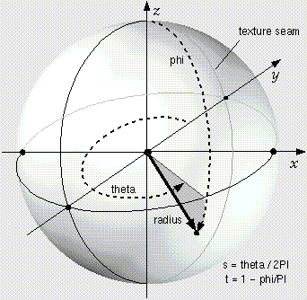

## Sphere

```
Sphere {
  SFFloat radius      1    # [0, inf)
  SFInt32 subdivision 1    # [1, 5] if 'ico' is TRUE, otherwise [3, 32]
  SFBool  ico         TRUE # {TRUE, FALSE}
}
```

The [Sphere](#sphere) node specifies a sphere centered at (0,0,0) in the local coordinate system.
The `radius` field specifies the radius of the sphere (see [this figure](#sphere-node)).

%figure "Sphere node"



%end

The `subdivision` field controls the number of faces of the rendered sphere.
If the `ico` field is TRUE and the `subdivision` field is 0, the sphere is rendered as an icosahedron with 20 faces. If the `subdivision` field is 1 (default value), then each face of the icosahedron is subdivided into 4 faces, resulting in a 80 faces icosahedron.
With a subdivision field set to 2, 320 faces will be rendered, making the sphere very smooth.
A maximum value of 5 (corresponding to 20480 faces) is allowed for this subdivision field to avoid a very long rendering process.
If the `ico` field is FALSE, then the sphere is rendered as a UV sphere, and the `subdivision` value has to be in the range [3, 32].
In this case the `subdivision` field specifies the number of rings and segments in which the sphere is subdivided.
If the `subdivision` field is set to 3, then the sphere will have 3 rings and 3 segments, making 9 faces.
With a `subdivision` field set to 32, the faces are 1024.

The `ico` field specifies whether the sphere is rendered as an icosahedron (TRUE) or a UV sphere (FALSE).
By default [Sphere](#sphere) nodes created in Webots are icosahedrons with `subdivision` value of 1, whereas sphere geometries imported from VRML are UV spheres with a `subdivision` value of 24.

%figure "Sphere tessellations"


%end

When a texture is applied to a sphere, the texture covers the entire surface, wrapping counterclockwise from the left of the sphere.
The texture is applied using a UV mapping and it has a seam on the left side where the *yz*-plane intersects the sphere.
[TextureTransform](texturetransform.md) affects the texture coordinates of the Sphere.
