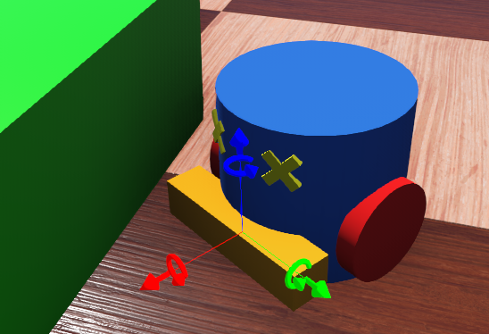

## TouchSensor

Derived from [Device](device.md) and [Solid](solid.md).

```
TouchSensor {
  SFString type        "bumper"                  # {"bumper", "force", "force-3d"}
  MFVec3f  lookupTable [ 0 0 0, 5000 50000 0 ]   # lookup table
  SFFloat  resolution  -1                        # {-1, [0, inf)}
}
```

### Description

A [TouchSensor](#touchsensor) node is used to model a bumper or a force sensor.
The [TouchSensor](#touchsensor) comes in three different types.
The "bumper" type simply detects collisions and returns a boolean status.
The "force" type measures the force exerted on the sensor's body on one axis (x-axis).
The "force-3d" type measures the 3d force vector exerted by external object on the sensor's body.

Examples of using the [TouchSensor](#touchsensor) are provided by the "hoap2\_sumo.wbt" and "hoap2\_walk.wbt" worlds (located in the "projects/robots/hoap2/worlds" directory of Webots) and by the "force\_sensor.wbt" and "bumper.wbt" worlds (located in the "projects/samples/devices/worlds" directory of Webots).

### Field Summary

- `type`: allows the user to select the type of sensor: "bumper", "force", or "force-3d", described below.

- `lookupTable`: similar to the one used by the [DistanceSensor](distancesensor.md#lookup-table) node.

- `resolution`: This field allows to define the resolution of the sensor, the resolution is the smallest change that it is able to measure.
Setting this field to -1 (default) means that the sensor has an 'infinite' resolution (it can measure any infinitesimal change).
This field is used only if the type is "force" or "force-3d" and accepts any value in the interval (0.0, inf).

### Types

#### "bumper" Sensors

A "bumper" [TouchSensor](#touchsensor) returns a boolean value that indicates whether or not there is a collision with another object.
More precisely, it returns 1.0 if a collision is detected and 0.0 otherwise.
A collision is detected when the `boundingObject` of the [TouchSensor](#touchsensor) intersects the `boundingObject` of any other [Solid](solid.md) object.
The `lookupTable` field of a "bumper" sensor is ignored.
The [Physics](physics.md) node of a "bumper" sensor is not required.

#### "force" Sensors

A "force" [TouchSensor](#touchsensor) computes the (scalar) amount of force currently exerted on the sensor's body along the x-axis.
The sensor uses this equation: *r=|f|*cos(α)*, where *r* is the return value, *f* is the cumulative force currently exerted on the sensor's body, and *α* is the angle between *f* and the sensor's x-axis.
So the "force" sensor returns the projection of the force on its x-axis; a force perpendicular to the x-axis yields zero.
For this reason, a "force" sensor must be oriented such that its positive x-axis points outside of the robot, in the direction where the force needs to be measured.
For example, if the [TouchSensor](#touchsensor) is used as a foot sensor then the x-axis should be oriented downwards.
The scalar force value must be read using the `wb_touch_sensor_get_value` function.

#### "force-3d" Sensors

A "force-3d" [TouchSensor](#touchsensor) returns a 3d-vector that represents the cumulative force currently applied to its body.
This 3d-vector is expressed in the coordinate system of the [TouchSensor](#touchsensor).
The length of the vector reflects the magnitude of the force.
The force vector must be read using the `wb_touch_sensor_get_values` function.

%figure "TouchSensor types"

| sensor type    | "bumper"                        | "force"                         | "force-3d"                       |
| -------------- | ------------------------------- | ------------------------------- | -------------------------------- |
| boundingObject | required                        | required                        | required                         |
| Physics node   | not required                    | required                        | required                         |
| lookupTable    | ignored                         | used                            | used                             |
| return value   | 0 or 1                          | scalar                          | vector                           |
| API function   | wb\_touch\_sensor\_get\_value() | wb\_touch\_sensor\_get\_value() | wb\_touch\_sensor\_get\_values() |

%end

### Lookup Table

A "force" and "force-3d" sensors can optionally specify a `lookupTable` to simulate the possible non-linearity (and saturation) of the real device.
The `lookupTable` allows the user to map the simulated force measured in *newton* [N] to an output value that will be returned by the `wb_touch_sensor_get_value` function.
The value returned by the force sensor is first computed by the ODE physics engine, then interpolated using the `lookupTable`, and finally noise is added (if specified in the lookupTable).
Each line of the `lookupTable` contains three numbers: (1) an input force in *newton* [N], (2) the corresponding output value, and (3) a noise level between 0.0 and 1.0 (see [DistanceSensor](distancesensor.md) for more info).
Note that the default `lookupTable` of the [TouchSensor](#touchsensor) node is:

```
[   0     0 0
5000 50000 0 ]
```

Hence it maps forces between 0 and 5000 *newton* [N] to output values between 0 and 50000, the output unit being 0.1 *newton* [N].
You should empty the `lookupTable` to have *newton* [N] as output units.

### Collision Detection

[TouchSensor](#touchsensor)s detect collisions based on the 3D geometry of its `boundingObject`.
So the `boundingObject` must be specified for every type of [TouchSensor](#touchsensor).
Because the actual 3D intersection of the sensors `boundingObject`s with other `boundingObject`s is used in the calculation, it is very important that the sensors' `boundingObject`s are correctly positioned; they should be able to collide with other objects, otherwise they would be ineffective.
For that reason, the `boundingObject`s of [TouchSensor](#touchsensor)s should always extend beyond the other `boundingObject`s of the robot in the area where the collision is expected.

For example, let's assume that you want to add a [TouchSensor](#touchsensor) under the foot of a humanoid robot.
In this case, it is critical that the `boundingObject` of this sensor (and not any other `boundingObject` of the robot) makes the actual contact with the floor.
Therefore, it is necessary that the sensor's `boundingObject` extend below any other `boundingObject` of the robot (e.g., foot, ankle, etc.).

### Coordinate System

It is easy to check the orientation of the coordinate system of a [TouchSensor](#touchsensor): if you select the [TouchSensor](#touchsensor) object in the Scene Tree, then only the bounding object of this [TouchSensor](#touchsensor) should be shown in the 3D window.
If you zoom in on this bounding object, you should see the red/green/blue depiction of the [TouchSensor](#touchsensor)'s coordinate system (the color coding is: *x/y/z* = red/green/blue).
For a "force" sensor, the red (*x*) component should point in the direction where the collision is expected.

%figure "Coordinate system of a TouchSensor."



%end


### Accuracy

The force measured by the ODE physics engine is only a rough approximation of a real physical force.
This approximation usually improves as the `basicTimeStep` ([WorldInfo](worldinfo.md) node) decreases.

### TouchSensor Functions

#### `wb_touch_sensor_enable`
#### `wb_touch_sensor_disable`
#### `wb_touch_sensor_get_sampling_period`
#### `wb_touch_sensor_get_value`
#### `wb_touch_sensor_get_values`
#### `wb_touch_sensor_get_lookup_table_size`
#### `wb_touch_sensor_get_lookup_table`

%tab-component "language"

%tab "C"

```c
#include <webots/touch_sensor.h>

void wb_touch_sensor_enable(WbDeviceTag tag, int sampling_period);
void wb_touch_sensor_disable(WbDeviceTag tag);
int wb_touch_sensor_get_sampling_period(WbDeviceTag tag);
double wb_touch_sensor_get_value(WbDeviceTag tag);
const double *wb_touch_sensor_get_values(WbDeviceTag tag);
int wb_touch_sensor_get_lookup_table_size(WbDeviceTag tag);
const double *wb_touch_sensor_get_lookup_table(WbDeviceTag tag);
```

%tab-end

%tab "C++"

```cpp
#include <webots/TouchSensor.hpp>

namespace webots {
  class TouchSensor : public Device {
    virtual void enable(int samplingPeriod);
    virtual void disable();
    int getSamplingPeriod() const;
    double getValue() const;
    const double *getValues() const;
    int getLookupTableSize() const;
    const double *getLookupTable() const;
    // ...
  }
}
```

%tab-end

%tab "Python"

```python
from controller import TouchSensor

class TouchSensor (Device):
    def enable(self, samplingPeriod):
    def disable(self):
    def getSamplingPeriod(self):
    def getValue(self):
    def getValues(self):
    def getLookupTable(self):
    # ...
```

%tab-end

%tab "Java"

```java
import com.cyberbotics.webots.controller.TouchSensor;

public class TouchSensor extends Device
  public void enable(int samplingPeriod);
  public void disable();
  public int getSamplingPeriod();
  public double getValue();
  public double[] getValues();
  public double[] getLookupTable();
  // ...
}
```

%tab-end

%tab "MATLAB"

```MATLAB
wb_touch_sensor_enable(tag, sampling_period)
wb_touch_sensor_disable(tag)
period = wb_touch_sensor_get_sampling_period(tag)
value = wb_touch_sensor_get_value(tag)
x_y_z_array = wb_touch_sensor_get_values(tag)
lookup_table_array = wb_touch_sensor_get_lookup_table(tag)
```

%tab-end

%tab "ROS"

| name | service/topic | data type | data type definition |
| --- | --- | --- | --- |
| `/<device_name>/value` | `topic` | webots_ros::Float64Stamped | [`Header`](http://docs.ros.org/api/std_msgs/html/msg/Header.html) `header`<br/>`float64 data` |
| `/<device_name>/values` | `topic` | [`geometry_msgs::WrenchStamped`](http://docs.ros.org/api/geometry_msgs/html/msg/WrenchStamped.html) | [`Header`](http://docs.ros.org/api/std_msgs/html/msg/Header.html) `header`<br/>[`Wrench`](http://docs.ros.org/api/geometry_msgs/html/msg/Wrench.html) wrench |
| `/<device_name>/value` | `topic` | `webots_ros::BoolStamped` | [`Header`](http://docs.ros.org/api/std_msgs/html/msg/Header.html) `header`<br/>`bool data` |
| `/<device_name>/enable` | `service` | [`webots_ros::set_int`](ros-api.md#common-services) | |
| `/<device_name>/get_sampling_period` | `service` | [`webots_ros::get_int`](ros-api.md#common-services) | |
| `/<device_name>/get_lookup_table` | `service` | [`webots_ros::get_float_array`](ros-api.md#common-services) | |

%tab-end

%end

##### Description

*enable, disable and read last touch sensor measurements*

The `wb_touch_sensor_enable` function allows the user to enable touch sensor measurements.
The `sampling_period` argument specifies the sampling period of the sensor and is expressed in milliseconds.
Note that the first measurement will be available only after the first sampling period has elapsed.

The `wb_touch_sensor_disable` function turns the touch sensor off, saving computation time.

The `wb_touch_sensor_get_value` function returns the last value measured by a "bumper" or "force" [TouchSensor](#touchsensor).
This function can be used with a sensor of type "bumper" or "force".
For a "force" sensor, the value may be altered by an optional lookup table.
For a "bumper" sensor, the value can be 0.0 or 1.0.

The `wb_touch_sensor_get_sampling_period` function returns the period given into the `wb_touch_sensor_enable` function, or 0 if the device is disabled.

The `wb_touch_sensor_get_values` function returns the last force vector measured by a "force-3d" [TouchSensor](#touchsensor).
This function can be used with a sensor of type "force-3d" exclusively.

---

#### `wb_touch_sensor_get_type`

%tab-component "language"

%tab "C"

```c
#include <webots/touch_sensor.h>

typedef enum {
  WB_TOUCH_SENSOR_BUMPER,
  WB_TOUCH_SENSOR_FORCE,
  WB_TOUCH_SENSOR_FORCE3D
} WbTouchSensorType;

WbTouchSensorType wb_touch_sensor_get_type(WbDeviceTag tag);
```

%tab-end

%tab "C++"

```cpp
#include <webots/TouchSensor.hpp>

namespace webots {
  class TouchSensor : public Device {
    typedef enum {BUMPER, FORCE, FORCE3D} Type;
    Type getType() const;
    // ...
  }
}
```

%tab-end

%tab "Python"

```python
from controller import TouchSensor

class TouchSensor (Device):
    BUMPER, FORCE, FORCE3D
    def getType(self):
    # ...
```

%tab-end

%tab "Java"

```java
import com.cyberbotics.webots.controller.TouchSensor;

public class TouchSensor extends Device {
  public final static int BUMPER, FORCE, FORCE3D;
  public int getType();
  // ...
}
```

%tab-end

%tab "MATLAB"

```MATLAB
WB_TOUCH_SENSOR_BUMPER, WB_TOUCH_SENSOR_FORCE, WB_TOUCH_SENSOR_FORCE3D

type = wb_touch_sensor_get_type(tag)
```

%tab-end

%tab "ROS"

| name | service/topic | data type | data type definition |
| --- | --- | --- | --- |
| `/<device_name>/get_type` | `service` | [`webots_ros::get_int`](ros-api.md#common-services) | |

%tab-end

%end

The `wb_touch_sensor_get_lookup_table_size` function returns the number of rows in the [lookup table](#lookup-table).

The `wb_touch_sensor_get_lookup_table` function returns the values of the [lookup table](#lookup-table).
This function returns a matrix containing exactly N * 3 values (N represents the number of mapped values optained with the `wb_touch_sensor_get_lookup_table_size` function) that shall be interpreted as a N x 3 table.

##### Description

*get the touch sensor type*

This function allows the user to retrieve the touch sensor type defined by the `type` field.
If the value of the `type` field is "force" then this function returns `WB_TOUCH_SENSOR_FORCE`, if it is "force-3d" then it returns `WB_TOUCH_SENSOR_FORCE3D` and otherwise it returns `WB_TOUCH_SENSOR_BUMPER`.

%figure "Return values for the `wb_touch_sensor_get_type` function"

| TouchSensor.type | return value               |
| ---------------- | -------------------------- |
| "bumper"         | `WB_TOUCH_SENSOR_BUMPER`   |
| "force"          | `WB_TOUCH_SENSOR_FORCE`    |
| "force-3d"       | `WB_TOUCH_SENSOR_FORCE3D`  |

%end
