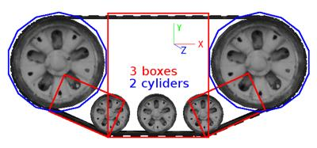
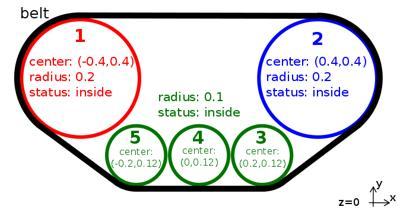
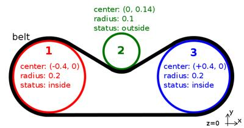

## Track

Derived from [Solid](solid.md).

```
Track {
  MFNode  device           [ ]    # {LinearMotor, PositionSensor, Brake, PROTO}
  SFVec2f textureAnimation 0 0    # any vector
  SFNode  animatedGeometry NULL   # {Shape, CadShape, Group, Pose, Transform, Slot, PROTO}
  SFInt32 geometriesCount  10     # [0, inf)
}
```

The [Track](#track) node defines a track object that could be used to model tracks for conveyor belts or tank robots.

Note that this works only in *physics-based* simulations.
Therefore, the `physics` and `boundingObject` fields of the [Track](#track) node and related [Solid](solid.md) nodes must be non-NULL for the [Track](#track) node to behave correctly.
It is not a requirement that the `boundingObject` exactly matches the track belt shape; it is possible to use basic geometries such as boxes and cylinders to specify the external shape of the belt, especially the parts where it may touch the ground or obstacles.
A simple example is shown in the [following figure](#tracks-bounding-object-example).

Additionally, in order to work correctly, the [Track](#track) node has to fulfill these conditions:

- the z-axis of the [Track](#track) node is parallel to the world up vector.
- the belt and wheels are aligned on a plane perpendicular to the [Track](#track) node's y-axis.

%figure "Track's bounding object example"



%end

The `device` field optionally specifies a [LinearMotor](linearmotor.md), a linear [PositionSensor](positionsensor.md) and a [Brake](brake.md) device.
The motor allows to control the motion of the track, and if not specified the track will behave like a fixed joint.
Position, velocity or force control can be used but force feedback functions are not available.

The track system doesn't have any default wheel, but it is possible to insert a [TrackWheel](trackwheel.md) node in the `children` field to define an object that will automatically rotate based on the [Track](#track) motor speed.
Note that the [TrackWheel](trackwheel.md) node is an abstract wheel and the shape has to be defined by the user.

Other than the motion, it is also possible to define an animation to show graphically the movement of the track.
Two different types of animation are available: texture animation and geometries animation.

Note that the track belt is only automatically generated and displayed in case the geometries animation is enabled.
Otherwise it can be manually defined by adding the shape in the `children` field.

### Texture Animation

The texture animation is the simplest option and consists in scrolling the texture object in the direction defined in the `textureAnimation` field.
This scroll value is combined with the belt velocity in order to update the position of texture at each time step.
If the value is *[0 0]* the texture will not move.
Only the first child of the [Track](#track) is taken into consideration for texture animation, and it has to be a [Shape](shape.md), a [Group](group.md) node or a [Group](group.md) descendant having a [Shape](shape.md) node as its first child.
Also note that the [Appearance](appearance.md) node of the [Shape](shape.md) and its `texture` and `textureTransform` fields have to be explicitly defined.

Note that the [TextureTransform](texturetransform.md) node that is going to be automatically altered by the [Track](#track) functionality cannot be a [USE](def-and-use.md) node.

### Geometries Animation

The geometries animation consists of a set of pure graphical [Shape](shape.md) objects without physics properties moving along a defined belt path.

The `animatedGeometry` field contains the specification of the appearance and geometry of the animated objects.

The `geometriesCount` field specifies the number of animated objects that will move along the belt path.

Note that the geometries animation is enabled only if the `geometriesCount` value is greater than 0 and the `animatedGeometry` field is defined.

The belt path along which the animated geometries move is shaped to the [TrackWheel](trackwheel.md) nodes contained in the `children` field.
Each wheel contains the information about its center position, its radius and if it is inside or outside the belt.
By convention the wheels are all aligned on a plane perpendicular to the [Track](#track) node's y-axis and have to be defined in clockwise order starting from the one with the smallest x-axis position component.

The following code fragment shows the belt path definition for the convex track example shown in [this figure](#convex-tracks-belt-shape-example):

```
children [
  TrackWheel {
   position -0.4 0.4
    radius 0.2
    inner TRUE
  }
  TrackWheel {
    position 0.4 0.4
    radius 0.2
    inner TRUE
  }
  TrackWheel {
    position 0.2 0.12
    radius 0.1
    inner TRUE
  }
  TrackWheel {
    position 0 0.12
    radius 0.1
    inner TRUE
  }
  TrackWheel {
    position -0.2 0.12
    radius 0.1
    inner TRUE
  }
]
```

%figure "Convex track's belt shape example"



%end

Then for a concave track belt shape like the one shown in [this figure](#concave-tracks-belt-shape-example) the following [TrackWheel](trackwheel.md) nodes have to be defined:

```
children [
  TrackWheel {
    position -0.4 0.0
    radius 0.2
    inner TRUE
  }
  TrackWheel {
    position -0.0 0.14
    radius 0.1
    inner FALSE
  }
  TrackWheel {
    position 0.4 0.0
    radius 0.2
    inner TRUE
  }
]
```

%figure "Concave track's belt shape example"



%end
