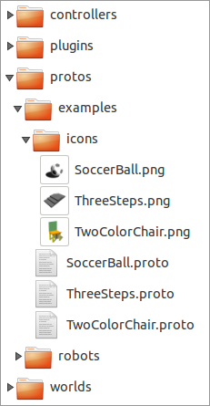
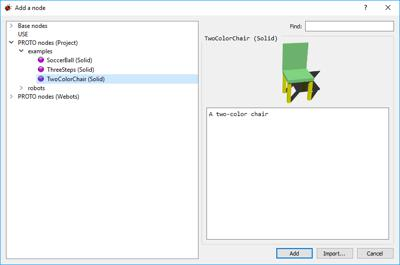
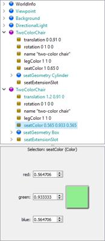

## Using PROTO Nodes with the Scene Tree

Several PROTO examples are packaged with Webots.
Instances of these PROTO nodes can be added to the simulation with the Scene Tree buttons.
Note that currently the Scene Tree allows the instantiation but not the definition of PROTO nodes.
PROTO definitions must be created or modified manually in ".proto" files.

### PROTO Directories

In order to make a PROTO available to Webots, the complete PROTO definition must be placed in a ".proto" file.
Each ".proto" file can contain the definition for only one PROTO, and each file must be saved under the name <*PROTOName*>".proto", where *PROTOName* is the name of the PROTO as specified after the PROTO keyword (case-sensitive).
For example the above `TwoColorChair` PROTO must be saved in a file name "TwoColorChair.proto".

The ".proto" file should be placed in the "protos" subdirectory of the current project directory.
By definition, the current project directory is the parent directory of the "worlds" directory that contains the currently opened ".wbt" file.
The [figure](#proto-directory-in-a-project-directory-structure) shows where ".proto" files are stored in a project directory.

%figure "PROTO directory in a project directory structure"

%end

Note that inside the "protos" directory, the number of subdirectories and their names is free.
The user can assign directory names for practical classification reasons; but the names do not influence how PROTO files are searched.
The whole subdirectory tree is always searched recursively.

In addition to the current project directory, Webots does also manage a *default* project directory.
This directory is structurally similar to the current project directory (see above) but it is located inside Webots distribution.
In the default project directory there is also a "protos" subdirectory that provides Webots standard PROTO nodes.
These standard PROTO nodes should normally not be modified by the user.
Note that ".proto" files will be searched first in the current project directory and then in the default project directory.

### Add a Node Dialog

If a PROTO is saved in a file with proper name and location, it should become visible in the `Add a node` dialog that can be invoked from the `Scene Tree`.
In the dialog, the PROTO nodes are organized using the same directory hierarchy found in the project's and Webots's "protos" folders.
However this dialog shows a PROTO only if its *base type* is suitable for the chosen insertion point.
For example, a PROTO whose base type is [Material](material.md) cannot be inserted in a `boundingObject` field.
In [this figure](#adding-an-instance-of-the-twocolorchair-proto) you can see how the `TwoColorChair` PROTO appears in the dialog.
Note that, the dialog's text panel is automatically filled with any comment placed at the beginning of the ".proto" file.

%figure "Adding an instance of the TwoColorChair PROTO"

%end

Icons can be used to better illustrate PROTO nodes.
A PROTO icon must be stored in a 128 x 128 pixels ".png" file.
The file name must correspond to that of the PROTO plus the ".png" extension and it must be stored in the "icons" subdirectory of the "protos" directory (see [this figure](#proto-directory-in-a-project-directory-structure)).
Note that it is possible to create the ".png" files directly with Webots's menu `File / Take Screenshot...`.
Then the image should be cropped or resized to 128 x 128 pixels using an image editor.

### Using PROTO Instances

If you hit the `Add` button, the PROTO instance is added to the `Scene Tree`.
In the `Scene Tree`, PROTO instances are represented with a different color than built-in nodes (see [this figure](#scene-tree-with-two-instances-of-the-twocolorchair-proto)).
PROTO fields can be manipulated exactly like built-in node fields.

%figure "Scene Tree with two instances of the TwoColorChair PROTO"

%end
