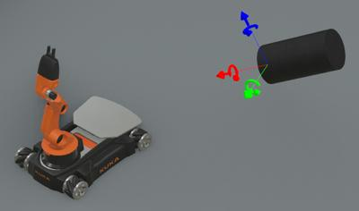

## Viewpoint

```
Viewpoint {
  SFFloat    fieldOfView             0.785398         # [0, pi]
  SFRotation orientation             0 0 1 0          # unit axis, (-inf, inf) angle
  SFVec3f    position                -10 0 0          # any vector
  SFString   description             ""               # any string
  SFFloat    near                    0.05             # [0, far]
  SFFloat    far                     0.0              # [near, inf)
  SFFloat    exposure                1.0              # [0, inf)
  SFString   follow                  ""               # any string
  SFString   followType              "Tracking Shot"  # {"None", "Tracking Shot", "Mounted Shot", "Pan and Tilt Shot"}
  SFFloat    followSmoothness        0.5              # [0, 1]
  SFNode     lensFlare               NULL             # {LensFlare, PROTO}
  SFFloat    ambientOcclusionRadius  2                # [0, inf)
  SFFloat    bloomThreshold          21               # [0, inf)
}
```

The [Viewpoint](#viewpoint) node defines a specific location in the local coordinate system from which the user may view the scene.

%figure "Viewpoint oriented towards a robot"



%end

The `position` and `orientation` fields of the [Viewpoint](#viewpoint) node specify absolute locations in the coordinate system.
In the default position and orientation, the viewer is on the z-axis, looking down the *x*-axis toward the origin with *+x* to the right and *+y* straight up.

Navigating in the 3D view by dragging the mouse pointer dynamically changes the `position` and the `orientation` fields of the [Viewpoint](#viewpoint) node.

The `fieldOfView` field specifies the viewing angle in radians.
A small field of view roughly corresponds to a telephoto lens; a large field of view roughly corresponds to a wide-angle lens.

The `near` field defines the distance from the camera to the near clipping plane.
This plane is parallel to the projection plane for the 3D display in the main window.
The near field determines the precision of the OpenGL depth buffer.
A too small value may cause depth fighting between overlaid polygons, resulting in random polygon overlaps.
The far clipping plane is parallel to the near clipping plane and is defined by the `far` field.
The far clipping plane can be set at an infinite distance by setting the `far` field to 0.
Setting a far clipping plane will filter out far objects and can therefore greatly improve the rendering performance.

The `near`, `far` and the `fieldOfView` fields define together the viewing frustum.
Any 3D shape outside this frustum won't be rendered.
Hence, shapes too close (standing between the camera and the near plane) won't appear.

The `exposure` field defines the photometric exposure of the scene in joule per square meter (J/m^2).

The `follow` field can be used to specify the name of a robot (or other solid object) that the viewpoint will follow during the simulation.
If the string is empty, or if it does not correspond to any solid object, then the viewpoint will remain fixed.
The `follow` field is automatically updated when setting the solid to be followed from the `View / Follow Object` menu.
Given that the same [Solid](solid.md).name field value could be used by different [Solid](solid.md) nodes, the `follow` field value also contains the name of the ancestor [Solid](solid.md) nodes.
The list of [Solid](solid.md) names is joined using the character ':' and the '\\' and ':' characters contained in a [Solid](solid.md) name is escaped by prepending '\\'.
For example, please consider the following structure where the `TARGET` solid is followed:
```
Robot {
  Solid {
    children [
      Solid {
        name "solid"
      }
    ]
    name "first solid"
  }
  Solid {
    children {
      DEF TARGET Solid {
        name "target\solid" // <- followed object
      }
    }
    name "second:solid"
  }
  name "robot"
}
```
Then, `follow` value will be "robot:second\:solid:target\\solid".

The `followType` field specifies how the viewpoint should follow the object defined in the `follow` field.
If the value is `None`, the viewpoint will not change.
If the value is `Tracking Shot`, the viewpoint will follow the object in translation (traveling movement).
If the value is `Mounted Shot`, the viewpoint will follow the object both in translation and rotation, this is particularly useful to see from within an object (e.g. from inside a vehicle).
Finally, if the value is `Pan and Tilt Shot`, the viewpoint will always look at the object center.

The `followSmoothness` field defines how smooth the camera is when following an object.
With a value of 0 the camera follows the movement of the object instantly, and increasing the value increases the inertia of the camera thus making the movement more fluid.
Higher values can sometimes make the camera lag behind in the case of fast moving objects that change direction often.
This parameter is used only if the `followType` field is set to `Tracking Shot`.

The `lensFlare` field may contain a [LensFlare](lensflare.md) node to add a lens flare effect to the view (if any light casts flares).

- The `ambientOcclusionRadius` field denotes the radius of geometric occlusion searches in the scene.
Increasing the radius can increase occlusion from further objects.
However, at lower quality levels, near-field occlusion can start to disappear as the radius increases.

- The `bloomThreshold` field denotes the luminosity above which pixels start to "bloom" - i.e. overexpose the camera and leak light around themselves.
Decreasing the threshold means pixels bloom more easily, as if the camera were more easily overexposed.
The effect can be disabled by setting this value to `-1`.
Please note this effect is not physically based, like with Ambient Occlusion (GTAO) or PBR.
It serves as a good approximation of camera overexposure, however.
