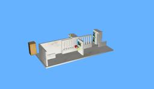

The [A4 Portal](http://www.a4.fr/automatisme-et-robotique/maquettes-automatisees/portail-coulissant-automatise.html) is a sliding portal designed for teaching automatized systems.
It uses the PICAXE programming kit.

### Movie Presentation


### Portal PROTO

Derived from [Robot](https://cyberbotics.com/doc/reference/robot).

```
Portal {
  SFVec3f    translation     0 0 0
  SFRotation rotation        0 0 1 0
  SFString   name            "Portal"
  SFString   controller      "<generic>"
  MFString   controllerArgs  []
  SFString   customData      ""
  SFBool     supervisor      FALSE
  SFBool     synchronization TRUE
  MFNode     extensionSlot   []
}
```

#### Portal Field Summary

- `extensionSlot`: Extends the robot with new nodes in the extension slot.

### Samples

You will find the following sample in this folder: "[WEBOTS\_HOME/projects/robots/a4/portal/worlds]({{ url.github_tree }}/projects/robots/a4/portal/worlds)".

#### [portal\_pe.wbt]({{ url.github_tree }}/projects/robots/a4/portal/worlds/portal\_pe.wbt)

 This simulation shows the portal model.
